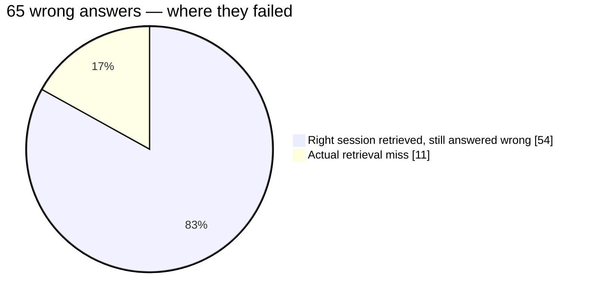

I shipped AutoMem 0.16 this week. 63 commits and about 5,000 lines of server code since 0.15.2 — and the most interesting decision in the whole release was the half I *didn't* turn on.

## The short version

- **Recall stops surfacing dead memories.** Superseded and invalidated facts are filtered by default now.
- **A new retrieval channel** (metadata sidecar) that's on out of the box.
- **A stack of scoring correctness fixes** — keyword normalization, summary hydration, an embedding bug that was quietly storing garbage vectors.
- **Bulk associations and an admin backup endpoint** — new API surface.
- **Four recall-tuning knobs that I built, measured, and left OFF** — because the data said to.

That last one is the real story. These aren't half-finished features. **They're finished features that lost their A/B.**

## Why this release exists

0.15 got AutoMem to "good enough to trust." 0.16 was supposed to be the recall-quality release — tighten ranking, stop stale results from winning, make the newest version of a fact beat the stale one.

Some of that shipped and is live. Some of it I chased, measured, and walked away from. Both halves are below, with the numbers behind each.

First, an honest caveat that shapes everything: there's **no clean "0.15 → 0.16 = +X%" number** in this post. The recall A/B lab had a config-plumbing bug for most of its life — the env overrides never reached the container, so every "comparison" was secretly comparing two identical configs. I rebuilt it. The comparisons below are from the rebuilt lab; the historical ones, I threw out. Owning that is cheaper than quoting a number I don't believe.

## What's live by default

### Recall ignores dead memories

The biggest behavior change. Before 0.16, if you stored a fact, then superseded it, recall could still hand back the old one. Now `/recall` defaults to `current_only` — expired, not-yet-valid, invalidated, and evolved-into memories are suppressed unless you explicitly ask for history (`current_only=false`).

**Test process:** a targeted eval (`run_current_state_recall_eval.py`) seeds an isolated set of current/stale/future/superseded memories, calls `/recall` with `state_debug=true`, and scores both what came back *and* what got correctly suppressed.

**Result:** 6/6 scenarios pass — stale and future memories suppressed, invalidated replaced by current, and `CONTRADICTS` deliberately *preserved* (a contradiction isn't a stale fact; you want both). Plus 15 focused regression tests covering temporal validity, `INVALIDATED_BY`/`EVOLVED_INTO` suppression, and tag-filtered replacement injection. This is the same direction the forgetting-aware benchmarks (FAMA, out of ACL 2026) are pushing the whole field — don't reward a system for confidently recalling something that's no longer true.

### A new retrieval channel

0.16 adds a metadata sidecar search path — candidates admitted via metadata matches, weighted at 0.35 alongside vector and keyword. On by default (`RECALL_METADATA_SEARCH_ENABLED=true`). More ways to surface the right memory, especially when the match lives in structured metadata rather than the content body.

### The unglamorous correctness fixes

No A/B for these — they're bugs, validated by the test suite, not preferences to be tuned:

- **Keyword scores normalized into the 0–1 range.** Graph keyword hits were escaping the component range and distorting the weighted sum. Everyone's rankings were subtly off; now they aren't.
- **Semantic recall summaries hydrate.** Vector hits return their summaries instead of dropping them.
- **Embedding batch fallback.** The batch store path could fall back to placeholder (hash-based, semantically meaningless) vectors instead of retrying real embeddings — memories that looked stored but were unsearchable. Fixed to exhaust real embeddings first.
- **Entity extraction stopped over-rejecting** real people, code tools, and event categories (a 669-line rewrite of the entity-quality path). Cleaner entity tags for everyone, since enrichment runs on by default.

### New capabilities

- **Bulk associations** — `POST /associate` now takes up to 500 associations in one call, instead of one HTTP round-trip per edge.
- **Admin backup endpoint** — `/backup` plus a real backup module behind an admin token.
- **`state_mode=current|history`** recall alias, **configurable recency decay window/curve**, **cluster threshold/size env vars**, and the MCP detailed-recall format now surfaces stored metadata and `updated_at`.

## The knobs I built and left off

Here's where the testing earned its keep. Four levers got built, measured on a 10,107-memory production clone and a judged BEAM 100K run, and shipped **inert**:

| Knob | What it'd do | What the data said |
|---|---|---|
| `RECALL_RELEVANCE_GATE` | Down-weight off-topic high-importance memories in tag-scoped recall (issue #130) | Gate at 0.0 / 0.15 / 0.40 → "preserve" score flat at ~0.983. **No measured win.** |
| `RECALL_RECENCY_BIAS=auto` | Re-rank so newer facts beat older ones on temporal queries | **−0.5pt** on judged BEAM (82.00% → 81.50%) |
| `SEARCH_TAG_SCORE_TOKEN_CAP` | Cap the tag-score denominator to fix query-length bias | Cap 2/3/4 → **−14 / −7 / −4pp Recall@5** (200 queries) |
| `SEARCH_WEIGHT_RELEVANCE` | Fold consolidation-decay relevance into scoring | 0.0 by default = literal no-op; never beat baseline |

The recency one is the trap worth naming. "Prefer the newest version of a fact" *sounds* like an obvious win. On a query set with real temporal intent, it probably is. On the broad BEAM mix, it cost half a point — most questions don't have temporal intent, so the re-rank is noise more often than signal.

So `recency_bias=auto` stays in the box as a per-request option and a benchmark setting, **not** a default. Flipping any of these to on now would be shipping vibes. The bar is a judged A/B that beats the all-off baseline, and none of them cleared it yet.

> Knowing *not* to flip a knob is a result. It's just not the one that feels like progress.

## The methodology problem behind the numbers

Here's the number that changed how I think about all of this.

Same AutoMem. Same answers. Same BEAM 100K question set. Scored by two different judges:

- Under a **gpt-5-mini judge**: 82.0%
- Under a **gpt-5 judge**: 70.25%

**A ~12-point swing from judge strictness alone.** Not a memory change. Not a retrieval change. Just a stricter grader.

That's the whole reason my own-harness, own-judge numbers aren't comparable to anyone else's — Hindsight publishes ~73–75% at the 100K tier, mem0 and Zep publish their own, and every one of those is entangled with whatever judge they ran. AutoMem's native runner beats my mem0-shim baseline at the same model (82.0% vs 76.25%, both gpt-5-mini) — a real ~6-point edge from AutoMem's own chunking and `/recall` over the mem0 wire contract — but I can't put that on a leaderboard and expect it to mean anything.

So the next step wasn't a config change. It was submitting AutoMem to the **neutral Agent Memory Benchmark** — standardized Gemini answerer, standardized Gemini judge, results by PR. Same grader as everyone else. That run is done now, and the numbers from it are the ones I actually stand behind: [the neutral AMB results are here](/blog/automem-amb-neutral-numbers).

## Where the real bottleneck turned out to be

One more finding from a 500-question LongMemEval pass that reframed my roadmap. Overall: ~87% answer accuracy, ~97% recall@5. Break the 65 wrong answers down by cause:

- **54** had the right session retrieved at recall@5 — and still got answered wrong.
- **11** were actual retrieval misses.

**The memory was there 83% of the time it failed.** The bottleneck isn't finding the right memory — it's reasoning over it once it's found, especially temporal conflicts and preference updates (single-session-preference was the worst category at 56.67%). That's not a retrieval-weights problem. That's issues #158 and #159, and it's where 0.17 goes.

## What's working, what isn't, what's next

**Working:** state-aware recall, the new metadata channel, the correctness fixes. AutoMem at its all-off defaults scores 82.0% on judged BEAM 100K — but that's under my own gpt-5-mini judge, so read it as directional: above my mem0 shim, in the neighborhood of Hindsight's published 100K tier, not a leaderboard claim. The defaults are good; that's why I'm not touching them.

**Not working yet:** preference and temporal-conflict reasoning. Retrieval finds the fact; the answer step fumbles it.

**Next:** the neutral AMB run landed — [real comparable numbers are in the results post](/blog/automem-amb-neutral-numbers) — and 0.17 is aimed squarely at the retrieved-but-wrong failure mode.

## Caveats, up front

- No clean 0.15→0.16 delta — the old A/B lab was a no-op, and I'd rather say so than fabricate one.
- The internal benchmark numbers above use my own judge. Treat them as directional until the neutral-harness run lands.
- BEAM 100K is an easier tier than mem0's published 1M/10M settings. Different tier, different number.

0.16 is mostly correctness and capability, with a deliberate decision to leave the tuning alone until the evidence shows up. That's not the flashy version of a release. It's the honest one.

— Jack
