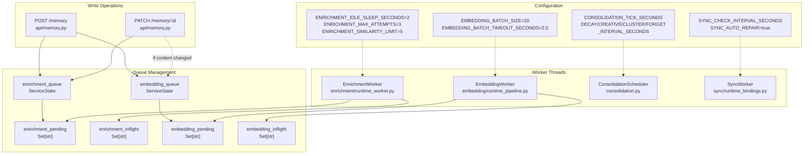
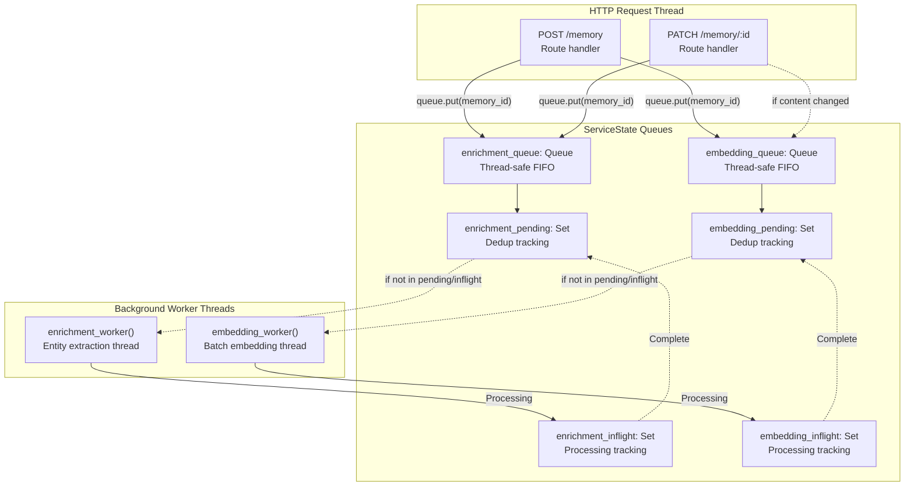

:::note[Source files]
Key GitHub sources:
- [automem/enrichment/runtime_queue_bindings.py](https://github.com/verygoodplugins/automem/blob/1b812cf883cbc95632d5f9f1ed180d1865c0638a/automem/enrichment/runtime_queue_bindings.py) — Enrichment queue setup
- [automem/enrichment/runtime_worker.py](https://github.com/verygoodplugins/automem/blob/1b812cf883cbc95632d5f9f1ed180d1865c0638a/automem/enrichment/runtime_worker.py) — Enrichment worker thread
- [automem/embedding/runtime_bindings.py](https://github.com/verygoodplugins/automem/blob/1b812cf883cbc95632d5f9f1ed180d1865c0638a/automem/embedding/runtime_bindings.py) — Embedding queue setup
- [automem/embedding/runtime_pipeline.py](https://github.com/verygoodplugins/automem/blob/1b812cf883cbc95632d5f9f1ed180d1865c0638a/automem/embedding/runtime_pipeline.py) — Embedding worker and batch processing
- [automem/consolidation/runtime_bindings.py](https://github.com/verygoodplugins/automem/blob/1b812cf883cbc95632d5f9f1ed180d1865c0638a/automem/consolidation/runtime_bindings.py) — Consolidation scheduler
- [automem/sync/runtime_bindings.py](https://github.com/verygoodplugins/automem/blob/1b812cf883cbc95632d5f9f1ed180d1865c0638a/automem/sync/runtime_bindings.py) — Sync worker
- [automem/runtime_wiring.py](https://github.com/verygoodplugins/automem/blob/1b812cf883cbc95632d5f9f1ed180d1865c0638a/automem/runtime_wiring.py) — Startup sequence and worker initialization
- [.env.example](https://github.com/verygoodplugins/automem/blob/1b812cf883cbc95632d5f9f1ed180d1865c0638a/.env.example) — Background processing configuration variables
:::

AutoMem implements four background processing systems that operate independently of the main Flask API request/response cycle. These systems handle computationally expensive operations without blocking client requests.

For detailed implementation of each system, see:

- [Enrichment Pipeline](/docs/architecture/enrichment/) — Entity extraction and relationship building
- [Embedding Generation](/docs/architecture/embeddings/) — Batched vector creation

---

## Four Independent Systems

AutoMem implements four background processing systems, each with distinct triggers, execution models, and responsibilities:

| System | Trigger | Execution Model | Primary Purpose |
|---|---|---|---|
| **Enrichment Pipeline** | Event-driven | Queue + worker thread | Enhance memories with entities, tags, relationships |
| **Embedding Worker** | Event-driven | Queue + batch accumulator | Generate and store vector embeddings |
| **Consolidation Engine** | Time-based | Scheduled intervals | Apply decay, discover associations, cluster, forget |
| **Sync Worker** | Time-based | Interval polling | Detect and repair FalkorDB/Qdrant drift |

---

## Worker Coordination Diagram



---

## Queue Management



**Key Insights:**
- `POST /memory` writes immediately to FalkorDB, then enqueues background jobs
- Enrichment and embedding workers run continuously in separate threads
- Consolidation scheduler runs periodic checks via a custom thread-based scheduler
- All systems can operate independently; failures are isolated

---

## Threading Model

All background workers run in daemon threads started during Flask application initialization:

| Component | Started At | Daemon | Lifecycle |
|---|---|---|---|
| `enrichment_worker` | [automem/enrichment/runtime_queue_bindings.py](https://github.com/verygoodplugins/automem/blob/1b812cf883cbc95632d5f9f1ed180d1865c0638a/automem/enrichment/runtime_queue_bindings.py) | Yes | Runs until app shutdown |
| `embedding_worker` | [automem/embedding/runtime_bindings.py](https://github.com/verygoodplugins/automem/blob/1b812cf883cbc95632d5f9f1ed180d1865c0638a/automem/embedding/runtime_bindings.py) | Yes | Runs until app shutdown |
| Consolidation scheduler | [automem/consolidation/runtime_bindings.py](https://github.com/verygoodplugins/automem/blob/1b812cf883cbc95632d5f9f1ed180d1865c0638a/automem/consolidation/runtime_bindings.py) | Yes | Custom thread-based scheduler |

**Thread Safety:**
- `enrichment_queue` and `embedding_queue` use Python's thread-safe `Queue` class
- Each worker polls its queue in an infinite loop with timeout-based blocking
- FalkorDB and Qdrant clients are thread-safe for read/write operations

---

## Lifecycle and Startup

### Application Startup Sequence

Startup is orchestrated by [automem/runtime_wiring.py](https://github.com/verygoodplugins/automem/blob/1b812cf883cbc95632d5f9f1ed180d1865c0638a/automem/runtime_wiring.py):

1. `init_falkordb()` — Establish FalkorDB connection
2. `init_qdrant()` — Establish optional Qdrant connection
3. `init_openai()` — Initialize OpenAI client for classification
4. `init_embedding_provider()` — Select and initialize embedding provider
5. `init_enrichment_pipeline()` — Start enrichment worker thread
6. `init_embedding_pipeline()` — Start embedding worker thread
7. `init_consolidation_scheduler()` — Start consolidation scheduler
8. `init_sync_worker()` — Start sync worker thread

### Graceful Shutdown

All background threads are daemon threads, meaning they terminate automatically when the main Flask process exits. No explicit cleanup is required.

**Implications:**
- In-flight enrichment/embedding jobs may be lost on shutdown
- Consolidation tasks may be interrupted mid-run
- Queue contents are not persisted between restarts
- Restarting the service will reprocess queued items from scratch (new memories will be re-enqueued on next access or re-enrichment trigger)

---

## Configuration Reference

### Enrichment Configuration

| Variable | Default | Purpose |
|---|---|---|
| `ENRICHMENT_MAX_ATTEMPTS` | 3 | Max retries per memory |
| `ENRICHMENT_SIMILARITY_LIMIT` | 5 | Max similar neighbors to link |
| `ENRICHMENT_SIMILARITY_THRESHOLD` | 0.8 | Min cosine similarity for `SIMILAR_TO` edge |
| `ENRICHMENT_IDLE_SLEEP_SECONDS` | 2.0 | Queue poll timeout |
| `ENRICHMENT_FAILURE_BACKOFF_SECONDS` | 5.0 | Base backoff on failure |
| `ENRICHMENT_ENABLE_SUMMARIES` | true | Generate content summaries |
| `ENRICHMENT_SPACY_MODEL` | `en_core_web_sm` | spaCy model for NER |

### Embedding Configuration

| Variable | Default | Purpose |
|---|---|---|
| `EMBEDDING_BATCH_SIZE` | 20 | Items per batch |
| `EMBEDDING_BATCH_TIMEOUT_SECONDS` | 2.0 | Max wait before processing partial batch |

### Consolidation Configuration

| Variable | Default | Purpose |
|---|---|---|
| `CONSOLIDATION_TICK_SECONDS` | 60 | Scheduler check interval |
| `CONSOLIDATION_DECAY_INTERVAL_SECONDS` | 86400 | Decay task frequency (1 day) |
| `CONSOLIDATION_CREATIVE_INTERVAL_SECONDS` | 604800 | Creative task frequency (1 week) |
| `CONSOLIDATION_CLUSTER_INTERVAL_SECONDS` | 2592000 | Cluster task frequency (1 month) |
| `CONSOLIDATION_FORGET_INTERVAL_SECONDS` | 0 | Forget task frequency (0 = disabled) |
| `CONSOLIDATION_DECAY_IMPORTANCE_THRESHOLD` | 0.3 | Min importance for decay (optional filter) |
| `CONSOLIDATION_HISTORY_LIMIT` | 20 | Max consolidation run history |

---

## Monitoring and Health

### Health Endpoint Statistics

The `/health` endpoint exposes real-time statistics for all background systems:

| Metric | Source | Interpretation |
|---|---|---|
| `enrichment.queue_depth` | `ServiceState.enrichment_queue` | Items waiting in queue |
| `enrichment.pending` | `ServiceState.enrichment_pending` | Memories not yet enriched in graph |
| `enrichment.inflight` | `ServiceState.enrichment_inflight` | Currently processing |
| `enrichment.processed` | `EnrichmentStats.successes` | Total completed |
| `enrichment.failed` | `EnrichmentStats.failures` | Total failed |
| `embedding.queue_depth` | `ServiceState.embedding_queue` | Embeddings queued for generation |
| `consolidation.last_runs` | `ConsolidationScheduler` | Last execution timestamps |
| `consolidation.next_runs` | `ConsolidationScheduler.get_next_runs()` | Time until next run |

### Admin Endpoints

Advanced monitoring available via admin token:

| Endpoint | Method | Purpose |
|---|---|---|
| `/enrichment/status` | GET | Detailed enrichment stats + sample pending IDs |
| `/enrichment/reprocess` | POST | Re-enqueue specific memory IDs |
| `/consolidate` | POST | Manually trigger consolidation tasks |
| `/consolidate/status` | GET | Consolidation history and next run times |

---

## Error Handling and Retry Logic

### Enrichment Retries

Failed enrichment jobs are automatically retried with flat backoff:

- Max attempts: `ENRICHMENT_MAX_ATTEMPTS` (default: 3)
- Backoff: `ENRICHMENT_FAILURE_BACKOFF_SECONDS` (default: 5.0) — sleeps this flat duration on each failure
- Failed jobs logged and removed from queue after max attempts

### Embedding Retries

Embedding failures are currently not retried at the batch level. If a batch fails:

1. Error is logged
2. Memories remain without embeddings in Qdrant
3. Graph metadata `embedding_status` remains in queue state
4. Re-embedding can be triggered via `/admin/reembed`

### Consolidation Failures

Consolidation tasks catch exceptions and continue:

- Failed tasks are logged with error details
- Next scheduled run proceeds normally
- Individual task failures don't affect other tasks
- History includes error details for debugging

---

## Performance Characteristics

### Resource Usage

| System | CPU Usage | Memory Usage | I/O Pattern |
|---|---|---|---|
| Enrichment | Moderate (spaCy NER) | Low per job | Burst writes to graph |
| Embedding | Low (network-bound) | Low (batch accumulator) | Batched API calls |
| Consolidation | High (graph traversal) | Moderate (in-memory cache) | Large read + write operations |
| Sync Worker | Low (periodic scans) | Low | Periodic graph + vector queries |

### Optimization Features

**Embedding Batching (40-50% cost reduction):**
- Accumulates up to 20 memories before calling provider API
- Single API call generates embeddings for entire batch
- Timeout ensures responsiveness (max 2s delay)

**Relationship Count Caching (80% consolidation speedup):**
- LRU cache with 10,000 entry capacity
- Hourly cache invalidation via timestamp key
- Dramatically reduces graph queries during decay cycles ([consolidation.py:95-110](https://github.com/verygoodplugins/automem/blob/a742602f5d6ad2dea5a4d3c387d5b49d610afe2c/consolidation.py#L95-L110))

---

## Integration with API Endpoints

### POST /memory Integration

The `POST /memory` endpoint response includes indicators of queued background work:

```json
{
  "memory_id": "uuid",
  "message": "Memory stored successfully",
  "enrichment_queued": true,
  "embedding_queued": true
}
```

### GET /recall Integration

Recall queries benefit from completed background processing:

- Vector search uses embeddings generated by the embedding worker
- Relationship traversal uses edges created by the enrichment worker
- Relevance scores use `relevance_score` updated by the consolidation engine

:::tip
Memories searched immediately after storage may not yet have embeddings or semantic relationships. The best search quality is achieved after the background workers have completed their processing (typically within 1-2 seconds for enrichment, 2-5 seconds for embedding depending on batch accumulation).
:::

---

## Summary

AutoMem's background processing architecture achieves:

1. **Non-blocking API responses** — Write to graph first, enhance later
2. **Cost efficiency** — Batched embedding generation reduces API calls by 40-50%
3. **Automatic maintenance** — Scheduled consolidation keeps graph healthy over time
4. **Fault tolerance** — Independent systems with retry logic and error isolation
5. **Observability** — Rich metrics via `/health` and admin endpoints

For implementation details of each subsystem:

- [Enrichment Pipeline](/docs/architecture/enrichment/) — Entity extraction, relationship building, pattern detection
- [Embedding Generation](/docs/architecture/embeddings/) — Provider selection, batching, dimension validation
