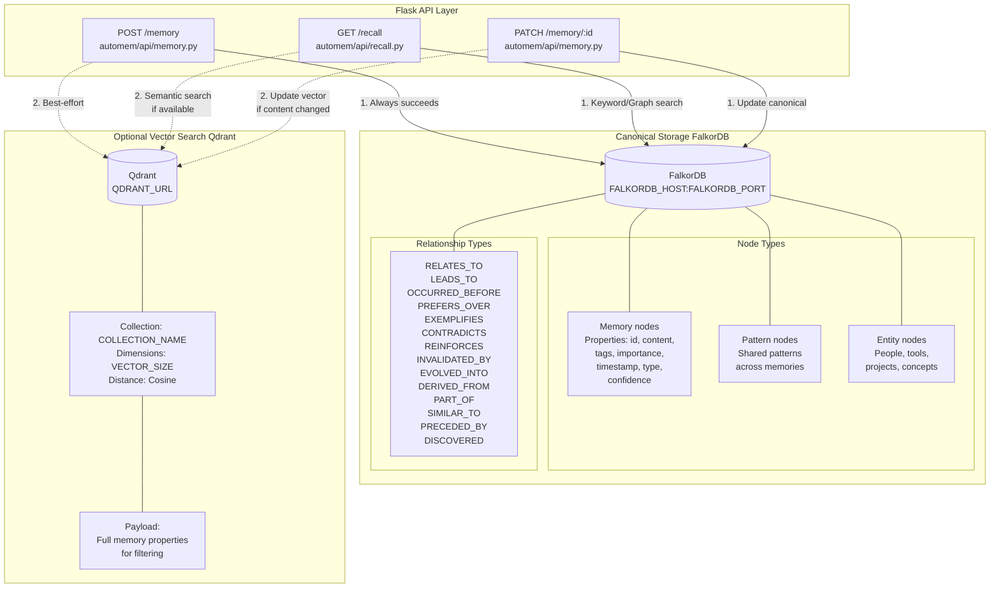

:::note[Source files]
Key GitHub sources:
- [automem/stores/runtime_clients.py](https://github.com/verygoodplugins/automem/blob/28eb916eae430f80ebee57d44f63b712b9d45398/automem/stores/runtime_clients.py) — Connection init (init_falkordb, init_qdrant, ensure_qdrant_collection)
- [automem/stores/graph_store.py](https://github.com/verygoodplugins/automem/blob/28eb916eae430f80ebee57d44f63b712b9d45398/automem/stores/graph_store.py) — FalkorDB abstraction
- [automem/stores/vector_store.py](https://github.com/verygoodplugins/automem/blob/28eb916eae430f80ebee57d44f63b712b9d45398/automem/stores/vector_store.py) — Qdrant abstraction
- [automem/embedding/provider.py](https://github.com/verygoodplugins/automem/blob/28eb916eae430f80ebee57d44f63b712b9d45398/automem/embedding/provider.py) — Embedding provider abstraction
- [automem/utils/validation.py](https://github.com/verygoodplugins/automem/blob/28eb916eae430f80ebee57d44f63b712b9d45398/automem/utils/validation.py) — Dimension validation
- [.env.example](https://github.com/verygoodplugins/automem/blob/28eb916eae430f80ebee57d44f63b712b9d45398/.env.example) — Configuration reference
:::

AutoMem uses two specialized databases that serve complementary purposes:

- **FalkorDB** (required): Graph database storing `Memory` nodes, relationships, and metadata. Acts as the source of truth.
- **Qdrant** (optional): Vector database storing dense embeddings for semantic similarity search. Enhances performance but is not required for operation.

The system is designed for **graceful degradation**: all core functionality continues if Qdrant is unavailable, with the API falling back to keyword-based search in FalkorDB.

---

## Storage Layer Architecture

---

## FalkorDB (Graph Database)

### Role and Capabilities

FalkorDB is a Redis-compatible graph database that stores memories as nodes with typed relationships. It serves as the **authoritative data store** and enables:

- **Node storage**: Each memory is a `Memory` node with properties (`content`, `type`, `importance`, `confidence`, `timestamp`, `tags`)
- **Relationship traversal**: 14 relationship types (11 authorable + 3 system-generated) connect memories semantically (see [Relationship Types](/docs/core-concepts/relationship-types/))
- **Keyword search**: Cypher queries perform content/tag matching
- **Temporal queries**: Filter memories by timestamp ranges
- **Pattern detection**: Store and query recurring patterns via enrichment metadata

### Configuration

| Environment Variable | Default | Description |
|---|---|---|
| `FALKORDB_HOST` | `localhost` | Hostname or IP address |
| `FALKORDB_PORT` | `6379` | Redis protocol port |
| `FALKORDB_PASSWORD` | _(none)_ | Authentication password |
| `FALKORDB_GRAPH` | `memories` | Graph database name |

**Connection Initialization:** The Flask app establishes the connection at startup via `init_falkordb()` ([automem/stores/runtime_clients.py](https://github.com/verygoodplugins/automem/blob/28eb916eae430f80ebee57d44f63b712b9d45398/automem/stores/runtime_clients.py)).

### Persistence Configuration

FalkorDB uses Redis AOF (Append-Only File) and RDB snapshots for durability. Configuration via `REDIS_ARGS`:

- `--save 60 1`: Snapshot if 1 or more keys change in 60 seconds
- `--appendonly yes`: Enable AOF persistence
- `--appendfsync everysec`: Fsync AOF every second (balance safety/performance)
- `--requirepass`: Require authentication

### Core Operations

**Memory Node Creation**

Memories are created via `MERGE` to ensure idempotency ([automem/stores/graph_store.py](https://github.com/verygoodplugins/automem/blob/28eb916eae430f80ebee57d44f63b712b9d45398/automem/stores/graph_store.py)).

**Relationship Creation**

The `/associate` endpoint creates typed edges between memory nodes ([automem/api/memory.py](https://github.com/verygoodplugins/automem/blob/28eb916eae430f80ebee57d44f63b712b9d45398/automem/api/memory.py)).

**Keyword Search**

The `_graph_keyword_search` function performs content and tag matching using Cypher queries ([automem/stores/graph_store.py](https://github.com/verygoodplugins/automem/blob/28eb916eae430f80ebee57d44f63b712b9d45398/automem/stores/graph_store.py)).

---

## Qdrant (Vector Database)

### Role and Capabilities

Qdrant stores dense vector embeddings and enables **semantic similarity search** via cosine distance. It provides:

- **Fast vector search**: Sub-100ms similarity queries over thousands of memories
- **Payload mirroring**: Stores memory content, tags, importance alongside vectors
- **Filtered search**: Combine vector similarity with tag/metadata filters
- **Batch operations**: Efficient bulk upserts for embedding generation

:::note
Qdrant is optional. If unavailable, AutoMem falls back to keyword-based search in FalkorDB with no change to the API response format.
:::

### Configuration

| Environment Variable | Default | Description |
|---|---|---|
| `QDRANT_URL` | _(none)_ | Full URL (e.g., `https://xyz.cloud.qdrant.io`) |
| `QDRANT_API_KEY` | _(none)_ | API key for authentication |
| `QDRANT_COLLECTION` | `memories` | Collection name |
| `VECTOR_SIZE` | `1024` | Embedding dimensions (must match collection and provider) |

**Dimension Validation**

AutoMem validates vector dimensions against the configured `VECTOR_SIZE` before writing to Qdrant. Mismatches raise a `ValueError` with a clear message, preventing Qdrant collection corruption from mixed dimensions ([automem/utils/validation.py](https://github.com/verygoodplugins/automem/blob/28eb916eae430f80ebee57d44f63b712b9d45398/automem/utils/validation.py)).

:::caution[Migration Note]
Existing deployments using 768-dimensional embeddings should keep `VECTOR_SIZE=768` and `EMBEDDING_MODEL=text-embedding-3-small` until re-embedding via `scripts/reembed_embeddings.py`.
:::

### Embedding Generation

AutoMem uses a provider-based embedding system with automatic fallback. The default configuration is `EMBEDDING_PROVIDER=auto` with OpenAI's `text-embedding-3-small` as the default OpenAI model. In auto mode, Voyage is preferred when configured; OpenAI is the next network provider fallback.

**Provider Selection Priority (Auto Mode):**

1. Voyage AI (if `VOYAGE_API_KEY` set)
2. OpenAI (if `OPENAI_API_KEY` set)
3. Ollama (if `OLLAMA_BASE_URL` or `OLLAMA_MODEL` set)
4. FastEmbed (local ONNX, if installed)
5. Placeholder (hash-based, always available)

**Provider Features:**

| Provider | Dimensions | Requires Network | Cost | Semantic Quality |
|---|---|---|---|---|
| Voyage | 256, 512, 1024, 2048 | Yes | Paid API | Excellent |
| OpenAI | 1536 native (`text-embedding-3-small`), 3072 (`text-embedding-3-large`) | Yes | Paid API | Excellent |
| Ollama | Configurable | Local | Free | Good |
| FastEmbed | 384, 768, 1024 | No (after download) | Free | Good |
| Placeholder | Configurable | No | Free | None (hash-based) |

**Embedding Configuration:**

| Environment Variable | Default | Description |
|---|---|---|
| `EMBEDDING_PROVIDER` | `auto` | Provider selection: `auto`, `voyage`, `openai`, `ollama`, `local`, `placeholder` |
| `VECTOR_SIZE` | `1024` | Embedding dimensions (must match Qdrant collection) |
| `EMBEDDING_MODEL` | `text-embedding-3-small` | Model identifier for provider |
| `VOYAGE_API_KEY` | _(none)_ | Voyage AI API key |
| `OPENAI_API_KEY` | _(none)_ | OpenAI or compatible API key |
| `OPENAI_BASE_URL` | _(none)_ | Custom endpoint for OpenAI-compatible providers |
| `OLLAMA_BASE_URL` | `http://localhost:11434` | Ollama server endpoint |
| `OLLAMA_MODEL` | `nomic-embed-text` | Ollama embedding model |
| `EMBEDDING_BATCH_SIZE` | `20` | Max items per batch |
| `EMBEDDING_BATCH_TIMEOUT_SECONDS` | `2.0` | Max wait before processing batch |

:::tip
Batching reduces API calls by 40-50% compared to individual requests. If `VECTOR_SIZE > 1536` while using OpenAI, AutoMem automatically upgrades from `text-embedding-3-small` to `text-embedding-3-large`. When `OPENAI_BASE_URL` targets an endpoint that doesn't support the `dimensions` parameter, AutoMem omits it and `text-embedding-3-small` may return its native 1536-dimensional output.
:::

### Vector Search Implementation

The `_vector_search` function performs similarity queries against the Qdrant collection ([automem/stores/vector_store.py](https://github.com/verygoodplugins/automem/blob/28eb916eae430f80ebee57d44f63b712b9d45398/automem/stores/vector_store.py)).

---

## Dual Storage Strategy

### Write Path

Every memory write performs **dual storage** to maintain consistency:

1. Write to FalkorDB (always committed, synchronous)
2. Queue embedding generation (asynchronous, background worker)
3. Write embedding to Qdrant (best-effort, async — failure is logged, not propagated)

### Read Path (Hybrid Search)

The `/recall` endpoint combines results from both databases:

1. If Qdrant is available: execute vector similarity search
2. Execute FalkorDB keyword/graph search
3. Merge results using deduplication (`seen_ids` set)
4. Apply 10-component hybrid scoring
5. Sort and return top results

For details on the scoring formula, see [Hybrid Search](/docs/core-concepts/hybrid-search/).

---

## Graceful Degradation

AutoMem is designed to continue operating if Qdrant is unavailable or misconfigured.

### Fallback Behavior

**Write Operations (Qdrant Unavailable):**
- Memory writes to FalkorDB succeed normally
- Embedding generation jobs are queued but not stored
- Memories remain fully accessible via keyword search
- No error is returned to clients

**Read Operations (Qdrant Unavailable):**
- Vector similarity search is skipped
- Results come entirely from FalkorDB keyword search
- Relationship traversal still works (graph-based)
- Search quality degrades but remains functional

### Health Check Reporting

The `/health` endpoint reports both database states:

| Database | States | Meaning |
|---|---|---|
| FalkorDB | `connected`, `disconnected` | Always required, disconnection is fatal |
| Qdrant | `connected`, `disconnected` | Optional, errors logged but not fatal |

---

## Data Persistence and Volumes

### FalkorDB Persistence

In production, FalkorDB requires a persistent volume.

**Railway Volume Configuration:** Mount path stores:
- **RDB snapshots**: Point-in-time backups triggered by `--save` rules
- **AOF log**: Append-only file of all write operations
- **Graph data**: FalkorDB's internal graph structures

### Qdrant Persistence

Qdrant Cloud handles persistence automatically. For self-hosted Qdrant, configure a volume at `/qdrant/storage`.

---

## Connection Pooling and Performance

### FalkorDB Connection Management

The Flask app maintains a single persistent connection. FalkorDB uses Redis pipelining internally for efficiency. No explicit pooling is required for single-threaded Flask.

### Qdrant Client Configuration

The Qdrant client maintains HTTP/2 connection pooling automatically via `httpx`.

---

## Database Comparison Table

| Feature | FalkorDB | Qdrant |
|---|---|---|
| **Role** | Source of truth | Performance enhancement |
| **Required** | Yes | No (optional) |
| **Data Structure** | Graph (nodes + edges) | Vectors + payloads |
| **Primary Use** | Relationships, metadata, keywords | Semantic similarity |
| **Query Language** | Cypher | Vector search API |
| **Persistence** | AOF + RDB snapshots | Automatic (cloud) or volume |
| **Port** | 6379 (Redis protocol) | 6333 (HTTP) |
| **Typical Latency** | 5-20ms (keyword) | 50-100ms (vector) |
| **Failure Impact** | Service halts | Degrades to keyword search |
| **Default Dimensions** | N/A | 1024 (common configs: 256, 512, 1024, 1536, 2048, 3072) |
| **Embedding Providers** | N/A | Voyage, OpenAI, Ollama, FastEmbed, Placeholder |
