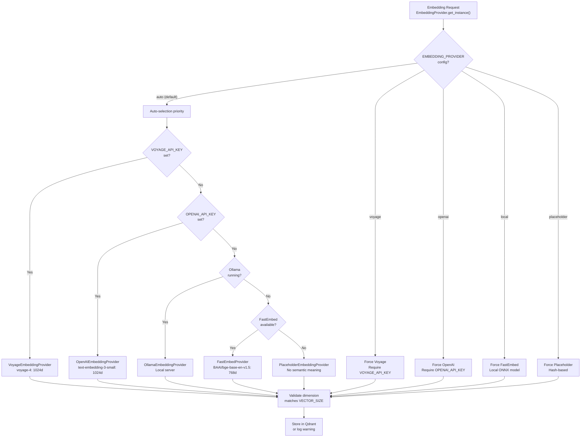
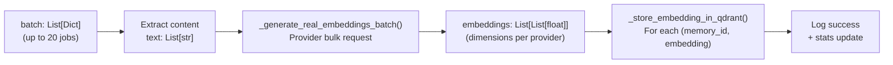

:::note[Source files]
Key GitHub sources:
- [automem/embedding/runtime_pipeline.py](https://github.com/verygoodplugins/automem/blob/main/automem/embedding/runtime_pipeline.py) — Embedding worker and batch processing logic
- [automem/embedding/runtime_bindings.py](https://github.com/verygoodplugins/automem/blob/main/automem/embedding/runtime_bindings.py) — Queue setup and worker startup
- [automem/embedding/provider.py](https://github.com/verygoodplugins/automem/blob/main/automem/embedding/provider.py) — Abstract provider base class
- [automem/embedding/voyage.py](https://github.com/verygoodplugins/automem/blob/main/automem/embedding/voyage.py) — Voyage AI provider
- [automem/embedding/openai.py](https://github.com/verygoodplugins/automem/blob/main/automem/embedding/openai.py) — OpenAI provider
- [automem/embedding/fastembed.py](https://github.com/verygoodplugins/automem/blob/main/automem/embedding/fastembed.py) — FastEmbed local provider
- [automem/embedding/ollama.py](https://github.com/verygoodplugins/automem/blob/main/automem/embedding/ollama.py) — Ollama local provider
- [automem/embedding/placeholder.py](https://github.com/verygoodplugins/automem/blob/main/automem/embedding/placeholder.py) — Deterministic fallback provider
- [automem/utils/validation.py](https://github.com/verygoodplugins/automem/blob/main/automem/utils/validation.py) — Dimension validation
- [tests/test_embedding_providers.py](https://github.com/verygoodplugins/automem/blob/main/tests/test_embedding_providers.py) — Provider tests
:::

The embedding generation subsystem handles asynchronous vector embedding creation for memories using multiple backend providers. The system implements batching optimization to reduce API costs by 40-50%, improves `/memory` endpoint latency by 60% through non-blocking queue-based processing, and provides automatic provider selection with graceful fallback.

**Key features:**
- **Multi-provider support:** Voyage AI, OpenAI, FastEmbed (local), Ollama, or deterministic placeholder vectors
- **Auto-selection priority chain:** Voyage → OpenAI → Ollama → FastEmbed → Placeholder
- **Batch processing:** Up to 20 memories per API call with 2-second timeout
- **Dimension flexibility:** Supports 256d, 512d, 768d, 1024d, 2048d, 3072d embeddings
- **Graceful degradation:** Falls back to placeholder vectors if all providers fail

For information about how memories are enriched with entities and relationships after storage, see [Enrichment Pipeline](/docs/architecture/enrichment/). For the overall background processing architecture, see [Background Processing](/docs/architecture/background-processing/).

---

## System Architecture

The embedding generation system operates independently from the main API request flow, using a queue-based worker thread to batch-process memories and generate embeddings through a pluggable provider abstraction layer.

When a memory is stored via `POST /memory`, the endpoint immediately writes to FalkorDB and returns a response without waiting for embedding generation. The embedding job is queued for asynchronous processing.

---

## Provider Selection System

AutoMem uses a sophisticated provider selection system that automatically chooses the best available embedding backend based on configuration and API key availability.

### Auto-Selection Priority Chain



### Provider Capabilities Matrix

| Provider | Dimensions Supported | API Key Required | Network Required | Cost | Quality |
|---|---|---|---|---|---|
| **Voyage** | 256, 512, 1024, 2048 | `VOYAGE_API_KEY` | Yes (HTTPS) | Paid/Free tier | Highest |
| **OpenAI** | 768, 1536, 3072 | `OPENAI_API_KEY` | Yes (HTTPS) | Paid | High |
| **FastEmbed** | 384, 768, 1024 | No | No (local ONNX) | Free | Medium |
| **Ollama** | Variable by model | No | Yes (local HTTP) | Free | Medium |
| **Placeholder** | Any (configurable) | No | No | Free | Deterministic only |

**Selection priority rationale:**

1. **Voyage first:** Best quality embeddings, generous free tier, shared embedding space across model sizes
2. **OpenAI second:** High quality, widely available, compatible with OpenRouter/LiteLLM
3. **Ollama third:** Local inference, flexible models, requires Ollama server running
4. **FastEmbed fourth:** Local ONNX inference, no API costs, good quality for 768d
5. **Placeholder last:** Deterministic fallback, no semantic meaning but consistent

### Dimension Validation and Fail-Fast

The system validates embedding dimensions against the configured `VECTOR_SIZE` before storing in Qdrant:

- `validate_vector_dimensions()` in [automem/utils/validation.py](https://github.com/verygoodplugins/automem/blob/main/automem/utils/validation.py) checks dimension consistency
- Mismatches raise `ValueError` with a clear message
- Prevents Qdrant collection corruption from mixed dimensions
- FalkorDB writes always succeed regardless of embedding status

---

## Provider-Specific Features

### Voyage AI Provider

**Configuration:**
- `VOYAGE_API_KEY` — Required
- `VOYAGE_MODEL` — Default: `voyage-4` (also: `voyage-4-large`, `voyage-4-lite`)

**Voyage-specific features:**
- Shared embedding space across voyage-4 family models
- MoE architecture in `voyage-4-large` for best quality
- Optimized `voyage-4-lite` for latency/cost tradeoff
- Support for `input_type` hint ("query" or "document")
- Exponential backoff retry for 429/5xx errors
- Maximum batch size: 128 texts per API call

### OpenAI Provider

**Configuration:**
- `OPENAI_API_KEY` — Required
- `EMBEDDING_MODEL` — Default: `text-embedding-3-small` (also: `text-embedding-3-large`)
- `OPENAI_BASE_URL` — Optional: Custom endpoint for OpenAI-compatible providers

**OpenAI-compatible providers:**
- Native OpenAI API
- OpenRouter (`https://openrouter.ai/api/v1`)
- LiteLLM (`http://localhost:4000/v1`)
- vLLM (`http://localhost:8000/v1`)

**Key implementation details:**
- `dimensions` parameter sent only to native OpenAI endpoints
- OpenAI-compatible providers do not support the `dimensions` parameter
- Detection via `_is_openai_native()` helper function
- Maximum batch size: 2048 texts per API call (use 20-32 to avoid timeout)

### FastEmbed Provider (Local)

**Configuration:**
- `EMBEDDING_PROVIDER=local` (explicit) or auto-detected when no API keys present
- Models cached in `~/.config/automem/models/`

**Model selection by dimension:**

| Dimension | Auto-Selected Model | Size |
|---|---|---|
| 384 | `BAAI/bge-small-en-v1.5` | ~130MB |
| 768 | `BAAI/bge-base-en-v1.5` | ~440MB |
| 1024 | `BAAI/bge-large-en-v1.5` | ~1.2GB |

**Features:**
- ONNX runtime for fast local inference
- No API calls, no network required after initial model download
- Warmup batch on initialization
- Automatic dimension detection and validation

### Placeholder Provider (Deterministic Fallback)

**Configuration:**
- `EMBEDDING_PROVIDER=placeholder` (explicit) or auto-selected when no providers available

**Implementation:**
- SHA-256 hash of content as RNG seed
- Seeded random number generator for reproducibility
- Normalized to [0, 1] range
- Same text always produces identical embedding
- No semantic meaning, but consistent for deduplication

**Use cases:**
- Development without API keys
- Testing and CI pipelines
- Graceful degradation when all providers fail
- Temporary fallback during API outages

---

## Queue-Based Processing

### Memory Storage Flow

When a memory is stored via `POST /memory`:

1. Flask route handler writes memory to FalkorDB (synchronous, blocks response)
2. Job is added to `embedding_queue` with `{memory_id, content, attempt: 0}`
3. Response is returned immediately (non-blocking)
4. Background worker picks up the job and generates the embedding

### Job Structure

Each queued job is a dictionary with the following structure:

| Field | Type | Description |
|---|---|---|
| `memory_id` | str | UUID of the memory to embed |
| `content` | str | Text content to generate embedding for |
| `attempt` | int | Retry counter (0-indexed) |

---

## Batching Strategy

### Accumulation Logic

The `embedding_worker()` function implements a time-boxed accumulation strategy to balance latency and cost efficiency.

The worker accumulates jobs into a batch, then triggers processing when **either** condition is met:

1. Batch size reaches `EMBEDDING_BATCH_SIZE` (default: 20 items)
2. Timeout elapsed since first item added (default: 2.0 seconds)

This ensures low-traffic periods don't cause indefinite delays while high-traffic periods maximize API efficiency.

### Configuration Parameters

| Variable | Default | Description |
|---|---|---|
| `EMBEDDING_BATCH_SIZE` | 20 | Maximum items per batch before forcing processing |
| `EMBEDDING_BATCH_TIMEOUT_SECONDS` | 2.0 | Maximum wait time for batch accumulation (seconds) |

**Batch size limits by provider:**

| Provider | Maximum Batch Size | Recommendation |
|---|---|---|
| Voyage | 128 | Use 20-50 for cost/latency balance |
| OpenAI | 2048 | Use 20-32 to avoid timeout |
| FastEmbed | Unlimited | Use 20-50 for memory efficiency |
| Ollama | 1 (sequential) | Batch size ignored |
| Placeholder | Unlimited | Use 20 for consistency |

---

## Batch Processing Pipeline

### End-to-End Flow



### Bulk Embedding Generation

The `_generate_real_embeddings_batch()` function sends multiple texts to the configured embedding provider:

- **Input:** `List[str]` — Text content from each memory
- **Output:** `List[List[float]]` — Embedding vectors (dimension depends on provider/model)
- **Provider:** `state.embedding_provider.generate_embeddings_batch(texts)`

**Provider-specific batch processing:**

| Provider | Batch Method | Internal Batching |
|---|---|---|
| Voyage | `client.post()` with `input: List[str]` | Single API call for up to 128 texts |
| OpenAI | `client.embeddings.create()` with `input: List[str]` | Single API call for all texts |
| FastEmbed | `model.embed()` iterator | Local ONNX batch inference |
| Ollama | Sequential `POST /api/embeddings` | One request per text |
| Placeholder | `[_hash_based_vector(t) for t in texts]` | Local computation, no batching needed |

**Key implementation details:**
- Single provider method call for all texts in batch (vs. N separate calls)
- Returns embeddings in same order as input texts
- Handles provider-specific errors with logging
- Falls back to placeholder vectors on provider failure
- Validates dimension consistency before storage

### Storage Phase

The `_store_embedding_in_qdrant()` helper function persists each embedding.

**Payload Requirements:**
- Must include all searchable fields: `content`, `tags`, `tag_prefixes`, `type`, `importance`, `timestamp`, `metadata`
- Missing payload is fetched from FalkorDB using `_serialize_node()`
- Ensures Qdrant can be used as backup/recovery source

---

## Error Handling and Resilience

### Retry Logic

| Scenario | Behavior |
|---|---|
| OpenAI API failure | Log error, skip embedding, continue with next batch |
| Qdrant connection failure | Log warning, memory remains in FalkorDB (graceful degradation) |
| Job processing exception | Increment `attempt` counter, re-queue if `attempt < 3` |
| Queue full | Use `queue.put()` without timeout (blocks until space available) |

### Graceful Degradation

The system operates in multiple modes based on provider and storage availability:

1. **Optimal:** Voyage/OpenAI + Qdrant = Semantic vector search with high-quality embeddings
2. **Good:** FastEmbed/Ollama + Qdrant = Semantic vector search with local embeddings
3. **Acceptable:** Voyage/OpenAI without Qdrant = Embeddings stored in FalkorDB, keyword search only
4. **Degraded:** Placeholder + Qdrant = Deterministic vectors for deduplication, no semantic meaning
5. **Minimal:** Placeholder without Qdrant = Graph-only keyword and relationship search

:::note[Key principle]
FalkorDB writes always succeed regardless of embedding or Qdrant status. This ensures the canonical memory record is never lost, even during provider outages.
:::

---

## Performance Characteristics

### Latency Impact

**Before batching optimization (v0.5.0):**
- `/memory` POST: 250-400ms (synchronous embedding generation)
- Each memory triggered an individual OpenAI API call

**After batching optimization (v0.6.0):**
- `/memory` POST: 100-150ms (60% faster)
- Embeddings generated in background
- Batch processing reduces API overhead

### Cost Reduction

**Batching efficiency:**
- Reduces OpenAI API calls by 40-50%
- Single API request handles up to 20 memories
- Estimated savings: $8-15/year at 1000 memories/day

**Example calculation:**
- Without batching: 1000 API calls/day = 365,000/year
- With batching (20x): ~50 API calls/day = ~18,250/year
- Reduction: ~95% of calls eliminated through batching

---

## Configuration Reference

### Core Embedding Configuration

| Variable | Type | Default | Description |
|---|---|---|---|
| `EMBEDDING_PROVIDER` | str | `auto` | Provider selection: `auto`, `voyage`, `openai`, `local`, `ollama`, `placeholder` |
| `EMBEDDING_BATCH_SIZE` | int | 20 | Maximum memories per batch |
| `EMBEDDING_BATCH_TIMEOUT_SECONDS` | float | 2.0 | Maximum batch accumulation time (seconds) |
| `VECTOR_SIZE` | int | 1024 | Embedding dimension (must match Qdrant collection) |

### Provider-Specific Configuration

| Variable | Type | Required For | Description |
|---|---|---|---|
| `VOYAGE_API_KEY` | str | Voyage | Voyage AI API key |
| `VOYAGE_MODEL` | str | Voyage | Model: `voyage-4`, `voyage-4-large`, `voyage-4-lite` (default: `voyage-4`) |
| `OPENAI_API_KEY` | str | OpenAI | OpenAI or compatible provider API key |
| `OPENAI_BASE_URL` | str | OpenAI | Custom endpoint (OpenRouter, LiteLLM, vLLM) |
| `EMBEDDING_MODEL` | str | OpenAI | Model: `text-embedding-3-small`, `text-embedding-3-large` |
| `OLLAMA_BASE_URL` | str | Ollama | Ollama server URL (default: `http://localhost:11434`) |
| `OLLAMA_MODEL` | str | Ollama | Ollama embedding model (default: `nomic-embed-text`) |

### Storage Configuration

| Variable | Type | Default | Description |
|---|---|---|---|
| `QDRANT_URL` | str | — | Qdrant endpoint (optional) |
| `QDRANT_API_KEY` | str | — | Qdrant authentication (optional) |
| `QDRANT_COLLECTION` | str | `memories` | Qdrant collection name |

**Configuration validation:**
- `VECTOR_SIZE` must match the Qdrant collection dimension
- Provider-specific keys are only required when using that provider
- Auto mode requires at least one provider key (falls back to placeholder)
- The dimension must be valid for the selected provider

### Tuning Recommendations

**High-traffic scenarios (>100 memories/hour):**
- `EMBEDDING_BATCH_SIZE=50`, `EMBEDDING_BATCH_TIMEOUT_SECONDS=5.0`
- Maximizes batching efficiency, acceptable latency for bulk operations

**Low-traffic scenarios (<10 memories/hour):**
- `EMBEDDING_BATCH_SIZE=5`, `EMBEDDING_BATCH_TIMEOUT_SECONDS=0.5`
- Reduces embedding delay, maintains some batching benefit

**Real-time requirements:**
- `EMBEDDING_PROVIDER=local`, `EMBEDDING_BATCH_SIZE=1`
- Minimizes latency with local inference, sacrifices batching efficiency

**Cost-optimized (free tier):**
- `EMBEDDING_PROVIDER=voyage`, `VOYAGE_MODEL=voyage-4-lite`, `EMBEDDING_BATCH_SIZE=50`
- Voyage generous free tier + lite model for best cost/performance

**Development/testing:**
- `EMBEDDING_PROVIDER=placeholder`
- No API keys required, deterministic results for testing

---

## Thread Safety

The embedding worker runs in a dedicated thread started during application initialization:

- **Daemon thread:** Automatically terminates when main process exits
- **Single worker:** One thread handles all embedding jobs
- **Thread-safe queue:** Python `queue.Queue` provides synchronization
- **No shared state:** Worker only accesses queue and external services

---

## Integration Points

### Memory Storage Integration

The `POST /memory` endpoint integrates with the embedding queue via [automem/api/memory.py](https://github.com/verygoodplugins/automem/blob/main/automem/api/memory.py).

### Enrichment Pipeline Coordination

Embedding generation and enrichment run independently:

| System | Trigger | Dependency |
|---|---|---|
| Embedding Worker | Memory created | None (immediate queue) |
| Enrichment Worker | Memory created | **Uses Qdrant for similarity search** (uses existing embeddings) |

The enrichment pipeline may query Qdrant for similar memories, so embedding generation should ideally complete before semantic neighbor relationships are created. In practice, they run concurrently and the enrichment worker uses whatever embeddings are already available.

---

## Monitoring and Debugging

### Log Messages

The embedding worker logs structured events:

```
INFO | Generating embeddings for batch of N memories
INFO | Generated N OpenAI embeddings in batch
INFO | Stored embedding for memory_id in Qdrant
ERROR | Failed to generate embeddings: <exception>
WARNING | Qdrant unavailable, skipping embedding storage
```

---

## Recovery and Reprocessing

### Manual Re-embedding

The `/admin/reembed` endpoint allows batch re-embedding of existing memories:

**Use cases:**
- Migrating to different embedding model
- Recovering from Qdrant data loss
- Fixing corrupted embeddings
- Changing from one provider to another

When switching embedding models or providers, the `VECTOR_SIZE` must match the new provider's output dimensions and the Qdrant collection must be recreated with the new dimensions (or a new collection name used).
