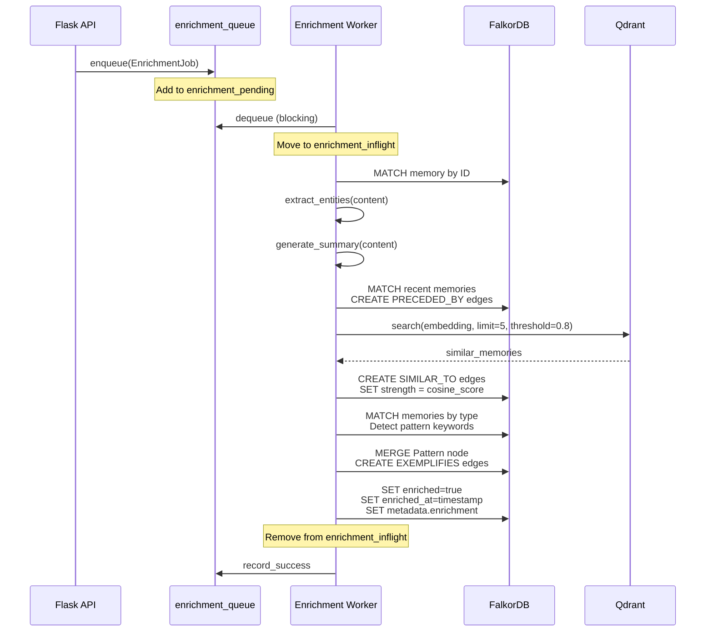
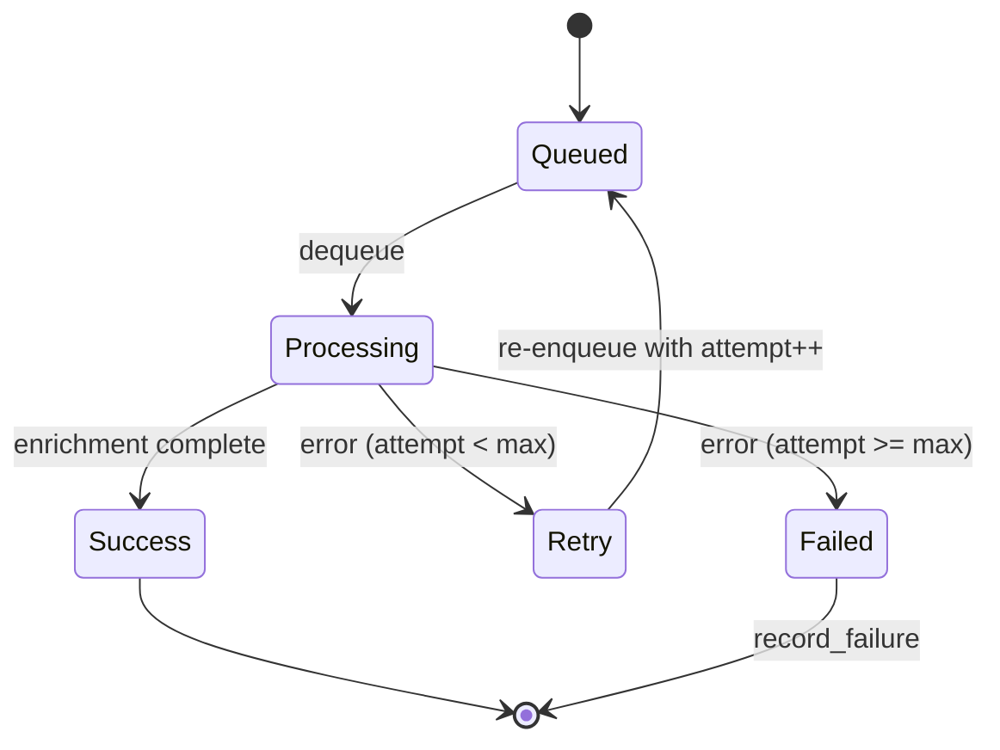

:::note[Source files]
Key GitHub sources:
- [automem/api/enrichment.py](https://github.com/verygoodplugins/automem/blob/ed36b98e3e1569dde71aa430417b6549520f7068/automem/api/enrichment.py) — `/enrichment/status` and `/enrichment/reprocess` route handlers
- [automem/enrichment/runtime_worker.py](https://github.com/verygoodplugins/automem/blob/ed36b98e3e1569dde71aa430417b6549520f7068/automem/enrichment/runtime_worker.py) — Enrichment worker thread and job queue management
- [automem/enrichment/runtime_orchestration.py](https://github.com/verygoodplugins/automem/blob/ed36b98e3e1569dde71aa430417b6549520f7068/automem/enrichment/runtime_orchestration.py) — Memory enrichment orchestration (enrich_memory, jit_enrich_lightweight)
- [automem/enrichment/runtime_helpers.py](https://github.com/verygoodplugins/automem/blob/ed36b98e3e1569dde71aa430417b6549520f7068/automem/enrichment/runtime_helpers.py) — Relationship creation helpers (temporal, semantic, pattern links)
- [automem/enrichment/runtime_queue_bindings.py](https://github.com/verygoodplugins/automem/blob/ed36b98e3e1569dde71aa430417b6549520f7068/automem/enrichment/runtime_queue_bindings.py) — Queue management
- [automem/service_state.py](https://github.com/verygoodplugins/automem/blob/ed36b98e3e1569dde71aa430417b6549520f7068/automem/service_state.py) — EnrichmentJob dataclass
- [automem/stores/graph_store.py](https://github.com/verygoodplugins/automem/blob/ed36b98e3e1569dde71aa430417b6549520f7068/automem/stores/graph_store.py) — Graph write operations for enrichment
- [.env.example](https://github.com/verygoodplugins/automem/blob/ed36b98e3e1569dde71aa430417b6549520f7068/.env.example) — Enrichment configuration variables
:::

The Enrichment Pipeline is a background worker system that automatically enhances stored memories with extracted entities, relationships, summaries, and pattern associations. This page documents the queue-based architecture, processing stages, entity extraction techniques, and relationship creation mechanisms.

For information about embedding generation (which runs in parallel), see [Embedding Generation](/docs/architecture/embeddings/). For details about consolidation cycles (decay, creative, cluster, forget), see the Consolidation Engine page. For the broader context of all background processing systems, see [Background Processing](/docs/architecture/background-processing/).

---

## System Architecture

The enrichment pipeline operates as an independent background thread that consumes jobs from a thread-safe queue. It processes memories asynchronously after storage, ensuring API write operations remain non-blocking.

### Processing Flow



---

## Data Structures

### EnrichmentJob

Jobs enqueued for processing contain the memory ID, retry attempt counter, and a forced flag for admin-triggered reprocessing.

Fields:
- `memory_id` — UUID of the memory to enrich
- `attempt` — Retry counter (0-indexed), incremented on each failure
- `forced` — When `true` (admin trigger), skips the already-enriched check and reprocesses

([automem/service_state.py](https://github.com/verygoodplugins/automem/blob/ed36b98e3e1569dde71aa430417b6549520f7068/automem/service_state.py))

---

## Job Lifecycle

### Job Creation

Enrichment jobs are enqueued in three scenarios:

| Trigger | Endpoint | Behavior |
|---|---|---|
| Memory creation | `POST /memory` | Automatic enqueue after graph write |
| Memory update | `PATCH /memory/:id` | Re-enqueue if content/tags changed |
| Admin reprocessing | `POST /enrichment/reprocess` | Forced reprocessing with `forced=true` |

### Retry Logic

Jobs that fail during processing are retried up to `ENRICHMENT_MAX_ATTEMPTS` times with flat backoff:

| Attempt | Backoff | Behavior |
|---|---|---|
| 1 | 0s | Immediate first attempt |
| 2 | `ENRICHMENT_FAILURE_BACKOFF_SECONDS` | Default 5 seconds |
| 3 | `ENRICHMENT_FAILURE_BACKOFF_SECONDS` | Default 5 seconds |
| Final | — | Record failure in `enrichment_stats` |



---

## Entity Extraction

### Extraction Methods

The pipeline uses a two-tier approach: spaCy NLP when available, with regex fallbacks for specific patterns.

**Tier 1: spaCy NLP**
- Runs `en_core_web_sm` model (configurable via `ENRICHMENT_SPACY_MODEL`)
- Model is loaded once and cached via LRU cache — eliminates repeated 5-10 second load time
- Named Entity Recognition (NER) extracts `PERSON`, `ORG`, `PRODUCT`, `WORK_OF_ART`, `EVENT`, `GPE`, `LOC` labels

**Tier 2: Regex Fallbacks**
- Active when spaCy is unavailable or as supplements for patterns spaCy misses
- Patterns like `"met with X"`, `"talked to X"` for people
- Backtick-delimited terms for project names
- `"using X"`, `"deploy X"` patterns for tools

### Entity Types

Five entity categories are extracted and stored in `metadata.entities`:

| Type | spaCy Labels | Regex Patterns | Examples |
|---|---|---|---|
| `people` | `PERSON` | `met with X`, `talked to X` | "Sarah", "John Smith" |
| `organizations` | `ORG` | — | "Google", "NASA" |
| `tools` | `PRODUCT`, `WORK_OF_ART` | `using X`, `deploy X` | "PostgreSQL", "Docker" |
| `concepts` | `EVENT`, `GPE`, `LOC` | — | "Machine Learning", "New York" |
| `projects` | — | backticks, `project called "X"` | "automem", "Project Phoenix" |

### Entity Validation

The `_is_valid_entity` function filters noise using multiple heuristics.

**Rejection criteria:**
- Length < 3 characters
- Matches `SEARCH_STOPWORDS`, `ENTITY_STOPWORDS`, or `ENTITY_BLOCKLIST`
- No alphabetic characters
- Starts lowercase (unless `allow_lower=true`)
- Starts with markdown/code symbols (`-`, `*`, `#`, `` ` ``, `{`, etc.)
- Ends with class name suffixes (`Adapter`, `Handler`, `Manager`, `Service`, etc.)
- Boolean/null literals (`true`, `false`, `null`, `undefined`)
- Environment variable pattern (UPPER_CASE with underscores)
- Exceeds `max_words` limit (if specified)

### Auto-Tagging

Extracted entities generate structured tags in the format `entity:<type>:<slug>`:

```
"John Smith" → entity:people:john-smith
"PostgreSQL" → entity:tools:postgresql
"Project Phoenix" → entity:projects:project-phoenix
```

Slugification uses `_slugify` to convert entities to URL-safe lowercase identifiers.

---

## Summary Generation

The `generate_summary` function creates lightweight gist representations for quick scanning, controlled by the `ENRICHMENT_ENABLE_SUMMARIES` configuration flag.

### Algorithm


**Example:**

Input: `"The team decided to migrate the database to PostgreSQL. This was due to performance concerns. Migration planned for Q2."`

Output: `"The team decided to migrate the database to PostgreSQL."`

---

## Relationship Creation

The enrichment pipeline automatically creates three types of relationships to build the knowledge graph.

### Temporal Links (PRECEDED_BY)

Connects memories to recently created or updated memories within a time window.

- Queries FalkorDB for memories created/updated within the configured time window
- Creates `PRECEDED_BY` edges from the new memory to those recent memories
- Establishes chronological chains in the graph

### Semantic Links (SIMILAR_TO)

Creates bidirectional edges between semantically similar memories using Qdrant vector search.

**Semantic Linking Flow:**
1. Query Qdrant for the memory's embedding (if available)
2. Search for similar vectors above the similarity threshold
3. Create `SIMILAR_TO` edges in FalkorDB with `strength = cosine_score`
4. Links are bidirectional (both directions created)

**Configuration:**
- `ENRICHMENT_SIMILARITY_LIMIT` — Maximum neighbors to link (default: 5)
- `ENRICHMENT_SIMILARITY_THRESHOLD` — Minimum cosine similarity (default: 0.8)

:::note
Semantic linking depends on the embedding worker having already generated a vector for the memory. The enrichment worker may query Qdrant using existing embeddings if the new memory's embedding is still pending.
:::

### Pattern Detection (EXEMPLIFIES)

Discovers recurring themes by analyzing memories of the same type and linking them to shared `Pattern` nodes.

**Pattern Detection Algorithm:**
1. Load recent memories of the same `type`
2. Extract key term frequencies (TF-IDF-style counting)
3. Identify terms appearing in multiple memories above threshold
4. `MERGE` a `Pattern` node identified by slugified theme name
5. Create `EXEMPLIFIES` edge from memory to pattern node

**Pattern node properties:**
- `pattern_id` — Unique identifier (slugified theme)
- `occurrences` — Counter incremented each time the pattern is detected
- `first_seen` — Timestamp of first occurrence
- `last_reinforced` — Timestamp of most recent occurrence

**EXEMPLIFIES relationship properties:**
- `pattern_type` — Memory type that exemplifies the pattern
- `confidence` — Detection confidence score
- `key_terms` — Array of keywords that define the pattern

---

## Configuration

### Environment Variables

| Variable | Default | Description |
|---|---|---|
| `ENRICHMENT_ENABLE_SUMMARIES` | `true` | Enable automatic summary generation |
| `ENRICHMENT_MAX_ATTEMPTS` | `3` | Maximum retry attempts before giving up |
| `ENRICHMENT_IDLE_SLEEP_SECONDS` | `2` | Worker sleep duration when queue is empty |
| `ENRICHMENT_FAILURE_BACKOFF_SECONDS` | `5` | Backoff delay between retry attempts |
| `ENRICHMENT_SIMILARITY_LIMIT` | `5` | Maximum semantic neighbors to link |
| `ENRICHMENT_SIMILARITY_THRESHOLD` | `0.8` | Minimum cosine similarity for `SIMILAR_TO` edges |
| `ENRICHMENT_SPACY_MODEL` | `en_core_web_sm` | spaCy model for NER (requires `pip install spacy`) |

---

## Monitoring and Observability

### Status Endpoint

The `GET /enrichment/status` endpoint exposes real-time worker metrics:

```json
{
  "status": "running",
  "queue_size": 3,
  "pending": 3,
  "inflight": 1,
  "max_attempts": 3,
  "stats": {
    "processed_total": 1024,
    "successes": 1021,
    "failures": 3,
    "last_success_id": "a1b2c3d4-...",
    "last_success_at": "2025-01-15T10:30:00Z",
    "last_error": "FalkorDB write failed",
    "last_error_at": "2025-01-14T08:15:00Z"
  }
}
```

**Fields:**
- `status` — Worker thread state: `"running"` or `"stopped"`
- `queue_size` — Items in the underlying queue (`enrichment_queue.qsize()`)
- `pending` — Count of IDs in `enrichment_pending` (items not yet dequeued; `len(state.enrichment_pending)`)
- `inflight` — Count of IDs in `enrichment_inflight` (items currently processing; `len(state.enrichment_inflight)`)
- `max_attempts` — Configured retry limit (`ENRICHMENT_MAX_ATTEMPTS`)
- `stats` — Lifetime counters from `EnrichmentStats.to_dict()`: `processed_total`, `successes`, `failures`, `last_success_id`, `last_success_at`, `last_error`, `last_error_at`

### Tracking Sets

Thread-safe sets prevent duplicate processing:

- `enrichment_pending` — Set of memory IDs awaiting enrichment (not yet dequeued)
- `enrichment_inflight` — Set of memory IDs currently being processed

When a job is dequeued, the ID is moved from `enrichment_pending` to `enrichment_inflight`. When processing completes (success or final failure), it is removed from `enrichment_inflight`. New enqueues check both sets to prevent duplicates.

---

## Error Handling

### Failure Scenarios

| Scenario | Behavior | Recovery |
|---|---|---|
| spaCy model unavailable | Log warning, use regex fallbacks | Graceful degradation |
| FalkorDB write failure | Retry with exponential backoff | Max 3 attempts |
| Qdrant unavailable | Skip semantic linking, log warning | Continue enrichment |
| Invalid memory ID | Log error, record failure | No retry |
| Extraction exception | Catch, log, retry | Max 3 attempts |

### Retry Mechanics

Jobs increment their `attempt` counter on each retry. When `attempt >= ENRICHMENT_MAX_ATTEMPTS`, the job is marked as failed and removed from the queue.

The backoff is a flat sleep of `ENRICHMENT_FAILURE_BACKOFF_SECONDS` on each failure:
- Attempt 1 → immediate
- Attempt 2 → sleep 5 seconds
- Attempt 3 → sleep 5 seconds
- After 3 failures → discard, record in `enrichment_stats`

---

## Performance Characteristics

### Throughput

- **Entity extraction:** ~50-100ms per memory (spaCy), ~5-10ms (regex only)
- **Summary generation:** <1ms (single sentence extraction)
- **Temporal linking:** ~10-50ms (depends on time window size)
- **Semantic linking:** ~20-100ms (Qdrant query for 5 neighbors)
- **Pattern detection:** ~50-200ms (depends on memory type frequency)

**Total enrichment time per memory:** ~150-500ms

### Concurrency

- Single worker thread processes jobs sequentially
- Non-blocking API writes (enrichment happens asynchronously)
- Lock-protected tracking sets prevent race conditions
- Queue-based architecture allows future multi-worker scaling

---

## Admin Operations

### Force Reprocessing

The `POST /enrichment/reprocess` endpoint (requires `X-Admin-Token`) allows forced re-enrichment of existing memories:

**Parameters:**
- `ids` — Array of memory UUIDs to reprocess

---

## Integration with Other Systems

### Relationship to Embedding Worker

Enrichment and embedding generation are independent workers:

| System | Trigger | Dependency |
|---|---|---|
| Embedding Worker | Memory created | None (immediate queue) |
| Enrichment Worker | Memory created | Uses Qdrant for similarity search (uses existing embeddings if available) |

Both can proceed in parallel. Enrichment can create `SIMILAR_TO` edges even if embedding generation is still in progress, using whatever embeddings are already in Qdrant.

For details on embedding generation, see [Embedding Generation](/docs/architecture/embeddings/).

### Relationship to Consolidation

Enrichment occurs immediately after memory creation, while consolidation runs on scheduled intervals:

- **Enrichment:** Per-memory processing (immediate, within seconds)
- **Consolidation:** Cross-memory analysis (daily/weekly/monthly intervals)

Enrichment creates the foundation (entities, initial relationships) that consolidation builds upon (decay scores, creative associations, clustering).

For details on consolidation cycles, see the Consolidation Engine page.
