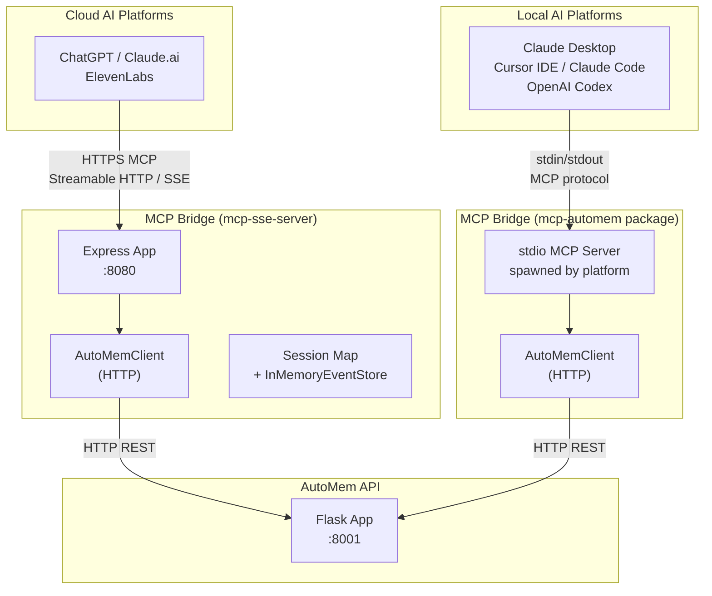
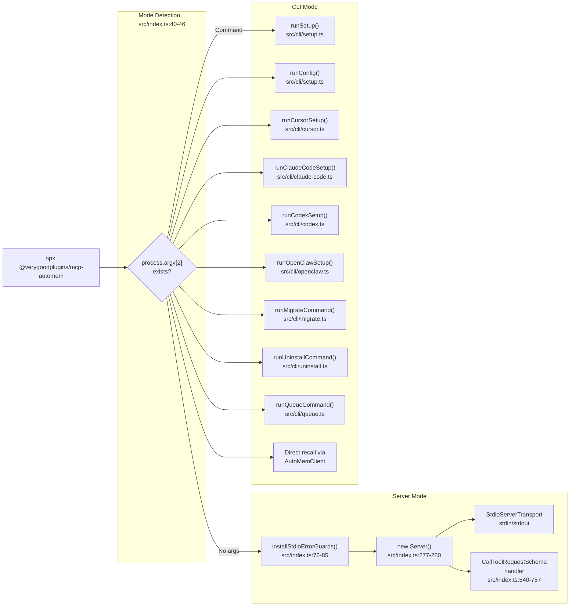
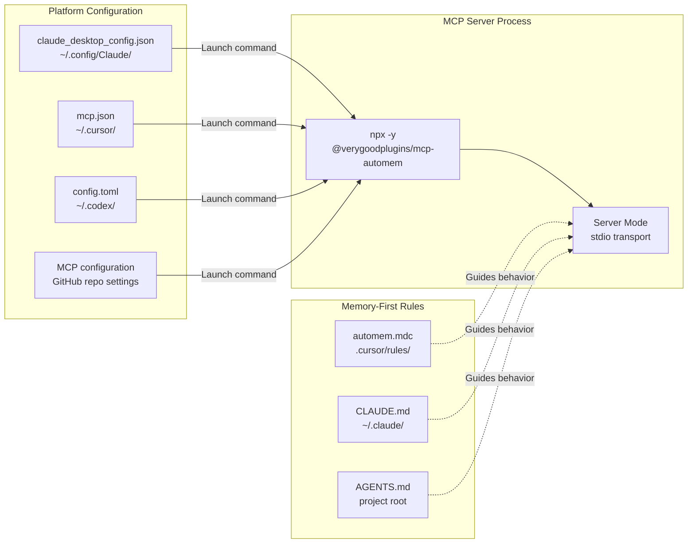
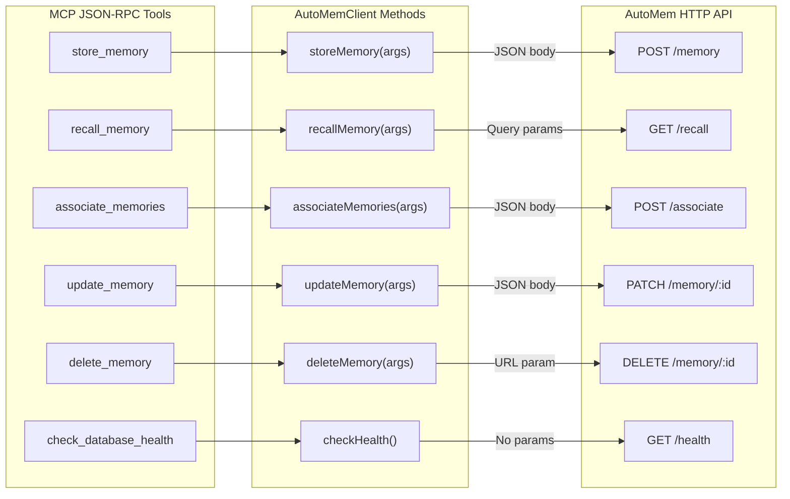
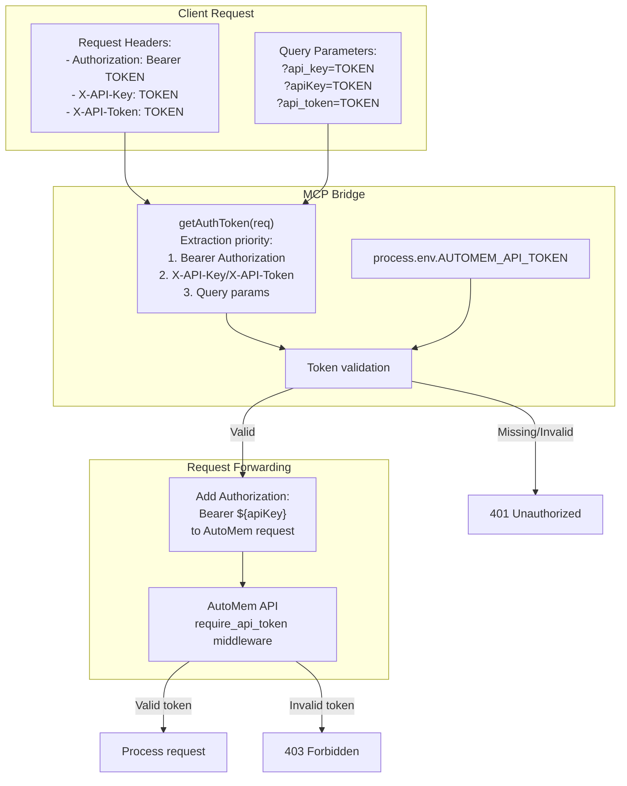

:::note[Source files]
Key GitHub sources:
- [mcp-sse-server/server.js](https://github.com/verygoodplugins/automem/blob/ed36b98e3e1569dde71aa430417b6549520f7068/mcp-sse-server/server.js) — Express app, transport handlers, tool definitions, session management
- [docs/MCP_SSE.md](https://github.com/verygoodplugins/automem/blob/ed36b98e3e1569dde71aa430417b6549520f7068/docs/MCP_SSE.md) — Transport protocol documentation
- [mcp-sse-server/README.md](https://github.com/verygoodplugins/automem/blob/ed36b98e3e1569dde71aa430417b6549520f7068/mcp-sse-server/README.md) — Deployment quickstart
- [src/index.ts](https://github.com/verygoodplugins/mcp-automem/blob/34fcfe2b7bdac6a99829c64cc74611e29af69a38/src/index.ts) — mcp-automem package entry point (stdio client)
- [src/automem-client.ts](https://github.com/verygoodplugins/mcp-automem/blob/34fcfe2b7bdac6a99829c64cc74611e29af69a38/src/automem-client.ts) — HTTP client implementation
:::

The MCP Bridge connects AI platforms to AutoMem's memory service. It exists in two forms that serve different integration scenarios:

1. **mcp-sse-server** (in the `automem` repo) — A Node.js/Express service that exposes AutoMem's HTTP API as an MCP server over Streamable HTTP or SSE transports, enabling **cloud-hosted AI platforms** (ChatGPT, Claude.ai, ElevenLabs) to access memory over the network.

2. **mcp-automem** (separate npm package) — A TypeScript package that runs as a **local stdio MCP server**, spawned directly by AI platforms on the developer's machine (Claude Desktop, Cursor, Claude Code, OpenAI Codex).

Both approaches implement the same six MCP tools and use the same `AutoMemClient` HTTP client to call the AutoMem API, but they differ in their transport mechanism, deployment model, and target use case.

---

## Architecture Overview

### mcp-sse-server Key Components

| Component | File Location | Purpose |
|---|---|---|
| Express app | [server.js:513](https://github.com/verygoodplugins/automem/blob/ed36b98e3e1569dde71aa430417b6549520f7068/mcp-sse-server/server.js#L513) | HTTP server with endpoint routing (`createApp()`) |
| `AutoMemClient` | [server.js:240-306](https://github.com/verygoodplugins/automem/blob/ed36b98e3e1569dde71aa430417b6549520f7068/mcp-sse-server/server.js#L240-L306) | HTTP client for AutoMem API |
| `buildMcpServer()` | [server.js:365-511](https://github.com/verygoodplugins/automem/blob/ed36b98e3e1569dde71aa430417b6549520f7068/mcp-sse-server/server.js#L365-L511) | MCP server factory with tool handlers |
| `InMemoryEventStore` | [server.js:202-237](https://github.com/verygoodplugins/automem/blob/ed36b98e3e1569dde71aa430417b6549520f7068/mcp-sse-server/server.js#L202-L237) | Event buffering for stream resumption |
| Session management | [server.js:532-554](https://github.com/verygoodplugins/automem/blob/ed36b98e3e1569dde71aa430417b6549520f7068/mcp-sse-server/server.js#L532-L554) | Map-based session tracking with TTL |

---

## mcp-automem: Local stdio Server

The `mcp-automem` npm package operates as a local MCP server using stdio transport. When invoked with no arguments, it launches the server; with arguments, it runs CLI commands.

### Entry Mode Detection

**Server Mode** (no arguments): Launches an MCP server using stdio transport. AI platforms (Claude Desktop, Cursor, etc.) spawn this process as an MCP server. Console output is redirected to stderr to avoid corrupting the stdio protocol stream.

**CLI Mode** (with arguments): Provides interactive commands for setup, configuration, platform installation, and memory operations.

### Standard MCP Integration Pattern

---

## mcp-sse-server: Transport Protocols

The mcp-sse-server bridge supports two MCP transport protocols with different characteristics and lifecycle models.

### Streamable HTTP Transport (2025-03-26)

**Implementation Details:**

- **Request handler**: [server.js:570](https://github.com/verygoodplugins/automem/blob/ed36b98e3e1569dde71aa430417b6549520f7068/mcp-sse-server/server.js#L570) — `app.all('/mcp', ...)` creates a fresh `StreamableHTTPServerTransport` per request (stateless — no server-side session map)
- **Event storage**: [server.js:202-237](https://github.com/verygoodplugins/automem/blob/ed36b98e3e1569dde71aa430417b6549520f7068/mcp-sse-server/server.js#L202-L237) — Stores up to 1000 events per stream
- **Session cleanup**: [server.js:534-554](https://github.com/verygoodplugins/automem/blob/ed36b98e3e1569dde71aa430417b6549520f7068/mcp-sse-server/server.js#L534-L554) — Sweeps every 5 minutes, 1-hour TTL
- **Resumability**: [server.js:231](https://github.com/verygoodplugins/automem/blob/ed36b98e3e1569dde71aa430417b6549520f7068/mcp-sse-server/server.js#L231) — `replayEventsAfter()` for `Last-Event-ID` support

### SSE Transport (2024-11-05, Deprecated)

**Implementation Details:**

- **Stream setup**: [server.js:878-912](https://github.com/verygoodplugins/automem/blob/ed36b98e3e1569dde71aa430417b6549520f7068/mcp-sse-server/server.js#L878-L912) — Creates `SSEServerTransport` with `/mcp/messages` endpoint
- **Heartbeat**: [server.js:903-905](https://github.com/verygoodplugins/automem/blob/ed36b98e3e1569dde71aa430417b6549520f7068/mcp-sse-server/server.js#L903-L905) — Sends `: ping\n\n` every 20 seconds
- **Message handling**: [server.js:878-912](https://github.com/verygoodplugins/automem/blob/ed36b98e3e1569dde71aa430417b6549520f7068/mcp-sse-server/server.js#L878-L912) — Routes POST to `handlePostMessage()`
- **Cleanup**: [server.js:878-912](https://github.com/verygoodplugins/automem/blob/ed36b98e3e1569dde71aa430417b6549520f7068/mcp-sse-server/server.js#L878-L912) — `res.on('close')` clears heartbeat and session

### Transport Comparison

| Feature | Streamable HTTP | SSE (Deprecated) |
|---|---|---|
| Protocol version | 2025-03-26 | 2024-11-05 |
| Initialization | Single endpoint (`POST /mcp`) | Separate endpoints (`GET /mcp/sse`, `POST /mcp/messages`) |
| Session ID | `Mcp-Session-Id` header | Query param in POST URL |
| Resumability | `Last-Event-ID` header | None |
| Event buffering | `InMemoryEventStore` (1000 events) | None |
| Connection style | Stateful sessions with TTL | Long-lived SSE stream |
| Heartbeat | Not needed (stateless requests) | 20-second ping interval |

---

## Protocol Translation

Both bridge implementations translate between MCP JSON-RPC tool calls and AutoMem's REST API.

### Tool-to-Endpoint Mapping

### AutoMemClient HTTP Request Flow

```mermaid
sequenceDiagram
    participant Handler as "Tool Handler"
    participant Client as "AutoMemClient"
    participant Request as "_request(method, path, body)"
    participant API as "Flask API :8001"

    Handler->>Client: client.storeMemory({content, tags, ...})
    Client->>Client: Build request body with all fields
    Client->>Request: _request('POST', 'memory', body)
    Request->>Request: Construct URL:<br/>endpoint + '/' + path
    Request->>Request: Add headers:<br/>Content-Type: application/json<br/>Authorization: Bearer ${apiKey}
    Request->>API: fetch(url, {method, headers, body})
    API-->>Request: HTTP response
    Request->>Request: await res.json()
    alt Response OK
        Request-->>Client: Parsed JSON data
        Client-->>Handler: {memory_id, message}
    else Response Error
        Request->>Request: throw Error(data.message || data.detail)
        Request-->>Handler: Error thrown
    end
```

**Key AutoMemClient Methods (mcp-sse-server):**

| Method | HTTP Method | Endpoint Pattern | Request Body |
|---|---|---|---|
| `storeMemory()` | POST | `/memory` | All Memory fields |
| `recallMemory()` | GET | `/recall?{params}` | URLSearchParams encoding |
| `associateMemories()` | POST | `/associate` | Two IDs + type/strength |
| `updateMemory()` | PATCH | `/memory/{id}` | Partial updates |
| `deleteMemory()` | DELETE | `/memory/{id}` | ID in URL |
| `checkHealth()` | GET | `/health` | No body |

**Error Handling:** [server.js:104-167](https://github.com/verygoodplugins/automem/blob/ed36b98e3e1569dde71aa430417b6549520f7068/mcp-sse-server/server.js#L104-L167) wraps fetch failures and non-OK responses into Error objects.

---

## Authentication

Both bridge implementations support multiple authentication methods for flexibility across different client platforms.

### Authentication Flow

**Token Extraction Priority (mcp-sse-server):**

1. `Authorization: Bearer` header (preferred)
2. `X-API-Key` or `X-API-Token` header
3. Query parameters: `api_key`, `apiKey`, or `api_token`

**Environment Fallback:** If client doesn't provide token, uses `process.env.AUTOMEM_API_TOKEN` from [server.js](https://github.com/verygoodplugins/automem/blob/ed36b98e3e1569dde71aa430417b6549520f7068/mcp-sse-server/server.js) (Alexa, Streamable HTTP, and SSE endpoints).

**mcp-automem environment variable priority:**

1. `AUTOMEM_API_KEY` (primary, current)
2. `AUTOMEM_API_TOKEN` (fallback)

The `readAutoMemApiKeyFromEnv()` function in `src/env.ts` implements this priority chain.

---

## Tool Definitions

Both bridge implementations expose six MCP tools with JSON schemas for validation.

### Detailed Tool Specifications

**`store_memory`** — [server.js:377-400](https://github.com/verygoodplugins/automem/blob/ed36b98e3e1569dde71aa430417b6549520f7068/mcp-sse-server/server.js#L377-L400)

| Parameter | Type | Required | Constraints | Description |
|---|---|---|---|---|
| `content` | string | Yes | — | Memory text content |
| `tags` | string[] | No | — | Classification tags |
| `importance` | number | No | 0.0-1.0 | Relevance score |
| `embedding` | number[] | No | — | Pre-computed vector |
| `metadata` | object | No | — | Custom key-value pairs |
| `timestamp` | string | No | ISO 8601 | Creation time |
| `type` | string | No | — | Memory classification |
| `confidence` | number | No | 0.0-1.0 | Classification confidence |

**`recall_memory`** — [server.js:401-456](https://github.com/verygoodplugins/automem/blob/ed36b98e3e1569dde71aa430417b6549520f7068/mcp-sse-server/server.js#L401-L456)

Advanced recall parameters:
- `expand_relations` (boolean): Enable graph traversal
- `expand_entities` (boolean): Multi-hop via entities
- `auto_decompose` (boolean): Generate sub-queries
- `expansion_limit` (integer 1-500): Max expanded results
- `relation_limit` (integer 1-200): Relations per seed
- `expand_min_importance` (number 0-1): Filter threshold
- `expand_min_strength` (number 0-1): Relation strength threshold

Context hints:
- `context` (string): e.g., "coding-style", "architecture"
- `language` (string): e.g., "python", "typescript"
- `active_path` (string): Current file path
- `context_tags` (string[]): Priority tags
- `context_types` (string[]): Priority memory types
- `priority_ids` (string[]): Specific IDs to boost

**Output Formats** ([server.js:365-511](https://github.com/verygoodplugins/automem/blob/ed36b98e3e1569dde71aa430417b6549520f7068/mcp-sse-server/server.js#L365-L511)):
- `text` (default): Single-block text with all results
- `items`: One MCP content item per memory
- `detailed`: Items with timestamps, relations, scores
- `json`: Raw API response as JSON string

### Result Formatting

**`formatRecallAsItems()` Function:**

[server.js:308-362](https://github.com/verygoodplugins/automem/blob/ed36b98e3e1569dde71aa430417b6549520f7068/mcp-sse-server/server.js#L308-L362) transforms AutoMem API responses into MCP content items.

**Relation Summarization:** [server.js:308-362](https://github.com/verygoodplugins/automem/blob/ed36b98e3e1569dde71aa430417b6549520f7068/mcp-sse-server/server.js#L308-L362) — Shows up to 5 relations with type, strength, and source ID.

---

## Session Management (mcp-sse-server)

The mcp-sse-server bridge maintains stateful sessions for both transport protocols with different lifecycle strategies.

### Session State Structure

**Session Creation:**

Streamable HTTP — [server.js:836-875](https://github.com/verygoodplugins/automem/blob/ed36b98e3e1569dde71aa430417b6549520f7068/mcp-sse-server/server.js#L836-L875)

SSE — [server.js:878-912](https://github.com/verygoodplugins/automem/blob/ed36b98e3e1569dde71aa430417b6549520f7068/mcp-sse-server/server.js#L878-L912)

**Session Cleanup:**

| Transport | Cleanup Strategy | TTL | Implementation |
|---|---|---|---|
| Streamable HTTP | Sweep interval | 1 hour idle | [server.js:534-554](https://github.com/verygoodplugins/automem/blob/ed36b98e3e1569dde71aa430417b6549520f7068/mcp-sse-server/server.js#L534-L554) — 5 minute sweeps |
| SSE | Connection close | Until disconnect | [server.js:878-912](https://github.com/verygoodplugins/automem/blob/ed36b98e3e1569dde71aa430417b6549520f7068/mcp-sse-server/server.js#L878-L912) — `res.on('close')` |

### Event Store Implementation

**Purpose:** Enable session resumption with `Last-Event-ID` header for Streamable HTTP transport.

[server.js:202-237](https://github.com/verygoodplugins/automem/blob/ed36b98e3e1569dde71aa430417b6549520f7068/mcp-sse-server/server.js#L202-L237) `InMemoryEventStore` class:

| Method | Parameters | Return | Description |
|---|---|---|---|
| `storeEvent()` | streamId, message | eventId | Store event with auto-generated ID, limit 1000 per stream |
| `replayEventsAfter()` | streamId, lastEventId | message[] | Return all events after specified ID |
| `removeStream()` | streamId | void | Delete all events for stream |
| `stopCleanup()` | — | void | Stop TTL sweep timer |

**Event ID Format:** [server.js:221](https://github.com/verygoodplugins/automem/blob/ed36b98e3e1569dde71aa430417b6549520f7068/mcp-sse-server/server.js#L221) — `${streamId}-${Date.now()}-${randomUUID().slice(0, 8)}`

**TTL Sweep:** [server.js:206-213](https://github.com/verygoodplugins/automem/blob/ed36b98e3e1569dde71aa430417b6549520f7068/mcp-sse-server/server.js#L206-L213) — Runs every 5 minutes (default), removes streams idle > 1 hour.

---

## Additional Features

### Alexa Integration (mcp-sse-server)

The bridge includes a custom Alexa skill endpoint separate from MCP protocol handling.

**Implementation Details:**

| Component | File Location | Purpose |
|---|---|---|
| Endpoint handler | [server.js:673-739](https://github.com/verygoodplugins/automem/blob/ed36b98e3e1569dde71aa430417b6549520f7068/mcp-sse-server/server.js#L673-L739) | Routes Alexa JSON to AutoMem API |
| `speech()` helper | [server.js:613-624](https://github.com/verygoodplugins/automem/blob/ed36b98e3e1569dde71aa430417b6549520f7068/mcp-sse-server/server.js#L613-L624) | Builds Alexa response JSON |
| `getSlot()` | [server.js:631-636](https://github.com/verygoodplugins/automem/blob/ed36b98e3e1569dde71aa430417b6549520f7068/mcp-sse-server/server.js#L631-L636) | Extracts intent slot values |
| `buildAlexaTags()` | [server.js:642-651](https://github.com/verygoodplugins/automem/blob/ed36b98e3e1569dde71aa430417b6549520f7068/mcp-sse-server/server.js#L642-L651) | Adds `alexa`, `user:{id}`, `device:{id}` tags |
| `formatRecallSpeech()` | [server.js:656-670](https://github.com/verygoodplugins/automem/blob/ed36b98e3e1569dde71aa430417b6549520f7068/mcp-sse-server/server.js#L656-L670) | Converts memories to spoken text (240 char limit) |

**Supported Intents:**

| Intent | Slot | Action | Response |
|---|---|---|---|
| `RememberIntent` | `note` | Store memory with Alexa tags | "Saved to memory." |
| `RecallIntent` | `query` | Search with tags, fallback without | Speak up to 3 results |
| `AMAZON.HelpIntent` | — | — | Usage instructions |
| `LaunchRequest` | — | — | Welcome message |

**Tag Scoping:** [server.js:673-739](https://github.com/verygoodplugins/automem/blob/ed36b98e3e1569dde71aa430417b6549520f7068/mcp-sse-server/server.js#L673-L739) — Recall tries user-specific tags first, falls back to unscoped search.

### Health Endpoint

**Route:** `GET /health` — [server.js:773-792](https://github.com/verygoodplugins/automem/blob/ed36b98e3e1569dde71aa430417b6549520f7068/mcp-sse-server/server.js#L773-L792)

**Purpose:** Railway health checks, monitoring systems, and client capability detection.

---

## Deployment Integration (mcp-sse-server)

### Railway Configuration

The MCP Bridge deploys as a separate service alongside the AutoMem API service.

**Required Environment Variables:**

| Variable | Example | Purpose |
|---|---|---|
| `PORT` | `8080` | Express listener port (Railway requires) |
| `AUTOMEM_API_URL` | `http://memory-service.railway.internal:8001` | Internal AutoMem API endpoint |
| `AUTOMEM_API_TOKEN` | `${shared.AUTOMEM_API_TOKEN}` | Shared secret for API authentication |

**Railway Template Setup:** [docs/RAILWAY_DEPLOYMENT.md](https://github.com/verygoodplugins/automem/blob/ed36b98e3e1569dde71aa430417b6549520f7068/docs/RAILWAY_DEPLOYMENT.md) — One-click deployment includes mcp-sse-server by default.

**Manual Setup:** Add service with root directory `mcp-sse-server`, auto-detects Dockerfile.

**Internal Networking:** Uses `*.railway.internal` domains for service-to-service communication (IPv6).

### Network Architecture

**Port Configuration:**
- MCP Bridge: External `:443` (HTTPS) → Internal `:8080` (HTTP)
- AutoMem API: Internal `:8001` (HTTP only, no public domain by default)
- FalkorDB: Internal `:6379` (Redis protocol, no public access)

:::caution[Common Issue: PORT Variable]
Without `PORT=8001` set, Flask defaults to `:5000`, causing `ECONNREFUSED` errors from the MCP bridge. Always set `PORT=8001` for the memory-service.
:::

### Cost Optimization

**Resource Sizing:**

| Component | CPU | Memory | Monthly Cost |
|---|---|---|---|
| mcp-sse-server | 0.25 vCPU | 256 MB | ~$2-3 |
| memory-service | 0.5 vCPU | 512 MB | ~$5 |
| FalkorDB | 1 vCPU | 1 GB | ~$10 |

:::tip
If only using Cursor or Claude Desktop (local MCP clients via mcp-automem package), you can delete the mcp-sse-server service to save $2-3/month. The mcp-sse-server is only needed for cloud-hosted AI platforms.
:::

---

## Security Considerations

**Token Exposure:**
- Query parameter auth (`?api_token=`) may appear in logs
- Prefer header-based auth (`Authorization: Bearer`) when platform supports it
- Railway internal logs capture all request URLs

**Network Isolation:**
- MCP bridge has public domain (required for cloud AI platforms)
- AutoMem API should remain internal (`*.railway.internal`)
- FalkorDB never exposed publicly

**Token Rotation:**
- Update `AUTOMEM_API_TOKEN` in both mcp-sse-server and memory-service simultaneously
- Use Railway shared variables (`${shared.AUTOMEM_API_TOKEN}`) to maintain consistency

---

## Choosing the Right Integration

| Scenario | Recommended Approach |
|---|---|
| Claude Desktop, Cursor, Claude Code, Codex | `mcp-automem` npm package (local stdio) |
| ChatGPT, Claude.ai, ElevenLabs, any cloud AI | `mcp-sse-server` (Railway deployment) |
| Alexa voice interface | `mcp-sse-server` Alexa endpoint |
| Self-hosted local AI with network access | Either approach depending on platform support |

For platform-specific integration guides, see [Platform Integrations](/docs/platforms/claude-desktop/).
