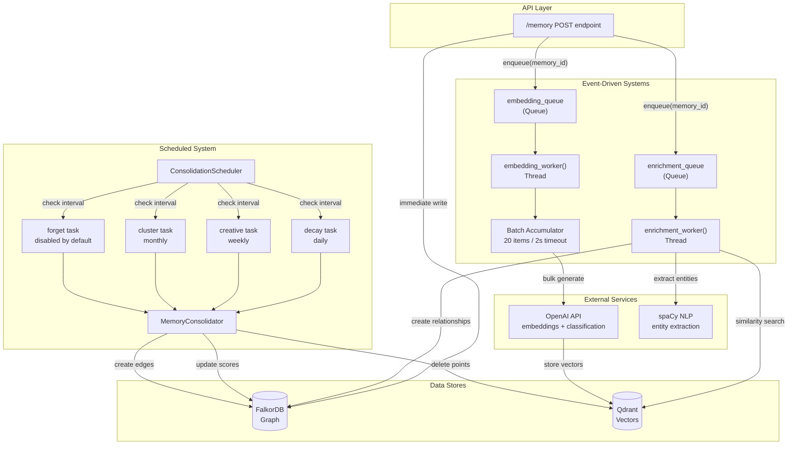
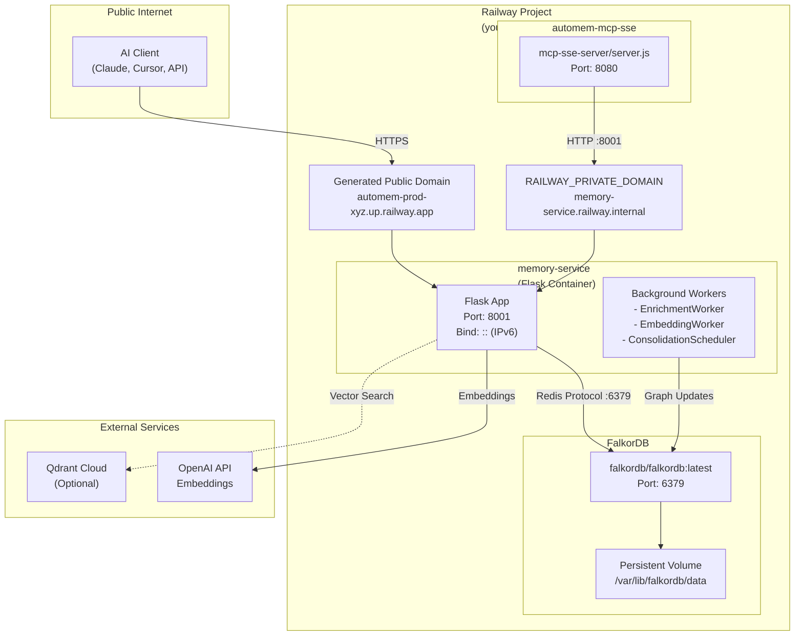
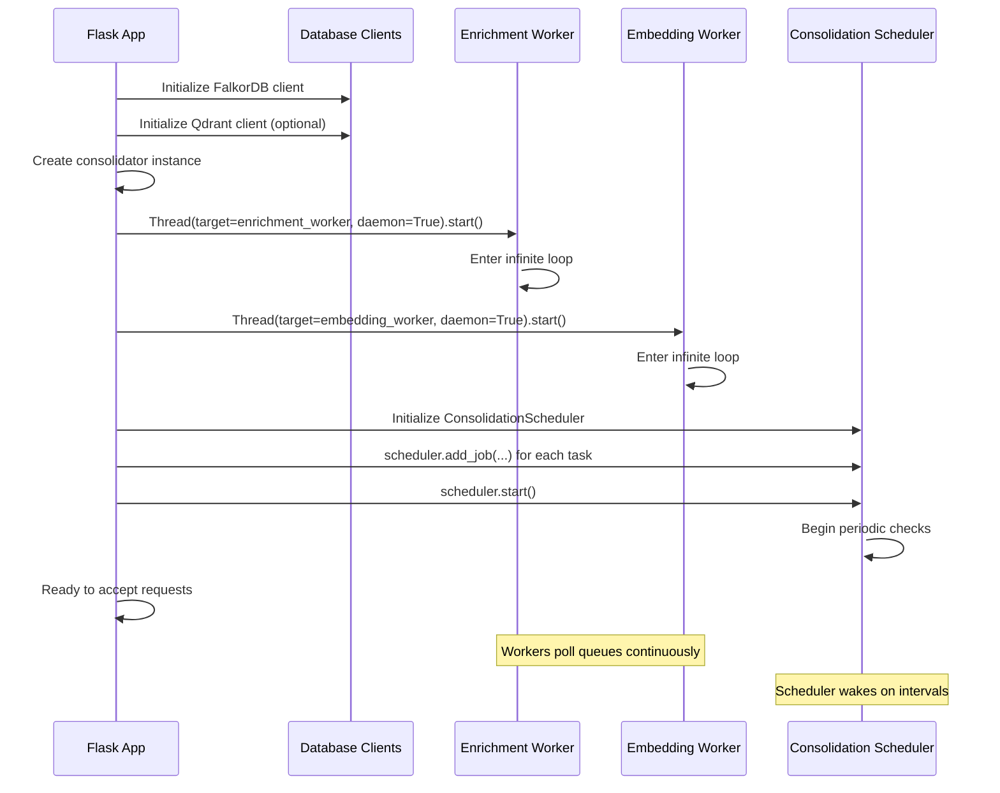

:::note[Source files]
Key GitHub sources:
- [automem/service_state.py](https://github.com/verygoodplugins/automem/blob/main/automem/service_state.py) — ServiceState dataclass and shared state
- [automem/config.py](https://github.com/verygoodplugins/automem/blob/main/automem/config.py) — Centralized configuration and constants
- [automem/runtime_wiring.py](https://github.com/verygoodplugins/automem/blob/main/automem/runtime_wiring.py) — Application startup and worker initialization
- [automem/api/](https://github.com/verygoodplugins/automem/blob/main/automem/api/) — Route blueprints (memory.py, recall.py, graph.py, admin.py, health.py, enrichment.py, consolidation.py, viewer.py)
- [automem/stores/graph_store.py](https://github.com/verygoodplugins/automem/blob/main/automem/stores/graph_store.py) — FalkorDB operations
- [automem/stores/vector_store.py](https://github.com/verygoodplugins/automem/blob/main/automem/stores/vector_store.py) — Qdrant operations
- [automem/embedding/provider.py](https://github.com/verygoodplugins/automem/blob/main/automem/embedding/provider.py) — Embedding provider abstraction
:::

This document provides a comprehensive overview of AutoMem's internal architecture, design decisions, and component interactions. It covers the Flask application structure, service initialization, request processing flow, and the coordination between storage systems and background workers.

For detailed information about specific components:

- Storage layer implementation: see [Data Stores](/docs/architecture/data-stores/)
- Background worker systems: see [Background Processing](/docs/architecture/background-processing/)
- MCP protocol integration: see [MCP Bridge](/docs/architecture/mcp-bridge/)
- Enrichment pipeline: see [Enrichment Pipeline](/docs/architecture/enrichment/)
- Embedding generation: see [Embedding Generation](/docs/architecture/embeddings/)

---

## Core Architecture Principles

AutoMem implements three fundamental architectural patterns:

### 1. Dual-Storage Canonical Design

FalkorDB serves as the **canonical data store** with authoritative memory records, while Qdrant provides **optional semantic search capabilities**. All memory writes commit to FalkorDB first; Qdrant failures do not block operations.

This design ensures:

- **Graph operations always succeed** regardless of vector store availability
- Built-in redundancy for disaster recovery
- Graceful degradation to graph-only mode when Qdrant is unavailable

### 2. Asynchronous Enrichment Pipeline

Memory storage returns immediately to clients while enrichment processes asynchronously. This prevents blocking on:

- Entity extraction via spaCy NLP
- Embedding generation via external APIs
- Pattern detection across the memory graph
- Relationship creation between memories

### 3. Provider Pattern for External Services

The embedding system uses a provider abstraction that enables automatic fallback and explicit provider selection.

Implementations: `VoyageEmbeddingProvider`, `OpenAIEmbeddingProvider`, `FastEmbedProvider`, `OllamaEmbeddingProvider`, `PlaceholderEmbeddingProvider`.

---

## System Architecture Diagram

---

## Service Topology

---

## Flask Application Structure

### ServiceState Dataclass

The `ServiceState` dataclass ([automem/service_state.py](https://github.com/verygoodplugins/automem/blob/main/automem/service_state.py)) serves as the central state container for all service components.

This single `state` instance is shared across all Flask request handlers and background threads, requiring careful lock management for queue operations.

---

## Service Initialization Sequence

The Flask application initializes services in a specific order to ensure dependencies are available:

### Key Initialization Functions

| Function | Purpose | Location |
|---|---|---|
| `init_falkordb()` | Establishes FalkorDB connection | [automem/stores/runtime_clients.py](https://github.com/verygoodplugins/automem/blob/main/automem/stores/runtime_clients.py) |
| `init_qdrant()` | Establishes optional Qdrant connection | [automem/stores/runtime_clients.py](https://github.com/verygoodplugins/automem/blob/main/automem/stores/runtime_clients.py) |
| `init_openai()` | Initializes OpenAI client for memory classification | [automem/service_runtime.py](https://github.com/verygoodplugins/automem/blob/main/automem/service_runtime.py) |
| `init_embedding_provider()` | Selects and initializes embedding provider | [automem/embedding/provider_init.py](https://github.com/verygoodplugins/automem/blob/main/automem/embedding/provider_init.py) |
| `init_enrichment_pipeline()` | Launches entity extraction and linking pipeline | [automem/enrichment/runtime_queue_bindings.py](https://github.com/verygoodplugins/automem/blob/main/automem/enrichment/runtime_queue_bindings.py) |
| `init_embedding_pipeline()` | Launches batch embedding generation worker | [automem/embedding/runtime_bindings.py](https://github.com/verygoodplugins/automem/blob/main/automem/embedding/runtime_bindings.py) |
| `init_consolidation_scheduler()` | Launches scheduled consolidation cycles | [automem/consolidation/runtime_bindings.py](https://github.com/verygoodplugins/automem/blob/main/automem/consolidation/runtime_bindings.py) |
| `init_sync_worker()` | Launches drift detection and repair worker | [automem/sync/runtime_bindings.py](https://github.com/verygoodplugins/automem/blob/main/automem/sync/runtime_bindings.py) |

---

## Request Processing Flow

### Memory Storage Request

The `POST /memory` request flows through synchronous and asynchronous phases:

:::note[Critical Design Point]
The graph write to FalkorDB always succeeds before queuing asynchronous tasks. Qdrant writes are best-effort and logged but do not block the response.
:::

### Memory Recall Request

Recall implements hybrid search combining vector similarity, keyword matching, and graph traversal.

### 9-Component Hybrid Scoring

The `_compute_metadata_score()` function ([automem/utils/scoring.py](https://github.com/verygoodplugins/automem/blob/main/automem/utils/scoring.py)) combines signals with configurable weights:

| Component | Weight | Source | Config Variable |
|---|---|---|---|
| Vector similarity | 35% | Qdrant cosine distance | `SEARCH_WEIGHT_VECTOR` |
| Keyword match | 35% | TF-IDF from graph query | `SEARCH_WEIGHT_KEYWORD` |
| Relationship strength | 25% | Graph edge properties | `SEARCH_WEIGHT_RELATION` |
| Exact match | 20% | Exact string match | `SEARCH_WEIGHT_EXACT` |
| Tag matching | 20% | Prefix/exact tag filters | `SEARCH_WEIGHT_TAG` |
| Importance score | 10% | User-assigned priority | `SEARCH_WEIGHT_IMPORTANCE` |
| Recency boost | 10% | Freshness decay function | `SEARCH_WEIGHT_RECENCY` |
| Confidence score | 5% | Classification confidence | `SEARCH_WEIGHT_CONFIDENCE` |
| Relevance | 0% | Contextual relevance hint | `SEARCH_WEIGHT_RELEVANCE` |

---

## Background Worker Architecture

AutoMem runs four independent background threads that process memories asynchronously without blocking API requests.

### Worker Coordination via ServiceState

All workers share the `ServiceState` instance and use thread-safe coordination:

| Worker | Queue | Lock | Tracking Sets | Stop Signal |
|---|---|---|---|---|
| Enrichment | `enrichment_queue` | `enrichment_lock` | `enrichment_inflight`, `enrichment_pending` | None (daemon) |
| Embedding | `embedding_queue` | `embedding_lock` | `embedding_inflight`, `embedding_pending` | None (daemon) |
| Consolidation | N/A (schedule-based) | N/A | N/A | `consolidation_stop_event` |
| Sync | N/A (interval-based) | N/A | N/A | `sync_stop_event` |

:::note[Critical Pattern]
The `_inflight` sets prevent duplicate processing when the same `memory_id` appears multiple times in a queue. Workers acquire the lock, check the set, add the ID, process, then remove the ID before releasing the lock.
:::

---

## Storage Layer Abstraction

AutoMem uses two abstraction modules to isolate database-specific logic:

### Graph Store Module

The `automem/stores/graph_store.py` module encapsulates FalkorDB operations:

Key functions:
- `_build_graph_tag_predicate(tag_mode, tag_match)` — Generates Cypher WHERE clauses for tag filtering
- `_serialize_node(node)` — Converts FalkorDB node to dictionary with property extraction
- `_summarize_relation_node(rel)` — Extracts relationship metadata (type, strength, context)

### Vector Store Module

The `automem/stores/vector_store.py` module handles Qdrant operations:

Key functions:
- `_build_qdrant_tag_filter(tags, mode, match)` — Constructs Qdrant filter objects for tag queries
- `ensure_qdrant_collection()` — Creates collection with appropriate vector parameters if missing ([automem/stores/runtime_clients.py](https://github.com/verygoodplugins/automem/blob/main/automem/stores/runtime_clients.py))
- Graceful degradation: All Qdrant operations wrapped in try-except with logging but no request failures

---

## Authentication and Authorization Flow

AutoMem implements two-tier authorization with multiple token extraction methods.

### Token Extraction Methods

The `_extract_api_token()` function ([automem/api/auth_helpers.py](https://github.com/verygoodplugins/automem/blob/main/automem/api/auth_helpers.py)) tries three methods in order:

1. **Bearer token** (recommended): `Authorization: Bearer {token}`
2. **Custom header**: `X-API-Key: {token}`
3. **Query parameter** (discouraged): `?api_key={token}`

### Admin Endpoints

Admin operations require a separate token checked by `_require_admin_token()` ([automem/api/auth_helpers.py](https://github.com/verygoodplugins/automem/blob/main/automem/api/auth_helpers.py)):

| Endpoint | Purpose | Admin Token Required |
|---|---|---|
| `POST /admin/reembed` | Regenerate all embeddings | Yes |
| `POST /enrichment/reprocess` | Force re-enrichment | Yes |
| `GET /consolidate/status` | View scheduler state | No |
| `POST /consolidate` | Trigger consolidation | No |

**Configuration:**
- `AUTOMEM_API_TOKEN` — Standard API access ([automem/config.py:124](https://github.com/verygoodplugins/automem/blob/main/automem/config.py#L124))
- `ADMIN_API_TOKEN` — Admin operations ([automem/config.py:123](https://github.com/verygoodplugins/automem/blob/main/automem/config.py#L123))

---

## Embedding Provider Architecture

The embedding system uses a provider pattern that enables automatic fallback and explicit selection.

### Provider Interface

All providers implement the `EmbeddingProvider` abstract base class.

### Auto-Selection Priority

When `EMBEDDING_PROVIDER=auto` (default), the system tries providers in order:

1. **Voyage AI** — Best quality, requires API key ([automem/embedding/voyage.py](https://github.com/verygoodplugins/automem/blob/main/automem/embedding/voyage.py))
2. **OpenAI** — High quality, requires API key ([automem/embedding/openai.py](https://github.com/verygoodplugins/automem/blob/main/automem/embedding/openai.py))
3. **Ollama** — Local server, no API key ([automem/embedding/ollama.py](https://github.com/verygoodplugins/automem/blob/main/automem/embedding/ollama.py))
4. **FastEmbed** — Local ONNX, no API key ([automem/embedding/fastembed.py](https://github.com/verygoodplugins/automem/blob/main/automem/embedding/fastembed.py))
5. **Placeholder** — Hash-based, always available ([automem/embedding/placeholder.py](https://github.com/verygoodplugins/automem/blob/main/automem/embedding/placeholder.py))

### Dimension Validation

The `validate_vector_dimensions()` function ([automem/utils/validation.py](https://github.com/verygoodplugins/automem/blob/main/automem/utils/validation.py)) prevents dimension mismatches that would corrupt Qdrant data.

:::caution
If validation fails, the memory still writes to FalkorDB (canonical record preserved) but the embedding is not stored in Qdrant.
:::

---

## Configuration Management

Configuration is centralized in `automem/config.py` which loads environment variables and provides constants throughout the codebase.

### Core Configuration Categories

| Category | Key Variables | Purpose |
|---|---|---|
| **Database** | `FALKORDB_HOST`, `FALKORDB_PORT`, `GRAPH_NAME` | Graph database connection |
| **Vector Store** | `QDRANT_URL`, `QDRANT_API_KEY`, `COLLECTION_NAME`, `VECTOR_SIZE` | Optional semantic search |
| **Authentication** | `AUTOMEM_API_TOKEN`, `ADMIN_API_TOKEN` | API access control |
| **Embedding** | `EMBEDDING_PROVIDER`, `EMBEDDING_MODEL`, `VOYAGE_API_KEY`, `OPENAI_API_KEY` | Embedding generation |
| **Enrichment** | `ENRICHMENT_*` (12 variables) | Entity extraction, linking |
| **Consolidation** | `CONSOLIDATION_*` (15 variables) | Schedule, thresholds |
| **Search** | `SEARCH_WEIGHT_*` (8 variables) | Hybrid scoring weights |
| **Memory** | `MEMORY_TYPES`, `RELATIONSHIP_TYPES`, `TYPE_ALIASES` | Type system |

### Configuration Loading Priority

The `automem/config.py` module loads configuration in this order:

1. **Environment variables** — Highest priority
2. **~/.config/automem/.env** — User-level defaults
3. **Project .env** — Development defaults
4. **Hardcoded defaults** — Fallback values in config.py

### Memory Type System

The type system supports classification and normalization across defined memory types.

### Relationship Type System

The relationship type system defines 14 typed edges (11 authorable + 3 system-generated) with validation.

---

## Error Handling and Graceful Degradation

AutoMem implements defense-in-depth error handling to maximize availability.

### Storage Layer Resilience

**Design principle:** FalkorDB writes commit before Qdrant operations. Vector store failures are logged but do not return errors to clients.

### Background Worker Resilience

Each worker implements retry logic with exponential backoff:

| Worker | Max Retries | Backoff | Failure Handling |
|---|---|---|---|
| Enrichment | 3 | 5s, 10s, 15s | Log error, update stats, discard job |
| Embedding | Built into provider | Provider-specific | Queue retries, mark failed after max attempts |
| Consolidation | Infinite (scheduled) | None | Log error, continue to next cycle |
| Sync | Infinite (interval) | None | Log error, retry on next interval |

### API Error Responses

The Flask application uses structured error responses.

HTTP status codes:
- `400` — Client error (invalid request)
- `401` — Unauthorized (missing/invalid token)
- `403` — Forbidden (admin token required)
- `404` — Not found (memory doesn't exist)
- `500` — Server error (unexpected failure)
- `503` — Service unavailable (database down)

---

## Performance Optimizations

### Embedding Batch Processing

The embedding worker batches requests to reduce API costs and latency.

:::tip
Batching reduces embedding API calls by 95% (20 memories per call vs. 1 memory per call).
:::

### Query Result Deduplication

The `seen_ids` set prevents duplicate results when combining vector and keyword search.

### LRU Caching for Entity Extraction

The spaCy NLP model is loaded once and cached.

:::tip
This eliminates model loading time (5-10 seconds) on every enrichment job.
:::

---

## Summary

AutoMem's architecture implements three core principles:

1. **Dual-storage canonical design** — FalkorDB as authoritative record, Qdrant as optional enhancement
2. **Asynchronous enrichment** — Non-blocking entity extraction, embedding generation, and relationship creation
3. **Provider pattern abstractions** — Pluggable embedding providers with automatic fallback

The system coordinates four independent background workers (enrichment, embedding, consolidation, sync) through a shared `ServiceState` dataclass, using thread-safe queues and lock-protected tracking sets.

For detailed information about specific components, see:

- [Data Stores](/docs/architecture/data-stores/) — FalkorDB and Qdrant implementation details
- [Background Processing](/docs/architecture/background-processing/) — Worker thread implementations
- [MCP Bridge](/docs/architecture/mcp-bridge/) — Protocol translation for cloud AI platforms
- [Enrichment Pipeline](/docs/architecture/enrichment/) — Entity extraction and relationship building
- [Embedding Generation](/docs/architecture/embeddings/) — Provider system and batching
