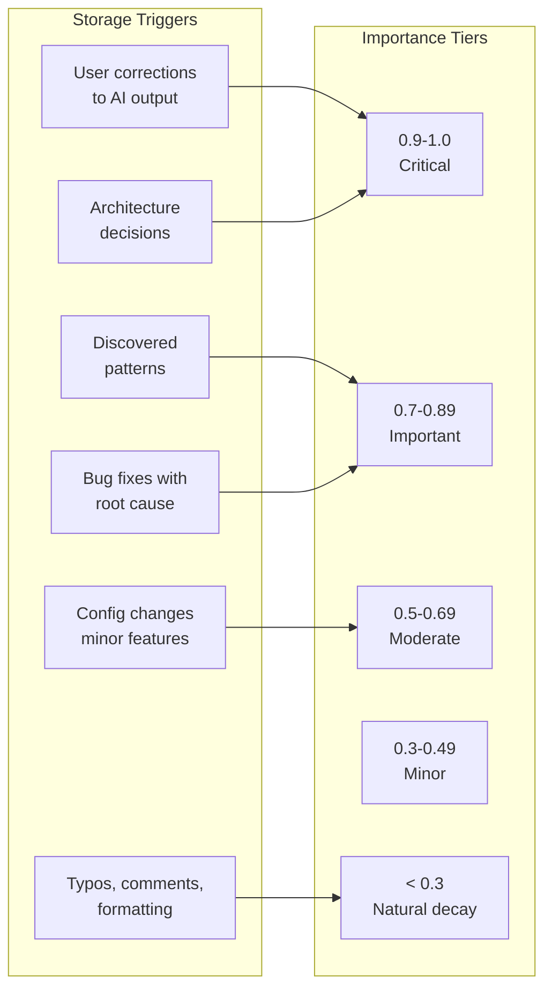
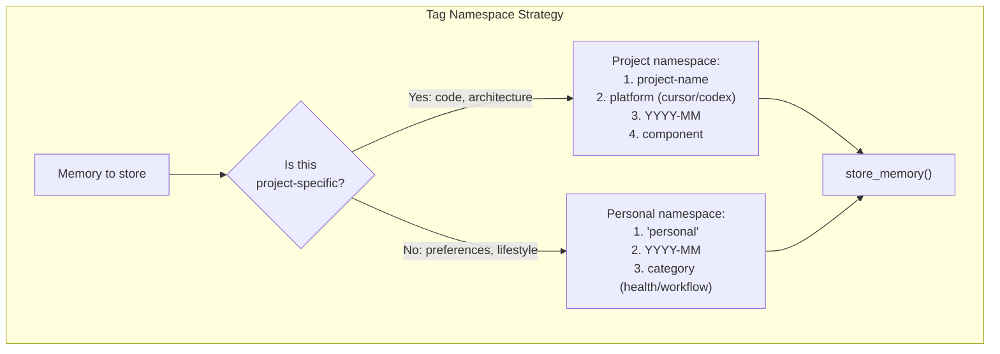
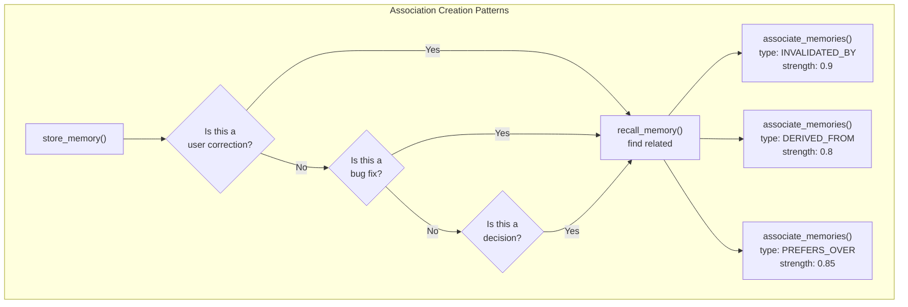

This page provides a comprehensive reference for memory-first development patterns used with the AutoMem MCP server. It documents proven strategies for memory recall, storage patterns, importance scoring, tagging conventions, and relationship management that enable AI assistants to maintain persistent context across sessions.

This page focuses on **usage patterns and best practices** for the six MCP tools. For tool schemas and API details, see the [Memory Operations](/docs/reference/api/memory-operations/) reference. For platform-specific integration setup, see the [Platform Integration Guides](/docs/platforms/claude-desktop/).

---

## Memory-First Development Philosophy

The memory system implements a **trust-based architecture**: AI assistants have direct access to MCP memory tools and are guided by instructions to make intelligent decisions about what to store and when to recall. This contrasts with automated capture systems that attempt to guess significance.

**Core principle**: `Trust AI + good instructions > automated hooks that guess significance`

This philosophy evolved from early experiments with hook-based automation (Claude Code) toward instruction-based patterns (Cursor, Codex). The instruction-based approach proved more reliable because the AI can contextualize significance better than automated event capture.

:::note[Hook system history]
The hook system was experimentally implemented for Claude Code (v0.5.0) and Cursor (v0.5.0), then removed in v0.8.0 and v0.6.0 respectively. See [Custom Integrations](/docs/best-practices/progressive-disclosure/) for the current template-based integration path.
:::

---

## Recall Strategies

### Basic Recall Patterns

The `recall_memory` tool supports five fundamental recall strategies, often used in parallel:

| Strategy | Use Case | Parameters | When to Use |
|---|---|---|---|
| **Semantic** | Natural language search | `query`, `queries` | Topic-based recall, context gathering |
| **Tag-based** | Precise filtering | `tags`, `tag_mode`, `tag_match` | Project isolation, component filtering |
| **Temporal** | Time-bound search | `time_query`, `start`, `end` | Recent work, time-specific events |
| **Graph expansion** | Multi-hop reasoning | `expand_entities`, `expand_relations` | Complex questions, relationship traversal |
| **Context-aware** | Language/style hints | `language`, `context_types` | Coding tasks, style preferences |

### Session Initialization Patterns

**Two-Phase Recall** is the recommended approach from Claude Code templates:

**Phase 1 — Preferences (tag-only, no semantic search):**
```
recall_memory({
  tags: ["preference"],
  limit: 20,
  sort: "updated_desc"
})
```

**Phase 2 — Task context (semantic + temporal):**
```
recall_memory({
  query: "<proper nouns, specific tools, exact topics from the user's message>",
  tags: ["<project-name>"],
  limit: 30,
  time_query: "last 90 days"
})
```

:::tip[Key insight]
Don't mix tag-based preference recall with semantic task recall — combining them dilutes results. Preferences are stable and should use exact tag matching without semantic search interference. For Phase 2, a single well-written `query` consistently beats `queries[]` + `auto_decompose: true` on focused tasks; reserve multi-query decomposition for genuinely multi-topic questions.
:::

### Advanced Recall Techniques

**Multi-Hop Reasoning via Entity Expansion**

Enable graph traversal to follow relationships from seed results:

```json
{
  "query": "why did we switch database backends",
  "expand_entities": true,
  "expand_relations": true,
  "expand_min_importance": 0.5,
  "expand_min_strength": 0.3,
  "expansion_limit": 25,
  "relation_limit": 5
}
```

API parameters exposed in `src/index.ts:764-811`:
- `expand_entities: true` — Enable multi-hop entity expansion
- `expand_relations: true` — Follow graph relationships from seed results
- `expand_min_importance: 0.5` — Filter expanded results by importance threshold
- `expand_min_strength: 0.3` — Only follow associations above strength threshold
- `expansion_limit: 25` — Max expanded memories to include
- `relation_limit: 5` — Max relationships to follow per seed result

**Context-Aware Coding Recall**

Context hints boost relevant memories for coding tasks:

```json
{
  "query": "authentication patterns",
  "language": "typescript",
  "context_types": ["Pattern", "Decision"],
  "tags": ["my-project", "auth"]
}
```

These parameters influence the scoring algorithm in the AutoMem service, boosting memories that match the language, file path patterns, or specified types/tags.

**Parallel Recall for Comprehensive Context**

Execute multiple recall strategies simultaneously (both can be issued to the MCP server in a single message):

```json
// Strategy 1: Recent project work
{"query": "current sprint tasks", "tags": ["my-project"], "time_query": "last 7 days"}

// Strategy 2: Preferences and style
{"tags": ["preference"], "tag_mode": "any", "limit": 10}
```

The `recall_memory` tool already implements parallel queries when both semantic search and tag filtering are requested, merging and deduplicating results server-side.

### Tag Matching Modes

| Parameter | Behavior | Use Case |
|---|---|---|
| `tag_mode: "any"` (default) | OR logic — match any tag | Broad recall, multiple components |
| `tag_mode: "all"` | AND logic — require all tags | Strict filtering, intersection queries |

**Namespace Support via Prefix Matching**

Set `tag_match: "prefix"` to support hierarchical tag queries:

```json
{
  "tags": ["auth"],
  "tag_match": "prefix"
}
```

This matches memories tagged `auth/jwt`, `auth/oauth`, `auth/mfa`, and any other `auth/*` variants.

---

## Storage Patterns

### Content Size Governance

The MCP server enforces a **three-tier size policy** to prevent embedding quality degradation:

| Tier | Limit | Behavior |
|---|---|---|
| **Target** | 150–300 characters | Optimal for vector embeddings |
| **Soft limit** | 500 characters | Passes with warning; backend may summarize |
| **Hard limit** | 2000 characters | Rejected immediately |

**Rationale**: Vector embeddings lose quality with overly long text. The 500-character soft limit signals to the backend that summarization may be beneficial, while the 2000-character hard limit prevents storage of entire code files or documentation.

**Content Structure Template**

Format: `"Brief title. Context and reasoning. Outcome or impact."`

Good examples:
- `"Chose PostgreSQL over MongoDB for ACID compliance. Evaluated both for 3 weeks. Decision affects all write-heavy services."`
- `"User prefers 2-space indentation with single quotes. Correction applied to generated code. Affects all TypeScript output."`

Anti-patterns to avoid:
- Storing entire function bodies or file contents
- Vague entries without context: `"Fixed auth bug"`
- Redundant entries for trivial changes: `"Updated comment in utils.ts"`

### Memory Type Taxonomy

The system supports **seven memory types** with distinct semantic meanings:

| Type | Usage | Importance Range | Example |
|---|---|---|---|
| `Decision` | Strategic/technical decisions | 0.85–0.95 | "Chose PostgreSQL over MongoDB for ACID compliance" |
| `Pattern` | Recurring approaches | 0.70–0.85 | "Using early returns for validation reduces nesting" |
| `Insight` | Key learnings, resolutions | 0.75–0.85 | "Auth timeout caused by missing retry logic" |
| `Preference` | User/team preferences | 0.75–0.90 | "User prefers 2-space indents with single quotes" |
| `Style` | Code style, formatting | 0.60–0.80 | "Always wrap database calls with timeout logging" |
| `Habit` | Regular behaviors | 0.50–0.70 | "Deploy to staging before production" |
| `Context` | General information | 0.50–0.70 | "Added JWT authentication system" |

**Type vs Importance**: The `type` field enables semantic filtering (e.g., recall only `Decision` memories), while `importance` controls relevance ranking and decay. Corrections to AI outputs should always use `importance: 0.9` as they represent strong style signals.

From templates: Use explicit `type` when confident about classification. Omit `type` to let the system auto-classify (less accurate but acceptable). Include `confidence: 0.95` when providing explicit type (defaults to 0.9).

---

## Importance Scoring



**Importance Scoring Matrix**

| Memory Type | Typical Range | Examples | Rationale |
|---|---|---|---|
| **User Corrections** | 0.9 | Style fixes, preference statements | Strongest signal for personalization |
| **Decisions** | 0.85–0.95 | Architecture choices, library selections | Referenced months later |
| **Patterns** | 0.75–0.85 | Best practices, reusable approaches | Useful across projects |
| **Insights** | 0.7–0.8 | Bug fixes, key learnings | Important but time-sensitive |
| **Features** | 0.7–0.8 | Implementation details | Project-specific context |
| **Preferences** | 0.6–0.8 | Tool choices, style preferences | Stable but lower priority than corrections |
| **Context** | 0.5–0.7 | General information | Background knowledge |

**Philosophy**: High importance scores (0.9+) are reserved for memories that should persist indefinitely and rank highly in recall. Medium scores (0.7–0.8) indicate useful patterns that should survive for months. Low scores (< 0.3) signal the memory system to let them naturally decay.

**Anti-Patterns**:
- Assigning 0.9 to every memory (dilutes recall ranking)
- Assigning 0.5 to user corrections (they won't surface prominently enough)
- Using 1.0 except for truly irreplaceable preferences

---

## Tagging Conventions

### Hierarchical Tagging Schema



**Project-Specific Memories**

```json
{
  "tags": ["my-api-service", "cursor", "2026-02", "auth"]
}
```

**Personal/Cross-Project Memories**

```json
{
  "tags": ["personal", "2026-02", "workflow"]
}
```

**Namespace Hierarchy**

Tags support hierarchical namespaces via prefix matching:

```
project-x/
├── auth/
│   ├── jwt
│   ├── oauth
│   └── mfa
├── api/
│   ├── rest
│   └── graphql
└── frontend/
    ├── components
    └── routing
```

**Why Separate Personal and Project Namespaces**

From template documentation: Using `personal` instead of a project tag ensures preferences and lifestyle context aren't drowned out by high-importance technical memories. Project tags help filter technical memories, but personal memories should be discoverable across all projects.

### Time Tag Conventions

**Monthly Tags** (YYYY-MM format):

Always include the current month as a tag. This enables time-based filtering in recall:

```json
{
  "tags": ["my-project", "2026-02", "auth"],
  "time_query": "last 30 days"
}
```

**Time-Based Filtering**:

```json
{
  "tags": ["2026-01"],
  "tag_mode": "any"
}
```

---

## Relationship Patterns

### Eleven Relationship Types



**Relationship Type Reference**

| Type | Use Case | Strength Range | Example |
|---|---|---|---|
| `LEADS_TO` | Causal relationship (A caused B) | 0.8–0.95 | Bug → Solution, Problem → Fix |
| `DERIVED_FROM` | Implementation based on decision | 0.7–0.9 | Feature → Architecture decision |
| `EXEMPLIFIES` | Concrete example of pattern | 0.7–0.85 | Code → Pattern memory |
| `EVOLVED_INTO` | Updated version of concept | 0.8–0.95 | Old approach → New approach |
| `INVALIDATED_BY` | Superseded by another memory | 0.85–0.95 | Old info → Current approach |
| `CONTRADICTS` | Conflicts with another memory | 0.7–0.9 | Alternative A → Alternative B |
| `REINFORCES` | Strengthens another memory's validity | 0.6–0.85 | Supporting evidence |
| `RELATES_TO` | General connection (default) | 0.5–0.8 | Any related concept |
| `PART_OF` | Component of larger effort | 0.7–0.9 | Task → Epic |
| `PREFERS_OVER` | Chosen alternative | 0.8–0.95 | Chosen option → Rejected option |
| `OCCURRED_BEFORE` | Temporal ordering | 0.6–0.8 | Earlier work → Later work |

### Association Triggers

**When to Create Associations**

Create associations after storing a new memory when:
1. The memory corrects or supersedes existing information
2. The memory is the solution to a previously stored problem
3. The memory is a decision that explicitly prefers one option over another
4. The memory is a concrete implementation of a stored pattern

**Association Pattern: User Corrections**

User corrections are the strongest signal for personalization. Always search and link:

```json
// 1. Store the correction
store_memory({ content: "User prefers camelCase for variable names", type: "Preference", importance: 0.9 })

// 2. Find the old preference
recall_memory({ query: "variable naming style preference" })

// 3. Link correction to old memory
associate_memories({ memory1_id: "<new_id>", memory2_id: "<old_id>", type: "INVALIDATED_BY", strength: 0.9 })
```

**Association Pattern: Bug Fixes**

Link fixes to original bug discoveries to build problem-solution chains:

```json
// After storing fix
associate_memories({ memory1_id: "<fix_id>", memory2_id: "<bug_id>", type: "LEADS_TO", strength: 0.85 })
```

**Association Pattern: Decisions**

Link decisions to alternatives considered to capture tradeoff reasoning:

```json
// Decision: chose PostgreSQL
associate_memories({ memory1_id: "<postgres_id>", memory2_id: "<mongo_id>", type: "PREFERS_OVER", strength: 0.9 })
```

---

## Platform-Specific Adaptations

### Template Variable Substitution

Each platform template uses placeholder variables that are substituted during installation:

**Common Variables**

| Variable | Resolution | Example |
|---|---|---|
| `{{PROJECT_NAME}}` | From package.json, git remote, or directory name | `my-api-service` |
| `{{PROJECT_DESC}}` | From package.json description | `REST API for user management` |
| `{{MCP_TOOL_PREFIX}}` | Platform-specific tool prefix | `mcp__memory__` |
| `{{MCP_SERVER_NAME}}` | Server name from config | `memory` |
| `{{CURRENT_MONTH}}` | Current YYYY-MM | `2026-02` |

**Tool Prefix Variations**

| Platform | MCP Server Name | Tool Prefix | Example |
|---|---|---|---|
| Cursor | `memory` | `mcp__memory__` | `mcp__memory__recall_memory` |
| Claude Code | `memory` | `mcp__memory__` | `mcp__memory__store_memory` |
| Claude Code (plugin) | `plugin_automem_memory` | `mcp__plugin_automem_memory__` | `mcp__plugin_automem_memory__recall_memory` |
| Codex | `memory` | `mcp__memory__` | `mcp__memory__recall_memory` |
| Claude Desktop | `memory` | `mcp__memory__` | `mcp__memory__recall_memory` |

:::caution
Tool names are client-specific. The prefix depends on the server name in your MCP configuration (`mcpServers` key). Use the exact names shown in your tool list.
:::

### Platform Integration Patterns

**Cursor: Rule-Based Integration**

Cursor uses `.cursor/rules/automem.mdc` with `alwaysApply: true` to ensure memory tools are available in every conversation.

Pattern: **3-phase lifecycle** (conversation start → during work → conversation end)

**Claude Code: Permission + Rules Integration**

Claude Code uses two mechanisms:
1. Permissions in `~/.claude/settings.json` to allow memory tools without prompting
2. Rules in `~/.claude/CLAUDE.md` to guide usage

Pattern: **Two-phase recall** (preferences tag-only, task context semantic+time)

**Codex: AGENTS.md Integration**

Codex uses `AGENTS.md` in the project root with memory rules appended via CLI.

Pattern: **Simple recall at task start**, store during work

**Claude Desktop: Personal Preferences**

Claude Desktop uses Personal Preferences (Settings → Profile → Personal Preferences) with memory usage patterns.

Pattern: **Conversation start protocol**, corrections as gold, before creating content

---

## Template File Locations

```
templates/
├── CLAUDE_MD_MEMORY_RULES.md           # Full rules for CLAUDE.md
├── CLAUDE_DESKTOP_INSTRUCTIONS.md      # Claude Desktop Personal Preferences template
├── CLAUDE_CODE_INTEGRATION.md          # Integration guide
├── cursor/
│   └── automem.mdc.template            # Cursor rule file
└── codex/
    ├── memory-rules.md                 # Codex AGENTS.md section
    └── config.toml                     # Codex MCP config
```

---

## Best Practices Summary

### Recall Best Practices

1. **Default to recall** for project-related questions
2. **Use parallel strategies** for comprehensive context
3. **Start simple** (project tag only), add complexity if needed
4. **Separate preferences from task context** (two-phase recall)
5. **Natural integration** — don't announce memory operations
6. **Fail gracefully** — continue without context if recall fails

### Storage Best Practices

1. **Keep memories atomic** — 150–300 characters target
2. **Tag consistently** — project, platform, date, component
3. **Score appropriately** — user corrections highest (0.9)
4. **Include context** — explain "why", not just "what"
5. **Avoid noise** — skip trivial changes, routine operations
6. **Use explicit types** — include `type` and `confidence` when certain

### Association Best Practices

1. **Always link corrections** — strongest personalization signal
2. **Chain bug fixes** — link to original problems
3. **Connect decisions** — link to alternatives and rationale
4. **Use appropriate types** — `INVALIDATED_BY` for corrections, `DERIVED_FROM` for implementations
5. **Score strength accurately** — 0.9+ for direct causation, 0.7–0.8 for strong relationships

### Content Best Practices

1. **Format consistently** — "Brief title. Context. Impact."
2. **Avoid type prefixes** — use `type` field instead of `[DECISION]` in content
3. **Never store secrets** — API keys, passwords, tokens
4. **Split long content** — use multiple memories with associations
5. **Use metadata** — structured data for files, errors, solutions

---

This page provides the canonical reference for memory patterns used across all platform integrations. The patterns documented here are derived from extensive testing and community feedback, reflecting the evolution from automated capture toward instruction-based memory management.
