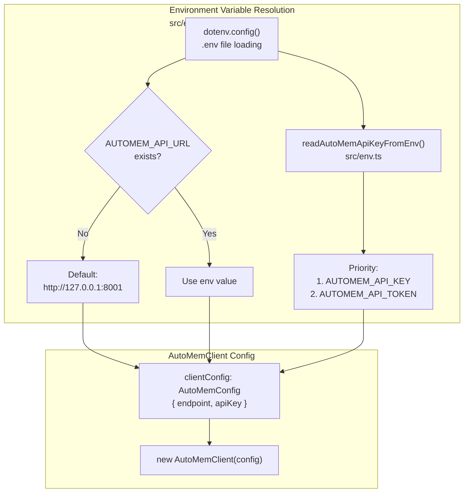
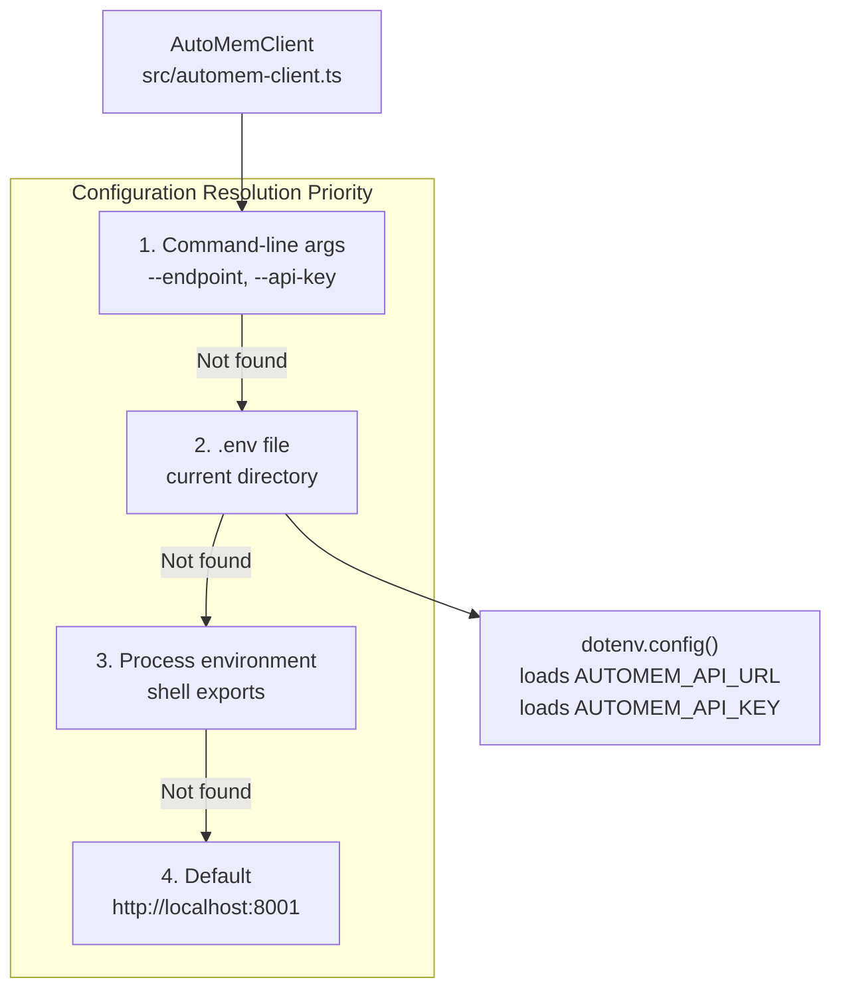

This page explains how to configure the mcp-automem client to connect to your AutoMem service. It covers environment variables, configuration resolution priority, platform-specific configuration files, and validation. For initial setup instructions, see [Setup & Installation](/docs/cli/setup/). For platform-specific integration details, see [Platform Installers](/docs/cli/platform-installers/).

## Environment Variables

The mcp-automem client uses two primary environment variables to locate and authenticate with the AutoMem backend service. These can be set via `.env` file, shell environment, or platform-specific MCP configuration files.

| Variable | Required | Default | Description |
|---|---|---|---|
| `AUTOMEM_API_URL` | Yes | `http://127.0.0.1:8001` | HTTP URL of the AutoMem service |
| `AUTOMEM_API_KEY` | No | (none) | API key for authenticated instances |
| `AUTOMEM_API_TOKEN` | No | (none) | Alternative name for API key |
| `AUTOMEM_PROCESS_TAG` | No | (none) | Process title tag for safe cleanup |
| `MCP_PROCESS_TAG` | No | (none) | Alternative process tag variable |
| `AUTOMEM_LOG_LEVEL` | No | (none) | Set to `debug` for verbose logging |

### AUTOMEM_API_URL

Specifies the HTTP endpoint of your AutoMem service. Common values:

- **Local development**: `http://127.0.0.1:8001` or `http://localhost:8001`
- **Railway deployment**: `https://your-service.railway.app`
- **Custom deployment**: Your service's public or internal URL

The endpoint is read at server startup by `AutoMemClient` and written by the `setup` wizard. The legacy alias `AUTOMEM_ENDPOINT` is also accepted.

### AUTOMEM_API_KEY

Optional authentication token for secured AutoMem instances. Required when deploying to Railway or other hosted environments. The client supports two environment variable names for compatibility:

- `AUTOMEM_API_KEY` (preferred)
- `AUTOMEM_API_TOKEN` (alternative)

The `readAutoMemApiKeyFromEnv()` function checks these variables in priority order:

1. `AUTOMEM_API_KEY`
2. `AUTOMEM_API_TOKEN`

### Process Tags

Optional variables for multi-process environments. When set, the server updates `process.title` to enable safe process management by supervisors like AutoHub:

```bash
AUTOMEM_PROCESS_TAG=cursor-session-1 npx @verygoodplugins/mcp-automem
```

## Configuration Resolution Priority

The client resolves configuration from multiple sources with a defined priority order. This allows flexible deployment while maintaining sensible defaults.

### Environment Variable Resolution Flow



### Configuration File Locations



### Priority Levels

1. **Environment variables** (highest priority)
   - Direct shell environment: `export AUTOMEM_API_URL=...`
   - `.env` file in current directory (loaded via `dotenv`)
   - Platform-specific MCP server `env` blocks
2. **`~/.claude.json` configuration**
   - Used by CLI commands when environment is not set
   - Fallback for queue processing and other utilities
   - Scans all `mcpServers` entries for AutoMem config
3. **Default values** (lowest priority)
   - `endpoint`: `http://127.0.0.1:8001`
   - `apiKey`: `undefined`

The resolution is implemented in `resolveAutoMemConfig()` in `src/cli/queue.ts`.

## Platform-Specific Configuration Files

Each AI platform stores MCP server configuration differently. The setup wizard and CLI tools generate appropriate configuration for each platform.

### Configuration File Locations

| Platform | Configuration File | Format |
|---|---|---|
| Claude Desktop | `~/Library/Application Support/Claude/claude_desktop_config.json` (macOS) / `%APPDATA%\Claude\claude_desktop_config.json` (Windows) / `~/.config/Claude/claude_desktop_config.json` (Linux) | JSON |
| Cursor IDE | `~/.cursor/mcp.json` | JSON |
| Claude Code | `~/.claude.json` | JSON |
| Codex | `~/.codex/config.toml` | TOML |
| OpenClaw | `~/.openclaw/openclaw.json` | JSON |

### JSON Configuration Example (Claude Desktop, Cursor, Claude Code)

```json
{
  "mcpServers": {
    "automem": {
      "command": "npx",
      "args": ["@verygoodplugins/mcp-automem"],
      "env": {
        "AUTOMEM_API_URL": "http://localhost:8001",
        "AUTOMEM_API_KEY": "your-api-key"
      }
    }
  }
}
```

The `command` and `args` launch the MCP server in stdio mode. The `env` block passes configuration to the server process. Platform launchers spawn this command when initializing MCP connections.

### TOML Configuration Example (Codex)

```toml
[[mcp_servers]]
name = "automem"
command = "npx"
args = ["@verygoodplugins/mcp-automem"]

[mcp_servers.env]
AUTOMEM_API_URL = "http://localhost:8001"
AUTOMEM_API_KEY = "your-api-key"
```

The TOML format is semantically equivalent to JSON but uses Codex's native configuration syntax.

## Configuration Validation

The client performs validation at multiple stages to ensure reliable operation and provide clear error messages.

### Validation Flow

The `setup` command collects and saves your configuration:

1. **Prompt for API URL**: Prompts for `AUTOMEM_API_URL` with default `http://127.0.0.1:8001`
2. **Prompt for API key**: Optionally prompts for `AUTOMEM_API_KEY` (skipped if TTY unavailable)
3. **Confirmation prompt**: Asks `"Write settings to <path>?"` before persisting
4. **Configuration write**: Saves `AUTOMEM_API_URL` and `AUTOMEM_API_KEY` to `.env`

### Runtime Validation

When the MCP server starts, it performs startup validation:

1. Loads `.env` file (if present) via `dotenv.config()`
2. Reads `AUTOMEM_API_URL` (or legacy `AUTOMEM_ENDPOINT`) from environment
3. Reads API key from environment (checking all supported variable names)
4. Creates `AutoMemClient` instance with resolved config
5. Logs connection details to stderr (never stdout, to avoid polluting JSON-RPC stream)

### Content Size Governance

The `store_memory` tool enforces content size limits to maintain embedding quality:

| Limit Type | Threshold | Behavior |
|---|---|---|
| **Soft limit** | 500 characters | Warning; backend may auto-summarize |
| **Hard limit** | 2000 characters | Rejected immediately with error |

## Special Configuration Options

### Stdio Server Mode Configuration

When launched without arguments, the package runs in MCP server mode using stdio transport:

```bash
# Server mode (no args) - used by platform config files
npx @verygoodplugins/mcp-automem
```

In server mode, all logging is redirected to `stderr` to prevent contaminating the JSON-RPC stdio stream. The `dotenv` library is configured with `quiet: true` to suppress its output.

### CLI Mode Configuration

When launched with a command (e.g., `setup`, `config`, `recall`), the package runs in CLI mode. Configuration is resolved using the priority system described above.

Example CLI commands that require configuration:

- `recall` — Direct query tool
- `queue` — Queue processing
- `config` — Configuration snippet generation

```bash
# All CLI commands use the same config resolution
npx @verygoodplugins/mcp-automem recall "project architecture"
npx @verygoodplugins/mcp-automem queue
npx @verygoodplugins/mcp-automem config
```

### Debug Logging

Set `AUTOMEM_LOG_LEVEL=debug` to enable verbose logging in server mode:

```bash
AUTOMEM_LOG_LEVEL=debug npx @verygoodplugins/mcp-automem
```

Debug output includes:
- Configuration values loaded (API key is masked)
- Each tool call with parameters
- HTTP request/response details
- Retry attempts and backoff timing

## Configuration Generation

The CLI provides tools to generate platform-specific configuration snippets without modifying files.

### Config Command

```bash
# Generate JSON snippet (Claude Desktop, Cursor, Claude Code)
npx @verygoodplugins/mcp-automem config
```

Outputs configuration for the current environment in JSON format. Uses the same resolution priority as the runtime system.

### Platform Installers

Each platform installer generates and installs appropriate configuration:

| Command | Generated Files | Configuration Location |
|---|---|---|
| `cursor` | `.cursor/rules/automem.mdc` | `~/.cursor/mcp.json` (manual) |
| `claude-code` | Hook scripts in `~/.claude/hooks/`, support scripts in `~/.claude/scripts/` | Merges `~/.claude/settings.json` (CLAUDE.md must be appended manually) |
| `codex` | `AGENTS.md` updates | `~/.codex/config.toml` (manual) |
| `openclaw` | `~/.openclaw/skills/automem/SKILL.md` | `~/.openclaw/openclaw.json` (automatic) |

See [Platform Installers](/docs/cli/platform-installers/) for detailed instructions per platform.

## Troubleshooting Configuration Issues

### Connection Failures

If the MCP server cannot reach the AutoMem service:

1. **Verify endpoint**: Check that `AUTOMEM_API_URL` is correct and reachable
2. **Test health endpoint**: Run `curl http://your-endpoint/health`
3. **Check API key**: Ensure `AUTOMEM_API_KEY` matches your deployed service
4. **Network issues**: Verify firewall rules and DNS resolution

### Configuration Not Found

If the server cannot find configuration:

1. **Environment variables**: Ensure `.env` is in the working directory or variables are exported
2. **Platform config**: Check that platform config files exist and are readable
3. **Resolution priority**: Remember environment variables override platform configs

### Service Unavailable

The queue command skips processing if the endpoint is unreachable — this prevents queue operations from blocking when the service is down.

```
$ npx @verygoodplugins/mcp-automem queue
AutoMem endpoint http://localhost:8001 is not reachable
Skipping queue processing. Start the AutoMem service and retry.
```

### API Key Mismatch

If you receive `401 Unauthorized` errors:

1. Check what token is configured: `grep AUTOMEM_API_KEY .env`
2. Compare against the token in your AutoMem service configuration
3. For Railway: check the `AUTOMEM_API_TOKEN` variable in the Railway dashboard
4. Update `.env` or platform config with the correct token

### Multiple Configurations Conflict

If configuration behaves unexpectedly, use debug mode to see which values are being loaded:

```bash
AUTOMEM_LOG_LEVEL=debug npx @verygoodplugins/mcp-automem recall "test"
```

The debug output shows the resolved `endpoint` and whether an `apiKey` was found (the actual key value is masked for security).
