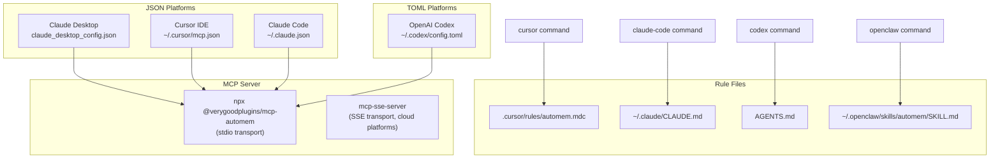

The `mcp-automem` CLI provides one-command installers for each supported AI platform. These commands configure the MCP server connection, install memory rules, and set up platform-specific integration files — all without manually editing configuration files.

For initial installation and setup wizard, see [Setup & Installation](/docs/cli/setup/). For configuration details and environment variables, see [Configuration Tools](/docs/cli/config-tools/).

## Overview

Each platform installer generates and installs appropriate configuration files for that platform's MCP server format. The installers read your current AutoMem configuration from the environment or `.env` file and write the correct JSON, TOML, or Markdown files for each platform.

| Command | Generated Files | Configuration Location |
|---|---|---|
| `cursor` | `.cursor/rules/automem.mdc` | `~/.cursor/mcp.json` (manual) |
| `claude-code` | `~/.claude/CLAUDE.md` updates | `~/.claude/settings.json` |
| `codex` | `AGENTS.md` updates | `~/.codex/config.toml` (manual) |
| `openclaw` | `~/.openclaw/skills/automem/SKILL.md` | `~/.openclaw/openclaw.json` (automatic) |

## Claude Desktop

Claude Desktop requires manual configuration file editing — there is no one-command installer. The setup wizard prints the configuration snippet after completing setup.

### Configuration File Location

| Platform | Path |
|---|---|
| macOS | `~/Library/Application Support/Claude/claude_desktop_config.json` |
| Windows | `%APPDATA%\Claude\claude_desktop_config.json` |
| Linux | `~/.config/Claude/claude_desktop_config.json` |

### Configuration Structure

Add the `automem` entry to the `mcpServers` object in your Claude Desktop config file:

```json
{
  "mcpServers": {
    "automem": {
      "command": "npx",
      "args": ["@verygoodplugins/mcp-automem"],
      "env": {
        "AUTOMEM_ENDPOINT": "http://localhost:8001",
        "AUTOMEM_API_KEY": "your-api-key"
      }
    }
  }
}
```

The `command` and `args` launch the MCP server in stdio mode. The `env` block passes configuration to the server process. Claude Desktop spawns this command when initializing MCP connections.

After editing the config file, **restart Claude Desktop** for changes to take effect.

:::tip[Generate the snippet]
Run `npx @verygoodplugins/mcp-automem setup` and it will print the exact JSON snippet for your current AutoMem configuration.
:::

## Cursor IDE

The `cursor` command installs memory rules into the project's `.cursor/rules/` directory as a Cursor-compatible `.mdc` file.

### Installation

```bash
npx @verygoodplugins/mcp-automem cursor
```

This creates `.cursor/rules/automem.mdc` in the current directory with memory operation rules tailored for Cursor's AI features.

### MCP Configuration

Cursor's global MCP configuration lives at `~/.cursor/mcp.json`. Add the AutoMem server entry:

```json
{
  "mcpServers": {
    "automem": {
      "command": "npx",
      "args": ["@verygoodplugins/mcp-automem"]
    }
  }
}
```

:::note
Cursor reads the `AUTOMEM_ENDPOINT` and `AUTOMEM_API_KEY` from the environment or `.env` file in the project directory, not from the MCP config `env` block. Ensure your `.env` file is present in the project root.
:::

### Project-Specific Rules

The `.cursor/rules/automem.mdc` file installed by the `cursor` command contains instructions that tell Cursor's AI how to use AutoMem tools — when to store memories, how to structure recalls, and what context to preserve across sessions.

## Claude Code

The `claude-code` command updates the global `~/.claude/CLAUDE.md` memory rules file and configures permissions in `~/.claude/settings.json`.

### Installation

```bash
npx @verygoodplugins/mcp-automem claude-code
```

This command:
1. Updates `~/.claude/CLAUDE.md` with AutoMem memory operation instructions
2. Configures `~/.claude/settings.json` with appropriate tool permissions

### MCP Configuration

Claude Code reads MCP server configuration from `~/.claude.json`:

```json
{
  "mcpServers": {
    "automem": {
      "command": "npx",
      "args": ["@verygoodplugins/mcp-automem"],
      "env": {
        "AUTOMEM_ENDPOINT": "http://localhost:8001",
        "AUTOMEM_API_KEY": "your-api-key"
      }
    }
  }
}
```

## OpenAI Codex

The `codex` command installs AutoMem instructions into the project's `AGENTS.md` file, which Codex reads as agent instructions.

### Installation

```bash
npx @verygoodplugins/mcp-automem codex
```

This updates `AGENTS.md` in the current directory with memory operation rules for Codex.

### MCP Configuration (TOML)

Codex uses TOML format for its configuration file at `~/.codex/config.toml`. The TOML format is semantically equivalent to the JSON format used by other platforms:

```toml
[[mcp_servers]]
name = "automem"
command = "npx"
args = ["@verygoodplugins/mcp-automem"]

[mcp_servers.env]
AUTOMEM_ENDPOINT = "http://localhost:8001"
AUTOMEM_API_KEY = "your-api-key"
```

### Config Snippet Generation

Generate the TOML snippet for your current configuration:

```bash
npx @verygoodplugins/mcp-automem config --format toml
```

## OpenClaw

The `openclaw` command installs AutoMem as a skill in the OpenClaw framework, including automatic registration in `~/.openclaw/openclaw.json`.

### Installation

```bash
npx @verygoodplugins/mcp-automem openclaw
```

This command:
1. Creates `~/.openclaw/skills/automem/SKILL.md` with memory operation instructions
2. Automatically registers the skill in `~/.openclaw/openclaw.json`

Unlike other platform installers, OpenClaw supports automatic configuration file modification.

## Warp Terminal

Warp Terminal has native MCP support. Configure AutoMem in Warp's MCP settings by adding:

```json
{
  "name": "automem",
  "command": "npx",
  "args": ["@verygoodplugins/mcp-automem"],
  "env": {
    "AUTOMEM_ENDPOINT": "http://localhost:8001",
    "AUTOMEM_API_KEY": "your-api-key"
  }
}
```

Warp's MCP configuration interface is accessible through Settings → AI → MCP Servers.

## Remote MCP (Cloud Platforms)

For cloud AI platforms that cannot run local processes (ChatGPT, Claude.ai via API, ElevenLabs), AutoMem provides a remote MCP bridge via the `mcp-sse-server` service.

The `mcp-sse-server` exposes AutoMem tools over SSE (Server-Sent Events) transport, which is compatible with remote MCP clients. Deploy it alongside the AutoMem backend — see [Railway Deployment](/docs/deployment/railway/) for the deployment setup.

Configure cloud platforms with the public URL of your deployed `mcp-sse-server`:

```
https://your-mcp-bridge.up.railway.app
```

## Configuration Structure by Platform

The following diagram shows how configuration files map to different platforms:



## Verification

After installing for any platform, verify the MCP connection is working:

1. Restart the AI platform application
2. Ask the AI to check memory health: "Check my AutoMem database health"
3. The AI should call `check_database_health` and return status information

A successful response looks like:
```
AutoMem is connected and healthy:
- FalkorDB: connected (0 memories)
- Qdrant: connected
- Enrichment worker: running
```

## Troubleshooting Platform Installers

### Claude Desktop: Server Not Found

**Symptom**: Claude Desktop reports "Server not found" for AutoMem

**Solutions**:
1. Verify the config file path is correct for your OS
2. Validate JSON syntax (the config file must be valid JSON)
3. Ensure `npx` is in the PATH accessible to Claude Desktop
4. Restart Claude Desktop after config changes

### Cursor: Tools Not Available

**Symptom**: AutoMem tools are not available in Cursor

**Solutions**:
1. Check `~/.cursor/mcp.json` exists and has valid JSON
2. Ensure `.env` file is present in the project root with `AUTOMEM_ENDPOINT`
3. Reload the Cursor window (Cmd/Ctrl+Shift+P → "Reload Window")

### Claude Code: Permission Denied

**Symptom**: Claude Code reports permission errors when calling AutoMem tools

**Solutions**:
1. Run `npx @verygoodplugins/mcp-automem claude-code` to update permissions
2. Check `~/.claude/settings.json` for the `automem` tool permissions
3. Add tool allowances manually if needed

### All Platforms: ECONNREFUSED

**Symptom**: MCP server starts but cannot reach AutoMem service

**Solutions**:
1. Verify AutoMem service is running: `curl http://localhost:8001/health`
2. Check `AUTOMEM_ENDPOINT` is set correctly in `.env` or platform config `env` block
3. For Railway deployments, verify the public URL is accessible
