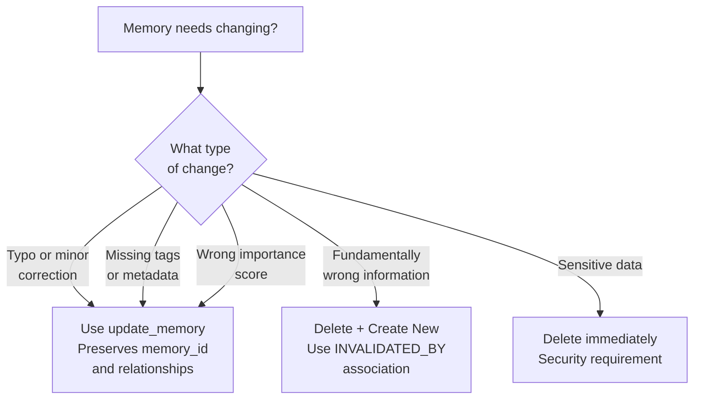
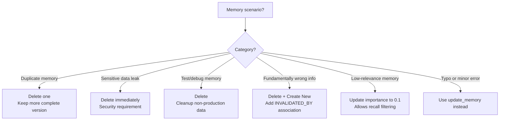
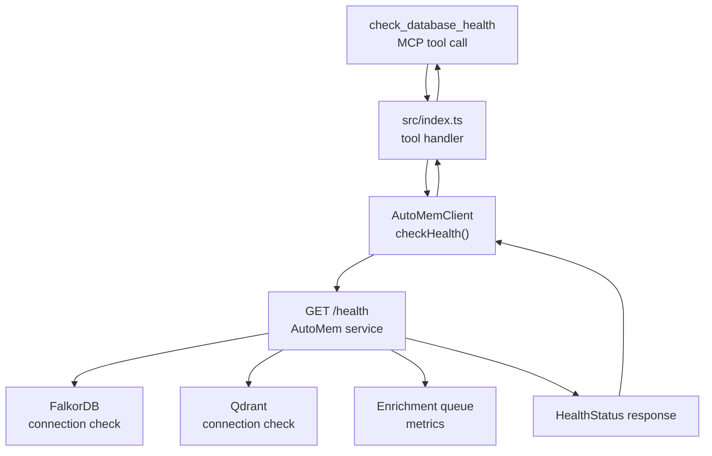
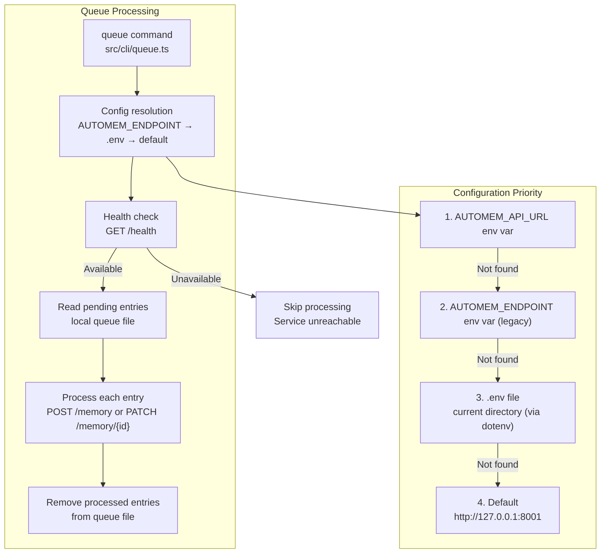

The `queue` CLI command provides utilities for managing the memory processing queue in the mcp-automem client. This page documents the `update_memory`, `delete_memory`, and `check_database_health` MCP tools, as well as the queue processing CLI command that processes pending memories from the local queue.

For setup commands, see [Setup & Installation](/docs/cli/setup/). For configuration tools, see [Configuration Tools](/docs/cli/config-tools/).

## Memory Lifecycle Overview

Memories in AutoMem follow a managed lifecycle with distinct operations at each stage. Understanding this lifecycle helps determine when to update, delete, or create new memories.

### Memory State Transitions

The three lifecycle management tools correspond to three operations:

- `update_memory` — Modify existing memories (correct errors, add tags, adjust importance)
- `delete_memory` — Permanently remove memories (destructive, irreversible)
- `check_database_health` — Monitor service status before and after operations

All three tools follow the same request flow through the MCP server to the AutoMem backend: MCP tool call → `src/index.ts` handler → `AutoMemClient` method → HTTP request to AutoMem API.

## Updating Memories

The `update_memory` tool modifies existing memory fields without changing the memory's identity or relationships. This is preferred over creating duplicate memories with corrected information.

### When to Use Update vs Create New



### UpdateMemoryArgs Parameters

The `update_memory` tool accepts the following parameters (defined in [`src/types.ts`](https://github.com/verygoodplugins/mcp-automem/blob/b81c63ae8f833feb4f6fb21e795c389f99a5dbe8/src/types.ts)):

| Parameter | Type | Required | Description |
|---|---|---|---|
| `memory_id` | `string` | **Yes** | ID of memory to update (from `store_memory` or `recall_memory`) |
| `content` | `string` | No | New content (replaces existing) |
| `tags` | `string[]` | No | New tags (replaces existing array) |
| `importance` | `number` (0-1) | No | New importance score |
| `metadata` | `object` | No | New metadata (merged with existing) |
| `timestamp` | `string` (ISO) | No | Override creation timestamp |
| `updated_at` | `string` (ISO) | No | Explicit update timestamp |
| `last_accessed` | `string` (ISO) | No | Last access timestamp |
| `type` | `string` | No | Memory type classification |
| `confidence` | `number` (0-1) | No | Confidence score for memory |

### Update Implementation

The `update_memory` tool handler validates the `memory_id` parameter and delegates to `AutoMemClient.updateMemory()`. The client makes a `PATCH` request to the AutoMem API:

```
PATCH /memory/{memory_id}
Authorization: Bearer {api_key}
Content-Type: application/json

{
  "content": "Updated content here",
  "tags": ["updated-tag"],
  "importance": 0.8
}
```

### Update Use Cases

**Correcting Inaccurate Information:**
```
update_memory({
  memory_id: "abc-123",
  content: "The correct information after correction"
})
```

**Adding Forgotten Tags:**
```
update_memory({
  memory_id: "abc-123",
  tags: ["project:automem", "type:decision", "status:active"]
})
```

**Enhancing Content:**
```
update_memory({
  memory_id: "abc-123",
  content: "Original content. Additional context added later.",
  importance: 0.9
})
```

**Adding Structured Metadata:**
```
update_memory({
  memory_id: "abc-123",
  metadata: {
    "project": "automem-website",
    "ticket": "DOCS-42",
    "verified": true
  }
})
```

## Deleting Memories

The `delete_memory` tool permanently removes a memory and its embedding from both FalkorDB and Qdrant. This operation is **destructive** and **irreversible**.

### When to Delete Memories



### DeleteMemoryArgs Parameters

The `delete_memory` tool accepts the following parameters (defined in [`src/types.ts`](https://github.com/verygoodplugins/mcp-automem/blob/b81c63ae8f833feb4f6fb21e795c389f99a5dbe8/src/types.ts)). Use either `memory_id` or `tags` — they are mutually exclusive deletion modes:

| Parameter | Type | Required | Description |
|---|---|---|---|
| `memory_id` | `string` | No | ID of a single memory to delete (from `store_memory` or `recall_memory`) |
| `tags` | `string[]` | No | Delete all memories tagged with ANY of these tags (bulk delete) |

### Delete Implementation

The `delete_memory` tool is marked with `destructiveHint: true` to indicate its irreversible nature. The handler validates the `memory_id` and delegates to the client, which makes a `DELETE` request:

```
DELETE /memory/{memory_id}
Authorization: Bearer {api_key}
```

### Deletion Side Effects

When a memory is deleted, the following occurs in the AutoMem backend:

1. Memory node is removed from FalkorDB graph
2. Embedding vector is removed from Qdrant collection
3. All relationships where this memory is either source or target are deleted
4. Other memories that were associated with the deleted memory remain, but their connections to the deleted memory are permanently severed

:::caution[Irreversible operation]
Deleting a memory removes all relationships attached to it. Other memories that were associated with the deleted memory will remain, but their connections to the deleted memory are permanently severed. Consider using `update_memory` with a lower importance score instead of deletion when possible.
:::

### Delete Use Cases

**Removing Duplicate Memories:**
```
# First, recall to find duplicates
recall_memory({ query: "project architecture decision" })

# Delete the less complete duplicate
delete_memory({ memory_id: "duplicate-id" })
```

**Removing Sensitive Information:**
```
# Delete immediately when sensitive data is found
delete_memory({ memory_id: "sensitive-memory-id" })
```

**Cleaning Up Test Memories:**
```
# After testing, delete test memories
delete_memory({ memory_id: "test-memory-id-1" })
delete_memory({ memory_id: "test-memory-id-2" })
```

## Health Monitoring

The `check_database_health` tool queries the AutoMem service to verify connectivity and retrieve statistics from both FalkorDB (graph database) and Qdrant (vector database).

### Health Check Architecture



### HealthStatus Response Structure

The `check_database_health` tool returns a `HealthStatus` object (defined in [`src/types.ts`](https://github.com/verygoodplugins/mcp-automem/blob/b81c63ae8f833feb4f6fb21e795c389f99a5dbe8/src/types.ts)):

| Field | Type | Description |
|---|---|---|
| `status` | `"healthy"` \| `"error"` | Overall health status |
| `backend` | `string` | Backend type (always `"automem"`) |
| `statistics` | `object` | Database statistics and connection info |
| `statistics.falkordb` | `string` | FalkorDB connection status |
| `statistics.qdrant` | `string` | Qdrant connection status |
| `statistics.graph` | `string` | Graph database name |
| `statistics.timestamp` | `string` | Health check timestamp |
| `error` | `string` (optional) | Error message if status is `"error"` |

### Health Check Use Cases

**Session Start Verification:**

The health check is useful at the start of a session to confirm the AutoMem service is available before attempting memory operations.

**Troubleshooting Connection Issues:**

```
check_database_health()
# Returns:
# {
#   status: "error",
#   error: "ECONNREFUSED http://localhost:8001/health"
# }
```

This immediately identifies whether the issue is the AutoMem service being down versus a data issue.

**Monitoring Integration:**

AI platforms can periodically call `check_database_health()` to detect service degradation or outages before attempting memory operations.

The `AutoMemClient` implements automatic retry logic with exponential backoff for network errors and 5xx HTTP errors. Health checks leverage this retry mechanism to distinguish transient errors from persistent failures.

## Update vs Delete Decision Matrix

| Scenario | Recommended Action | Rationale |
|---|---|---|
| Typo in content | **Update** | Preserves memory_id and relationships |
| Wrong importance score | **Update** | Quick correction without data loss |
| Missing tags | **Update** | Enhances existing memory |
| Fundamentally wrong info | **Delete + Create New** | Prevents confusion; use `INVALIDATED_BY` association |
| Duplicate memory | **Delete** one | Keep the more complete version |
| Sensitive data leak | **Delete immediately** | Security requirement |
| Low-relevance memory | **Update** (lower importance) | Allows recall filtering |
| Test/debug memory | **Delete** | Cleanup non-production data |

## Memory Lifecycle Patterns

### Iterative Refinement Pattern

```
# Store initial memory
memory_id = store_memory({
  content: "Initial understanding of the problem"
})

# Later, refine with more detail
update_memory({
  memory_id: memory_id,
  content: "Refined understanding: the problem was caused by X, solved by Y",
  importance: 0.9,
  tags: ["problem:solved", "root-cause:X"]
})
```

### Cleanup Pattern

```
# After project completion, lower importance of outdated memories
update_memory({
  memory_id: "old-decision-id",
  importance: 0.1,
  metadata: { status: "superseded", superseded_by: "new-decision-id" }
})

# Or delete if no longer relevant at all
delete_memory({ memory_id: "temporary-id" })
```

## Queue Processing CLI Command

The `queue` CLI command processes pending memories from the local queue. When a memory operation is initiated by the AI but the AutoMem service is temporarily unavailable, operations can be queued locally and processed later.

### Usage

```bash
# Process all pending queue entries
npx @verygoodplugins/mcp-automem queue

# Process a specific queue file
npx @verygoodplugins/mcp-automem queue --file /path/to/queue.json

# Preview what would be processed without writing
npx @verygoodplugins/mcp-automem queue --dry-run

# Limit the number of entries to process
npx @verygoodplugins/mcp-automem queue --limit 10
```

The endpoint is resolved automatically using the priority chain: `AUTOMEM_API_URL` environment variable → `AUTOMEM_ENDPOINT` (legacy) → `.env` file (via dotenv) → default `http://127.0.0.1:8001`.

### Queue Processing Architecture



### Service Unavailability Handling

The queue command skips processing if the endpoint is unreachable — this prevents queue operations from blocking when the service is down. The queue entries are preserved for the next run.

```
$ npx @verygoodplugins/mcp-automem queue
Checking AutoMem service at http://localhost:8001...
❌ Service unavailable - skipping queue processing
Queue will be retried on next run
```

### Error Handling Patterns

**Graceful Degradation:**

When the AutoMem service is down, the MCP server continues to operate but memory operations are queued rather than immediately processed.

**Deletion Safety:**

Before deleting a memory, verify the memory ID is correct using `recall_memory`. The `delete_memory` operation cannot be undone, so always confirm the correct `memory_id` before calling.
