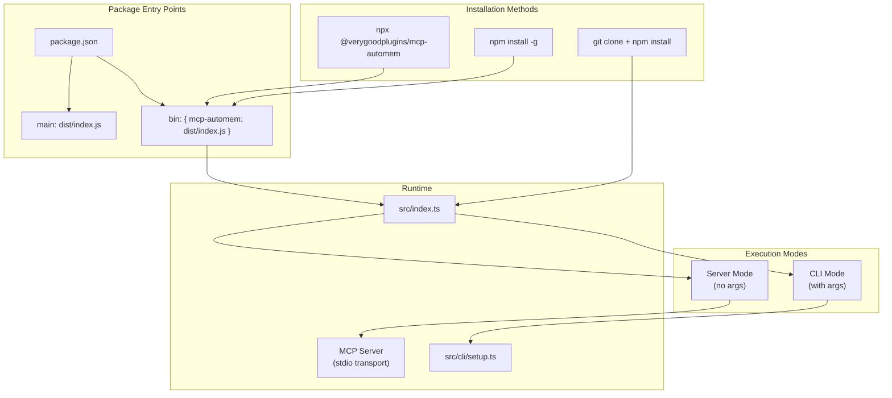
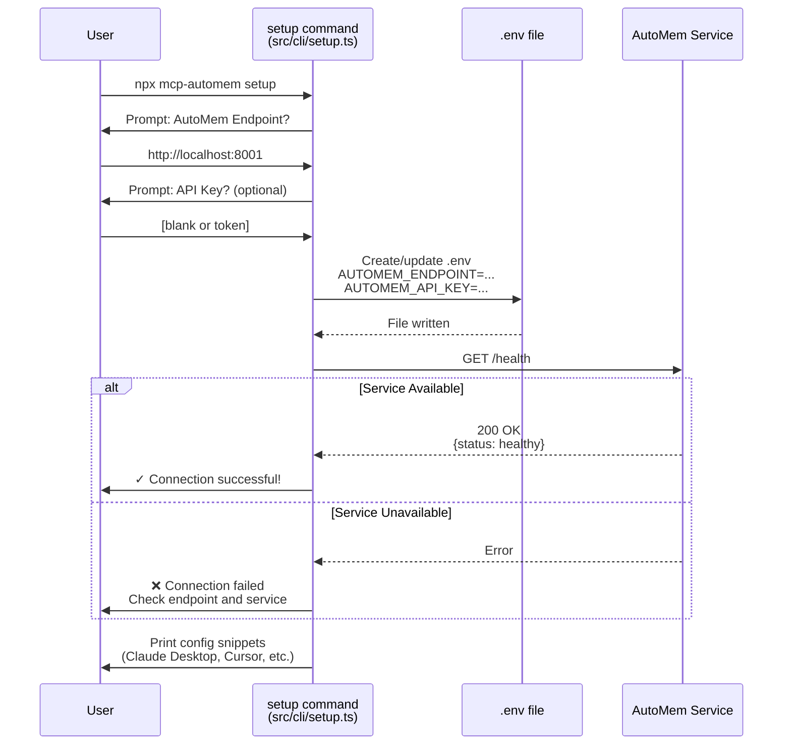

This page covers installing the `@verygoodplugins/mcp-automem` package and running the setup wizard to configure your connection to the AutoMem service. For information about deploying the AutoMem backend service itself, see [Prerequisites](#prerequisites). For detailed configuration options and environment variable resolution, see [Configuration Tools](/docs/cli/config-tools/).

## Prerequisites

The mcp-automem package is a **bridge component** that translates Model Context Protocol (MCP) calls into AutoMem HTTP API requests. It does not store memories itself — it requires a separate AutoMem backend service that handles memory storage, retrieval, and graph operations.

### Node.js Runtime Requirements

The mcp-automem package requires **Node.js 20.0.0 or higher**. This version requirement is enforced in the package manifest and necessary for:

- ECMAScript modules (ESM) support used throughout the codebase
- Native fetch API used by the HTTP client
- Modern async/await patterns in the MCP SDK

**Verify your Node.js version:**
```bash
node --version
# Should output: v20.x.x or higher
```

**Install or upgrade Node.js:**

| Method | Command |
|---|---|
| **nvm** (recommended) | `nvm install 20` |
| **Official Installer** | Download from [nodejs.org](https://nodejs.org) |
| **Homebrew (macOS)** | `brew install node@20` |
| **Package Manager (Linux)** | `apt install nodejs` or equivalent |

### AutoMem Service Requirement

The MCP server **cannot function without a running AutoMem service**. You must choose one deployment option before installing:

**Why separate services?**

- **Deployment flexibility**: Run memory backend on different infrastructure than MCP client
- **Multi-client support**: Multiple MCP servers can share one AutoMem instance
- **Scaling independence**: Scale memory storage separately from MCP protocol handling
- **Technology separation**: Backend can use Python/FastAPI while client uses TypeScript

**Option 1: Local Development**

Best for: development, testing, single-machine use, privacy-focused setups.

Requirements: Docker and Docker Compose installed, Git, 2GB RAM, ports 8001, 6379, 3000, 6333 available.

```bash
git clone https://github.com/verygoodplugins/automem
cd automem
make dev
```

This launches: Flask service on `:8001`, FalkorDB on `:6379`, Qdrant on `:6333`, FalkorDB graph browser on `:3000`.

Endpoint configuration: `AUTOMEM_ENDPOINT=http://127.0.0.1:8001` (no API key required in development mode)

**Option 2: Railway Cloud**

Best for: production use, multi-device access, team collaboration, always-on availability.

1. Click Railway deploy button (see AutoMem service repository)
2. Connect GitHub account
3. Configure environment variables in Railway dashboard
4. Note the generated Railway URL: `https://your-project.up.railway.app`

Endpoint configuration: `AUTOMEM_ENDPOINT=https://your-project.up.railway.app`, `AUTOMEM_API_KEY=<generated-token>`

Typical costs: development ~$0.50-1.00/month, production ~$5-10/month.

**Option 3: Self-Hosted Production**

Best for: enterprise deployments, custom infrastructure, air-gapped environments.

| Platform | Setup Complexity |
|---|---|
| **Docker Compose** | Medium |
| **Kubernetes** | High |
| **VPS (DigitalOcean, Linode)** | Medium |
| **AWS/GCP/Azure** | High |

### Network Connectivity Requirements

| Deployment | Ports Used | Accessibility |
|---|---|---|
| **Local** | `8001` (AutoMem API) | Localhost only |
| **Railway** | `443` (HTTPS) | Internet |
| **Self-hosted** | `8001` or custom | Depends on configuration |

### Platform-Specific Config Paths

Before installation, determine where these files will be located:

| File | Purpose | Typical Location | Required When |
|---|---|---|---|
| `.env` | AutoMem endpoint and API key | Current directory or home | Setup wizard |
| `claude_desktop_config.json` | Claude Desktop MCP config | OS-specific config directory | Claude Desktop |
| `~/.cursor/mcp.json` | Cursor MCP server config | User home directory | Cursor IDE |
| `~/.claude.json` | Claude Code MCP config | User home directory | Claude Code |
| `~/.codex/config.toml` | Codex MCP config | User home directory | OpenAI Codex |

**Claude Desktop**:
- macOS: `~/Library/Application Support/Claude/claude_desktop_config.json`
- Windows: `%APPDATA%\Claude\claude_desktop_config.json`
- Linux: `~/.config/Claude/claude_desktop_config.json`

**Cursor IDE**:
- All platforms: `~/.cursor/mcp.json` (MCP server config)
- Project-specific: `.cursor/rules/automem.mdc` (memory rules)

**Claude Code**:
- All platforms: `~/.claude.json` (MCP server config)
- All platforms: `~/.claude/settings.json` (permissions)
- All platforms: `~/.claude/CLAUDE.md` (memory rules)

### Pre-Installation Checklist

**System Requirements**
- Node.js 20.0.0 or higher installed (`node --version`)
- npm available (`npm --version`)
- Terminal access with write permissions

**AutoMem Service**
- AutoMem service deployed (local, Railway, or self-hosted)
- Service is running and accessible
- Health endpoint responds: `curl http://your-endpoint/health`
- Note your `AUTOMEM_ENDPOINT` URL
- Note your `AUTOMEM_API_KEY` (if using authentication)

**Network Connectivity**
- MCP client can reach AutoMem service (test with curl)
- No firewall blocking the connection
- HTTPS certificate valid (if using Railway or self-hosted with SSL)

**File System Access**
- Write permission to create `.env` file
- Access to platform-specific config directories
- Ability to restart AI platform applications

## Installation Methods

The `mcp-automem` package can be installed three ways, depending on your use case.

### Installation Entry Points



**Dual mode detection:** The entry point at `src/index.ts` determines whether to run as an MCP server (no arguments) or execute a CLI command (with arguments). This allows the same package to function as both an MCP server process and a CLI tool.

### Method 1: NPX (Recommended)

The recommended installation method uses `npx` to run the package without installing it globally. This ensures you always use the latest version and avoids version conflicts.

```bash
npx @verygoodplugins/mcp-automem setup
```

**How it works:**
- `npx` downloads the package temporarily to execute it
- No global installation required
- Automatically uses the latest published version
- Suitable for CI/CD pipelines and one-off commands

**When to use:** For platform configurations (Claude Desktop, Cursor, Claude Code) where the MCP server is launched on-demand via `npx` in the config file.

### Method 2: Global Installation

Install the package globally to use the `mcp-automem` command without `npx`.

```bash
npm install -g @verygoodplugins/mcp-automem
mcp-automem setup
```

**When to use:** If you run CLI commands frequently or want faster execution without npx download delays.

### Method 3: Local Development

For contributors or those customizing the codebase, clone and build locally.

```bash
git clone https://github.com/verygoodplugins/mcp-automem
cd mcp-automem
npm install
npm run build
node dist/index.js setup
```

The built server is available at `dist/index.js`.

**Build process:**
- `npm run build` — Compiles TypeScript from `src/` to `dist/`
- `npm run postbuild` — Makes `dist/index.js` executable (`chmod +x`)
- `npm run dev` — Runs the TypeScript source directly via `tsx watch` for development

## Setup Wizard

The `setup` command provides an interactive wizard that configures your connection to the AutoMem service.

### Wizard Flow



### Setup Wizard Implementation

The wizard prompts for two required configuration values:

| Prompt | Environment Variable | Description | Default |
|---|---|---|---|
| **AutoMem Endpoint** | `AUTOMEM_ENDPOINT` | HTTP URL to AutoMem service | `http://127.0.0.1:8001` |
| **API Key** | `AUTOMEM_API_KEY` | Authentication token (optional for local) | None |

**Endpoint validation:**
- Must be a valid HTTP/HTTPS URL
- Should end without trailing slash
- Common values: `http://localhost:8001` (local), `https://your-app.railway.app` (Railway)

**API Key handling:**
- Optional for local development (no authentication)
- Required for Railway and production deployments
- Can be left blank when prompted for local setups

### .env File Creation

The setup wizard creates or updates a `.env` file in the current directory:

```
AUTOMEM_ENDPOINT=http://localhost:8001
AUTOMEM_API_KEY=your-api-key-here
```

**File resolution:** The dotenv library loads `.env` from the current working directory when the MCP server starts. The configuration can also be overridden by system environment variables (see [Configuration Tools](/docs/cli/config-tools/)).

:::caution[Security note]
The `.env` file contains your API key and should be added to `.gitignore` to avoid committing credentials to version control.
:::

### Configuration File Output

After writing the `.env` file, the setup wizard prints platform-specific configuration snippets:

**For Claude Desktop:**
```json
{
  "mcpServers": {
    "automem": {
      "command": "npx",
      "args": ["@verygoodplugins/mcp-automem"],
      "env": {
        "AUTOMEM_ENDPOINT": "http://localhost:8001",
        "AUTOMEM_API_KEY": "your-token"
      }
    }
  }
}
```

**For Cursor/Codex:**
```json
{
  "mcpServers": {
    "automem": {
      "command": "npx",
      "args": ["@verygoodplugins/mcp-automem"]
    }
  }
}
```

These snippets can be copied directly into the respective platform configuration files. For platform-specific setup instructions, see [Platform Installers](/docs/cli/platform-installers/).

### Connection Validation

The setup wizard validates the connection to the AutoMem service by calling the `/health` endpoint:

**Successful response:**
```
✓ Connection successful!
✓ Config saved to .env
✓ Claude Desktop config snippet generated
```

**Failed response:**
```
❌ Connection failed
Check that AutoMem service is running at http://localhost:8001
See: https://github.com/verygoodplugins/automem/blob/main/INSTALLATION.md
```

The health check ensures both graph (FalkorDB) and vector (Qdrant) databases are accessible before completing setup.

## Post-Installation File Structure

After running the setup wizard, your directory contains:

```
your-project/
├── .env                          # Created by setup wizard
│   ├── AUTOMEM_ENDPOINT=...
│   └── AUTOMEM_API_KEY=...
└── node_modules/                 # If npm install was run
    └── @verygoodplugins/
        └── mcp-automem/
            ├── dist/
            │   └── index.js      # MCP server entry point
            ├── templates/        # Platform-specific rules
            │   ├── cursor/
            │   ├── codex/
            │   ├── claude-code/
            │   └── openclaw/
            └── package.json
```

**Templates:** The `templates/` directory contains platform-specific instruction files used by CLI commands like `cursor`, `claude-code`, and `codex` to generate integration rules. See [Platform Installers](/docs/cli/platform-installers/) for details.

## Verification

After installation, verify the setup works by checking the database health:

```bash
curl http://your-endpoint/health
```

**Expected health response:**
```json
{
  "status": "healthy",
  "falkordb": "connected",
  "qdrant": "connected",
  "memory_count": 0,
  "enrichment": {
    "status": "running",
    "queue_depth": 0
  }
}
```

For platform-specific verification (Claude Desktop, Cursor, etc.), see the respective integration guides in [Platform Installers](/docs/cli/platform-installers/).

## Common Installation Issues

| Issue | Cause | Solution |
|---|---|---|
| `AUTOMEM_ENDPOINT not set` | `.env` file missing or not in current directory | Run `setup` wizard or manually create `.env` |
| `Connection refused` | AutoMem service not running | Start service: `cd automem && make dev` |
| `401 Unauthorized` | Invalid API key | Check `AUTOMEM_API_KEY` matches service token |
| `npx: command not found` | Node.js not installed | Install Node.js >=20.0.0 |
| `Module not found` errors | Incomplete installation | Run `npm install` or use `npx` instead |

**Debug mode:** Set `AUTOMEM_LOG_LEVEL=debug` to enable verbose logging:

```bash
AUTOMEM_LOG_LEVEL=debug npx @verygoodplugins/mcp-automem
```

### Issue: Node.js Version Too Old

**Symptom**: Error during installation: `The engine "node" is incompatible with this module`

**Solution**: Upgrade Node.js to version 20 or higher using nvm or official installer.

### Issue: AutoMem Service Not Running

**Symptom**: MCP server logs show `ECONNREFUSED` or `Service unreachable`

**Solution**:
1. Verify service is running: `curl http://your-endpoint/health`
2. Check Docker containers for local: `docker ps | grep automem`
3. Check Railway logs for cloud deployments

### Issue: Network Connectivity

**Symptom**: Timeouts when calling AutoMem API

**Solution**:
1. Verify endpoint URL is correct (no typos)
2. Check firewall rules if self-hosted
3. Ensure AutoMem service is bound to correct interface (not just localhost)
4. Test with curl from same machine as MCP client

### Issue: Port Conflicts

**Symptom**: Local AutoMem service fails to start on port 8001

**Solution**:
1. Check what's using the port: `lsof -i :8001` (macOS/Linux) or `netstat -ano | findstr :8001` (Windows)
2. Stop conflicting service or reconfigure AutoMem to use different port
3. Update `AUTOMEM_ENDPOINT` accordingly

## Next Steps

After completing installation:

1. **Configure environment variables** — See [Configuration Tools](/docs/cli/config-tools/) for advanced options like custom endpoints and authentication
2. **Set up platform integration** — See [Platform Installers](/docs/cli/platform-installers/) for Claude Desktop, Cursor, Claude Code, etc.
3. **Store your first memory** — Use the `store_memory` MCP tool in your AI platform of choice
