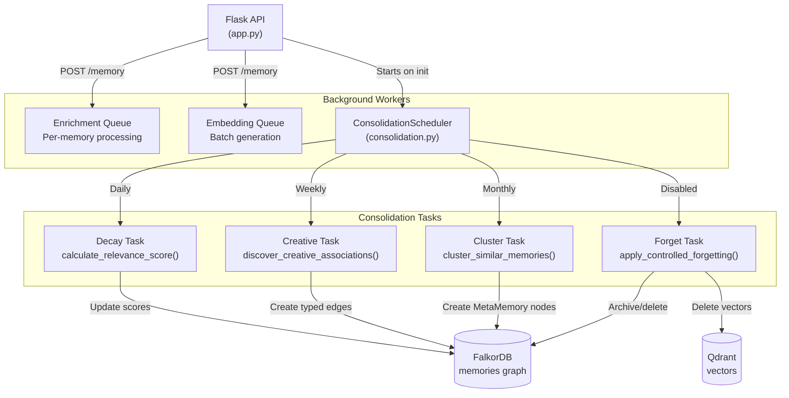
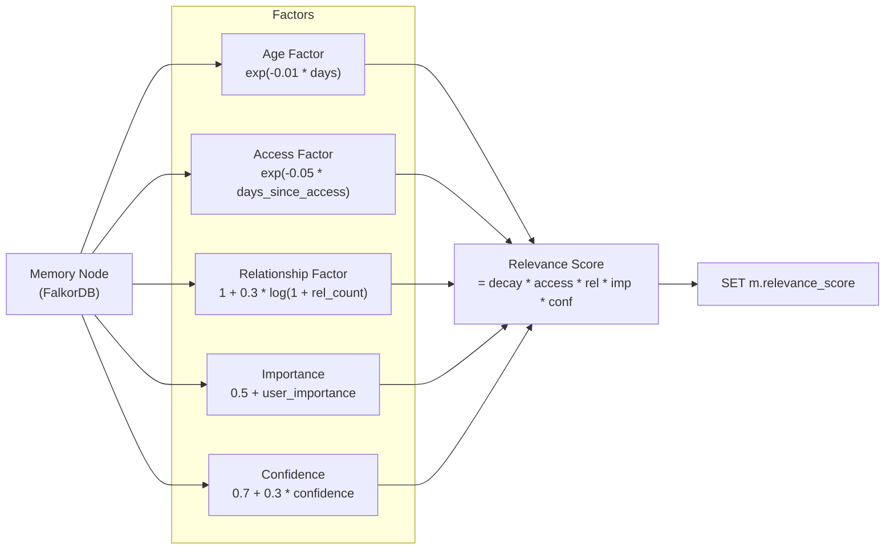
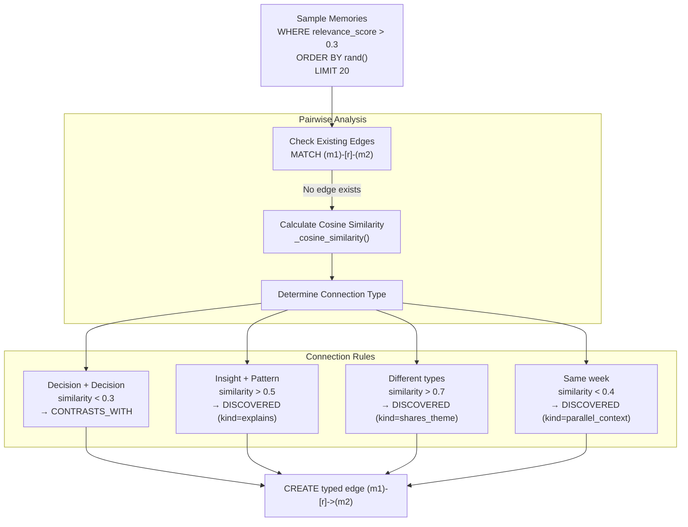
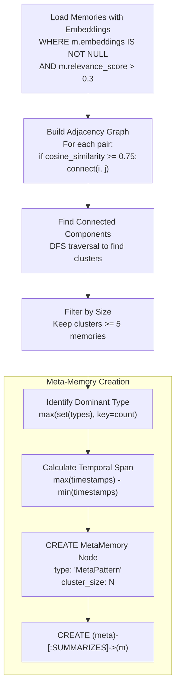
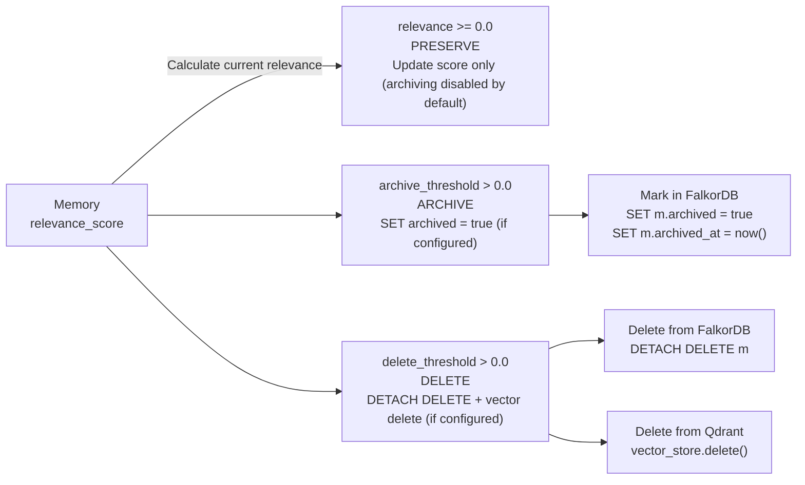

:::note[Source files]
Key implementation files:
- [consolidation.py#L111-L770](https://github.com/verygoodplugins/automem/blob/main/consolidation.py#L111-L770) — `MemoryConsolidator` and `ConsolidationScheduler` classes
- [consolidation.py#L178-L230](https://github.com/verygoodplugins/automem/blob/main/consolidation.py#L178-L230) — Relevance score calculation (decay task)
- [consolidation.py#L232-L330](https://github.com/verygoodplugins/automem/blob/main/consolidation.py#L232-L330) — Creative association discovery
- [consolidation.py#L332-L430](https://github.com/verygoodplugins/automem/blob/main/consolidation.py#L332-L430) — Clustering algorithm
- [consolidation.py#L433-L545](https://github.com/verygoodplugins/automem/blob/main/consolidation.py#L433-L545) — Forgetting/archiving
- [consolidation.py#L773-L873](https://github.com/verygoodplugins/automem/blob/main/consolidation.py#L773-L873) — Scheduler
- `automem/consolidation/runtime_scheduler.py` — Scheduler initialization
- `automem/consolidation/runtime_bindings.py` — Background thread startup
- `automem/api/consolidation.py` — Manual trigger endpoint
- [tests/test_consolidation_engine.py](https://github.com/verygoodplugins/automem/blob/main/tests/test_consolidation_engine.py) — Test coverage
:::

The Consolidation Engine maintains and optimizes the memory graph through scheduled background processing inspired by biological memory consolidation. It applies exponential decay, discovers non-obvious associations, clusters similar memories, and implements controlled forgetting to prevent unbounded memory growth.

This page covers the `MemoryConsolidator` and `ConsolidationScheduler` classes and their integration with the Flask API. For the enrichment pipeline that processes new memories, see [Enrichment Pipeline](/docs/architecture/enrichment/). For the overall background processing architecture, see [Background Processing](/docs/architecture/background-processing/).

---

## System Overview

The consolidation engine runs independently from client requests on configurable schedules. Unlike enrichment (which processes individual memories) or embedding generation (which handles batches of new memories), consolidation operates on the entire memory graph to maintain its health over time.

### Consolidation in the Background Processing System



---

## Core Components

### MemoryConsolidator Class

The `MemoryConsolidator` class implements the four consolidation tasks. It depends on a graph store (FalkorDB) and optionally a vector store (Qdrant) for deletions during forgetting.

**Key Parameters:**

| Parameter | Default | Purpose |
|---|---|---|
| `base_decay_rate` | 0.01 | Daily exponential decay rate |
| `reinforcement_bonus` | 0.2 | Strength added when memory accessed |
| `relationship_preservation` | 0.3 | Extra weight for connected memories |
| `min_cluster_size` | 5 | Minimum memories per cluster to create MetaMemory |
| `similarity_threshold` | 0.75 | Cosine similarity for clustering |
| `archive_threshold` | 0.0 | Archive below this relevance (disabled by default) |
| `delete_threshold` | 0.0 | Delete below this relevance (disabled by default) |

### ConsolidationScheduler Class

The `ConsolidationScheduler` manages when each consolidation task runs based on configured intervals.

**Default Schedule Configuration:**

| Task | Interval (Environment Variable) | Default Value |
|---|---|---|
| `decay` | `CONSOLIDATION_DECAY_INTERVAL_SECONDS` | 86400 (1 day) |
| `creative` | `CONSOLIDATION_CREATIVE_INTERVAL_SECONDS` | 604800 (1 week) |
| `cluster` | `CONSOLIDATION_CLUSTER_INTERVAL_SECONDS` | 2592000 (1 month) |
| `forget` | `CONSOLIDATION_FORGET_INTERVAL_SECONDS` | 0 (disabled) |

---

## Decay Task: Relevance Score Calculation

The decay task updates `relevance_score` for all memories using exponential decay based on age, access patterns, relationships, importance, and confidence.

### Relevance Score Algorithm



**Calculation Steps:**

1. **Age-based decay:** `exp(-0.01 * age_days)` — Exponential decay from creation timestamp
2. **Access reinforcement:** `1.0` if accessed within 24 hours, else `exp(-0.05 * days_since_access)`
3. **Relationship preservation:** `1 + 0.3 * log(1 + relationship_count)` — Connected memories decay slower
4. **Importance scaling:** `0.5 + importance` (scales from 0.5 to 1.5)
5. **Confidence bonus:** `0.7 + 0.3 * confidence` (adds up to 30%)
6. **Combined score:** Product of all factors, capped at 1.0

**Cypher Query Pattern:**

```cypher
MATCH (m:Memory)
WHERE (m.archived IS NULL OR m.archived = false)
  AND m.importance >= $importance_threshold  -- Optional filter
RETURN m.id, m.timestamp, m.importance, m.last_accessed, m.relevance_score
```

The consolidator then updates each memory with:

```cypher
MATCH (m:Memory {id: $id})
SET m.relevance_score = $score
```

### Relationship Count Caching Optimization

To avoid O(N) graph queries during decay, relationship counts are cached with hourly invalidation:

The `hour_key` parameter causes automatic cache invalidation every hour, balancing freshness with an **80% query reduction**.

:::note
The relationship count cache is an LRU cache keyed by `(memory_id, hour_key)`. Each new hour, cached counts are considered stale and re-queried from FalkorDB. This design intentionally accepts slightly stale counts to avoid N+1 graph queries during every decay cycle.
:::

---

## Creative Task: Association Discovery

The creative task discovers non-obvious connections between memories by randomly sampling the graph and analyzing semantic similarity and temporal patterns.

### Creative Association Algorithm



**Connection Types Discovered:**

| Type | Conditions | Confidence | Example |
|---|---|---|---|
| `CONTRADICTS` | Both `Decision`, similarity < 0.3 | 0.6 | Opposing architectural choices |
| `DISCOVERED` (kind=explains) | `Insight` + `Pattern`, similarity > 0.5 | 0.7 | Insight explains pattern |
| `DISCOVERED` (kind=shares_theme) | Different types, similarity > 0.7 | similarity | Cross-domain patterns |
| `DISCOVERED` (kind=parallel_context) | Same week, similarity < 0.4 | 0.5 | Unrelated concurrent work |

**Edge Properties:**

Each discovered edge is created as a `DISCOVERED` relationship with a `kind` property (`explains`, `shares_theme`, `parallel_context`) and carries metadata about the connection confidence:

```json
{
  "confidence": 0.6,
  "discovered_at": "2025-01-15T10:00:00Z",
  "algorithm": "creative_association"
}
```

:::tip
The creative task mimics REM sleep — it randomly samples from the graph rather than exhaustively comparing all pairs. This keeps computation bounded (O(N²) on sample size, not total memories) while still discovering meaningful connections.
:::

---

## Cluster Task: Semantic Grouping

The cluster task groups semantically similar memories using a graph-based clustering algorithm (similar to DBSCAN) and creates `MetaMemory` nodes to represent patterns.

### Clustering Algorithm



**Clustering Parameters:**

- **Similarity threshold:** 0.75 (configurable via `self.similarity_threshold`)
- **Minimum cluster size:** 5 memories (configurable via `self.min_cluster_size`) — clusters with fewer members do not create MetaMemory nodes
- **Relevance filter:** Only clusters memories with `relevance_score > 0.3`

**MetaMemory Node Properties:**

| Property | Type | Description |
|---|---|---|
| `label` | string | `"MetaPattern"` |
| `dominant_type` | string | Most common memory type in the cluster |
| `cluster_size` | integer | Number of memories in the cluster |
| `temporal_span_days` | float | Days between oldest and newest memory |
| `created_at` | ISO datetime | When this meta-memory was created |
| `content` | string | Auto-generated cluster summary |

MetaMemory nodes are connected to their member memories via `SUMMARIZES` relationships:

```cypher
MATCH (meta:MetaPattern), (m:Memory {id: $member_id})
CREATE (meta)-[:SUMMARIZES]->(m)
```

---

## Forget Task: Controlled Memory Pruning

The forget task archives low-relevance memories and permanently deletes very low-relevance memories, preventing unbounded graph growth.

### Forgetting Thresholds



**Forgetting Lifecycle:**

By default both `archive_threshold` and `delete_threshold` are `0.0`, meaning forgetting and archiving are **disabled**. Memory protection is the primary mechanism preventing unbounded growth:

- **Grace period:** Memories younger than `CONSOLIDATION_GRACE_PERIOD_DAYS` (default: 90) are never archived or deleted
- **Importance protection:** Memories with `importance >= 0.7` are protected from archiving/deletion
- **Protected types:** Types in `CONSOLIDATION_PROTECTED_TYPES` (default: `"Decision,Insight"`) are never archived or deleted

When thresholds are configured above `0.0`:

1. **Fresh/protected memories**: Updated but preserved
2. **Low-relevance memories** (below `archive_threshold`): Archived (kept in graph, marked `archived = true`)
3. **Very low-relevance memories** (below `delete_threshold`): Permanently deleted from both stores

**Archive Query (when `archive_threshold > 0.0`):**

```cypher
MATCH (m:Memory)
WHERE (m.archived IS NULL OR m.archived = false)
  AND m.relevance_score < $archive_threshold
  AND m.importance < 0.7
  AND NOT m.type IN ['Decision', 'Insight']
  AND m.timestamp < $grace_cutoff
SET m.archived = true,
    m.archived_at = $now
```

**Delete Queries (when `delete_threshold > 0.0`):**

```cypher
-- FalkorDB deletion
MATCH (m:Memory)
WHERE m.relevance_score < $delete_threshold
  AND (m.archived IS NULL OR m.archived = false)
  AND m.importance < 0.7
  AND NOT m.type IN ['Decision', 'Insight']
  AND m.timestamp < $grace_cutoff
DETACH DELETE m

-- Qdrant deletion (for each deleted memory ID)
vector_store.delete(memory_id)
```

:::caution
Deletion from both stores is permanent and irreversible. Both `archive_threshold` and `delete_threshold` default to `0.0` (disabled). When enabled, the memory protection system (90-day grace period, importance >= 0.7 threshold, and protected types Decision/Insight) prevents accidental loss of important memories.
:::

---

## Scheduling and Execution

### Background Thread Integration

Consolidation runs in a background thread started at Flask application initialization:

```python
# app.py — startup code
scheduler = ConsolidationScheduler(consolidator=consolidator)
thread = threading.Thread(target=scheduler.run, daemon=True)
thread.start()
```

The scheduler checks every `CONSOLIDATION_TICK_SECONDS` (default: 60) whether any task is due for execution.

### Manual Consolidation Endpoint

Administrators can manually trigger consolidation via the `/consolidate` endpoint:

```
POST /consolidate
Authorization: Bearer <admin_token>

{
  "task": "decay"   // Optional: run specific task only
}
```

If no `task` is specified, all four tasks run sequentially.

### Consolidation Control Node

Consolidation state is persisted in a `ConsolidationControl` node in FalkorDB:

**Node Creation:**

```cypher
MERGE (c:ConsolidationControl {id: 'singleton'})
ON CREATE SET
    c.last_decay = null,
    c.last_creative = null,
    c.last_cluster = null,
    c.last_forget = null,
    c.history = '[]'
```

**Update After Task:**

```cypher
MATCH (c:ConsolidationControl {id: 'singleton'})
SET c.last_decay = $now,
    c.history = $updated_history
```

This allows the `/consolidate/status` endpoint to report when each task last ran and its result.

---

## Configuration Reference

### Environment Variables

| Variable | Default | Description |
|---|---|---|
| `CONSOLIDATION_TICK_SECONDS` | 60 | How often scheduler checks if tasks are due (seconds) |
| `CONSOLIDATION_DECAY_INTERVAL_SECONDS` | 86400 | How often decay task runs (1 day) |
| `CONSOLIDATION_CREATIVE_INTERVAL_SECONDS` | 604800 | How often creative task runs (1 week) |
| `CONSOLIDATION_CLUSTER_INTERVAL_SECONDS` | 2592000 | How often cluster task runs (1 month) |
| `CONSOLIDATION_FORGET_INTERVAL_SECONDS` | 0 | How often forget task runs (0 = disabled) |
| `CONSOLIDATION_DECAY_IMPORTANCE_THRESHOLD` | 0.3 | Optional: Only decay memories with importance >= threshold |
| `CONSOLIDATION_HISTORY_LIMIT` | 20 | Max consolidation runs to keep in history |
| `CONSOLIDATION_PROTECTED_TYPES` | `"Decision,Insight"` | Comma-separated memory types never archived or deleted |
| `CONSOLIDATION_GRACE_PERIOD_DAYS` | 90 | Memories younger than this are never archived or deleted |
| `CONSOLIDATION_ARCHIVE_THRESHOLD` | 0.0 | Archive memories below this relevance score (0.0 = disabled) |
| `CONSOLIDATION_DELETE_THRESHOLD` | 0.0 | Delete memories below this relevance score (0.0 = disabled) |

### Tuning Recommendations

**High-Traffic Production (>10k memories/day):**

```bash
CONSOLIDATION_DECAY_INTERVAL_SECONDS=1800      # Every 30 minutes
CONSOLIDATION_CREATIVE_INTERVAL_SECONDS=7200   # Every 2 hours
CONSOLIDATION_CLUSTER_INTERVAL_SECONDS=43200   # Every 12 hours
CONSOLIDATION_FORGET_INTERVAL_SECONDS=86400    # Daily (keep at 24 hours)
```

**Low-Traffic Development:**

```bash
CONSOLIDATION_DECAY_INTERVAL_SECONDS=3600      # Every hour
CONSOLIDATION_CREATIVE_INTERVAL_SECONDS=3600   # Every hour
CONSOLIDATION_CLUSTER_INTERVAL_SECONDS=86400   # Daily
CONSOLIDATION_FORGET_INTERVAL_SECONDS=604800   # Weekly (longer retention)
```

**Memory-Constrained Environments:**

```bash
CONSOLIDATION_FORGET_INTERVAL_SECONDS=43200    # Every 12 hours (aggressive pruning)
CONSOLIDATION_DECAY_IMPORTANCE_THRESHOLD=0.3   # Only decay lower-importance memories
```

---

## Performance Characteristics

### Execution Time Estimates

| Task | Complexity | 1k Memories | 10k Memories | 100k Memories |
|---|---|---|---|---|
| Decay | O(N) | <1s | ~1s | ~10s |
| Creative | O(N²) sample | <1s | <2s | <5s |
| Cluster | O(N²) edges | 2-3s | 10-15s | 60-90s |
| Forget | O(N) | <1s | ~2s | ~15s |

**Notes:**

- Decay benefits from 80% cache hit rate via relationship count caching
- Creative samples only 20-30 memories, so scales with sample size not total memories
- Cluster complexity depends on embedding similarity distribution
- Forget includes vector store deletions which add latency

### Memory Usage

**Typical Memory Footprint:**

- **Baseline:** ~5MB (LRU cache + worker overhead)
- **During decay:** +1-2MB (result dictionaries)
- **During creative:** +2-3MB (sample embeddings)
- **During cluster:** +10-50MB (all embeddings + adjacency graph for 10k memories)

:::note
The cluster task loads all memory embeddings into memory simultaneously to build the adjacency graph. For very large memory collections (>100k), consider running cluster less frequently or increasing available RAM.
:::

---

## Testing and Observability

### Test Coverage

The consolidation engine has comprehensive test coverage in `tests/test_consolidation_engine.py`:

**Key Test Fixtures:**

- `FakeGraph`: Simulates FalkorDB with configurable responses
- `FakeVectorStore`: Simulates Qdrant for deletion tracking
- `freeze_time`: Freezes datetime for deterministic decay calculations

Tests cover all four tasks, edge cases (empty graph, single memory, max thresholds), and the scheduler timing logic.

### Monitoring Endpoints

**GET /consolidate/status** (Admin token required):

```json
{
  "last_decay": "2025-01-15T10:00:00Z",
  "last_creative": "2025-01-15T10:00:00Z",
  "last_cluster": "2025-01-15T06:00:00Z",
  "last_forget": "2025-01-15T00:00:00Z",
  "history": [
    {
      "task": "decay",
      "ran_at": "2025-01-15T10:00:00Z",
      "memories_processed": 1542,
      "duration_seconds": 0.8
    }
  ]
}
```

### Logging

Consolidation operations emit structured logs:

```
[consolidation] Starting decay task (1542 memories)
[consolidation] Decay complete: 1542 processed, 0.8s elapsed
[consolidation] Creative task: discovered 3 new associations
[consolidation] Cluster task: created 2 MetaMemory nodes from 8 clusters
[consolidation] Forget task: archived 12, deleted 3 memories
```

---

## Biological Inspiration

The consolidation engine implements memory principles from neuroscience research:

| Task | Biological Analog | Implementation |
|---|---|---|
| **Decay** | Synaptic weakening over time | Exponential relevance decay based on age and access |
| **Creative** | REM sleep association formation | Random memory sampling + similarity analysis |
| **Cluster** | Memory compression during sleep | Semantic grouping + meta-pattern creation |
| **Forget** | Controlled forgetting during consolidation | Archival before deletion, importance-weighted |

**Key Research Connections:**

- **Exponential decay** mirrors [forgetting curves](https://en.wikipedia.org/wiki/Forgetting_curve) (Ebbinghaus, 1885)
- **REM-like processing** inspired by [memory replay during sleep](https://www.ncbi.nlm.nih.gov/pmc/articles/PMC4648295/)
- **Clustering** implements principles from [MELODI](https://arxiv.org/html/2410.03156v1) (DeepMind, 2024) for memory compression
- **Controlled forgetting** follows [active forgetting research](https://www.nature.com/articles/nrn.2016.147) showing forgetting aids learning

For related API operations (triggering consolidation manually, viewing status), see [Consolidation Operations](/docs/reference/api/consolidation/).
