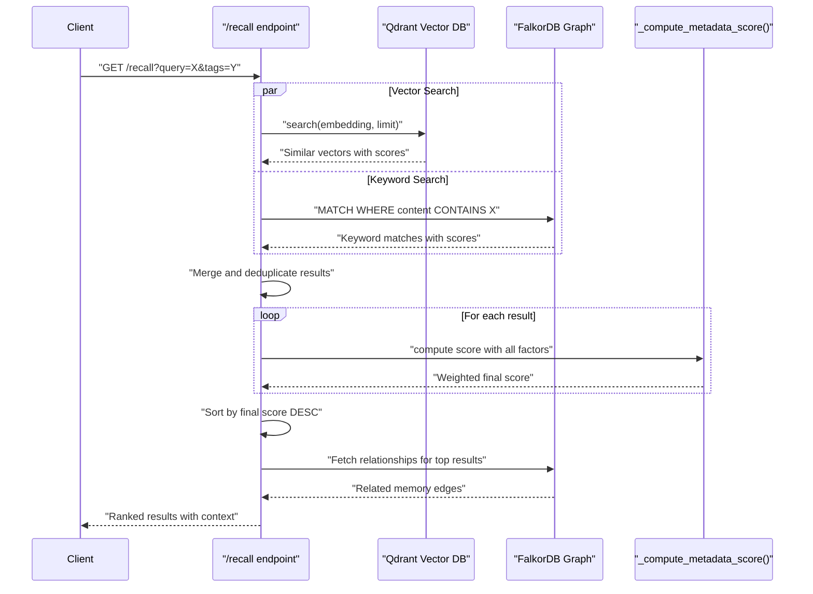
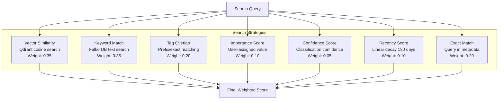
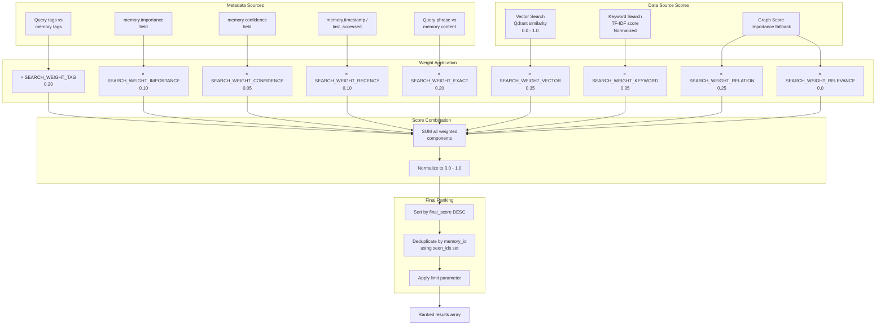

:::note[Source files]
Key implementation files:
- [automem/search/runtime_recall_helpers.py](https://github.com/verygoodplugins/automem/blob/28eb916eae430f80ebee57d44f63b712b9d45398/automem/search/runtime_recall_helpers.py) — Vector and keyword search implementations
- [automem/search/runtime_keywords.py](https://github.com/verygoodplugins/automem/blob/28eb916eae430f80ebee57d44f63b712b9d45398/automem/search/runtime_keywords.py) — Keyword matching logic
- [automem/search/runtime_relations.py](https://github.com/verygoodplugins/automem/blob/28eb916eae430f80ebee57d44f63b712b9d45398/automem/search/runtime_relations.py) — Relationship expansion
- [automem/api/recall.py](https://github.com/verygoodplugins/automem/blob/28eb916eae430f80ebee57d44f63b712b9d45398/automem/api/recall.py) — Recall endpoint orchestration
- [automem/config.py#L389-L397](https://github.com/verygoodplugins/automem/blob/28eb916eae430f80ebee57d44f63b712b9d45398/automem/config.py#L389-L397) — Search weight configuration
- [automem/utils/scoring.py](https://github.com/verygoodplugins/automem/blob/28eb916eae430f80ebee57d44f63b712b9d45398/automem/utils/scoring.py) — Score computation
- [automem/utils/graph.py](https://github.com/verygoodplugins/automem/blob/28eb916eae430f80ebee57d44f63b712b9d45398/automem/utils/graph.py) — Graph traversal utilities
- [automem/utils/time.py](https://github.com/verygoodplugins/automem/blob/28eb916eae430f80ebee57d44f63b712b9d45398/automem/utils/time.py) — Temporal expression parsing
- [automem/utils/tags.py](https://github.com/verygoodplugins/automem/blob/28eb916eae430f80ebee57d44f63b712b9d45398/automem/utils/tags.py) — Tag prefix utilities
:::

This document explains AutoMem's hybrid search system, which combines semantic, lexical, graph, temporal, and metadata signals to retrieve and rank memories. Current canonical benchmark claims are **87.00% on LongMemEval full** with **97.00% recall@5**, and **84.74% on LoCoMo full**. See [Benchmarks](/benchmarks/) for the publication bundle and methodology links.

For information about the memory structure being searched, see [Memory Model](/docs/core-concepts/memory-model/). For details on relationship types used in graph traversal, see [Relationship Types](/docs/core-concepts/relationship-types/). For API usage, see [Recall Operations](/docs/reference/api/recall-operations/).

---

## Hybrid Search Overview

AutoMem's recall system combines results from two complementary data stores and applies multi-dimensional scoring to rank results by relevance:



---

## Search Components



### Vector Search (Semantic Similarity)

Vector search uses Qdrant to find memories with semantically similar embeddings. Query text is converted to a vector using the configured embedding provider, then a cosine similarity search retrieves the top candidates.

The `_vector_search()` function handles both explicit embeddings (passed by client) and on-demand generation. If Qdrant is unavailable, the system gracefully degrades to graph-only mode.

**Key behaviors:**

- Returns empty list if no query text and no explicit embedding provided
- Applies tag filters via `_build_qdrant_tag_filter()`
- Deduplicates results using `seen_ids` set
- Attaches relations by calling `fetch_relations()` for each hit

### Keyword Search (Lexical Matching)

Keyword search performs text matching in FalkorDB's graph store using Cypher queries. The system extracts keywords from the query, searches content and tags, and assigns scores based on match frequency.

The keyword scoring algorithm rewards both individual keyword matches and phrase matches:

| Match Type | Location | Score |
|---|---|---|
| Single keyword | content field | +2 |
| Single keyword | tags array | +1 |
| Full phrase | content field | +2 |
| Full phrase | tags array | +1 |

**Fallback behavior:** If the normalized query is empty or `"*"`, the system calls `_graph_trending_results()` to return high-importance memories sorted by the `sort` parameter (`time_asc`, `time_desc`, `updated_asc`, `updated_desc`, or default importance ordering).

### Graph Relationship Traversal

Graph traversal leverages FalkorDB's typed relationship edges to find connected memories. This enables multi-hop reasoning and bridge discovery.

The `fetch_relations()` helper queries all relationships for a given memory and returns a list of related memory summaries. Each relationship includes:

- Target memory ID and summary
- Relationship type (e.g., `"PREFERS_OVER"`)
- Strength value (metadata field on relationship edge)

**Multi-hop patterns:**

1. **Direct relations** — Single-hop from seed memory
2. **Bridges** — Memories that connect two or more seed results
3. **Entity expansion** — Following `entity:<type>:<slug>` tags to related memories

### Temporal Alignment

Temporal scoring boosts memories that align with time-based query constraints. The system supports both absolute time ranges and relative expressions.

**Supported time expressions:**

- Relative: `last hour`, `last day`, `last week`, `last month`, `last year`
- Relative: `this hour`, `this day`, `this week`, `this month`, `this year`
- Relative: `next hour`, `next day`, `next week`, `next month`, `next year`
- Absolute: `before 2025-02-01`, `after 2025-01-15`
- Range: `between 2025-01-15 and 2025-01-20`
- Range: `2025-01-15 to 2025-01-20`

### Tag Matching

Tag filters support both exact matching and prefix matching for hierarchical tag namespaces. The system normalizes tags to lowercase and computes prefixes for efficient filtering.

**Tag prefix system:** AutoMem automatically computes tag prefixes for efficient hierarchical filtering. For example, the tag `"entity:person:sarah"` generates prefixes: `["entity", "entity:person", "entity:person:sarah"]`.

**Example queries:**

```
tags=slack&tag_match=prefix
  → Matches: slack:*, slack:U123:*, slack:channel-ops

tags=entity:person&tag_match=prefix&tag_mode=all
  → Matches: entity:person:*, entity:person:sarah, entity:person:john

tags=project&tags=decision&tag_mode=all
  → Matches: Memories tagged with both "project" AND "decision"
```

### Metadata Scoring Components

Three metadata fields contribute to the final score: importance, confidence, and recency.

**Recency calculation:** Recency uses a linear decay over 180 days: `max(0.0, 1.0 - (age_days / 180.0))`, based on the time since last access (or creation if never accessed). Memories older than 180 days score 0.0.

**Default behavior:**

- Missing `importance` defaults to 0.5
- Missing `confidence` defaults to 0.7
- Missing `last_accessed` falls back to `timestamp`

---

## 10-Component Scoring System

The final score for each memory result combines ten weighted components. The weights are configurable via environment variables.

### Scoring Formula

```
final_score =
    vector_similarity    × SEARCH_WEIGHT_VECTOR       (default: 0.35)
  + keyword_score        × SEARCH_WEIGHT_KEYWORD      (default: 0.35)
  + metadata_score       × SEARCH_WEIGHT_METADATA     (default: 0.35)
  + tag_match_score      × SEARCH_WEIGHT_TAG          (default: 0.20)
  + importance           × SEARCH_WEIGHT_IMPORTANCE   (default: 0.10)
  + confidence           × SEARCH_WEIGHT_CONFIDENCE   (default: 0.05)
  + recency_score        × SEARCH_WEIGHT_RECENCY      (default: 0.10)
  + exact_match_score    × SEARCH_WEIGHT_EXACT        (default: 0.20)
  + relation_strength    × SEARCH_WEIGHT_RELATION     (default: 0.25)
  + context_bonus        × SEARCH_WEIGHT_RELEVANCE    (default: 0.0)
```

**Note:** Component weights are relative contributions that sum to 1.95. Raw combined scores are normalized to the range [0.0, 1.0] during final ranking.

### Component Weights

| Component | Default Weight | Configurable | Description |
|---|---|---|---|
| Vector | 35% | `SEARCH_WEIGHT_VECTOR` | Semantic similarity from Qdrant |
| Keyword | 35% | `SEARCH_WEIGHT_KEYWORD` | Lexical matching score |
| Metadata | 35% | `SEARCH_WEIGHT_METADATA` | Metadata sidecar match score |
| Tag | 20% | `SEARCH_WEIGHT_TAG` | Tag filter matching |
| Importance | 10% | `SEARCH_WEIGHT_IMPORTANCE` | User-assigned priority |
| Confidence | 5% | `SEARCH_WEIGHT_CONFIDENCE` | Classification certainty |
| Recency | 10% | `SEARCH_WEIGHT_RECENCY` | Linear decay over 180 days |
| Exact | 20% | `SEARCH_WEIGHT_EXACT` | Exact phrase match boost |
| Relation | 25% | `SEARCH_WEIGHT_RELATION` | Graph relationship strength |
| Context | 0% | `SEARCH_WEIGHT_RELEVANCE` | Context profile scoring bonus |

> **Note:** Weights are relative contributions (sum = 1.95) normalized to [0.0, 1.0] during score computation.

### Score Combination Flow



---

## Multi-Hop Reasoning

Multi-hop reasoning enables AutoMem to find memories that are indirectly related to the query through intermediate connections.

### Bridge Discovery

Bridge discovery identifies memories that connect multiple seed results, revealing hidden relationships.

**Configuration:**

- `expand_relations=true` — Enable relation expansion (default: false, opt-in)
- `expand_min_strength` — Minimum relationship strength (0.0-1.0)
- `expand_min_importance` — Minimum target memory importance (0.0-1.0)
- `RECALL_EXPANSION_LIMIT` — Maximum expanded results (default: 25)

**Bridge scoring:** A bridge memory's score is the sum of its relationship strengths to all seed memories. Higher scores indicate stronger connections.

:::tip
Bridge discovery is particularly effective for finding the "why" behind decisions. A memory about a problem and a memory about a solution may not be textually similar, but a bridge memory about the constraints that shaped the solution connects them.
:::

### Entity Expansion

Entity expansion follows entity tags to find related memories. This enables queries like "What is Sarah's sister's job?" to work across multiple memory hops.

**How it works:**

1. Execute initial recall to get seed results
2. For each seed result, extract entity names from existing `entity:*` tags using `_extract_entities_from_results()`
3. Convert extracted entity names to `entity:<type>:<slug>` search tags
4. Query FalkorDB/Qdrant for memories with matching entity tags
5. Merge entity-expanded results with seed results
6. Apply expansion limits and filters

**Configuration:**

- `expand_entities=true` — Enable entity expansion (default: false)
- `entity_expansion=true` — Alias for `expand_entities`
- Entity expansion respects original tag filters for context scoping

**Entity types extracted:**

- `entity:person:<name>` — People mentioned
- `entity:tool:<name>` — Tools and technologies
- `entity:project:<name>` — Projects and repositories
- `entity:concept:<name>` — Concepts and ideas
- `entity:organization:<name>` — Organizations

---

## Complete Search Flow

The recall endpoint orchestrates the entire hybrid search process:

**Key decision points:**

1. **Embedding generation:** Skip if explicit `embedding` parameter provided
2. **Vector vs Keyword:** Vector search requires Qdrant; keyword search always available
3. **Trending fallback:** If query is empty or `"*"`, use `_graph_trending_results()`
4. **Expansion order:** Bridges first, then entity expansion
5. **Filter application:** Seed results never filtered; expanded results respect min thresholds

---

## Configuration Reference

### Search Weight Environment Variables

| Variable | Default | Description |
|---|---|---|
| `SEARCH_WEIGHT_VECTOR` | 0.35 | Vector similarity contribution |
| `SEARCH_WEIGHT_KEYWORD` | 0.35 | Keyword match contribution |
| `SEARCH_WEIGHT_METADATA` | 0.35 | Metadata sidecar match score |
| `SEARCH_WEIGHT_TAG` | 0.20 | Tag match contribution |
| `SEARCH_WEIGHT_IMPORTANCE` | 0.10 | Importance field contribution |
| `SEARCH_WEIGHT_CONFIDENCE` | 0.05 | Confidence field contribution |
| `SEARCH_WEIGHT_RECENCY` | 0.10 | Recency decay contribution (linear over 180 days) |
| `SEARCH_WEIGHT_EXACT` | 0.20 | Exact phrase match boost |
| `SEARCH_WEIGHT_RELATION` | 0.25 | Graph relationship strength contribution |
| `SEARCH_WEIGHT_RELEVANCE` | 0.0 | Context profile scoring bonus |

**Note on weight configuration:** Default weights are relative contributions that sum to 1.95. Final scores are normalized to [0.0, 1.0] during ranking. To customize, maintain relative proportions.

### Expansion and Limit Configuration

| Variable | Default | Description |
|---|---|---|
| `RECALL_EXPANSION_LIMIT` | 25 | Maximum expanded results (bridges + entities) |
| `RECALL_RELATION_LIMIT` | 5 | Maximum relations fetched per memory |

### Query Parameters

| Parameter | Type | Default | Description |
|---|---|---|---|
| `query` | string | — | Search query text |
| `embedding` | float[] | — | Pre-computed embedding vector |
| `tags` | string[] | — | Tag filters (comma-separated) |
| `tag_mode` | enum | "any" | Match mode: `"any"` or `"all"` |
| `tag_match` | enum | "prefix" | Match type: `"prefix"` or `"exact"` |
| `exclude_tags` | string[] | — | Tags to exclude |
| `time_query` | string | — | Temporal expression or ISO range |
| `expand_relations` | boolean | false | Enable bridge discovery |
| `expand_entities` | boolean | false | Enable entity expansion |
| `expand_min_strength` | float | — | Minimum relation strength filter |
| `expand_min_importance` | float | — | Minimum target importance filter |
| `limit` | integer | 5 | Maximum seed results |
| `sort` | enum | "score" | Sort order: `"score"`, `"time_asc"`, `"time_desc"`, `"updated_asc"`, `"updated_desc"` |

---

## Performance Characteristics

### Benchmark Results

AutoMem's current canonical results are sourced from the main repository's May 2026 publication bundle, not from hand-maintained prose. The headline results are:

| Benchmark | Scope | Score | Retrieval | Notes |
|---|---|---|---|---|
| LongMemEval full | 500 questions | **87.00% (435/500)** | recall@5 **97.00% (485/500)** | `gpt-5-mini` answerer, pinned `gpt-5.4-mini-2026-03-17` judge |
| LoCoMo full | 10 conversations, 1,986 questions | **84.74% (1683/1986)** | -- | Pinned `gpt-5.4-mini-2026-03-17` judge, 0 skips/errors |

For category breakdowns, canary runs, exploratory signals, and reproduction links, see [Benchmarks](/benchmarks/).

### Query Response Times

Typical response times for different query patterns:

| Query Type | Typical Latency | Notes |
|---|---|---|
| Vector-only (Qdrant) | 20-50ms | Semantic similarity only |
| Keyword-only (FalkorDB) | 30-80ms | Graph keyword search |
| Hybrid (both stores) | 50-150ms | Combined vector + keyword |
| With bridge expansion | 100-300ms | Includes multi-hop traversal |
| With entity expansion | 150-400ms | Includes entity tag queries |

**Optimization tips:**

- Use explicit `embedding` parameter to skip generation (saves 200-500ms)
- Set tight `expand_min_strength` filters to reduce expansion overhead
- Use `limit` parameter to reduce result set size
- Enable Qdrant for semantic search; fallback to keyword-only is slower but functional
