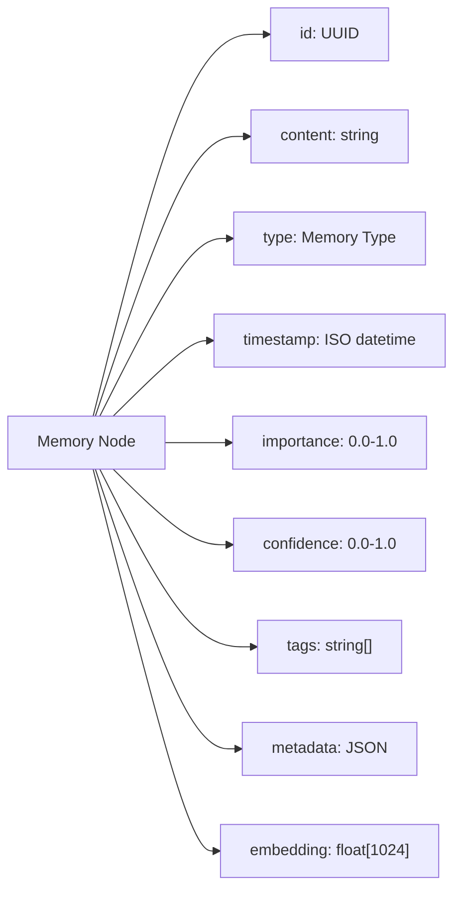
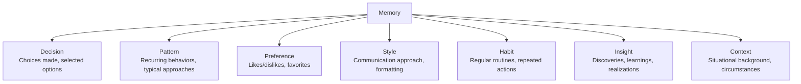
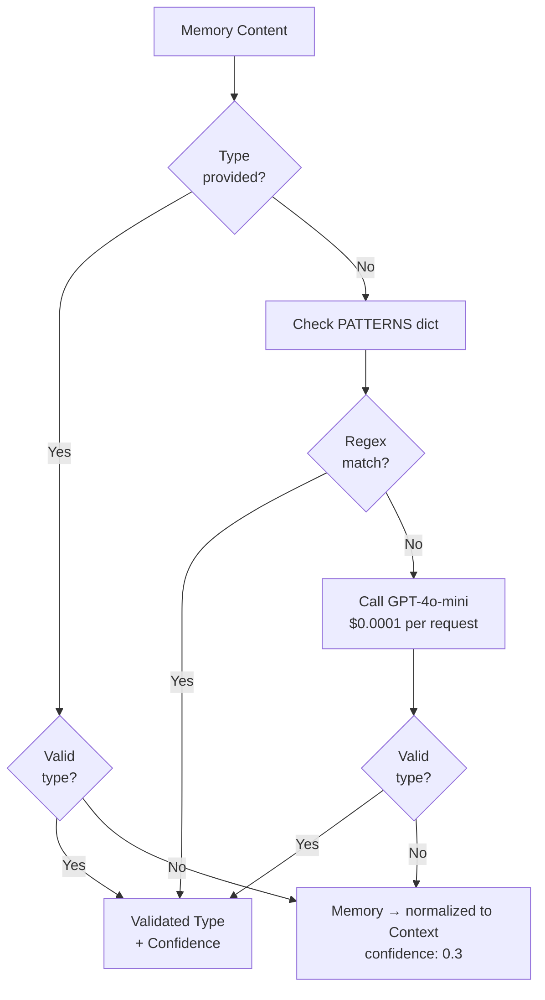
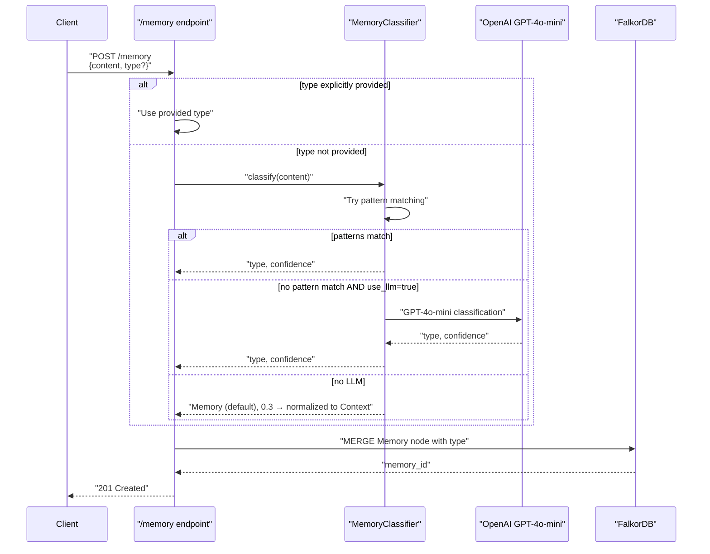
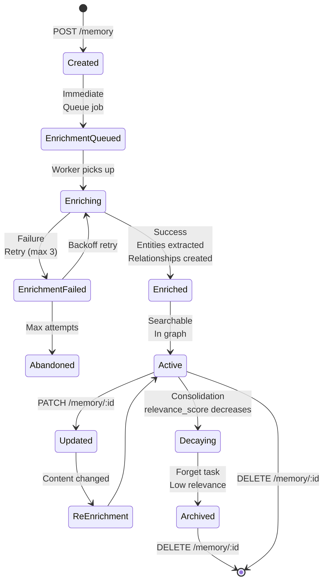
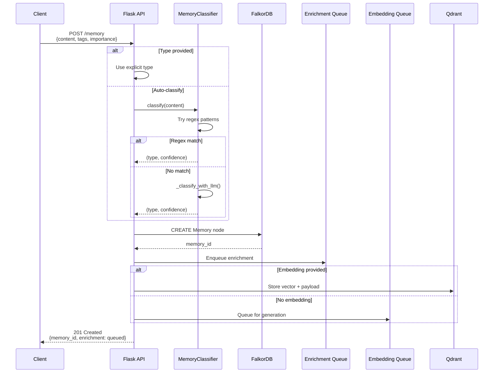

:::note[Source files]
Key implementation files:
- `automem/utils/validation.py` — Memory schema and validation
- `automem/classification/memory_classifier.py` — Classification system
- `automem/api/memory.py` — Memory lifecycle and storage
- [consolidation.py#L1-L100](https://github.com/verygoodplugins/automem/blob/main/consolidation.py#L1-L100) — State properties
:::

This page describes the complete data model for memories in AutoMem, including their structure, properties, classification taxonomy, and storage representation. For information about how memories relate to each other, see [Relationship Types](/docs/core-concepts/relationship-types/). For details on how memories are searched and retrieved, see [Hybrid Search](/docs/core-concepts/hybrid-search/).

---

## Overview

Every memory in AutoMem is a structured data object with both required and optional properties. Memories are classified into specific types (Decision, Pattern, Preference, etc.), enriched with metadata, and stored redundantly in both FalkorDB (graph) and Qdrant (vector) databases. The memory model supports temporal validity windows, confidence scoring, and hierarchical tag organization.



---

## Memory Schema

### Core Properties

All memories contain the following properties:

| Property | Type | Required | Description |
|---|---|---|---|
| `id` | string (UUID) | Yes | Unique identifier, auto-generated if not provided |
| `content` | string | Yes | The actual memory text (minimum 1 character) |
| `type` | string | Yes | Classification from `MEMORY_TYPES` set |
| `confidence` | float | Yes | Classification confidence score (0.0-1.0) |
| `importance` | float | Yes | User-specified or derived importance (0.0-1.0, default: 0.5) |
| `timestamp` | string (ISO 8601) | Yes | When the memory was created or occurred |
| `tags` | array[string] | No | Hierarchical categorization tags (e.g., `["project:automem", "decision"]`) |
| `tag_prefixes` | array[string] | No | Pre-computed lowercase tag prefixes for fast filtering |
| `metadata` | object | No | Flexible JSON object for custom fields |
| `embedding` | array[float] | No | 1024-dimensional vector for semantic search |

### Temporal Properties

| Property | Type | Required | Description |
|---|---|---|---|
| `t_valid` | string (ISO 8601) | No | When this memory becomes valid (future-dated memories) |
| `t_invalid` | string (ISO 8601) | No | When this memory expires or becomes invalid |
| `updated_at` | string (ISO 8601) | Yes | Last modification timestamp |
| `last_accessed` | string (ISO 8601) | Yes | Last retrieval or access timestamp |

### Enrichment Properties

| Property | Type | Description |
|---|---|---|
| `enriched_at` | string (ISO 8601) | When enrichment pipeline processed this memory |
| `enrichment_attempts` | integer | Number of enrichment attempts (max 3) |
| `summary` | string | Auto-generated summary (first sentence, max 240 chars) |
| `entities` | object | Extracted entities: `tools`, `projects`, `people`, `concepts`, `organizations` |

### State Properties

| Property | Type | Description |
|---|---|---|
| `archived` | boolean | Whether memory is archived (excluded from search by default) |
| `relevance_score` | float | Dynamic score computed by consolidation engine |

---

## Memory Type Taxonomy

AutoMem classifies all memories into one of seven semantic types. The classification system is defined in `MEMORY_TYPES`:

### Type Definitions



| Type | Description | Example Content |
|---|---|---|
| `Decision` | Strategic or technical choices, selected options | "Chose PostgreSQL over MongoDB for ACID compliance" |
| `Pattern` | Recurring behaviors, typical approaches, consistent tendencies | "Usually write integration tests before deploying" |
| `Preference` | Likes/dislikes, favorites, personal or team tastes | "Prefer async/await over callbacks for clarity" |
| `Style` | Communication approach, formatting preferences, tone | "Write commit messages in imperative mood" |
| `Habit` | Regular routines, repeated actions, scheduled activities | "Run pytest every morning before starting work" |
| `Insight` | Discoveries, learnings, realizations, key findings | "Realized embedding batching reduces costs by 40%" |
| `Context` | Situational background, circumstances, what was happening | "During database migration sprint in Q3 2024" |

:::caution
`"Memory"` is the internal fallback type returned by the classifier when LLM is unavailable and no regex pattern matches (confidence: 0.3). It is not a valid canonical type — it is immediately normalized to `"Context"` via `TYPE_ALIASES` during storage. Stored memories will always have one of the seven canonical types listed above.
:::

---

## Classification System

### Architecture

AutoMem employs a hybrid classification system that balances speed, cost, and accuracy:

1. **Explicit Type** (preferred): Client provides `type` field in POST request
2. **Regex Pattern Matching** (fast, free): Checks content against predefined patterns
3. **LLM Fallback** (accurate, ~$0.02/month): Uses GPT-4o-mini when patterns don't match



### Pattern-Based Classification

The `MemoryClassifier` class defines regex patterns for each memory type:

| Type | Example Patterns |
|---|---|
| `Decision` | `r"decided to"`, `r"chose (\w+) over"`, `r"going with"`, `r"opted for"` |
| `Pattern` | `r"usually"`, `r"typically"`, `r"tend to"`, `r"often"`, `r"consistently"` |
| `Preference` | `r"prefer"`, `r"like.*better"`, `r"favorite"`, `r"rather than"` |
| `Style` | `r"wrote.*in.*style"`, `r"communicated"`, `r"formatted as"` |
| `Habit` | `r"always"`, `r"every time"`, `r"daily"`, `r"weekly"`, `r"routine"` |
| `Insight` | `r"realized"`, `r"discovered"`, `r"learned that"`, `r"figured out"` |
| `Context` | `r"during"`, `r"while working on"`, `r"in the context of"`, `r"when"` |

**Confidence Calculation:**

- Base confidence: `0.6` for single pattern match
- Boost: `+0.1` for each additional pattern match (max `0.95`)

### LLM Classification

When regex patterns don't match (approximately 30% of cases), the system falls back to GPT-4o-mini:

**System Prompt Structure:**

```
You are a memory classification system. Classify each memory into exactly ONE of these types:
- Decision: Choices made, selected options, what was decided
- Pattern: Recurring behaviors, typical approaches, consistent tendencies
- Preference: Likes/dislikes, favorites, personal tastes
- Style: Communication approach, formatting, tone used
- Habit: Regular routines, repeated actions, schedules
- Insight: Discoveries, learnings, realizations, key findings
- Context: Situational background, what was happening, circumstances

Return JSON with: {"type": "<type>", "confidence": <0.0-1.0>}
```

**Request Format:**

- Model: `gpt-4o-mini`
- Temperature: `0.3` (deterministic)
- Max tokens: `50`
- Response format: JSON object
- Input limit: First 1000 characters of content

**Validation:**

- Returned type must exist in `MEMORY_TYPES`
- Invalid types fall back to `"Memory"` with confidence `0.3`, which is then normalized to `"Context"` via `TYPE_ALIASES` during storage

:::tip
Cost is approximately **$0.02/month** at 10 memories/day requiring LLM classification.
:::

The full classification sequence, including how POST /memory decides between explicit type, regex, and LLM:



---

## Temporal Validity Model

Memories support optional temporal validity windows:

### Validity Properties

| Property | Purpose | Use Case |
|---|---|---|
| `t_valid` | Earliest time this memory is valid | Future-dated reminders, scheduled knowledge |
| `t_invalid` | Latest time this memory is valid | Expiring credentials, time-bound decisions |

### Query Behavior

By default, `/recall` excludes memories where:

- `now < t_valid` (not yet valid)
- `now >= t_invalid` (expired)

**Override:** Use `time_query` or explicit `start`/`end` parameters to include expired memories.

**Example Scenarios:**

1. **Future-dated memory:** Set `t_valid` to a future date — the memory is not searchable until that date arrives.
2. **Expiring credential:** Set `t_invalid` to an expiry date — the memory is automatically excluded from search after that date.

---

## Metadata Structure

The `metadata` field is a flexible JSON object for storing arbitrary key-value pairs. Common patterns:

### Enrichment Metadata

Automatically added by the enrichment pipeline:

| Field | Type | Description |
|---|---|---|
| `metadata.enriched_at` | string | ISO timestamp of enrichment |
| `metadata.enrichment_attempts` | integer | Retry count (max 3) |
| `metadata.summary` | string | Auto-generated summary |
| `metadata.entities` | object | Extracted entities by category |

The `metadata.entities` object is structured by entity category:

```json
{
  "entities": {
    "tools": ["pytest", "docker"],
    "projects": ["automem"],
    "people": ["sarah"],
    "concepts": ["embedding", "vector search"],
    "organizations": ["OpenAI"]
  }
}
```

### Reserved Fields

The following fields are **reserved** and should not be placed in `metadata` (they are top-level properties):

- `type`, `confidence`, `content`, `timestamp`, `tags`, `tag_prefixes`
- `importance`, `embedding`, `id`, `archived`, `relevance_score`
- `t_valid`, `t_invalid`, `updated_at`, `last_accessed`

---

## Storage Representation

### FalkorDB (Graph Database)

Memories are stored as nodes with the `Memory` label. Node properties directly map to the memory schema:

**Graph Features:**

- Relationships connect memories (see [Relationship Types](/docs/core-concepts/relationship-types/))
- Cypher queries enable graph traversal
- Indexes on `tags`, `tag_prefixes`, `timestamp`, `importance`

### Qdrant (Vector Database)

Memories are stored as points with payloads mirroring FalkorDB properties:

**Qdrant Features:**

- Keyword indexes on `tags` and `tag_prefixes` for fast filtering
- HNSW index on vectors for approximate nearest neighbor search
- Payload filters support complex boolean queries

**Dual Storage Strategy:**

- FalkorDB is the **source of truth** (required)
- Qdrant is **optional** but enables semantic search
- Data is written to both databases synchronously
- Qdrant can rebuild FalkorDB if graph data is lost

:::note
If Qdrant is unavailable, the system gracefully degrades to graph-only search mode. Vector similarity scoring is disabled but keyword and graph traversal continue to work.
:::

---

## Memory Lifecycle



### Lifecycle Stages

1. **Created** (`POST /memory`):
   - Memory written to FalkorDB
   - Embedding queued for generation
   - Enrichment job queued
   - Returns `201 Created` immediately

2. **Enrichment Queued**:
   - Job added to in-memory queue
   - Worker thread polls queue every 2 seconds
   - Max 3 enrichment attempts with exponential backoff

3. **Enriching**:
   - Entity extraction (spaCy NER + regex)
   - Temporal links created (`OCCURRED_BEFORE`)
   - Semantic neighbors found (`SIMILAR_TO`)
   - Pattern detection (`EXEMPLIFIES`)
   - Summary generation (optional)

4. **Active**:
   - Fully searchable via `/recall`
   - Included in graph queries
   - Participates in consolidation

5. **Decaying**:
   - `relevance_score` decreases exponentially
   - Decay rate: daily consolidation task (default interval: 86400s)
   - Formula: `relevance = base_score * exp(-0.01 * age_days)`

6. **Archived**:
   - Marked `archived: true`
   - Excluded from search by default
   - Can be restored or deleted

7. **Deleted**:
   - Removed from both FalkorDB and Qdrant
   - Relationships cleaned up
   - Irreversible operation

---

## Implementation Details

### Memory Creation Flow

The complete flow from client request through classification, storage, and queue submission:



---

## Validation Rules

### Content Validation

- **Minimum length:** 1 character (empty strings rejected)
- **Soft limit:** `MEMORY_CONTENT_SOFT_LIMIT` = 500 characters — content between 500–2000 chars triggers auto-summarization to a ~300 character target (when `MEMORY_AUTO_SUMMARIZE=true`)
- **Hard limit:** `MEMORY_CONTENT_HARD_LIMIT` = 2000 characters — content exceeding this is rejected with `400 Bad Request`
- **Encoding:** UTF-8

### Type Validation

- Must be one of: `Decision`, `Pattern`, `Preference`, `Style`, `Habit`, `Insight`, `Context`
- Case-sensitive
- Invalid types return `400 Bad Request` with valid options listed

### Confidence Validation

- Range: `0.0` to `1.0` (inclusive)
- Default: `0.9` if type explicitly provided, computed otherwise
- Non-numeric values rejected

### Importance Validation

- Range: `0.0` to `1.0` (inclusive)
- Default: `0.5`
- Used in search ranking and consolidation

### Tag Validation

- Array of strings or comma-separated string
- Normalized to lowercase
- Hierarchical prefixes auto-computed (e.g., `"project:automem:api"` → `["project", "project:automem", "project:automem:api"]`)
- Empty tags filtered out

### Timestamp Validation

- Must be ISO 8601 format
- Automatically converted to UTC with `+00:00` timezone
- Strings ending in `Z` converted to `+00:00`
- Invalid timestamps return `400 Bad Request`

### Embedding Validation

- Must be exactly 1024 dimensions
- All values must be numeric
- Auto-generated if omitted (OpenAI `text-embedding-3-small` or deterministic placeholder)
