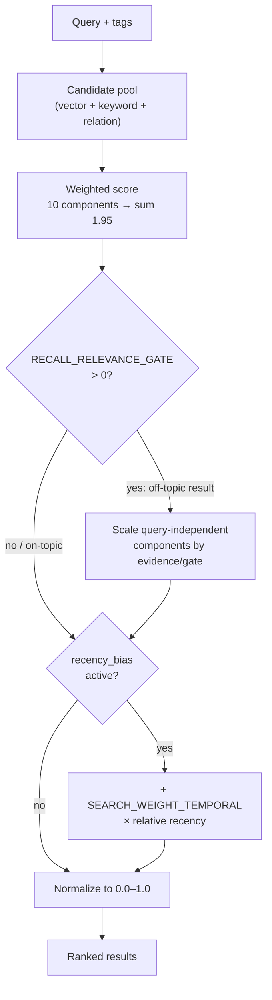

:::note[Source files]
Key implementation files:
- [automem/config.py](https://github.com/verygoodplugins/automem/blob/0720da2/automem/config.py) — All ranking weights and tuning knobs (with inline rationale)
- [automem/utils/scoring.py](https://github.com/verygoodplugins/automem/blob/0720da2/automem/utils/scoring.py) — Score computation
- [automem/api/recall.py](https://github.com/verygoodplugins/automem/blob/0720da2/automem/api/recall.py) — Recall endpoint orchestration and re-rank
- [automem/search/**](https://github.com/verygoodplugins/automem/tree/0720da2/automem/search) — Vector, keyword, and relation search
:::

AutoMem ships with a ranking pipeline that works well out of the box — every knob on this page defaults to *no behavior change* from prior releases. This guide is for operators who want to **tune** recall for a specific corpus: bias toward freshness, tighten a tag-scoped pool against off-topic memories, or adjust how much structured metadata and relationships contribute.

For *how* the score is computed (the 10 weighted components and the merge/rank flow), read [Hybrid Search](/docs/core-concepts/hybrid-search/) first — this page assumes that model. For the request-time parameters (`recency_bias`, `state_mode`, `min_score`), see [Recall Operations](/docs/reference/api/recall-operations/). For the full variable list with defaults, see [Configuration Reference](/docs/reference/configuration/).

Introduced across AutoMem **v0.16.0**. All knobs are environment variables read at startup; several also expose a per-request override on `/recall`.

---

## The ranking pipeline at a glance

Three stages are tunable independently: the **component weights** (what evidence counts and how much), the **relevance gate** (a within-pool guard against off-topic-but-important memories), and the **recency re-rank** (an optional freshness bias on top of the base score).

---

## Component weights

The base score is a weighted sum of ten components. Defaults (relative contributions, summing to 1.95, then normalized to `[0.0, 1.0]`):

| Weight variable | Default | Contribution |
| --- | --- | --- |
| `SEARCH_WEIGHT_VECTOR` | `0.35` | Semantic similarity (Qdrant) |
| `SEARCH_WEIGHT_KEYWORD` | `0.35` | Lexical match |
| `SEARCH_WEIGHT_METADATA` | `0.35` | Structured metadata field match |
| `SEARCH_WEIGHT_RELATION` | `0.25` | Graph relationship strength |
| `SEARCH_WEIGHT_TAG` | `0.20` | Tag-filter overlap |
| `SEARCH_WEIGHT_EXACT` | `0.20` | Exact-phrase boost |
| `SEARCH_WEIGHT_RECENCY` | `0.10` | Age decay (see below) |
| `SEARCH_WEIGHT_IMPORTANCE` | `0.10` | User-assigned importance |
| `SEARCH_WEIGHT_CONFIDENCE` | `0.05` | Classification certainty |
| `SEARCH_WEIGHT_RELEVANCE` | `0.00` | Context-profile bonus (opt-in via `context_tags`) |

Raise a weight to make that signal dominate; lower it to mute noise. The weights are *relative* — changing one shifts the balance, and the sum is renormalized, so you rarely need to rescale the others.

---

## Recency: age decay vs. relative re-rank

AutoMem has **two** independent freshness mechanisms. Don't confuse them:

### 1. Age decay (always on)
`SEARCH_WEIGHT_RECENCY` (`0.10`) contributes an absolute age-decay score to every result. Its shape is set by:

| Variable | Default | Notes |
| --- | --- | --- |
| `SEARCH_RECENCY_WINDOW_DAYS` | `180` | Decay window. Non-positive values fall back to 180. |
| `SEARCH_RECENCY_CURVE` | `linear` | `linear` → score reaches 0 at the window edge; `exp` → the window acts as a half-life. Invalid values fall back to `linear`. |

Use `exp` when recent memories should stay strongly ranked well inside the window but old ones shouldn't hit exactly zero; use a shorter window for fast-moving corpora.

### 2. Relative recency re-rank (opt-in)
A separate, post-scoring re-rank (issues #158/#159). When active, candidate timestamps are min-max normalized **across the current candidate set** and `SEARCH_WEIGHT_TEMPORAL` × that relative recency is added to each final score.

| Variable | Default | Notes |
| --- | --- | --- |
| `RECALL_RECENCY_BIAS` | `off` | `off` never re-ranks; `on` always; `auto` only when the query expresses temporal intent ("latest", "current", …). Invalid values fall back to `off`. |
| `SEARCH_WEIGHT_TEMPORAL` | `0.10` | Re-rank bonus weight. **Inert** unless the re-rank runs. |

The re-rank is **inert by default** — `SEARCH_WEIGHT_TEMPORAL` changes nothing until `RECALL_RECENCY_BIAS` is `on`/`auto` or a request passes the `recency_bias` param. Set `RECALL_RECENCY_BIAS=auto` to make "what's the latest…" style queries prefer fresh memories without penalizing topical queries.

---

## The relevance gate

`RECALL_RELEVANCE_GATE` (default `0.0` = disabled) addresses [issue #130](https://github.com/verygoodplugins/automem/issues/130): a high-importance but **off-topic** memory riding query-independent score (importance, confidence, recency, tag overlap) to the top of a tag-scoped pool.

When the gate is set and a result's best query-topical evidence — the max of its vector, keyword, metadata, and exact-match components — falls **below** the threshold, the query-independent components are scaled by `evidence / gate`. This is a **linear ramp, not a cliff**: a barely-relevant result is dampened a little, a wholly off-topic one a lot. The context bonus is never gated, so `context_tags` remains the explicit soft-boost channel.

- `0.0` — disabled; legacy scoring exactly.
- `~0.15–0.25` — a gentle guard that keeps obviously off-topic memories out of the top of a scoped pool.
- Values are clamped to `[0.0, 1.0]`.

Reach for the gate when tag-scoped recall surfaces importance-inflated memories that don't match the query. Leave it at `0.0` for open, query-only recall where every candidate is already topical.

---

## Vector candidate pool

Vector search fetches more candidates than the response `limit` so hybrid re-ranking can promote memories with strong importance, tag, or exact-match signals that rank slightly lower on raw cosine similarity.

| Variable | Default | Notes |
| --- | --- | --- |
| `RECALL_VECTOR_OVERFETCH` | `4` | Multiplier on `limit` for the vector fetch pool. `1` restores legacy 1× behavior. |
| `RECALL_VECTOR_FETCH_CAP` | `200` | Hard ceiling on fetched vector candidates, kept separate from `RECALL_MAX_LIMIT`. |

If recall misses high-importance exact-topic memories that vector search ranks just outside the top-K, try raising `RECALL_VECTOR_OVERFETCH` before changing score weights.

---

## Internal artifact types

Consolidation creates internal `MetaPattern` cluster summaries that should not appear in user-facing recall. These are filtered by `RECALL_EXCLUDED_TYPES` (default `MetaPattern`, comma-separated). The same set is excluded from `/health` memory/vector counts and `/admin/sync` drift accounting.

Add types here only for other internal artifacts you create programmatically and never want ranked in `/recall`.

---

## Tag-score normalization

`SEARCH_TAG_SCORE_TOKEN_CAP` (default `0` = disabled) caps the denominator used to normalize tag-overlap scores, so long queries aren't penalized relative to short ones. `0` selects the legacy denominator (full query length).

**Leave this at `0` unless you have measured otherwise.** A production-corpus A/B (2026-06-11, 200 queries against a 10k-memory clone) showed cap values of 2/3/4 regress Recall@5 by 14/7/4 percentage points on ungated queries — the capped denominator inflates tag scores and amplifies tag noise over vector/keyword evidence. The knob exists for corpora with unusually terse queries and disciplined tagging; it is opt-in for a reason.

---

## Consolidation clustering

The background consolidation pass groups near-duplicate memories into clusters. Two knobs control cluster formation:

| Variable | Default | Notes |
| --- | --- | --- |
| `CONSOLIDATION_CLUSTER_SIMILARITY_THRESHOLD` | `0.75` | Minimum cosine similarity for a memory to join a cluster. Higher = tighter, fewer clusters. |
| `CONSOLIDATION_MIN_CLUSTER_SIZE` | `3` | Minimum members before a cluster is formed. |

Raise the similarity threshold if unrelated memories are being clustered; lower `CONSOLIDATION_MIN_CLUSTER_SIZE` to consolidate more aggressively on smaller corpora. See [Consolidation & Decay](/docs/core-concepts/consolidation/) for the full lifecycle.

---

## A tuning recipe

1. **Start at defaults.** They are the benchmarked configuration; change one thing at a time.
2. **Freshness matters?** Set `RECALL_RECENCY_BIAS=auto` first (targets temporal queries only). Escalate to `on` + a higher `SEARCH_WEIGHT_TEMPORAL` only if that's not enough. For absolute age decay, shorten `SEARCH_RECENCY_WINDOW_DAYS` or switch to `exp`.
3. **Off-topic memories in scoped pools?** Introduce `RECALL_RELEVANCE_GATE` at ~`0.2` and adjust.
4. **Metadata/relationships under- or over-weighted?** Nudge `SEARCH_WEIGHT_METADATA` / `SEARCH_WEIGHT_RELATION`.
5. **Measure.** Use the recall lab and `scripts/audit_relevance.py` before and after — tuning by feel regresses quietly.

All values are read at startup; restart the service after changing them.
