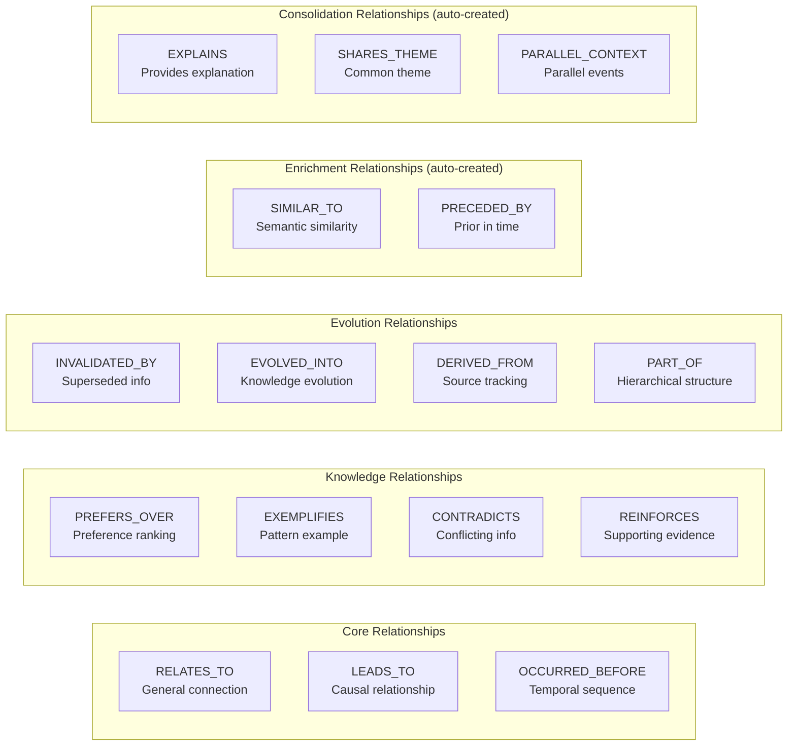
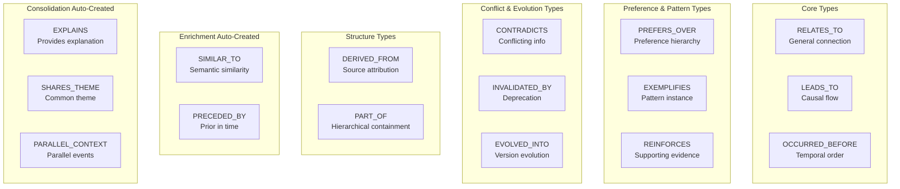
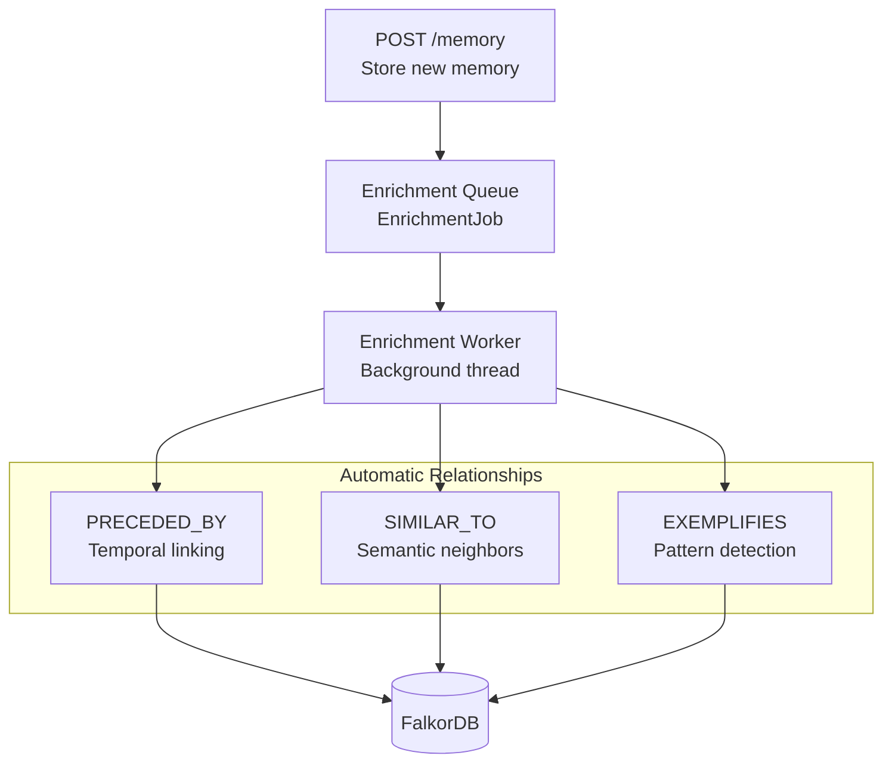
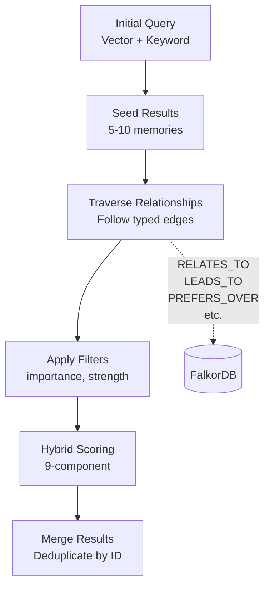

:::note[Source files]
Key implementation files:
- [automem/config.py](https://github.com/verygoodplugins/automem/blob/main/automem/config.py) — `ALLOWED_RELATIONS` and `RELATIONSHIP_TYPES` constants
- [app.py#L125](https://github.com/verygoodplugins/automem/blob/main/app.py#L125) — Relationship type imports and validation
- [app.py#L1051-L1180](https://github.com/verygoodplugins/automem/blob/main/app.py#L1051-L1180) — Enrichment worker (automatic relationship creation)
- [automem/stores/graph_store.py](https://github.com/verygoodplugins/automem/blob/main/automem/stores/graph_store.py) — Cypher query construction
- [automem/api/recall.py](https://github.com/verygoodplugins/automem/blob/main/automem/api/recall.py) — `_expand_related_memories` function
- [tests/test_api_endpoints.py#L939-L1004](https://github.com/verygoodplugins/automem/blob/main/tests/test_api_endpoints.py#L939-L1004) — Relationship type tests
:::

This page documents the 16 typed relationship edges that AutoMem uses to connect Memory nodes in the FalkorDB graph database. These relationships enable multi-hop reasoning, knowledge graph traversal, and semantic connections between memories.

For information about creating relationships via the API, see [Relationship Operations](/docs/reference/api/relationships/). For details on how relationships influence recall scoring, see [Hybrid Search](/docs/core-concepts/hybrid-search/).

---

## Overview

AutoMem implements **16 distinct relationship types** that connect Memory nodes in the graph database. Unlike traditional vector databases that only support similarity-based retrieval, typed relationships enable:

- **Causal reasoning** — Understanding why decisions were made and what they led to
- **Temporal sequencing** — Tracking how knowledge evolved over time
- **Preference modeling** — Recording what approaches are preferred and why
- **Pattern reinforcement** — Connecting examples to recurring patterns
- **Conflict resolution** — Marking outdated or contradictory information
- **Hierarchical organization** — Structuring memories into logical groupings

Each relationship type carries semantic meaning that influences graph traversal, recall scoring, and consolidation behavior.



---

## Relationship Type Taxonomy

### Core Relationship Types

The three foundational relationship types provide general-purpose connectivity:

| Type | Semantic Meaning | Direction | Use Case |
|---|---|---|---|
| `RELATES_TO` | General semantic connection | Bidirectional | Linking related concepts, cross-referencing memories |
| `LEADS_TO` | Causal relationship | Directional | Problem→Solution, Decision→Outcome |
| `OCCURRED_BEFORE` | Temporal precedence | Directional | Event sequencing, chronological ordering |

### Enhanced PKG Relationship Types

Eight additional types inspired by Personal Knowledge Graph research enable richer semantic modeling:

| Type | Semantic Meaning | Direction | Properties | Use Case |
|---|---|---|---|---|
| `PREFERS_OVER` | Preference/prioritization | Directional | `context`, `strength`, `reason` | Tool selection, methodology choices |
| `EXEMPLIFIES` | Pattern instantiation | Directional | `pattern_type`, `confidence` | Linking specific examples to patterns |
| `CONTRADICTS` | Conflicting information | Bidirectional | `resolution`, `reason` | Marking outdated approaches |
| `REINFORCES` | Supporting evidence | Directional | `strength`, `observations` | Strengthening patterns with evidence |
| `INVALIDATED_BY` | Supersession | Directional | `reason`, `timestamp` | Deprecating old information |
| `EVOLVED_INTO` | Knowledge evolution | Directional | `confidence`, `reason` | Tracking design iterations |
| `DERIVED_FROM` | Source attribution | Directional | `transformation`, `confidence` | Implementation from spec |
| `PART_OF` | Hierarchical containment | Directional | `role`, `context` | Feature→Epic, subtask→task |

### Enrichment Relationship Types (Auto-Created)

Two types are created automatically by the enrichment pipeline during background processing:

| Type | Semantic Meaning | Direction | Properties | Created By |
|---|---|---|---|---|
| `SIMILAR_TO` | Semantic similarity between memories | Bidirectional | `score`, `updated_at` | Enrichment pipeline (Qdrant similarity search) |
| `PRECEDED_BY` | Prior in time — new memory links to recent memories | Directional | `count`, `updated_at` | Enrichment pipeline (temporal linking) |

### Consolidation Relationship Types (Auto-Created)

Three types are created automatically by the consolidation engine's creative task:

| Type | Semantic Meaning | Direction | Properties | Created By |
|---|---|---|---|---|
| `EXPLAINS` | One memory provides explanation for another | Directional | `confidence`, `updated_at` | Consolidation creative task (Insight + Pattern) |
| `SHARES_THEME` | Two memories share a common theme | Bidirectional | `similarity`, `updated_at` | Consolidation creative task (cross-type similarity) |
| `PARALLEL_CONTEXT` | Memories represent parallel events or contexts | Bidirectional | `confidence`, `updated_at` | Consolidation creative task (same-week, low similarity) |

---

## Relationship Type Definitions



---

## Configuration and Validation

Relationship types are defined in `automem/config.py` and imported throughout the codebase:

The `ALLOWED_RELATIONS` constant contains all 16 valid relationship type strings, including the 11 manually-created types and the 5 auto-created types (`SIMILAR_TO`, `PRECEDED_BY`, `EXPLAINS`, `SHARES_THEME`, `PARALLEL_CONTEXT`). The API validates relationship types during association creation and rejects invalid types with a `400` error.

**Validation Flow:**

1. Client submits `POST /associate` with a `relation` field
2. API checks `relation` against `ALLOWED_RELATIONS`
3. If invalid, returns `400 Bad Request` with the list of valid types
4. If valid, executes Cypher `MERGE` in FalkorDB

---

## Relationship Properties

Relationships support optional properties that provide additional context and metadata. Properties are stored as edge attributes in the FalkorDB graph.

### Common Properties

All relationship types support these base properties:

| Property | Type | Description | Example |
|---|---|---|---|
| `strength` | Float (0.0-1.0) | Relationship confidence/weight | `0.9` for strong preference |
| `timestamp` | ISO datetime | When relationship was created | Auto-set by API |

### Type-Specific Properties

Enhanced relationship types support additional semantic properties:

| Relationship Type | Additional Properties | Example |
|---|---|---|
| `PREFERS_OVER` | `context`, `reason` | `{"context": "production", "reason": "Better performance"}` |
| `EXEMPLIFIES` | `pattern_type`, `confidence` | `{"pattern_type": "boring-tech", "confidence": 0.85}` |
| `CONTRADICTS` | `resolution`, `reason` | `{"resolution": "use-new-approach", "reason": "Security fix"}` |
| `REINFORCES` | `observations` | `{"observations": 5}` — number of supporting instances |
| `INVALIDATED_BY` | `reason` | `{"reason": "API deprecated in v2.0"}` |
| `EVOLVED_INTO` | `confidence`, `reason` | `{"confidence": 0.95, "reason": "Requirements changed"}` |
| `DERIVED_FROM` | `transformation`, `confidence` | `{"transformation": "code-generation"}` |
| `PART_OF` | `role`, `context` | `{"role": "authentication", "context": "login-feature"}` |
| `SIMILAR_TO` | `score`, `updated_at` | `{"score": 0.87, "updated_at": "2025-01-15T10:00:00Z"}` |
| `PRECEDED_BY` | `count`, `updated_at` | `{"count": 3, "updated_at": "2025-01-15T10:00:00Z"}` |
| `EXPLAINS` | `confidence`, `updated_at` | `{"confidence": 0.7, "updated_at": "2025-01-15T10:00:00Z"}` |
| `SHARES_THEME` | `similarity`, `updated_at` | `{"similarity": 0.82, "updated_at": "2025-01-15T10:00:00Z"}` |
| `PARALLEL_CONTEXT` | `confidence`, `updated_at` | `{"confidence": 0.5, "updated_at": "2025-01-15T10:00:00Z"}` |

---

## Creating Relationships

### Manual Creation via API

The `POST /associate` endpoint creates typed relationships between two Memory nodes:

**Endpoint:** `POST /associate`

**Request Body:**

```json
{
  "memory_id": "uuid-of-source-memory",
  "related_memory_id": "uuid-of-target-memory",
  "relation": "PREFERS_OVER",
  "properties": {
    "strength": 0.9,
    "context": "production deployments",
    "reason": "Better performance under load"
  }
}
```

**Response:**

```json
{
  "status": "associated",
  "relation": "PREFERS_OVER",
  "source_id": "uuid-of-source-memory",
  "target_id": "uuid-of-target-memory"
}
```

**Graph Query Pattern:**

The API executes a Cypher query to create the relationship in FalkorDB:

```cypher
MATCH (m1:Memory {id: $memory_id})
MATCH (m2:Memory {id: $related_memory_id})
MERGE (m1)-[r:PREFERS_OVER]->(m2)
SET r += $properties
```

---

## Automatic Relationship Creation

The enrichment pipeline automatically creates specific relationship types during background processing. This happens asynchronously after memory storage without blocking the API.



### PRECEDED_BY (Temporal Links)

The enrichment worker creates `PRECEDED_BY` relationships to recent memories within a time window:

- **Trigger:** Every enriched memory
- **Target:** Memories from the last 24 hours (configurable)
- **Direction:** New memory → Older memory
- **Properties:** `time_gap` (seconds between memories)

**Purpose:** Maintains conversation flow and temporal context for recall.

### SIMILAR_TO (Semantic Neighbors)

The enrichment worker queries Qdrant for semantically similar memories and creates bidirectional `SIMILAR_TO` relationships:

- **Trigger:** Every enriched memory with an embedding
- **Target:** Top N similar memories above threshold (default: 5 memories, 0.8 cosine similarity)
- **Direction:** Bidirectional (symmetric links)
- **Properties:** `similarity_score` (cosine similarity from Qdrant)

**Configuration:**

- `ENRICHMENT_SIMILARITY_LIMIT` — Maximum similar memories to link (default: 5)
- `ENRICHMENT_SIMILARITY_THRESHOLD` — Minimum cosine similarity (default: 0.8)

### EXEMPLIFIES (Pattern Links)

The enrichment worker detects recurring patterns across memory types and creates `EXEMPLIFIES` relationships:

- **Trigger:** Pattern detection during enrichment
- **Target:** Shared `Pattern` nodes (created if needed)
- **Direction:** Memory → Pattern node
- **Properties:** `key_terms` (list of pattern indicators), `confidence`

**Pattern Node Structure:**

```json
{
  "label": "Pattern",
  "pattern_type": "recurring-testing-behavior",
  "key_terms": ["pytest", "before deploying", "integration tests"],
  "confidence": 0.82
}
```

---

## Querying Relationships

### Graph Expansion During Recall

The `GET /recall` endpoint supports relationship traversal via the `expand_relations` parameter:



**Basic Expansion:**

```
GET /recall?query=postgres+performance&expand_relations=true
```

**Filtered Expansion:**

```
GET /recall?query=postgres+performance&expand_relations=true&expand_min_strength=0.7&expand_min_importance=0.5
```

**Parameters:**

- `expand_relations` (boolean) — Enable graph traversal
- `relation_limit` (int) — Max relationships per seed memory (default: 5)
- `expansion_limit` (int) — Total max expanded memories (default: 25)
- `expand_min_importance` (float) — Filter expanded memories by importance (0.0-1.0)
- `expand_min_strength` (float) — Filter relationships by strength (0.0-1.0)

### Expansion Algorithm

**Cypher Pattern for Expansion:**

```cypher
MATCH (seed:Memory {id: $seed_id})-[r]-(related:Memory)
WHERE related.archived IS NULL OR related.archived = false
  AND (r.strength IS NULL OR r.strength >= $min_strength)
  AND (related.importance IS NULL OR related.importance >= $min_importance)
RETURN related, type(r) as rel_type, r.strength as strength
ORDER BY strength DESC
LIMIT $relation_limit
```

---

## Relationship Type Usage Patterns

### Decision Modeling Pattern

Track decision-making with causal and preference relationships:

```
Memory A: "Evaluated PostgreSQL vs MongoDB"
  -[LEADS_TO]->
Memory B: "Chose PostgreSQL for ACID compliance"
  -[PREFERS_OVER {reason: "ACID compliance", context: "financial data"}]->
Memory C: "MongoDB evaluation notes"
```

**Graph Query:**

```cypher
MATCH (d:Memory {type: 'Decision'})-[r:LEADS_TO|PREFERS_OVER]->(outcome:Memory)
WHERE d.content CONTAINS 'database'
RETURN d, r, outcome
```

### Pattern Evolution Pattern

Track how patterns emerge and strengthen over time:

```
Memory A: "Used async/await in service A"
  -[EXEMPLIFIES {confidence: 0.7}]->
Pattern: "async-first development"

Memory B: "Used async/await in service B"
  -[EXEMPLIFIES {confidence: 0.85}]->
Pattern: "async-first development"

Memory B -[REINFORCES {observations: 2}]-> Memory A
```

### Conflict Resolution Pattern

Mark superseded information and track evolution:

```
Memory A: "Use callbacks for async operations"
  -[EVOLVED_INTO {reason: "Team adopted async/await standard"}]->
Memory B: "Use async/await for async operations"

Memory A -[CONTRADICTS {resolution: "use-async-await", reason: "Modern standard"}]-> Memory B
Memory A -[INVALIDATED_BY {reason: "Deprecated in v2.0 style guide"}]-> Memory B
```

---

## Relationship Scoring and Weights

During hybrid recall, relationships contribute to the final memory score through the **relation component** (25% weight by default):

**Relation Score Calculation:**

```
relation_score =
    incoming_strength × 0.50   # Memories pointed to by others
  + outgoing_strength × 0.30   # Memories pointing to others
  + type_diversity    × 0.20   # Number of distinct relationship types
```

**Factors:**

- Incoming relationship strength (50% of relation score)
- Outgoing relationship strength (30% of relation score)
- Relationship type diversity (20% of relation score)

**Configuration:**

- `SEARCH_WEIGHT_RELATION` (default: 0.25) — Relation component weight in hybrid scoring

:::tip
Higher-strength relationships and more diverse relationship types boost memory relevance during recall. A memory with 3 different relationship types scores higher than one with 3 identical relationship types at the same strength.
:::

---

## Code References

### Core Modules

- **Configuration:** [automem/config.py](https://github.com/verygoodplugins/automem/blob/main/automem/config.py) — Defines `ALLOWED_RELATIONS` and `RELATIONSHIP_TYPES` constants
- **API Endpoint:** [app.py](https://github.com/verygoodplugins/automem/blob/main/app.py) — `POST /associate` handler
- **Graph Store:** [automem/stores/graph_store.py](https://github.com/verygoodplugins/automem/blob/main/automem/stores/graph_store.py) — Cypher query construction for relationship creation
- **Recall Expansion:** [automem/api/recall.py](https://github.com/verygoodplugins/automem/blob/main/automem/api/recall.py) — `_expand_related_memories` function

### Enrichment Pipeline

- **Enrichment Worker:** [app.py#L1051-L1180](https://github.com/verygoodplugins/automem/blob/main/app.py#L1051-L1180) — Background worker that creates automatic relationships
- **Entity Extraction:** [app.py#L965-L1048](https://github.com/verygoodplugins/automem/blob/main/app.py#L965-L1048) — Extracts entities for pattern linking
- **Pattern Detection:** Embedded in enrichment worker loop

### Testing

- **Relationship Tests:** [tests/test_api_endpoints.py#L939-L1004](https://github.com/verygoodplugins/automem/blob/main/tests/test_api_endpoints.py#L939-L1004) — Tests all 16 relationship types
- **Integration Tests:** [tests/test_integration.py](https://github.com/verygoodplugins/automem/blob/main/tests/test_integration.py) — End-to-end relationship creation and querying
