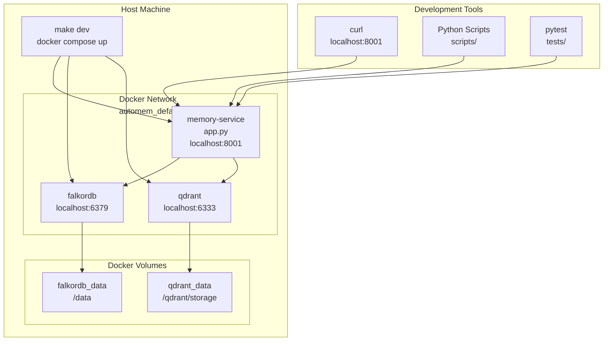

This page covers deploying AutoMem using Docker Compose for local development and self-hosted production environments. Docker Compose provides a complete, isolated stack with FalkorDB, Qdrant, and the Flask API running in containers with persistent volumes.

For cloud deployment on Railway, see [Railway Deployment](/docs/deployment/railway/). For environment variable reference across all deployment types, see the [Configuration Reference](/docs/reference/configuration/).

## Service Architecture

Docker Compose orchestrates three services defined in [`docker-compose.yml`](https://github.com/verygoodplugins/automem/blob/4b5eaafd2602c9eba39bbfe38e4120e3654c67e9/docker-compose.yml): the Flask API, FalkorDB graph database (which includes its own browser UI on port 3000 for local graph inspection), and the Qdrant vector store.



### Service Details

| Service | Image/Build | Ports | Purpose | Health Check |
|---|---|---|---|---|
| `flask-api` | Built from Dockerfile | 8001 | AutoMem Flask API with background workers | None (depends on FalkorDB health) |
| `falkordb` | `falkordb/falkordb:latest` | 6379 (Redis), 3000 (UI) | Graph database (canonical memory storage) | `redis-cli ping` every 10s |
| `qdrant` | `qdrant/qdrant:v1.11.3` | 6333 (REST), 6334 (gRPC) | Vector search database (optional) | None (service_started) |

> **Local FalkorDB UI vs `/viewer`.** The FalkorDB browser at `http://localhost:3000` is the official local graph-inspection UI shipped inside the `falkordb` container. The `/viewer` path on the AutoMem API is the production entrypoint — it redirects to the standalone [`automem-graph-viewer`](https://github.com/verygoodplugins/automem-graph-viewer) app when `GRAPH_VIEWER_URL` is set, and does not serve a local UI. Note that the standalone viewer docs also use port `3000` by default, so if you run it locally alongside this Docker stack you should change its port (for example, `PORT=3001`) to avoid a conflict with FalkorDB's built-in UI.

## Volume Configuration

Docker Compose defines three named volumes for persistent data and one bind mount for source code. This ensures data survives container restarts and enables hot-reload during development.

### Volume Persistence Strategy

| Volume | Container Path | Purpose | Persistence Level | Backup Strategy |
|---|---|---|---|---|
| `falkordb_data` | `/data` | RDB snapshots + AOF (append-only file) | High (every 60s or 1 key change) | Export via `redis-cli SAVE` to `/backups` |
| `qdrant_data` | `/qdrant/storage` | Vector collections + write-ahead log | High (write-ahead log) | Export via Qdrant API to `/backups` |
| `fastembed_models` | `/root/.config/automem/models` | Downloaded ONNX embedding models | Medium (cache, re-downloadable) | Not backed up (excluded in .gitignore) |
| `.` (bind mount) | `/app` | Source code for hot-reload | N/A (host filesystem) | Git repository |
| `./backups/falkordb` | `/backups` | Manual RDB exports | N/A (host filesystem) | Excluded in .gitignore |
| `./backups/qdrant` | `/backups` | Manual snapshot exports | N/A (host filesystem) | Excluded in .gitignore |

### FalkorDB Persistence Configuration

FalkorDB runs with aggressive persistence enabled via `REDIS_ARGS`:

- `--save 60 1`: Create RDB snapshot every 60 seconds if at least 1 key changed
- `--appendonly yes`: Enable AOF (append-only file) for durability
- `--appendfsync everysec`: Sync AOF to disk every second

The persistence directory is set separately via `FALKORDB_DATA_PATH=/data` (not a `REDIS_ARGS` flag) — FalkorDB's startup script always appends `--dir $FALKORDB_DATA_PATH` after `REDIS_ARGS`, so a `--dir` flag inside `REDIS_ARGS` itself would be silently overridden.

This configuration prioritizes data safety over performance, suitable for development where memory operations should not be lost on container restart.

## Environment Variables

The Flask API service accepts environment variables for configuration. Most have sensible defaults for local development.

### Required Environment Variables

| Variable | Docker Compose Default | Purpose | Notes |
|---|---|---|---|
| `PORT` | `8001` | Flask API port | Must match container port mapping |
| `AUTOMEM_API_TOKEN` | `${AUTOMEM_API_TOKEN:-test-token}` | Client authentication | Set via shell or `.env` |
| `ADMIN_API_TOKEN` | `${ADMIN_API_TOKEN:-test-admin-token}` | Admin endpoint authentication | Set via shell or `.env` |
| `FALKORDB_HOST` | `falkordb` | FalkorDB service name | Docker internal DNS resolution |
| `FALKORDB_PORT` | `6379` | FalkorDB port | Standard Redis port |

### Optional Configuration (with defaults)

| Variable | Docker Compose Default | Purpose | Notes |
|---|---|---|---|
| `FLASK_ENV` | `development` | Flask environment mode | Enables debug mode, hot-reload |
| `FLASK_DEBUG` | `"1"` | Flask debug flag | Enables detailed error pages |
| `FALKORDB_PASSWORD` | `${FALKORDB_PASSWORD:-}` | FalkorDB authentication | Empty by default (no auth) |
| `QDRANT_URL` | `http://qdrant:6333` | Qdrant endpoint | Docker internal URL |
| `QDRANT_API_KEY` | `${QDRANT_API_KEY:-}` | Qdrant authentication | Not required for local Qdrant |
| `OPENAI_API_KEY` | `${OPENAI_API_KEY:-}` | OpenAI API access | Falls back to placeholder embeddings |
| `VOYAGE_API_KEY` | `${VOYAGE_API_KEY:-}` | Voyage AI API access | Used when `EMBEDDING_PROVIDER=voyage` or auto-selected |
| `EMBEDDING_PROVIDER` | `${EMBEDDING_PROVIDER:-auto}` | Provider selection | `auto|openai|voyage|local|placeholder` |
| `VECTOR_SIZE` | `1024` | Embedding vector dimension | Must match the selected provider's output dimension |
| `AUTOMEM_MODELS_DIR` | `/root/.config/automem/models` | FastEmbed model cache | Must match volume mount path |
| `MEMORY_CONTENT_HARD_LIMIT` | `2000` | Max memory content length (chars) | Content over this is rejected |
| `MEMORY_AUTO_SUMMARIZE` | `true` | Auto-summarize oversized content | Set `false` to disable |
| `QDRANT_TIMEOUT_SECONDS` | `${QDRANT_TIMEOUT_SECONDS:-}` | Qdrant client request timeout | Empty by default (client library default applies) |
| `QDRANT_ENSURE_PAYLOAD_INDEXES` | `true` | Create Qdrant payload indexes at startup | Set `false` to skip |

### Accessing Variables

Environment variables can be set three ways (in order of precedence):

1. **Process environment**: `export OPENAI_API_KEY=sk-...` before running `docker compose up`
2. **`.env` file**: Create `.env` in project root with `OPENAI_API_KEY=sk-...`
3. **Docker Compose defaults**: Fallback values in `docker-compose.yml`

## Service Dependencies and Health Checks

Docker Compose manages startup order and readiness using `depends_on` conditions and health checks. This prevents the Flask API from attempting to connect to FalkorDB before it's ready.

**Health Check Details**

FalkorDB is the only service with a health check defined:

- **Test command**: `redis-cli ping` (expects `PONG` response)
- **Interval**: Check every 10 seconds
- **Timeout**: Fail if command doesn't respond within 5 seconds
- **Retries**: Attempt 5 times before marking unhealthy
- **Initial delay**: No explicit `start_period`, begins checking immediately

The Flask API waits for `condition: service_healthy`, ensuring FalkorDB is accepting connections before the API attempts to connect.

Qdrant uses `condition: service_started`, meaning the Flask API starts as soon as the Qdrant container starts (not waiting for full initialization). The API handles Qdrant connection failures gracefully via the graceful degradation pattern — Qdrant being unavailable results in `"qdrant": "not_configured"` in `/health` but does not prevent the service from running.

## Networking

Docker Compose creates an isolated network where services communicate using service names as hostnames. External clients access the Flask API via localhost port mapping.

### Port Mappings

| Container Port | Host Port | Service | Protocol | Purpose |
|---|---|---|---|---|
| 8001 | 8001 | flask-api | HTTP | AutoMem REST API |
| 6379 | 6379 | falkordb | TCP (Redis protocol) | FalkorDB graph queries |
| 3000 | 3000 | falkordb | HTTP | FalkorDB built-in web UI |
| 6333 | 6333 | qdrant | HTTP | Qdrant vector search API |
| 6334 | 6334 | qdrant | gRPC | Qdrant vector search API (gRPC) |

### Internal DNS Resolution

Flask API connects to dependencies using service names:

- `FALKORDB_HOST=falkordb` resolves to the `falkordb` container's internal IP
- `QDRANT_URL=http://qdrant:6333` resolves to the `qdrant` container's internal IP

Docker Compose automatically creates a DNS entry for each service name on the `automem_default` bridge network. This differs from Railway's `.railway.internal` hostnames (see [Railway Deployment](/docs/deployment/railway/)).

## Development Workflow

The Makefile provides commands for common Docker Compose operations. These commands handle container lifecycle, testing, and cleanup.

### Makefile Commands Reference

| Command | Underlying Action | Purpose | Data Loss Risk |
|---|---|---|---|
| `make dev` | `docker compose up --build` | Start all services, rebuild images if Dockerfile changed | None |
| `make stop` | `docker compose down` | Stop containers, preserve volumes | None |
| `make logs` | `docker compose logs -f flask-api` | Follow Flask API logs in real-time | None |
| `make test-integration` | Start services, run `pytest -rs -m integration`, keep running | Run integration test suite against local Docker stack | None (uses test tokens) |
| `make clean` | `docker compose down -v` | Stop containers, remove volumes | **High** — deletes all memory data |

### Starting Services

```bash
make dev
```

The `--build` flag ensures the Flask API image is rebuilt if `Dockerfile` or `requirements.txt` changed.

### Viewing Logs

```bash
make logs
# or for all services:
docker compose logs -f
```

### Running Integration Tests

The `make test-integration` command orchestrates a full test run:

1. Starts Docker Compose with test tokens (`AUTOMEM_API_TOKEN=test-token`, `ADMIN_API_TOKEN=test-admin-token`)
2. Waits 5 seconds for service initialization
3. Runs pytest with `AUTOMEM_RUN_INTEGRATION_TESTS=1` environment variable
4. Leaves services running for debugging

### Stopping and Cleanup

```bash
# Stop containers, preserve data volumes:
docker compose down

# Stop containers AND delete all data volumes:
make clean
```

:::caution[`make clean` deletes data]
`make clean` runs `docker compose down -v` which removes all named volumes. All stored memories will be permanently deleted.
:::

### Hot-Reload During Development

The Flask API container mounts the project directory as a volume, enabling hot-reload:

1. Edit any Python file in the project
2. Flask detects the change (via `FLASK_DEBUG=1`)
3. API automatically reloads within ~2 seconds
4. No need to restart containers

## Production Considerations

Docker Compose is optimized for development. Production deployments require security hardening, different persistence strategies, and monitoring.

### Development vs. Production Configuration

| Aspect | Docker Compose (Dev) | Production Recommendations |
|---|---|---|
| **Debug Mode** | `FLASK_DEBUG=1`, verbose logging | Disable debug, set `LOG_LEVEL=INFO` or `WARNING` |
| **API Tokens** | Defaults to `test-token`, `test-admin-token` | Generate cryptographically secure tokens (32+ chars) |
| **Port Exposure** | All ports mapped to localhost | Use reverse proxy (nginx, Traefik), expose only necessary ports |
| **Volume Backups** | Manual exports to `./backups/` | Automated backups to S3/remote storage (see [Backup & Recovery](/docs/operations/backup/)) |
| **Resource Limits** | Unlimited | Set `deploy.resources.limits` in docker-compose.yml |
| **Restart Policy** | `restart: unless-stopped` | Use `restart: always` with health checks |
| **FalkorDB Persistence** | Aggressive (`save 60 1`) | Balance between durability and performance |
| **SSL/TLS** | HTTP only | Terminate SSL at reverse proxy or use Traefik |
| **Monitoring** | Docker logs | External monitoring (Prometheus, health checks) |

### When to Use Docker Compose vs. Hosted Providers

| Scenario | Recommended Deployment |
|---|---|
| Single developer, local-only access | Docker Compose on local machine |
| Fast hosted setup with generated MCP config | InstaPods (see [InstaPods Deployment](/docs/deployment/instapods/)) |
| Team collaboration, remote access needed | Railway (see [Railway Deployment](/docs/deployment/railway/)) |
| Self-hosted production, existing infrastructure | Docker Compose with reverse proxy + backups |
| Prototyping, short-term experiments | Docker Compose (no cloud costs) |
| Production with minimal ops overhead | InstaPods or Railway |
| Air-gapped environments, strict data locality | Docker Compose on self-hosted infrastructure |
| Multi-region deployment | Multiple Railway projects or Kubernetes |

### Migrating from Docker Compose to Railway

Data can be migrated using backup/restore scripts:

1. **Export from Docker Compose**:
   ```bash
   python scripts/backup_automem.py --backup-dir ./backups/
   ```
2. **Import to Railway**:
   - Use GitHub Actions backup workflow to populate Railway from exported snapshots
   - See [Backup & Recovery](/docs/operations/backup/) for full restore procedures
