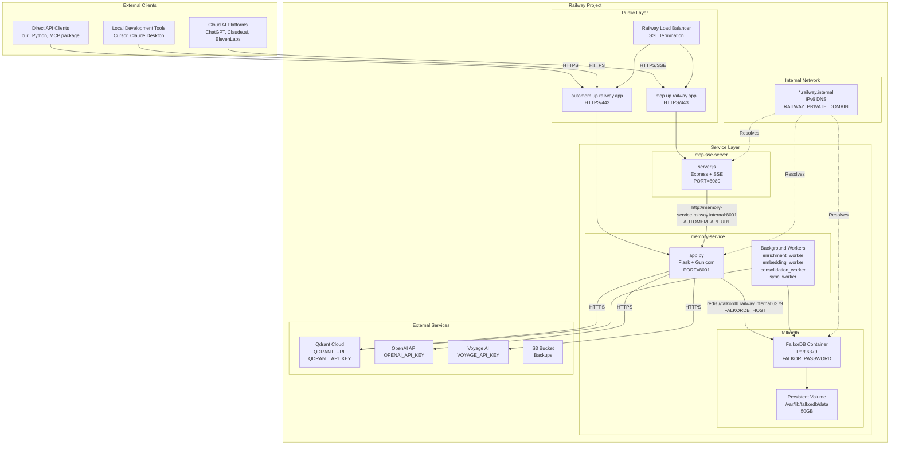
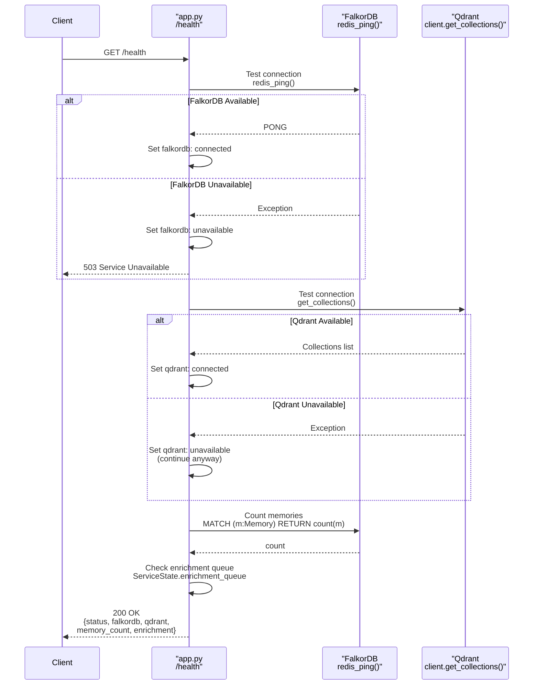

This page provides step-by-step instructions for deploying AutoMem on Railway, including service configuration, internal networking setup, and troubleshooting. Railway is a Platform-as-a-Service (PaaS) that provides containerized deployments with persistent volumes and internal service discovery.

For the fastest hosted setup with generated MCP config, see [InstaPods Deployment](/docs/deployment/instapods/). For local development setup, see the [Development Guide](https://github.com/verygoodplugins/automem/blob/main/INSTALLATION.md). For backup configuration and monitoring, see [Backup & Recovery](/docs/operations/backup/) and [Health Monitoring](/docs/operations/health/). For MCP bridge setup specifically, see the [MCP Integration guide](https://github.com/verygoodplugins/automem/blob/main/docs/MCP_SSE.md).

## Overview

Railway deployment provisions three services: the AutoMem Flask API (`memory-service`), FalkorDB graph database (`falkordb`), and optionally the MCP bridge for cloud AI platforms (`mcp-sse-server`). Railway handles container orchestration, internal networking via IPv6, persistent volumes, and health checks.

### Production Deployment Architecture



## Quick Start: One-Click Template

The Railway template automates service provisioning with pre-configured environment variables and networking.

### What Gets Deployed

| Service | Image/Source | Purpose | Public Domain |
|---|---|---|---|
| `memory-service` | GitHub repo root | Flask API, background workers | Yes (required) |
| `falkordb` | `falkordb/falkordb:latest` | Graph database with persistence | No (internal only) |
| `mcp-sse-server` | GitHub repo `mcp-sse-server/` | MCP bridge for cloud AI platforms | Yes (if using ChatGPT/Claude.ai) |

### Template Variables (Auto-Generated)

The template uses Railway's shared variables feature to generate secrets once and reference them across services. After template deployment, add your API keys:

1. Navigate to Railway Dashboard → `memory-service` → Variables
2. Add required variables:
   - `OPENAI_API_KEY` — For embeddings and classification
   - `QDRANT_URL` — Qdrant Cloud endpoint (optional but recommended)
   - `QDRANT_API_KEY` — Qdrant authentication
3. Redeploy `memory-service` to apply changes

## Manual Deployment

For production deployments or custom configurations, manual setup provides more control.

### Step 1: FalkorDB Service

FalkorDB requires persistent volume configuration to survive restarts.

**Required Environment Variables**

| Variable | Value | Purpose |
|---|---|---|
| `PORT` | `6379` | Redis protocol port |
| `FALKOR_PASSWORD` | `<generated-secret>` | Authentication password |
| `REDIS_ARGS` | `--save 60 1 --appendonly yes --appendfsync everysec` | Persistence configuration |

:::caution[Do not use `--requirepass`]
Do NOT add `--requirepass` to `REDIS_ARGS`. FalkorDB handles authentication via the `FALKOR_PASSWORD` environment variable. Adding `--requirepass` causes authentication to fail.
:::

**Volume Configuration**

- **Mount Path**: `/var/lib/falkordb/data` (not `/data`)
- **Minimum Size**: 1GB (adjust based on expected data)
- **Purpose**: Persists graph data across container restarts

### Step 2: Memory Service

The `memory-service` runs the Flask API, background workers, and handles all memory operations.

**Build Configuration**

```
Builder: DOCKERFILE
Dockerfile Path: ./Dockerfile
Root Directory: (empty - use repo root)
```

:::caution[PORT is required]
`PORT=8001` is **required**. Without this variable, Flask defaults to port 5000, causing connection failures from other services.
:::

**Variable Reference Patterns**

Railway supports two patterns for environment variables:

| Pattern | Example | Use Case | Stability |
|---|---|---|---|
| **Hardcoded** | `FALKORDB_HOST=falkordb.railway.internal` | Production, manual setup | Stable, easier to debug |
| **Reference** | `FALKORDB_HOST=${{FalkorDB.RAILWAY_PRIVATE_DOMAIN}}` | Templates only | Updates automatically, harder to troubleshoot |

:::tip
Use hardcoded values for manual deployments. Variable references only work in Railway templates.
:::

**Health Check Configuration**

- **Path**: `/health`
- **Timeout**: 100 seconds
- **Expected Response**: `{"status": "healthy"}`

### Step 3: MCP Bridge (Optional)

The `mcp-sse-server` service is only needed for cloud AI platforms (ChatGPT, Claude.ai, ElevenLabs). Skip this if you only use Cursor, Claude Desktop, or direct API access.

**Build Configuration**

```
Builder: DOCKERFILE
Dockerfile Path: mcp-sse-server/Dockerfile
Root Directory: mcp-sse-server
```

**Environment Variables**

| Variable | Required | Default | Description |
|---|---|---|---|
| `PORT` | Yes | `8080` | HTTP server port |
| `AUTOMEM_API_URL` | Yes | None | Internal URL: `http://memory-service.railway.internal:8001` |
| `AUTOMEM_API_TOKEN` | Yes | None | Copy from `memory-service` |

## Networking Architecture

Railway uses IPv6-based internal networking with automatic DNS resolution.

### Health Check Sequence



### IPv6 Dual-Stack Binding

Railway's internal networking uses IPv6 addresses. Services must bind to `::` (dual-stack) instead of `0.0.0.0` (IPv4 only). AutoMem v0.7.1+ handles this automatically — Flask binds to `host="::"` at startup.

If you see this in startup logs, the service is correctly bound:
```
* Running on http://[::]:8001
```

If you see the following (old versions only), upgrade to v0.7.1+:
```
* Running on http://0.0.0.0:8001
```

### Internal Service Discovery

Services communicate using internal hostnames:

| Service Name | Internal Hostname | Port | Usage |
|---|---|---|---|
| `memory-service` | `memory-service.railway.internal` | 8001 | MCP bridge connects here |
| `falkordb` | `falkordb.railway.internal` | 6379 | Memory service connects here |

The internal hostname is automatically set by Railway as `<service-name>.railway.internal`.

### TCP Proxy for External Access

TCP Proxy enables external services (like GitHub Actions) to access internal Railway services.

**When TCP Proxy Is Required**

| Use Case | Needs TCP Proxy? | Reason |
|---|---|---|
| Internal service-to-service | No | Use `.railway.internal` hostnames |
| GitHub Actions backups | Yes | External runners can't access internal network |
| Local development testing | Yes | External connection to Railway database |
| Public API access | No | Use public domains |

**Configuration Steps**

1. Railway Dashboard → `falkordb` service
2. Settings → Networking → **Enable TCP Proxy**
3. Note the generated endpoint:
   - `RAILWAY_TCP_PROXY_DOMAIN`: e.g., `monorail.proxy.rlwy.net`
   - `RAILWAY_TCP_PROXY_PORT`: e.g., `12345` (random high port)

**Usage in GitHub Actions**

For GitHub Actions backups, set these secrets:

```
FALKORDB_HOST = monorail.proxy.rlwy.net    # TCP Proxy domain
FALKORDB_PORT = 12345                       # TCP Proxy port (not 6379!)
FALKORDB_PASSWORD = <same-as-railway>
```

The backup workflow validates connectivity before running and checks that `FALKORDB_HOST` is not a `*.railway.internal` hostname (which external runners cannot reach).

## Post-Deployment Verification

After deploying all services, verify connectivity and data flow.

**Health Check**

```bash
curl https://your-project.up.railway.app/health
```

Expected response:
```json
{
  "status": "healthy",
  "falkordb": "connected",
  "qdrant": "connected",
  "memory_count": 0,
  "enrichment": {
    "status": "running",
    "queue_depth": 0
  }
}
```

**Store Test Memory**

```bash
curl -X POST https://your-project.up.railway.app/memory \
  -H "Authorization: Bearer YOUR_TOKEN" \
  -H "Content-Type: application/json" \
  -d '{"content": "Test memory for deployment verification"}'
```

**Verify Background Workers**

Check enrichment queue processing via `/health` — the `processed` count should increase after storing memories.

**Verification Checklist**

- Health endpoint returns `"status": "healthy"`
- FalkorDB shows `"connected"`
- Qdrant shows `"connected"` (if configured)
- Test memory stores successfully
- Enrichment worker processes memories (`processed` count increases)
- MCP bridge responds on `/health` (if deployed)

## Configuration Test Patterns

```mermaid
graph TB
    subgraph "Unit Tests (make test)"
        UnitConfig["No external services<br/>Mock configuration<br/>Fast execution"]

        MockFalkor["DummyGraph fixture<br/>In-memory stubs"]
        MockQdrant["Mock Qdrant client<br/>No network calls"]
        MockProvider["Mock embedding provider<br/>Deterministic outputs"]
    end

    subgraph "Integration Tests (make test-integration)"
        IntConfig["Real services via Docker<br/>Actual configuration<br/>Comprehensive validation"]

        DockerServices["docker-compose up<br/>FalkorDB + Qdrant"]
        RealConfig["Load from .env<br/>or environment"]
        TestAPICalls["HTTP requests to API<br/>AUTOMEM_TEST_BASE_URL"]
    end

    subgraph "Live Tests (make test-live)"
        LiveConfig["Railway deployment<br/>Production-like environment<br/>Safety checks"]

        ConfirmPrompt["Interactive confirmation<br/>AUTOMEM_ALLOW_LIVE=1"]
        RailwayAPI["https://automem.up.railway.app"]
        CleanupTests["Unique UUIDs<br/>Self-cleaning"]
    end

    UnitConfig --> MockFalkor
    UnitConfig --> MockQdrant
    UnitConfig --> MockProvider

    IntConfig --> DockerServices
    DockerServices --> RealConfig
    RealConfig --> TestAPICalls

    LiveConfig --> ConfirmPrompt
    ConfirmPrompt --> RailwayAPI
    RailwayAPI --> CleanupTests
```



## Environment Variables Reference

### memory-service Variables

| Variable | Required | Default | Description |
|---|---|---|---|
| `PORT` | Yes (Railway) | `5000` | Flask listen port. **Must be 8001 on Railway** |
| `FALKORDB_HOST` | Yes | `localhost` | FalkorDB hostname. Use `falkordb.railway.internal` on Railway |
| `FALKORDB_PORT` | Yes | `6379` | FalkorDB port |
| `FALKORDB_PASSWORD` | Yes | None | FalkorDB authentication password |
| `FALKORDB_GRAPH` | No | `memories` | Graph name in FalkorDB |
| `AUTOMEM_API_TOKEN` | Yes | None | API authentication token |
| `ADMIN_API_TOKEN` | Yes | None | Admin endpoint authentication |
| `OPENAI_API_KEY` | Recommended | None | Required for embeddings and classification |
| `QDRANT_URL` | Recommended | None | Qdrant Cloud endpoint |
| `QDRANT_API_KEY` | Recommended | None | Qdrant authentication |
| `QDRANT_COLLECTION` | No | `memories` | Qdrant collection name |

### falkordb Variables

| Variable | Required | Default | Description |
|---|---|---|---|
| `PORT` | Yes | `6379` | Redis protocol port |
| `FALKOR_PASSWORD` | Yes | None | Database authentication |
| `REDIS_ARGS` | Recommended | None | Persistence config: `--save 60 1 --appendonly yes --appendfsync everysec` |

### mcp-sse-server Variables

| Variable | Required | Default | Description |
|---|---|---|---|
| `PORT` | Yes | `8080` | HTTP server port |
| `AUTOMEM_API_URL` | Yes | None | Internal URL: `http://memory-service.railway.internal:8001` |
| `AUTOMEM_API_TOKEN` | Yes | None | Copy from `memory-service` |

## Troubleshooting

### ECONNREFUSED on Port 8001

**Symptoms**

```
Error: connect ECONNREFUSED fd12:ca03:42be:0:1000:50:1079:5b6c:8001
```

MCP bridge or other services cannot connect to `memory-service`.

**Solution 1: Add PORT Variable**

Most common cause. Flask defaults to port 5000 without explicit `PORT` variable. Add `PORT=8001` to `memory-service` variables in Railway Dashboard, then redeploy.

**Solution 2: Update IPv6 Binding**

If using older AutoMem versions (before v0.7.1), the service bound only to IPv4. Update to AutoMem v0.7.1 or later — Flask now binds to `host="::"` for dual-stack support.

**Solution 3: Verify Internal Hostname**

Ensure the MCP bridge uses `AUTOMEM_API_URL=http://memory-service.railway.internal:8001` (internal hostname, not the public domain).

### Variable Reference Not Resolving

**Symptoms**

Logs show literal `${{...}}` strings instead of resolved values.

**Cause**

Railway variable references only work in templates, not manual service configuration.

**Solution**

Replace variable references with hardcoded values:

```
# Instead of:
FALKORDB_HOST=${{FalkorDB.RAILWAY_PRIVATE_DOMAIN}}

# Use:
FALKORDB_HOST=falkordb.railway.internal
```

### FalkorDB Data Loss After Restart

**Symptoms**

All memories disappear after FalkorDB service restarts. `/health` shows `memory_count: 0`.

**Cause**

No persistent volume configured on FalkorDB service.

**Solution**

1. **Add Volume** (prevents future data loss)
   - Railway Dashboard → `falkordb` service
   - Settings → Volumes → Add Volume
   - Mount Path: `/var/lib/falkordb/data`
   - Redeploy service
2. **Recover Existing Data** (if Qdrant is intact)
   - Run `scripts/recover_from_qdrant.py` — see [Backup & Recovery](/docs/operations/backup/)

### GitHub Actions Backup Fails

**Symptoms**

```
Error: Connection reset by peer (error 104)
```

Backup workflow cannot connect to FalkorDB.

**Cause**

TCP Proxy not enabled or incorrect secrets configuration.

**Solution**

1. **Enable TCP Proxy** (if not already enabled)
   - Railway Dashboard → `falkordb` service
   - Settings → Networking → Enable TCP Proxy
   - Note the public endpoint
2. **Update GitHub Secrets**
   - Go to GitHub repo → Settings → Secrets and variables → Actions
   - Set these values:
     ```
     FALKORDB_HOST = monorail.proxy.rlwy.net    # TCP Proxy domain
     FALKORDB_PORT = 12345                       # TCP Proxy port (not 6379!)
     FALKORDB_PASSWORD = <same-as-railway>
     ```
3. **Verify Connectivity** — the backup workflow includes pre-flight checks that validate the TCP proxy connection before attempting backup

## Cost Optimization

Railway uses usage-based pricing with resource limits.

**Service Sizing Recommendations**

| Service | RAM | vCPU | Storage | Est. Cost/Month |
|---|---|---|---|---|
| `memory-service` | 512MB | 0.5 | - | ~$5 |
| `falkordb` | 1GB | 1.0 | 2GB volume | ~$10 |
| `mcp-sse-server` | 256MB | 0.25 | - | ~$2-3 |

**Total Estimated Cost**: $17-18/month (Railway Pro plan required: $20/month base)

**Cost-Saving Options**

1. **Remove `mcp-sse-server`** if only using Cursor/Claude Desktop
   - Saves ~$2-3/month
   - No impact on core API functionality
   - Delete service from Railway Dashboard
2. **Use Qdrant Cloud Free Tier**
   - 1GB storage free
   - Upgrade to $25/month for 10GB if needed
3. **Start with Smaller Volumes**
   - FalkorDB: 1GB initially (expand as needed)
   - Volume resizing is non-disruptive

## Security Best Practices

1. **Always set `FALKOR_PASSWORD`**
   - Railway auto-generates this in templates
   - For manual setup, use a strong random value
2. **Use Internal Networking**
   - Service-to-service communication via `.railway.internal` hostnames
   - Never expose FalkorDB publicly (no public domain)
3. **Rotate API Tokens Periodically**
   - Update `AUTOMEM_API_TOKEN` and `ADMIN_API_TOKEN` via Railway Dashboard
   - Redeploy affected services
4. **Disable Public Domains on FalkorDB**
   - Only `memory-service` and `mcp-sse-server` need public access
   - FalkorDB should only be accessible via internal network or TCP Proxy
5. **Service Naming Stability**
   - Internal DNS is based on service name (`<name>.railway.internal`)
   - Renaming a service updates its `RAILWAY_PRIVATE_DOMAIN`
   - Update hardcoded hostnames in other services after renaming

## Next Steps

After successful deployment:

- Configure automated backups — see [Backup & Recovery](/docs/operations/backup/)
- Set up health monitoring — see [Health Monitoring](/docs/operations/health/)
- Test disaster recovery procedures — see [Backup & Recovery](/docs/operations/backup/)
- Review environment configuration — see the [Configuration Reference](/docs/reference/configuration/)
