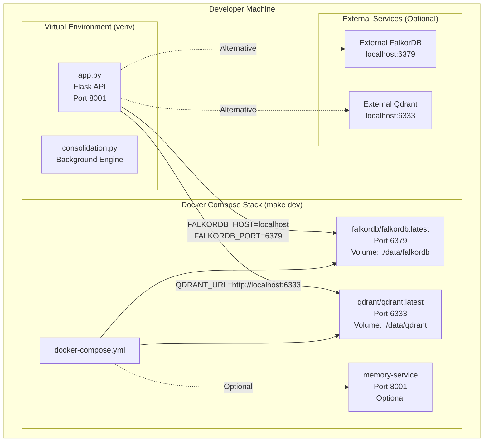
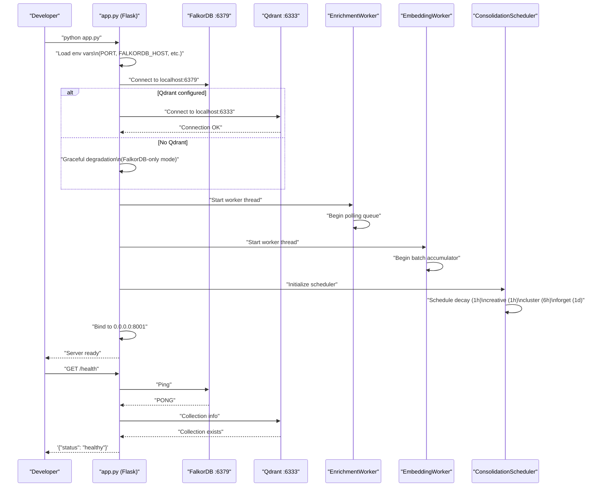

:::note[Two repositories]
This page covers local setup for both the **automem** server (Python/Flask) and the **mcp-automem** client (TypeScript/Node.js). For production deployment, see [Deployment](/docs/deployment/railway/).
:::

## AutoMem Server — Local Setup

### Prerequisites

Before setting up the development environment, ensure the following tools are installed:

| Tool | Minimum Version | Purpose |
|---|---|---|
| Python | 3.12 | Core runtime (standardized via `.python-version`) |
| pip | Latest | Package management |
| Docker | Latest | Local service dependencies (optional) |
| Docker Compose | Latest | Multi-container orchestration (optional) |
| git | Any recent version | Source control |

:::tip[One-shot bootstrap]
The repo now ships [`scripts/bootstrap_dev.sh`](https://github.com/verygoodplugins/automem/blob/ed36b98e3e1569dde71aa430417b6549520f7068/scripts/bootstrap_dev.sh), which creates a Python 3.12 virtualenv and installs dev requirements in one command. Prefer it over the manual steps below unless you need a custom setup.
:::

### Repository Contents

After cloning the repository, the structure relevant to development:

| Path | Description |
|---|---|
| `app.py` | Main Flask API application |
| `consolidation.py` | Background consolidation engine |
| `requirements.txt` | Production dependencies |
| `requirements-dev.txt` | Development dependencies |
| `Dockerfile` | Container image definition |
| `docker-compose.yml` | Local service orchestration |
| `tests/` | Test suite |
| `scripts/` | Utility scripts |

### Virtual Environment Setup

Create an isolated Python environment to avoid dependency conflicts:

```bash
python3.12 -m venv venv
source venv/bin/activate   # macOS/Linux
# or: venv\Scripts\activate  # Windows
```

The virtual environment isolates all installed packages from system Python, ensuring reproducible builds.

### Install Dependencies

#### Development Dependencies (Recommended)

```bash
pip install -r requirements-dev.txt
```

This installs:

- **Production dependencies** via `-r requirements.txt` (includes `requests`, `python-dotenv`, `nltk`, `rich`, and spaCy)
- **Testing tools**: `pytest==8.3.4`
- **Code quality**: `black==24.8.0`, `isort==5.13.2`, `flake8==7.1.1`
- **Pre-commit hooks**: `pre-commit==4.0.1`

#### Production Dependencies Only

```bash
pip install -r requirements.txt
```

Use this for minimal installations without testing/development tools.

#### spaCy for Enhanced Entity Extraction

spaCy is included in `requirements.txt` and installed automatically. After installing dependencies, download the model:

```bash
python -m spacy download en_core_web_sm
```

The `en_core_web_sm` model enables Named Entity Recognition (NER) in the enrichment pipeline for extracting persons, organizations, locations, and temporal entities from memory content. AutoMem degrades gracefully if the model is unavailable — entity extraction simply won't run.

---

### Running Dependencies

#### Development Environment Architecture



Two primary approaches exist for running the database dependencies.

#### Option 1: Docker Compose (Recommended)

```bash
make dev   # equivalent to: docker compose up --build
```

This starts all services in the foreground (attached), rebuilding images if `Dockerfile` or `requirements.txt` changed:

- **FalkorDB** on port `6379` with volume mount at `./data/falkordb`
- **Qdrant** on port `6333` with volume mount at `./data/qdrant`

The `docker-compose.yml` defines these services with persistent storage, ensuring data survives container restarts.

```bash
# Stop services
docker-compose down

# Check service status
docker-compose ps

# View logs
docker-compose logs -f falkordb
```

#### Option 2: External Services

Run FalkorDB and Qdrant independently (bare metal, separate Docker containers, or cloud) and configure connection via environment variables (see [Development Configuration](#development-configuration) below).

---

### Running the API

With dependencies running, start the Flask API:

```bash
python app.py
```

The Flask application binds to `0.0.0.0:8001` by default. The `PORT` environment variable controls the listening port.

**Verify startup:**

```bash
curl http://localhost:8001/health
```

Expected response:

```json
{
  "status": "healthy",
  "falkordb": "connected",
  "qdrant": "connected"
}
```

#### Startup Sequence



---

### Development Configuration

AutoMem loads configuration from three sources in order of precedence:

1. **Process environment** (highest priority)
2. **`.env` file** in project root
3. **`~/.config/automem/.env`** (user-wide config)

**Minimal development configuration** — create `.env` in the project root:

```bash
PORT=8001
FALKORDB_HOST=localhost
FALKORDB_PORT=6379
QDRANT_URL=http://localhost:6333
OPENAI_API_KEY=sk-...
AUTOMEM_API_TOKEN=your-dev-token
```

#### Full Configuration Reference

| Variable | Default | Description |
|---|---|---|
| `PORT` | `8001` | Flask API port |
| `FALKORDB_HOST` | `localhost` | FalkorDB hostname |
| `FALKORDB_PORT` | `6379` | FalkorDB port |
| `FALKORDB_PASSWORD` | _unset_ | FalkorDB auth password |
| `FALKORDB_GRAPH` | `memories` | Graph database name |
| `QDRANT_URL` | _unset_ | Qdrant endpoint URL |
| `QDRANT_API_KEY` | _unset_ | Qdrant API key |
| `QDRANT_COLLECTION` | `memories` | Qdrant collection name |
| `VECTOR_SIZE` | `1024` | Embedding dimension |
| `OPENAI_API_KEY` | _unset_ | OpenAI API key |
| `ENRICHMENT_MAX_ATTEMPTS` | `3` | Enrichment retry limit |
| `ENRICHMENT_SIMILARITY_LIMIT` | `5` | Semantic neighbors count |
| `ENRICHMENT_SIMILARITY_THRESHOLD` | `0.8` | SIMILAR_TO edge threshold |
| `FLASK_ENV` | `production` | Flask mode (`development` enables debug) |
| `LOG_LEVEL` | `INFO` | Logging verbosity |

**Enable development mode** for verbose logging and auto-reload:

```bash
FLASK_ENV=development
LOG_LEVEL=DEBUG
```

The `FLASK_ENV=development` setting enables: detailed error pages with stack traces, auto-reload on file changes, and more verbose console output.

---

### Development Workflow

**Code formatting** with Black + isort:

```bash
make fmt
# equivalent to: black . && isort .
```

**Code linting** with Flake8:

```bash
flake8 app.py automem/ tests/
```

**Running unit tests:**

```bash
pytest -m unit tests/
```

**Manual API testing:**

```bash
# Store a test memory
curl -X POST http://localhost:8001/memory \
  -H "Authorization: Bearer your-dev-token" \
  -H "Content-Type: application/json" \
  -d '{"content": "Test memory", "tags": ["test"], "importance": 0.5}'

# Recall memories
curl "http://localhost:8001/recall?query=test&limit=5" \
  -H "Authorization: Bearer your-dev-token"
```

---

### Troubleshooting

#### Port Already in Use

**Symptom**: `OSError: [Errno 48] Address already in use`

```bash
lsof -i :8001       # Find process using port
kill -9 <PID>       # Kill it
```

Or change the port: `PORT=8002 python app.py`

#### FalkorDB Connection Failed

**Symptom**: `503 Service Unavailable` or `FalkorDB is unavailable`

```bash
docker-compose ps           # Check if FalkorDB container is running
docker-compose up -d falkordb  # Start it if not
docker-compose logs falkordb   # Check for errors
```

#### Import Errors

**Symptom**: `ModuleNotFoundError: No module named 'flask'`

```bash
source venv/bin/activate    # Activate virtualenv
pip install -r requirements-dev.txt
```

#### Qdrant Not Working

**Symptom**: Qdrant errors in logs but API still works

**Behavior**: AutoMem operates in graceful degradation mode, using FalkorDB-only functionality. Vector search is replaced by keyword search. This is acceptable for development but impacts recall quality.

```bash
docker-compose up -d qdrant
curl http://localhost:6333/health   # Verify Qdrant is accessible
```

#### Enrichment Worker Not Processing

**Symptom**: Memories stored but `enrichment: queued` never completes

**Debug steps**: Check logs for `enrichment_worker` thread exceptions. Look for `metadata.enriched_at` field to confirm enrichment ran.

**Common causes:**

- Worker thread crashed (check logs for exceptions)
- spaCy model not downloaded (`python -m spacy download en_core_web_sm`)
- Memory already enriched (check `metadata.enriched_at` field)

#### Docker Volumes Permission Issues

**Symptom**: `Permission denied` errors when writing to `./data/falkordb` or `./data/qdrant`

```bash
sudo chown -R $(whoami) ./data/
```

---

## mcp-automem Client — Local Setup

### Prerequisites

- **Node.js**: Version 20.0.0 or higher
- **npm**: Comes with Node.js
- **git**: For version control
- **AutoMem Service**: Running instance for integration testing (local or Railway-hosted)

### Quick Start

```bash
git clone https://github.com/verygoodplugins/mcp-automem
cd mcp-automem
npm install   # Also installs Husky git hooks via "prepare" lifecycle script
```

### npm Scripts Reference

| Script | Command | Purpose |
|---|---|---|
| `prebuild` | `node scripts/sync-template-versions.mjs` | Sync template versions before build |
| `build` | `tsc` | Compile TypeScript to `dist/` |
| `postbuild` | `node scripts/build-openclaw-plugin-package.mjs && chmod +x dist/index.js` | Build OpenClaw plugin package and make binary executable |
| `sync-versions` | `node scripts/sync-template-versions.mjs` | Manually sync template versions without triggering a build |
| `dev` | `tsx watch src/index.ts` | Hot-reload development server |
| `lint` | `eslint .` | Run ESLint static analysis |
| `prepare` | `husky` | Install git hooks (runs on `npm install`) |
| `start` | `node dist/index.js` | Run compiled server |
| `test` | `vitest run` | Execute unit tests |
| `test:watch` | `vitest` | Run tests in watch mode |
| `test:coverage` | `vitest run --coverage` | Generate coverage report |
| `test:integration` | `vitest run --config vitest.integration.config.ts` | Run integration tests |
| `test:all` | `vitest run && vitest run --config vitest.integration.config.ts` | Run all test suites |
| `typecheck` | `tsc --noEmit` | Type-check without compilation |
| `prepublishOnly` | `npm run build && npm run test` | Pre-publish validation |
| `build:extension` | `npm run build && npx @anthropic-ai/mcpb pack` | Build `.mcpb` Claude Desktop extension |

### Development Environment Configuration

Create a `.env` file in the project root:

```bash
AUTOMEM_API_URL=http://localhost:8001
AUTOMEM_API_KEY=your-api-key
```

Configuration is read in priority order:

1. Constructor arguments (programmatic usage)
2. Process environment variables (`process.env`)
3. `.env` file in current directory
4. `.env` file in home directory

### Development Mode

The `dev` script uses `tsx` for hot-reload development — TypeScript runs directly without a compilation step:

```bash
npm run dev   # Watch mode, restarts on file changes
```

This is the recommended mode when actively developing. For testing the compiled output:

```bash
npm run build && node dist/index.js
```

### Debugging the MCP Server

**Method 1: Direct invocation** — test CLI commands without MCP client:

```bash
node dist/index.js setup      # Test setup wizard
node dist/index.js --help     # Show available commands
```

**Method 2: Hot-reload in server mode** — run without arguments to enter server mode, then send JSON-RPC messages via stdin.

**Debugging tips:**

- Add `console.error()` statements (goes to stderr, doesn't corrupt stdio protocol)
- Use `DEBUG=*` environment variable if using the debug library
- Check AutoMem service logs for backend errors
- Validate JSON payloads with `jq` or online validators

### Pre-Commit Checklist

Before committing changes to mcp-automem:

- Run `npm run lint` (no errors)
- Run `npm run typecheck` (no type errors)
- Run `npm test` (all tests pass)
- Ensure commit message follows Conventional Commits format
- Update documentation if adding new features
- Add tests for new functionality

:::note[Conventional Commits enforcement]
The `.husky/commit-msg` hook runs `commitlint` on every commit. Commit messages that don't follow the `type: description` format will be rejected. PR titles are also validated by the `semantic-pr-title` GitHub Actions workflow, since the repository uses squash-merge and PR titles become merge commit messages.
:::
