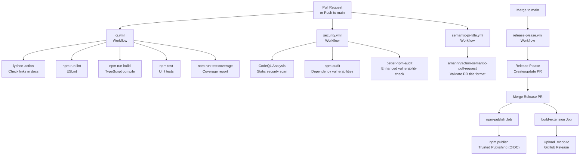
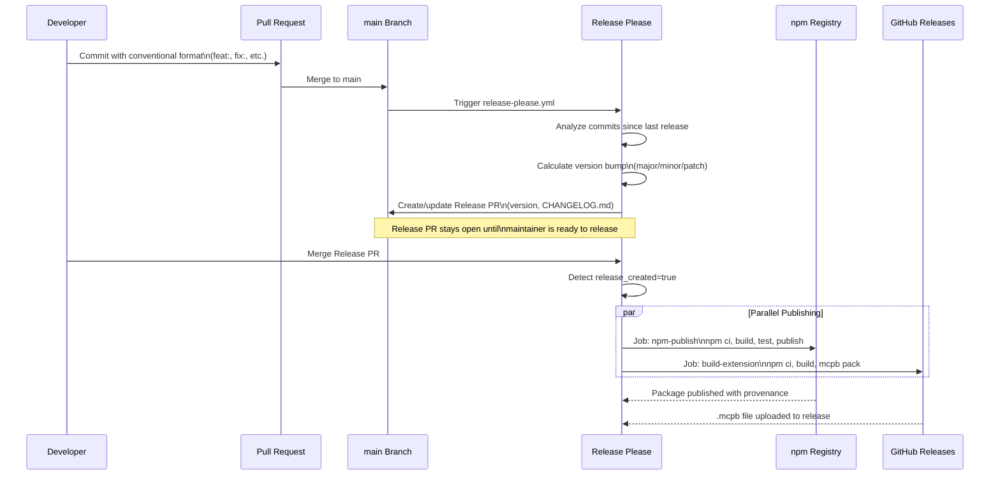

This page describes the CI/CD pipeline and automated release workflow for the mcp-automem package. The release process is fully automated using Release Please with conventional commits, requiring no manual version bumping or changelog updates.

For build and test procedures, see [Testing](/docs/development/testing/).

## CI/CD Pipeline Overview

The pipeline operates in three stages:

1. **Development Stage**: Local git hooks enforce commit message conventions via Husky and commitlint
2. **Validation Stage**: Automated workflows verify code quality, security, and functionality on every change
3. **Release Stage**: Automated versioning, publishing to npm, and building distribution artifacts



## Conventional Commits

All commits must follow the [Conventional Commits](https://www.conventionalcommits.org/) specification. The commit type determines version bump behavior.

### Version Bump Rules

| Commit Type | Version Bump | Example |
|---|---|---|
| `feat:` | Minor (0.x.0) | `feat: add cursor setup command` |
| `fix:` | Patch (0.0.x) | `fix: prevent stdout corruption in stdio mode` |
| `feat!:` or `BREAKING CHANGE:` | Major (x.0.0) | `feat!: remove search_by_tag tool` |
| `chore:`, `docs:`, `test:`, `ci:` | None | `chore: update dependencies` |

**Accepted types**: `fix`, `feat`, `chore`, `docs`, `refactor`, `test`, `ci`, `build`, `perf`, `revert`

### Enforcement Mechanisms

The repository enforces conventional commits at two levels:

1. **Local enforcement**: `.husky/commit-msg` runs `commitlint` on every commit using configuration from `.commitlintrc.cjs`. This provides immediate feedback during development.

2. **CI enforcement**: `semantic-pr-title.yml` validates PR titles on `opened`, `edited`, `synchronize`, and `reopened` events. Since the repository uses squash-merge, the PR title becomes the merge commit message.

:::tip[PR titles matter]
Because PRs are squash-merged, the PR title becomes the commit message on main. Format PR titles as conventional commits (e.g., `feat: add warp terminal integration`) — this is what release-please reads to determine version bumps.
:::

## CI Workflow (`ci.yml`)

Runs on every pull request and push to `main`.

### Job: Link Checker

Validates all URLs in documentation files to prevent broken links.

| Configuration | Value |
|---|---|
| Runner | `ubuntu-latest` |
| Action | `lycheeverse/lychee-action@v2` |
| Target Files | README.md, INSTALLATION.md, CHANGELOG.md |
| Accepted Status Codes | 200, 204, 301, 302, 403 |
| Exclusions | localhost, 127.0.0.1, x.com/i/communities, GitHub compare URLs |

### Job: Test

Comprehensive quality checks:

| Step | Command | Fail Behavior |
|---|---|---|
| Lint | `npm run lint` | Fails build |
| Build | `npm run build` | Fails build |
| Test | `npm test` | Fails build |
| Coverage | `npm run test:coverage` | Continue on error |

The coverage step uses `continue-on-error: true` to prevent flaky coverage thresholds from blocking merges.

## Security Workflow (`security.yml`)

Runs weekly, on PRs, on pushes to main, and on manual dispatch.

### Job: CodeQL Analysis

Static analysis security testing using GitHub's CodeQL engine for TypeScript. Results are uploaded to the GitHub Security tab under Code Scanning alerts.

### Job: Dependency Audit

Scans npm dependencies using two tools:

| Tool | Command | Audit Level | Fail Behavior |
|---|---|---|---|
| npm audit | `npm audit --audit-level=high` | High severity only | Continue on error for PRs |
| better-npm-audit | `npx better-npm-audit audit --level high` | High severity only | Continue on error for PRs |

**Conditional error handling**: On pull requests, errors are reported but don't fail the build. On pushes to main, errors fail the build. This allows developers to see security issues in PRs without blocking development while enforcing fixes on the main branch.

## Release Please Workflow (`release-please.yml`)

### Release Flow



### Three-Job Structure

| Job | Trigger | Purpose | Outputs |
|---|---|---|---|
| `release-please` | Every push to `main` | Analyze commits, manage Release PR | `release_created`, `tag_name` |
| `npm-publish` | `release_created == true` | Publish to npm registry | Package on npm |
| `build-extension` | `release_created == true` | Build and upload `.mcpb` file | Attachment on GitHub Release |

### Version Synchronization

Release Please automatically updates version numbers across five files using the `extra-files` configuration in `release-please-config.json`:

| File | Field Updated | Purpose |
|---|---|---|
| `package.json` | `version` | npm package version |
| `plugins/server/server.json` | `version` | MCP server metadata |
| `plugins/.claude-plugin/manifest.json` | `version` | Claude Desktop extension manifest |
| `plugins/.claude-plugin/plugin.json` | `version` | Claude Plugin marketplace metadata |
| `plugins/.claude-plugin/marketplace.json` | `version` | Marketplace listing version |

:::caution[Never manually bump versions]
Never manually edit version numbers in any of these five files. Release Please keeps them synchronized. Manual edits will cause drift and break the release automation.
:::

### Version Bump Decision Logic

Release Please analyzes all commits since the last release tag and determines the version bump based on the highest-priority change:

1. **Major bump** (x.0.0): Any commit with `!` after type (e.g., `feat!:`) or `BREAKING CHANGE:` in footer
2. **Minor bump** (0.x.0): Any `feat:` commit without breaking change marker
3. **Patch bump** (0.0.x): Any `fix:` commit
4. **No release**: Only `chore:`, `docs:`, `test:`, `ci:` commits

### npm Publishing with Trusted Publishing

The `npm-publish` job uses OIDC-based authentication (Trusted Publishing), eliminating the need for stored `NPM_TOKEN` secrets.

**Publishing command:**

```bash
npm publish --access public --provenance
```

- `--access public`: Required for scoped packages (`@verygoodplugins/mcp-automem`)
- `--provenance`: Includes build provenance (commit SHA, workflow, attestations) in package metadata

The OIDC token proves the publish request originates from the authorized GitHub Actions workflow, without requiring long-lived credentials.

### Extension Building

The `build-extension` job creates the Claude Desktop `.mcpb` extension file:

1. **Build phase**: Check out code, install dependencies (`npm ci`), compile TypeScript (`npm run build`)
2. **Pack phase**: Run `npx @anthropic-ai/mcpb pack` — bundles compiled server code from `dist/`, `manifest.json`, `server.json`, and dependencies
3. **Upload phase**: Attach all `*.mcpb` files to the GitHub Release identified by the `tag_name` output from the `release-please` job

**Local testing:** Build the extension locally with `npm run build:extension`.

## Quality Gates Summary

| Gate | Required For | Enforced By |
|---|---|---|
| Conventional commits | All merges | commitlint (local), release-please (GitHub) |
| Link validity | PR merge | CI workflow |
| ESLint passing | PR merge | CI workflow |
| Build success | PR merge | CI workflow |
| Tests passing | PR merge | CI workflow |
| No high-severity vulnerabilities | Main branch | Security workflow (warnings on PRs) |
| CodeQL analysis | Main branch | Security workflow |

Coverage reporting is informational only and does not block merges.

## Workflow Permissions

Each workflow uses the principle of least privilege:

| Workflow | Permissions |
|---|---|
| CI | Default (read-only) |
| Security | `contents: read`, `security-events: write` |
| Release Please | `contents: write`, `pull-requests: write` |
| npm-publish | `contents: read`, `id-token: write` |
| build-extension | `contents: write` |

No stored secrets (like `NPM_TOKEN`) are required due to Trusted Publishing.

## Dependabot Configuration

Automated dependency updates via GitHub Dependabot run weekly and are grouped into two categories:

**Production Dependencies Group**: All dependencies excluding `@types/*`, `typescript`, `vitest`, `eslint*`, `prettier`

**Dev Dependencies Group**: `@types/*`, `typescript`, `vitest`, `eslint*`, `prettier`

This grouping prevents excessive PRs by batching related updates. All dependency updates use the `chore(deps):` conventional commit prefix, which does not trigger version bumps.

## Distribution Channels

| Channel | URL Pattern | Format | Target Users |
|---|---|---|---|
| npm Registry | `@verygoodplugins/mcp-automem` | `.tgz` package | CLI users, programmatic integrations |
| GitHub Releases | `github.com/verygoodplugins/mcp-automem/releases` | `.mcpb` file | Claude Desktop one-click install |

**npm install:**

```bash
npx @verygoodplugins/mcp-automem setup
# or
npm install -g @verygoodplugins/mcp-automem
```

**Claude Desktop extension install:**

1. Download `.mcpb` file from GitHub Release
2. Double-click to install (macOS/Windows)
3. Extension installed to Claude Desktop automatically

## Typical Release Timeline

- **Day 1**: First `feat:` commit to `main` → release-please creates Release PR with version bump
- **Days 2-7**: Additional commits → release-please updates Release PR (version may change if higher-priority commits added)
- **Day 8**: Maintainer merges Release PR → Parallel jobs publish to npm and GitHub Releases within ~5 minutes

Releases can be created as frequently as needed by merging the Release PR.

## Troubleshooting

| Issue | Symptom | Resolution |
|---|---|---|
| **Commit rejected locally** | `commitlint` fails on commit | Fix commit message format: `type: description` |
| **PR blocked in CI** | semantic-pr-title fails | Edit PR title to use conventional format |
| **Release PR not created** | No PR after pushing to `main` | Check commits — only `feat:`, `fix:`, `feat!:` trigger releases |
| **npm publish fails** | Authentication error | Verify Trusted Publishing configured in npm package settings |
| **Extension build fails** | `.mcpb` file not created | Check `manifest.json` and `server.json` exist and are valid JSON |
| **Version out of sync** | Different versions across files | Manually update `.release-please-manifest.json`, delete Release PR, push again |

### Manual Intervention

If automation fails, manual publishing is possible:

```bash
npm run build
npm test
npm publish --access public
```

However, this bypasses provenance attestation and version synchronization. Prefer fixing automation issues over manual releases.
