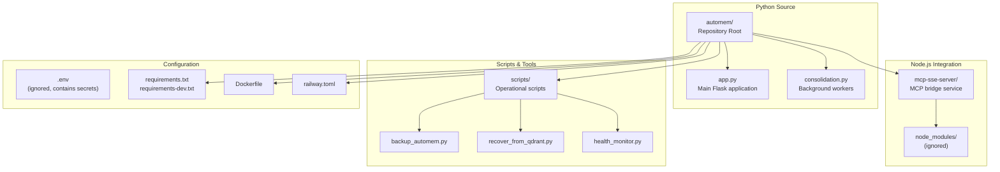

:::note[Two repositories]
AutoMem consists of two separate repositories: the **automem** server (Python/Flask) and the **mcp-automem** client (TypeScript/MCP). This page covers the structure of both.
:::

## AutoMem Server (`verygoodplugins/automem`)

The AutoMem server repository follows a hybrid Python/Node.js structure with three primary deployment targets: the core Flask API service, the MCP bridge server, and operational scripts.

### Directory Layout



### Core Service Modules

#### `app.py` — Flask Orchestration Entry Point

A ~506-line orchestration file that wires together all components from the `automem/` package. It is no longer a monolithic application — all business logic, routes, workers, and configuration live in the package.

| Responsibility | Implementation |
|---|---|
| Service startup and wiring | Imports from `automem/runtime_wiring.py` |
| Flask app factory | Delegates to `automem/api/` route modules |
| Background worker launch | Delegates to worker modules in `automem/` |
| Configuration loading | `automem/config.py` |

#### `automem/` — Core Python Package

The main package containing all business logic, organized by domain:

```text
automem/
├── __init__.py
├── config.py                   # All configuration constants
├── service_state.py            # ServiceState dataclass
├── service_runtime.py          # Runtime initialization helpers
├── service_runtime_bindings.py
├── runtime_wiring.py           # Server startup orchestration
├── runtime_environment.py
├── app_helper_bindings.py
├── api/
│   ├── memory.py               # POST/GET/PATCH/DELETE /memory routes
│   ├── recall.py               # GET /recall routes
│   ├── graph.py                # Graph query routes
│   ├── admin.py                # Admin operations
│   ├── health.py               # Health endpoint
│   ├── enrichment.py           # Enrichment status/reprocess
│   ├── consolidation.py        # Consolidation trigger/status
│   ├── viewer.py               # Graph viewer routes
│   ├── stream.py               # SSE streaming
│   ├── auth_helpers.py         # Authentication middleware
│   ├── runtime_bootstrap.py
│   ├── runtime_memory_routes.py
│   └── runtime_recall_routes.py
├── classification/
│   ├── __init__.py
│   └── memory_classifier.py
├── consolidation/
│   ├── runtime_bindings.py
│   ├── runtime_helpers.py
│   ├── runtime_routes.py
│   └── runtime_scheduler.py
├── embedding/
│   ├── provider.py             # Base provider class
│   ├── provider_init.py        # Auto-selection logic
│   ├── openai.py
│   ├── voyage.py
│   ├── fastembed.py
│   ├── ollama.py
│   ├── placeholder.py
│   ├── runtime_pipeline.py
│   ├── runtime_bindings.py
│   └── runtime_helpers.py
├── enrichment/
│   ├── runtime_bindings.py
│   ├── runtime_helpers.py
│   ├── runtime_orchestration.py
│   ├── runtime_queue_bindings.py
│   └── runtime_worker.py
├── search/
│   ├── runtime_recall_helpers.py
│   ├── runtime_relations.py
│   └── runtime_keywords.py
├── stores/
│   ├── graph_store.py
│   ├── vector_store.py
│   └── runtime_clients.py
├── sync/
│   ├── runtime_bindings.py
│   └── runtime_worker.py
├── analytics/
│   └── runtime_helpers.py
└── utils/
    ├── entity_extraction.py
    ├── scoring.py
    ├── tags.py
    ├── time.py
    ├── text.py
    ├── graph.py
    └── validation.py
```

#### `consolidation.py` — Dream-Inspired Maintenance

Self-contained consolidation engine with no Flask dependencies. Designed for both scheduled background execution and manual CLI invocation.

| Class | Purpose | Key Methods |
|---|---|---|
| `MemoryConsolidator` | Execute consolidation tasks | `consolidate()`, `calculate_relevance_score()`, `discover_creative_associations()`, `cluster_similar_memories()`, `apply_controlled_forgetting()` |
| `ConsolidationScheduler` | Manage task intervals | `run_scheduled_tasks()`, `should_run()`, `get_next_runs()` |
| `GraphLike` (Protocol) | Database abstraction | `query()` method only |
| `VectorStoreProtocol` (Protocol) | Vector store abstraction | `delete()` method only |

**Caching optimization**: Relationship count queries use `@lru_cache` with hourly invalidation ([consolidation.py:152-176](https://github.com/verygoodplugins/automem/blob/main/consolidation.py#L152-L176)).

:::tip[Flask independence]
`consolidation.py` is deliberately Flask-independent. It can be imported and used in CLI scripts or schedulers without Flask overhead. The `GraphLike` and `VectorStoreProtocol` protocols enable testing with in-memory mocks.
:::

#### `mcp-sse-server/` — Node.js SSE Bridge

Translates Model Context Protocol (MCP) tool calls into AutoMem REST API requests. Enables ChatGPT, ElevenLabs, and other SSE-compatible AI platforms to access AutoMem.

- **Port**: 8080 (configurable via `PORT` environment variable)
- **Connects to Flask API** at `AUTOMEM_URL` (default: `http://localhost:8001`)
- **Key files**: `index.js` (SSE endpoint handlers, JSON-RPC to REST translation), `package.json`

### Operational Scripts

Production-ready Python scripts for data protection and disaster recovery.

| Script | Purpose | Dependencies |
|---|---|---|
| `backup_automem.py` | Export FalkorDB + Qdrant to S3/local | `boto3`, `falkordb`, `qdrant-client` |
| `recover_from_qdrant.py` | Rebuild FalkorDB graph from Qdrant payloads | `falkordb`, `qdrant-client` |
| `restore_from_backup.py` | Restore from compressed JSON backups | `falkordb`, `qdrant-client` |
| `health_monitor.py` | Detect count drift between databases | `requests`, optional webhook client |

All scripts connect directly to FalkorDB and Qdrant, bypassing the Flask API. They read the same environment variables as `app.py`. The `backup_automem.py` script runs every 6 hours via a GitHub Actions workflow.

### Configuration Management

#### Environment Variable Load Order ([app.py:43-45](https://github.com/verygoodplugins/automem/blob/main/app.py#L43-L45))

1. Load `.env` from repository root
2. Load `~/.config/automem/.env` (user-specific overrides)
3. Railway injects secrets as environment variables

#### Key Configuration Categories

| Category | Example Variables | Defined In |
|---|---|---|
| Database Connections | `FALKORDB_HOST`, `QDRANT_URL` | [app.py:75-78](https://github.com/verygoodplugins/automem/blob/main/app.py#L75-L78) |
| Authentication | `AUTOMEM_API_TOKEN`, `ADMIN_API_TOKEN` | [app.py:209-210](https://github.com/verygoodplugins/automem/blob/main/app.py#L209-L210) |
| Consolidation Intervals | `CONSOLIDATION_DECAY_INTERVAL_SECONDS` | [app.py:82-92](https://github.com/verygoodplugins/automem/blob/main/app.py#L82-L92) |
| Enrichment Tuning | `ENRICHMENT_MAX_ATTEMPTS`, `ENRICHMENT_SIMILARITY_THRESHOLD` | [app.py:104-112](https://github.com/verygoodplugins/automem/blob/main/app.py#L104-L112) |
| Embedding Batching | `EMBEDDING_BATCH_SIZE`, `EMBEDDING_BATCH_TIMEOUT_SECONDS` | [app.py:115-116](https://github.com/verygoodplugins/automem/blob/main/app.py#L115-L116) |
| Search Weights | `SEARCH_WEIGHT_VECTOR`, `SEARCH_WEIGHT_KEYWORD` | [app.py:201-207](https://github.com/verygoodplugins/automem/blob/main/app.py#L201-L207) |

#### Containerization Files

| File | Purpose | Key Settings |
|---|---|---|
| `Dockerfile` | Container image definition | Python 3.11, installs spaCy model |
| `docker-compose.yml` | Local development stack | Orchestrates Flask + FalkorDB + Qdrant |
| `railway.json` | Railway deployment config | Service definitions, port mappings |

**Docker Compose services:**

- `memory-service`: Flask API (port 8001)
- `falkordb`: Graph database (port 6379)
- `qdrant`: Vector database (port 6333)

### Testing Infrastructure

#### `tests/` — Pytest Test Suites

The test suite covers consolidation, API endpoints, enrichment, embedding providers, and integration flows:

```text
tests/
├── conftest.py
├── test_consolidation_engine.py
├── test_api_endpoints.py
├── test_app.py
├── test_enrichment.py
├── test_embedding_providers.py
├── test_integration.py
├── test_content_size.py
├── test_vector_size_safety.py
├── test_recall_entity_extraction.py
├── support/
├── contracts/
└── benchmarks/
```

Tests use pytest markers to separate execution tiers: `unit` (no external services, runs with `make test`), `integration` (requires Docker stack, runs with `make test-integration`), and `live` (runs against a deployed Railway instance).

**Mock objects** ([tests/test_consolidation_engine.py:12-78](https://github.com/verygoodplugins/automem/blob/main/tests/test_consolidation_engine.py#L12-L78)):

- `FakeGraph`: Implements `GraphLike` protocol with in-memory state
- `FakeVectorStore`: Implements `VectorStoreProtocol` for deletion tracking
- `FakeResult`: Mimics FalkorDB query result structure

**Test philosophy**: Consolidation tests use deterministic mocks and frozen time to ensure reproducible relevance score calculations.

### File Naming Conventions

| Pattern | Purpose | Examples |
|---|---|---|
| `*.py` | Python modules | `app.py`, `consolidation.py` |
| `test_*.py` | Pytest test files | `test_consolidation_engine.py` |
| `*_automem.py` | Operational scripts | `backup_automem.py`, `restore_from_backup.py` |
| `*.md` | Markdown documentation | `README.md`, `OPTIMIZATIONS.md` |
| `*.sh` | Shell scripts | `test-optimizations.sh` |
| `.env` | Environment configuration | `.env`, `~/.config/automem/.env` |
| `*.yml` | YAML configuration | `docker-compose.yml` |

**Gitignored patterns**: `__pycache__/`, `venv/`, `.venv/`, `backups/`, `node_modules/`, `.env`

### Deployment Artifact Boundaries

Different deployment scenarios use different subsets of the repository:

1. **Railway (Production)**: Single container running `app.py` (which imports the `automem/` package), consolidation runs in background thread
2. **Docker Compose (Local)**: Multi-container with separate database services
3. **Bare Metal (Development)**: Python process + external databases
4. **MCP Bridge**: Optional Node.js service for AI platform integration
5. **Scripts**: Standalone utilities connecting directly to databases

---

## MCP Client (`verygoodplugins/mcp-automem`)

The mcp-automem package uses a TypeScript project structure with distinct directories for source code, templates, build artifacts, and configuration files.

### Directory Layout



```mermaid
graph TB
    ROOT["."]

    ROOT --> SRC["src/"]
    ROOT --> TEMPLATES["templates/"]
    ROOT --> PLUGINS["plugins/"]
    ROOT --> DIST["dist/"]
    ROOT --> GITHUB[".github/"]
    ROOT --> HUSKY[".husky/"]

    SRC --> INDEX["index.ts\n(MCP server entry point)"]
    SRC --> CLIENT["automem-client.ts\n(HTTP client)"]
    SRC --> TYPES["types.ts\n(TypeScript interfaces)"]
    SRC --> CLI["cli/"]

    CLI --> SETUP["setup.ts"]
    CLI --> CLAUDECODE["claude-code.ts"]
    CLI --> QUEUE["queue.ts"]
    CLI --> CONFIG["config.ts"]
    CLI --> CURSOR["cursor.ts"]
    CLI --> CODEX["codex.ts"]
    CLI --> OPENCLAW["openclaw.ts"]

    TEMPLATES --> TCCLI["claude-code/\nhooks, scripts, settings"]
    TEMPLATES --> TCUR["cursor/\n.mdc rule files"]
    TEMPLATES --> TCODEX["codex/\nAGENTS.md"]
    TEMPLATES --> TOCLAW["openclaw/\nSKILL.md"]
    TEMPLATES --> TWARP["warp/\nwarp-rules.md"]

    PLUGINS --> PCCLI[".claude-plugin/\nmarketplace files"]
    PLUGINS --> PSERVER["server/\nserver.json metadata"]

    GITHUB --> WORKFLOWS["workflows/\nCI/CD YAML files"]

    DIST --> DISTJS["*.js\n(Compiled code)"]
    DIST --> DISTDTS["*.d.ts\n(Type definitions)"]
    DIST --> DISTMAP["*.js.map\n(Source maps)"]
```

### Source Directory (`src/`)

#### Entry Point: `index.ts`

The [`src/index.ts`](https://github.com/verygoodplugins/mcp-automem/blob/main/src/index.ts) file serves dual purposes based on command-line arguments:

1. **Server Mode** (no arguments): Launches an MCP server using `StdioServerTransport` from `@modelcontextprotocol/sdk`
2. **CLI Mode** (with arguments): Routes commands to appropriate CLI handlers in `src/cli/`

#### HTTP Client: `automem-client.ts`

The [`src/automem-client.ts`](https://github.com/verygoodplugins/mcp-automem/blob/main/src/automem-client.ts) file implements the `AutoMemClient` class, providing a typed HTTP interface to the AutoMem backend service.

| Method | HTTP Endpoint | Purpose |
|---|---|---|
| `storeMemory()` | `POST /memory` | Store new memory with content, tags, metadata |
| `recallMemory()` | `GET /recall` | Hybrid search (vector + keyword + tags) |
| `recallMemoryByTag()` | `GET /memory/by-tag` | Tag-only filtering |
| `associateMemories()` | `POST /associate` | Create typed relationships |
| `updateMemory()` | `PATCH /memory/:id` | Update existing memory fields |
| `deleteMemory()` | `DELETE /memory/:id` | Remove memory and embedding |
| `checkHealth()` | `GET /health` | Database connectivity status |

**Configuration resolution** (priority order):

1. Constructor parameters (if provided)
2. Environment variables (`AUTOMEM_ENDPOINT`, `AUTOMEM_API_KEY`)
3. `.env` file (loaded via `dotenv`)

#### Type Definitions: `types.ts`

The [`src/types.ts`](https://github.com/verygoodplugins/mcp-automem/blob/main/src/types.ts) file defines TypeScript interfaces for all data structures:

- **Configuration types**: `AutoMemConfig`, `MCPServerConfig`, `ClaudeCodeConfig`
- **Memory operation arguments**: `StoreMemoryArgs`, `RecallMemoryArgs`, `AssociateMemoriesArgs`
- **API response types**: `RecallResult`, `MemoryMetadata`, `RelationshipType`
- **CLI types**: `SetupAnswers`, `QueueEntry`

#### CLI Commands (`src/cli/`)

Each CLI command is implemented as a separate module with a main `run*()` function. CLI handlers follow a consistent pattern: `--dry-run` flag for safe preview, `--verbose` flag for detailed logging, template rendering from `templates/` directory, filesystem operations with error handling, and user-friendly output with next-step instructions.

### Templates Directory (`templates/`)

The `templates/` directory contains platform-specific integration files that are copied to user systems during installation. These files are included in the published npm package.

```
templates/
├── claude-code/
│   ├── hooks/               # Shell scripts triggered by Claude events
│   │   ├── PostToolUse.sh  # After tool execution
│   │   └── Stop.sh         # Session end (queue processor)
│   ├── scripts/             # Support utilities
│   │   ├── session-memory.sh
│   │   ├── memory-filters.json
│   │   └── queue-processor.sh
│   ├── settings.json        # Base hook configuration
│   └── profiles/
│       ├── settings.lean.json
│       └── settings.extras.json
├── cursor/
│   ├── automem.mdc          # Cursor rule template
│   └── mcp-config.json      # MCP server config snippet
├── codex/
│   ├── AGENTS.md            # Codex agent rules
│   └── config.toml.snippet  # Server config for ~/.codex/
├── openclaw/
│   └── SKILL.md             # OpenClaw skill definition
└── warp/
    └── warp-rules.md        # Warp terminal rules
```

**Template file types:**

| Type | Extension | Purpose | Target Platform |
|---|---|---|---|
| Hook Scripts | `.sh` | Event-driven automation | Claude Code |
| Rule Files | `.md`, `.mdc` | AI assistant instructions | Cursor, Codex, Warp, OpenClaw |
| Config Snippets | `.json`, `.toml` | MCP server configuration | All platforms |
| Settings | `.json` | Hook permissions & matchers | Claude Code |
| Filter Configs | `.json` | Memory significance rules | Claude Code |

### Build Artifacts (`dist/`)

The `dist/` directory is generated by TypeScript compilation (`tsc`) and contains:

1. **JavaScript files** (`.js`) — Compiled from TypeScript source
2. **Type declarations** (`.d.ts`) — For TypeScript consumers
3. **Source maps** (`.js.map`) — For debugging compiled code

**TypeScript configuration** ([`tsconfig.json`](https://github.com/verygoodplugins/mcp-automem/blob/main/tsconfig.json)):

- `outDir: "./dist"` — Output location
- `declaration: true` — Generate `.d.ts` files
- `sourceMap: true` — Generate source maps
- `module: "ES2020"` — ES module format
- `target: "ES2020"` — JavaScript target version

**Build scripts:**

| Script | Command | Purpose |
|---|---|---|
| `build` | `tsc && npm run postbuild` | Compile + make executable |
| `postbuild` | `chmod +x dist/index.js` | Add execute permission |
| `dev` | `tsx watch src/index.ts` | Hot-reload development |
| `typecheck` | `tsc --noEmit` | Validate types without building |

### Plugins Directory (`plugins/`)

The `plugins/` directory contains a packaged version of the MCP server for Claude Desktop's plugin system. This directory duplicates content from `templates/` to support the `.mcpb` extension format, which requires a self-contained plugin directory with all resources included.

### Configuration Files

#### Root-Level Configuration

The repository root contains multiple configuration files:

| File | Purpose |
|---|---|
| `package.json` | npm scripts, dependencies, package metadata |
| `tsconfig.json` | TypeScript compiler options |
| `eslint.config.js` | ESLint flat config (ESLint 9+) |
| `.commitlintrc.cjs` | Conventional commit message validation |
| `.prettierrc` | Code formatting rules |
| `release-please-config.json` | Automated release configuration |
| `.release-please-manifest.json` | Current version tracking |
| `env.example` | Template for required environment variables |

#### Version Synchronization

Five files must maintain version consistency (managed by release-please):

1. `package.json` — `"version": "0.12.0"`
2. `plugins/mcp-automem/server.json` — `"version": "0.12.0"`
3. `manifest.json` — `"version": "0.12.0"`
4. `plugin.json` — `"version": "0.12.0"`
5. `marketplace.json` — `"version": "0.12.0"`

The [`release-please.yml`](https://github.com/verygoodplugins/mcp-automem/blob/main/.github/workflows/release-please.yml) workflow automatically updates all five files when creating releases based on conventional commits.

### GitHub Workflows (`.github/`)

| Workflow | Trigger | Purpose |
|---|---|---|
| `ci.yml` | PR, push to main | Lint, build, test, coverage |
| `security.yml` | PR, push, schedule | CodeQL, npm audit |
| `release-please.yml` | Push to main | Version bump, changelog, publish |
| `semantic-pr-title.yml` | PR open/edit | Validate PR title format |

### Git Hooks (`.husky/`)

The `.husky/commit-msg` hook runs `commitlint` to validate commit messages against Conventional Commits format before allowing the commit.

**Accepted types**: `fix`, `feat`, `chore`, `docs`, `refactor`, `test`, `ci`, `build`, `perf`, `revert`

### Published Package Contents

The `files` array in `package.json` specifies what gets included in the npm package:

**What's included**: `dist/`, `templates/`, `plugins/`, `env.example`, `README.md`, `CHANGELOG.md`

**What's excluded**: Source code (`src/`), tests, development configs, CI/CD files, `.tsbuildinfo`

### File Locations by Use Case

| Task | Files to Modify |
|---|---|
| Add a new MCP tool | `src/index.ts` (schema + handler), `src/automem-client.ts` (client method), `src/types.ts` |
| Add a new CLI command | Create `src/cli/new-command.ts`, import and route in `src/index.ts` |
| Modify platform integration | Edit `templates/<platform>/`, update `src/cli/<platform>.ts`, sync to `plugins/` |
| Change build output | Modify `tsconfig.json`, update `package.json` `main` and `types` fields |
| Add release automation | Edit `.github/workflows/release-please.yml`, update `.release-please-manifest.json` |
