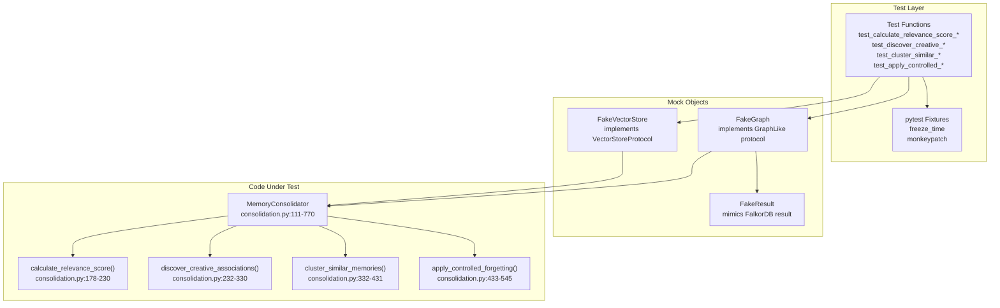
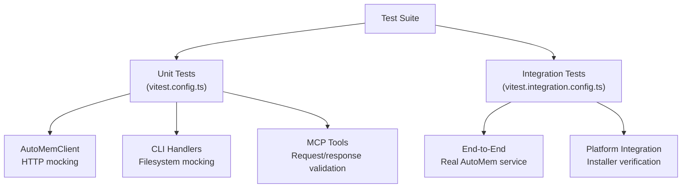

:::note[Two repositories]
AutoMem uses different test frameworks in each repository: **pytest** for the automem server (Python) and **Vitest** for the mcp-automem client (TypeScript).
:::

## AutoMem Server — Testing (pytest)

### Purpose and Scope

AutoMem's test suite validates core functionality through unit tests with emphasis on the consolidation engine. The test framework uses pytest with mock objects to isolate graph and vector store interactions, enabling fast execution without external dependencies.

Currently, the test suite focuses on consolidation logic. API endpoints and background workers are validated through manual testing and production monitoring.

### Test Suite Organization

```text
tests/
├── conftest.py
├── test_consolidation_engine.py
├── test_api_endpoints.py
├── test_app.py
├── test_enrichment.py
├── test_embedding_providers.py
├── test_integration.py
├── test_content_size.py
├── test_vector_size_safety.py
├── test_recall_entity_extraction.py
├── support/
├── contracts/
└── benchmarks/
```

### Pytest Markers

Tests are tagged with markers to control which tier runs:

| Marker | Command | Requires | Purpose |
|---|---|---|---|
| `unit` | `pytest -m unit tests/` | No external services | Fast, isolated logic tests |
| `integration` | `pytest -rs -m integration tests/` | Docker stack running | Full API + database flow |
| `live` | `AUTOMEM_ALLOW_LIVE=1 pytest -m live tests/` | Railway deployment | Production smoke tests |

`make test` runs unit tests only. `make test-integration` starts Docker Compose and runs integration tests.

#### Coverage by Component

| Component | Test File | Coverage Status |
|---|---|---|
| Memory Consolidation | `test_consolidation_engine.py` | Comprehensive |
| Decay Calculations | `test_consolidation_engine.py` | Covered |
| Creative Associations | `test_consolidation_engine.py` | Covered |
| Clustering Logic | `test_consolidation_engine.py` | Covered |
| Controlled Forgetting | `test_consolidation_engine.py` | Covered |
| Flask API Endpoints | `test_api_endpoints.py`, `test_app.py` | Covered |
| Enrichment Pipeline | `test_enrichment.py` | Covered |
| Embedding Providers | `test_embedding_providers.py` | Covered |
| Integration Flow | `test_integration.py` | Integration marker |
| Content Size Limits | `test_content_size.py` | Covered |
| Vector Size Safety | `test_vector_size_safety.py` | Covered |
| Recall Entity Extraction | `test_recall_entity_extraction.py` | Covered |
| MCP Bridge | — | Manual testing only |

### Running Tests

**Prerequisites** — install development dependencies:

```bash
pip install -r requirements-dev.txt
```

**Basic execution:**

```bash
pytest -m unit tests/                            # Run unit tests (no external services)
pytest -m unit tests/ -v                         # Verbose output
pytest tests/test_consolidation_engine.py        # Specific file
pytest -m unit tests/ -k "test_relevance_score"  # Specific function
pytest -rs -m integration tests/                 # Integration tests (requires Docker stack)
```

### Test Architecture



### Mock Object Implementation

The test suite uses in-memory mock objects that implement the same protocols as production dependencies, enabling fast tests without FalkorDB or Qdrant instances.

#### `FakeGraph` Class

`FakeGraph` implements the `GraphLike` protocol and simulates FalkorDB query behavior ([tests/test_consolidation_engine.py:17-69](https://github.com/verygoodplugins/automem/blob/main/tests/test_consolidation_engine.py#L17-L69)):

- **Query pattern matching**: Uses string matching to identify query type (e.g., `"COUNT(DISTINCT r)"` for relationship counts)
- **Deterministic responses**: Returns pre-configured data from state attributes
- **Side effect tracking**: Records deletions, archives, and score updates
- **Query history**: Stores all queries for verification

#### `FakeVectorStore` Class

`FakeVectorStore` implements `VectorStoreProtocol` and tracks vector deletion operations ([tests/test_consolidation_engine.py:72-77](https://github.com/verygoodplugins/automem/blob/main/tests/test_consolidation_engine.py#L72-L77)).

#### `FakeResult` Class

`FakeResult` mimics FalkorDB query result structure with a `result_set` attribute ([tests/test_consolidation_engine.py:12-14](https://github.com/verygoodplugins/automem/blob/main/tests/test_consolidation_engine.py#L12-L14)).

### Test Fixtures

#### `freeze_time` Fixture

The `freeze_time` fixture uses `monkeypatch` to replace `datetime.now()` with a fixed timestamp (2024-01-01 00:00:00 UTC), ensuring deterministic decay calculations ([tests/test_consolidation_engine.py:80-92](https://github.com/verygoodplugins/automem/blob/main/tests/test_consolidation_engine.py#L80-L92)):

- **Auto-use**: Applies to all tests automatically
- **Module patching**: Patches `consolidation_module.datetime`, not global `datetime`
- **Timezone support**: Handles both naive and aware datetime calls
- **Cleanup**: Automatically restores original `datetime` after each test

#### Helper Functions

`iso_days_ago(days: int)` generates ISO timestamp strings relative to the frozen time:

```python
def iso_days_ago(days: int) -> str:
    return (FROZEN_TIME - timedelta(days=days)).isoformat()
```

### Writing New Tests

#### Test Function Structure

Follow this pattern for consolidation engine tests:

1. **Setup**: Create `FakeGraph` and configure mock data
2. **Execution**: Instantiate `MemoryConsolidator` and call method
3. **Verification**: Assert return values and check mock state

```python
def test_calculate_relevance_score_recent_memory():
    # 1. Setup
    graph = FakeGraph()
    graph.relationship_counts = {"mem_001": 3}

    # 2. Execution
    consolidator = MemoryConsolidator(graph=graph, vector_store=FakeVectorStore())
    score = consolidator.calculate_relevance_score(
        memory_id="mem_001",
        importance=0.8,
        access_count=5,
        last_accessed=iso_days_ago(1),
        created_at=iso_days_ago(2),
    )

    # 3. Verification
    assert 0.5 < score < 1.0  # Recent, high-importance memory
```

#### Mock Data Configuration

**Relationship counts** — control `_get_relationship_count()` return values:

```python
graph.relationship_counts = {
    "mem_001": 5,  # 5 relationships
    "mem_002": 0   # No relationships
}
```

**Sample memories for creative associations** — configure `sample_rows` with structure matching the query in `discover_creative_associations()`:

```python
graph.sample_rows = [
    ["mem_001", "Chose PostgreSQL for reliability", 0.8, 2],
    ["mem_002", "Prefer typed languages", 0.7, 1],
]
```

**Cluster data** — configure `cluster_rows` for clustering tests:

```python
graph.cluster_rows = [
    ["mem_001", "content_a", [0.1, 0.2, 0.3]],
    ["mem_002", "content_b", [0.15, 0.22, 0.31]],
]
```

**Decay and forgetting data** — configure `decay_rows` or `forgetting_rows` with full memory attributes:

```python
graph.decay_rows = [
    {
        "id": "mem_001",
        "importance": 0.8,
        "access_count": 10,
        "last_accessed": iso_days_ago(30),
        "created_at": iso_days_ago(60),
        "relevance_score": 0.75
    }
]
```

#### Testing Dry Run vs Execution

Many consolidation methods support a `dry_run` parameter. Test both modes:

```python
def test_apply_forgetting_dry_run():
    graph = FakeGraph()
    # ... configure graph ...
    consolidator = MemoryConsolidator(graph=graph, vector_store=FakeVectorStore())
    result = consolidator.apply_controlled_forgetting(dry_run=True)
    assert len(graph.deleted_nodes) == 0  # Nothing deleted in dry run

def test_apply_forgetting_execution():
    graph = FakeGraph()
    # ... configure graph with low-relevance memories ...
    vector_store = FakeVectorStore()
    consolidator = MemoryConsolidator(graph=graph, vector_store=vector_store)
    result = consolidator.apply_controlled_forgetting(dry_run=False)
    assert len(graph.deleted_nodes) > 0   # Nodes deleted
    assert len(vector_store.deleted_ids) > 0  # Vectors deleted
```

#### Verifying Mock Interactions

**Query history** — check which queries were executed:

```python
assert any("MATCH (m:Memory)" in q for q in graph.query_history)
```

**State changes** — verify deletions, archives, and score updates:

```python
assert "mem_001" in graph.deleted_nodes
assert "mem_002" in graph.archived_nodes
assert graph.updated_scores.get("mem_003") < 0.2
```

**Vector store interactions:**

```python
assert "mem_001" in vector_store.deleted_ids
```

### Test Coverage Report

#### Consolidation Engine Coverage

| Module | Function | Test Coverage |
|---|---|---|
| `MemoryConsolidator` | `calculate_relevance_score()` | Complete |
| `MemoryConsolidator` | `discover_creative_associations()` | Complete |
| `MemoryConsolidator` | `cluster_similar_memories()` | Complete |
| `MemoryConsolidator` | `apply_controlled_forgetting()` | Complete (dry run + execution) |
| `MemoryConsolidator` | `_apply_decay()` | Complete |
| `MemoryConsolidator` | `consolidate()` | Partial (individual steps tested) |
| `ConsolidationScheduler` | — | Not tested |

#### Uncovered Components

**MCP Bridge** — deploy to Railway and test with Claude Desktop.

### Performance Testing Procedures

From [`docs/OPTIMIZATIONS.md`](https://github.com/verygoodplugins/automem/blob/main/docs/OPTIMIZATIONS.md):

**Embedding batching verification** — rapidly create 25 memories and check logs:

```bash
for i in {1..25}; do
  curl -X POST http://localhost:8001/memory \
    -H "Authorization: Bearer $TOKEN" \
    -d "{\"content\": \"Memory $i\", \"tags\": [\"test\"]}"
done
```

Expected log: `Generated 20 OpenAI embeddings in batch`

**Consolidation performance** — monitor logs during decay runs. After optimization, should see ~80% reduction in relationship query counts.

**Health endpoint** — verify enrichment stats:

```bash
curl http://localhost:8001/health | jq '.enrichment'
# Expected keys: status, queue_depth, pending, inflight, processed, failed
```

**Structured logging** — check logs for structured events after memory operations:

- `recall_complete` events with latency metrics
- `memory_stored` events with queue status

### Future Testing Priorities

Based on current coverage gaps:

1. **API endpoint tests** — Test Flask routes with mock database
2. **Background worker tests** — Test enrichment and embedding workers
3. **Integration tests** — Test full memory storage → enrichment → recall flow
4. **ConsolidationScheduler tests** — Test scheduling logic and intervals
5. **MCP bridge tests** — Test tool call translation
6. **Load testing** — Verify performance under high memory throughput

---

## mcp-automem Client — Testing (Vitest)

### Overview

The mcp-automem package uses Vitest as its test runner, providing fast ES module support, built-in coverage reporting, watch mode for TDD, and parallel test execution.

### Test Organization



- **Unit tests**: `src/**/*.test.ts` or `tests/unit/` — mock `node-fetch` for HTTP requests, mock `fs` for filesystem operations, use in-memory fixtures for AutoMem responses
- **Integration tests**: `tests/integration/` — require a running AutoMem service

### Test Commands

| Script | Command | Purpose |
|---|---|---|
| `test` | `vitest run` | Run all unit tests once |
| `test:watch` | `vitest` | Watch mode for TDD |
| `test:coverage` | `vitest run --coverage` | Generate coverage reports |
| `test:integration` | `vitest run --config vitest.integration.config.ts` | Integration test suite |
| `test:all` | Both unit and integration | Full test suite |

### Coverage Requirements

Coverage reporting is integrated into the CI pipeline via `@vitest/coverage-v8`, generating reports for line, branch, function, and statement coverage. Coverage failures don't block builds (`continue-on-error: true`) — coverage is informational rather than a hard gate during active development.

### Mock Strategy

**HTTP mocking** — mock `node-fetch` to simulate AutoMem backend responses without a running service:

```typescript
import { vi } from 'vitest';

vi.mock('node-fetch', () => ({
  default: vi.fn().mockResolvedValue({
    ok: true,
    json: () => Promise.resolve({ memory_id: 'test-123', message: 'Stored' })
  })
}));
```

**Filesystem mocking** — mock `fs` for CLI installer tests:

```typescript
vi.mock('fs', () => ({
  writeFileSync: vi.fn(),
  readFileSync: vi.fn().mockReturnValue('template content'),
  existsSync: vi.fn().mockReturnValue(false)
}));
```

**In-memory AutoMem fixtures** — use realistic response shapes:

```typescript
const mockRecallResponse = {
  results: [
    {
      id: 'mem-001',
      content: 'Chose PostgreSQL for reliability',
      score: 0.92,
      tags: ['decision', 'database'],
      importance: 0.8,
      metadata: { type: 'Decision' }
    }
  ],
  count: 1
};
```

### Integration Test Requirements

Integration tests require a live AutoMem service. Set the following environment variables before running:

```bash
AUTOMEM_ENDPOINT=http://localhost:8001
AUTOMEM_API_KEY=your-test-token
```

:::caution[Integration tests create real data]
Integration tests store and recall actual memories in the AutoMem service. Use a dedicated test instance or clean up test memories after runs using tag-based deletion.
:::

### CI/CD Integration

The CI workflow ([`.github/workflows/ci.yml`](https://github.com/verygoodplugins/mcp-automem/blob/main/.github/workflows/ci.yml)) runs on every PR and push to main:

1. Link validation on documentation files
2. `npm run lint` — ESLint (fails build on errors)
3. `npm run build` — TypeScript compilation (fails build on errors)
4. `npm test` — Unit tests (fails build on failures)
5. `npm run test:coverage` — Coverage report (non-blocking)

Unit tests run in CI without an external AutoMem service. Integration tests are run manually or in dedicated integration environments.
