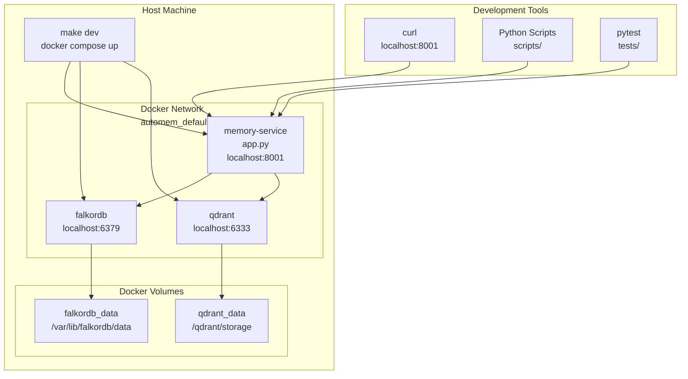

AutoMem provides two local development paths: Docker Compose (recommended) for a complete self-contained stack, and bare Python for lightweight API-only development against external database instances.

---

## Installation Method Comparison

| Feature | Docker Compose | Bare Metal |
|---------|---------------|-----------|
| Setup Time | 5 minutes | 2 minutes |
| External Access | Local only | Local only |
| Data Persistence | Named volumes (manual backup) | External DB dependent |
| Cost | Free | Free |
| Use Case | Full-stack development | API development only |
| Services Included | `app.py`, FalkorDB, Qdrant | `app.py` only |

**Prerequisites for all local methods:**

| Requirement | Version | Purpose |
|-------------|---------|---------|
| Python | 3.10+ | Runtime for `app.py` and background workers |
| Git | Any recent | Repository cloning |

---

## Docker Compose (Recommended)

Docker Compose provides a complete, isolated stack with FalkorDB, Qdrant, and the Flask API running in containers with persistent volumes.



### Prerequisites

- Docker 20.10+
- Docker Compose 2.0+

### Starting the Stack

**Method 1 — Makefile (recommended):**

```bash
make dev
```

This runs `docker compose up --build` and rebuilds the Flask API image if `Dockerfile` or `requirements.txt` have changed.

**Method 2 — Direct Docker Compose:**

```bash
docker compose up --build
```

### Service Details

| Service | Image/Build | Ports | Purpose | Health Check |
|---------|-------------|-------|---------|-------------|
| `flask-api` | Built from Dockerfile | 8001 | AutoMem Flask API with background workers | None (depends on FalkorDB health) |
| `falkordb` | `falkordb/falkordb:latest` | 6379 (Redis), 3000 (UI) | Graph database (canonical memory storage) | `redis-cli ping` every 10s |
| `qdrant` | `qdrant/qdrant:v1.11.3` | 6333 | Vector search database (optional) | None (service_started) |

**Default service URLs:**
- API: `http://localhost:8001`
- FalkorDB: `localhost:6379` (Redis protocol)
- FalkorDB UI (built-in, official): `http://localhost:3000` — use this for local graph inspection
- Qdrant: `http://localhost:6333`

> **Local FalkorDB UI vs `/viewer`.** The FalkorDB browser at `http://localhost:3000` is the official local graph-inspection UI shipped inside the `falkordb` container. The `/viewer` path on the AutoMem API is the production entrypoint — it redirects to the standalone [`automem-graph-viewer`](https://github.com/verygoodplugins/automem-graph-viewer) app when `GRAPH_VIEWER_URL` is set, and does not serve a local UI. If you run that standalone viewer locally alongside the Docker stack, note that it may also default to `http://localhost:3000`, so you will need to change one of the ports (for example, set `PORT` for the viewer) to avoid a collision.

### Volume Configuration

Docker Compose defines named volumes for persistent data and a bind mount for source code hot-reload:

| Volume | Container Path | Purpose | Persistence Level |
|--------|---------------|---------|------------------|
| `falkordb_data` | `/data` | RDB snapshots + AOF (append-only file) | High (every 60s or 1 key change) |
| `qdrant_data` | `/qdrant/storage` | Vector collections + write-ahead log | High (write-ahead log) |
| `fastembed_models` | `/root/.config/automem/models` | Downloaded ONNX embedding models | Medium (cache, re-downloadable) |
| `.` (bind mount) | `/app` | Source code for hot-reload | N/A (host filesystem) |
| `./backups/falkordb` | `/backups` | Manual RDB exports | N/A (host filesystem) |
| `./backups/qdrant` | `/backups` | Manual snapshot exports | N/A (host filesystem) |

**FalkorDB persistence settings** (`REDIS_ARGS` in `docker-compose.yml`):

- `--save 60 1` — Create RDB snapshot every 60 seconds if at least 1 key changed
- `--appendonly yes` — Enable AOF for durability
- `--appendfsync everysec` — Sync AOF to disk every second
- `--dir /data` — Store persistence files in the mounted volume

### Environment Variables

Required variables for the Docker Compose stack:

| Variable | Docker Compose Default | Purpose | Notes |
|----------|----------------------|---------|-------|
| `PORT` | `8001` | Flask API port | Must match container port mapping |
| `AUTOMEM_API_TOKEN` | `${AUTOMEM_API_TOKEN:-test-token}` | Client authentication | Set via shell or `.env` |
| `ADMIN_API_TOKEN` | `${ADMIN_API_TOKEN:-test-admin-token}` | Admin endpoint authentication | Set via shell or `.env` |
| `FALKORDB_HOST` | `falkordb` | FalkorDB service name | Docker internal DNS resolution |
| `FALKORDB_PORT` | `6379` | FalkorDB port | Standard Redis port |

Optional variables with defaults:

| Variable | Docker Compose Default | Purpose | Notes |
|----------|----------------------|---------|-------|
| `FLASK_ENV` | `development` | Flask environment mode | Enables debug mode, hot-reload |
| `FLASK_DEBUG` | `"1"` | Flask debug flag | Enables detailed error pages |
| `FALKORDB_PASSWORD` | `${FALKORDB_PASSWORD:-}` | FalkorDB authentication | Empty by default (no auth) |
| `QDRANT_URL` | `http://qdrant:6333` | Qdrant endpoint | Docker internal URL |
| `QDRANT_API_KEY` | `${QDRANT_API_KEY:-}` | Qdrant authentication | Not required for local Qdrant |
| `OPENAI_API_KEY` | `${OPENAI_API_KEY:-}` | OpenAI API access | Falls back to placeholder embeddings |
| `EMBEDDING_PROVIDER` | `${EMBEDDING_PROVIDER:-auto}` | Provider selection | `auto\|openai\|voyage\|local\|placeholder` |
| `AUTOMEM_MODELS_DIR` | `/root/.config/automem/models` | FastEmbed model cache | Must match volume mount path |

Environment variable resolution order inside Docker Compose:

1. **Process environment** — `export OPENAI_API_KEY=sk-...` before running `docker compose up`
2. **`.env` file** — Create `.env` in project root with `OPENAI_API_KEY=sk-...`
3. **Docker Compose defaults** — Fallback values in `docker-compose.yml`

### Service Dependencies and Health Checks

Docker Compose manages startup order using `depends_on` conditions:

- **FalkorDB** has an active health check (`redis-cli ping` every 10s, 5 retries)
- **Flask API** waits for `condition: service_healthy` on FalkorDB — it will not start until FalkorDB is accepting connections
- **Qdrant** uses `condition: service_started` — the Flask API starts as soon as the Qdrant container starts and handles connection failures gracefully

### Port Mappings

| Container Port | Host Port | Service | Protocol | Purpose |
|---------------|-----------|---------|----------|---------|
| 8001 | 8001 | flask-api | HTTP | AutoMem REST API |
| 6379 | 6379 | falkordb | TCP (Redis) | FalkorDB graph queries |
| 3000 | 3000 | falkordb | HTTP | FalkorDB built-in web UI |
| 6333 | 6333 | qdrant | HTTP | Qdrant vector search API |

Flask API connects to dependencies using service names (`FALKORDB_HOST=falkordb`, `QDRANT_URL=http://qdrant:6333`). Docker Compose automatically creates DNS entries for each service name on the `automem_default` bridge network.

### Development Workflow

**Makefile commands reference:**

| Command | Underlying Action | Purpose | Data Loss Risk |
|---------|-----------------|---------|---------------|
| `make dev` | `docker compose up --build` | Start all services, rebuild images if Dockerfile changed | None |
| `make stop` | `docker compose down` | Stop containers, preserve volumes | None |
| `make logs` | `docker compose logs -f flask-api` | Follow Flask API logs in real-time | None |
| `make test-integration` | Start services, run `pytest -rs -m integration`, keep running | Run integration test suite against local Docker stack | None (uses test tokens) |
| `make clean` | `docker compose down -v` | Stop containers, remove volumes | **High** — deletes all memory data |

**Hot-reload during development:**

The Flask API container mounts the project directory as a volume with `FLASK_DEBUG=1`. Edit any Python file and the API automatically reloads within ~2 seconds — no need to restart containers.

**Running integration tests:**

`make test-integration` orchestrates a full test run:

1. Starts Docker Compose with test tokens (`AUTOMEM_API_TOKEN=test-token`, `ADMIN_API_TOKEN=test-admin-token`)
2. Waits 5 seconds for service initialization
3. Runs pytest with `AUTOMEM_RUN_INTEGRATION_TESTS=1`
4. Leaves services running for debugging

---

## Bare Metal Python

Direct execution of `app.py` without containerization. Requires external database instances.

### Prerequisites

- External FalkorDB instance on port 6379
- Optional: External Qdrant instance on port 6333
- Python 3.10+ virtual environment

### Setup Steps

**Step 1 — Create virtual environment and install dependencies:**

```bash
git clone https://github.com/verygoodplugins/automem.git
cd automem
python -m venv venv
source venv/bin/activate
pip install -r requirements.txt
```

**Step 2 — Configure environment:**

Create `.env` in project root or export variables:

```bash
FALKORDB_HOST=localhost
FALKORDB_PORT=6379
AUTOMEM_API_TOKEN=your-dev-token
ADMIN_API_TOKEN=your-admin-token
PORT=8001
# Optional: enable vector search
QDRANT_URL=http://localhost:6333
# Optional: enable real embeddings
OPENAI_API_KEY=sk-...
```

**Step 3 — Run the application:**

```bash
python app.py
```

**Expected startup output:**

```
[INFO] Loading configuration...
[INFO] Connecting to FalkorDB at localhost:6379
[INFO] FalkorDB connected successfully
[INFO] Starting enrichment worker thread
[INFO] Starting embedding worker thread
[INFO] Starting consolidation scheduler
 * Running on http://[::]:8001
```

The server binds to `[::]` (IPv6 dual-stack) on port 8001.

---

## Verification and Health Checks

After starting either method, verify AutoMem is operational:

```bash
curl http://localhost:8001/health
```

**Expected response (healthy):**

```json
{
  "status": "healthy",
  "falkordb": "connected",
  "qdrant": "connected",
  "memory_count": 0,
  "enrichment": {
    "status": "running",
    "queue_depth": 0
  },
  "graph": "memories"
}
```

**Response fields:**

| Field | Type | Description |
|-------|------|-------------|
| `status` | string | Overall health: `"healthy"` or `"unhealthy"` |
| `falkordb` | string | FalkorDB connection: `"connected"` or error message |
| `qdrant` | string | Qdrant connection: `"connected"`, `"unavailable"`, or `"not configured"` |
| `memory_count` | integer | Total memories in graph |
| `enrichment.status` | string | Worker thread state: `"running"` or `"stopped"` |
| `enrichment.queue_depth` | integer | Pending enrichment jobs |
| `graph` | string | FalkorDB graph name (default: `memories`) |

:::note
`"qdrant": "unavailable"` is **expected behavior** when Qdrant is not configured. AutoMem gracefully degrades — vector search is disabled but all graph-based operations continue normally. To enable Qdrant, set `QDRANT_URL` and restart.
:::

### Common Health Check Failures

| Problem | Cause | Solution |
|---------|-------|---------|
| 503 Service Unavailable | FalkorDB not running | `docker compose up -d falkordb` |
| 503 Service Unavailable | Incorrect `FALKORDB_HOST` | Railway uses `.railway.internal`; Docker uses `falkordb` |
| 503 Service Unavailable | Wrong `FALKORDB_PORT` | Default is `6379` |
| 503 Service Unavailable | Auth failure | Check `FALKORDB_PASSWORD` matches both services |

### First Memory Test

After the health check passes, store and retrieve a test memory:

```bash
# Store a memory
curl -X POST http://localhost:8001/memory \
  -H "Authorization: Bearer test-token" \
  -H "Content-Type: application/json" \
  -d '{"content": "Prefer PostgreSQL for relational data", "type": "Preference"}'

# Recall memories
curl "http://localhost:8001/recall?q=database+preferences" \
  -H "Authorization: Bearer test-token"
```

**Successful response indicators:**
- POST returns `201 Created` with `memory_id`
- GET `/recall` returns non-empty `results` array
- Memory appears with `match_type: "vector"` or `"keyword"`

---

## Production Considerations

Docker Compose is optimized for development. Production deployments require additional hardening:

| Aspect | Docker Compose (Dev) | Production Recommendations |
|--------|---------------------|--------------------------|
| **Debug Mode** | `FLASK_DEBUG=1`, verbose logging | Disable debug, set `LOG_LEVEL=INFO` or `WARNING` |
| **API Tokens** | Defaults to `test-token`, `test-admin-token` | Generate cryptographically secure tokens (32+ chars) |
| **Port Exposure** | All ports mapped to localhost | Use reverse proxy (nginx, Traefik); expose only necessary ports |
| **Volume Backups** | Manual exports to `./backups/` | Automated backups to S3/remote storage |
| **Resource Limits** | Unlimited | Set `deploy.resources.limits` in docker-compose.yml |
| **Restart Policy** | `restart: unless-stopped` | Use `restart: always` with health checks |
| **SSL/TLS** | HTTP only | Terminate SSL at reverse proxy or use Traefik |
| **Monitoring** | Docker logs | External monitoring (Prometheus, health checks) |

**When to use Docker Compose vs. Railway:**

| Scenario | Recommended Deployment |
|----------|----------------------|
| Single developer, local-only access | Docker Compose on local machine |
| Team collaboration, remote access needed | Railway |
| Self-hosted production, existing infrastructure | Docker Compose with reverse proxy + backups |
| Prototyping, short-term experiments | Docker Compose (no cloud costs) |
| Production with minimal ops overhead | Railway (managed backups, monitoring) |
| Air-gapped environments, strict data locality | Docker Compose on self-hosted infrastructure |

### Migrating from Docker Compose to Railway

Data can be migrated using backup/restore scripts:

1. **Export from Docker Compose:**

   ```bash
   # Export FalkorDB RDB
   docker compose exec falkordb redis-cli SAVE
   docker compose cp falkordb:/data/dump.rdb ./backups/falkordb/

   # Export Qdrant snapshot
   curl -X POST http://localhost:6333/collections/memories/snapshots
   ```

2. **Import to Railway:**

   Use the GitHub Actions backup workflow to populate Railway from exported snapshots.
