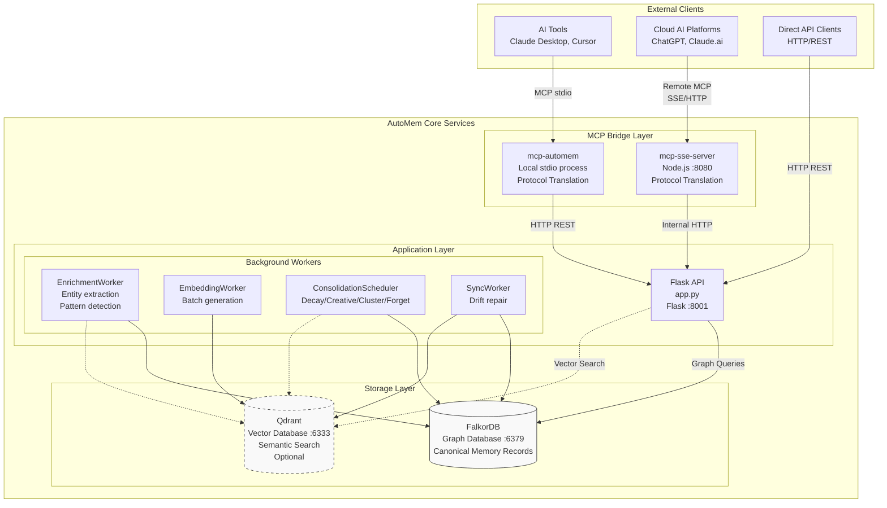
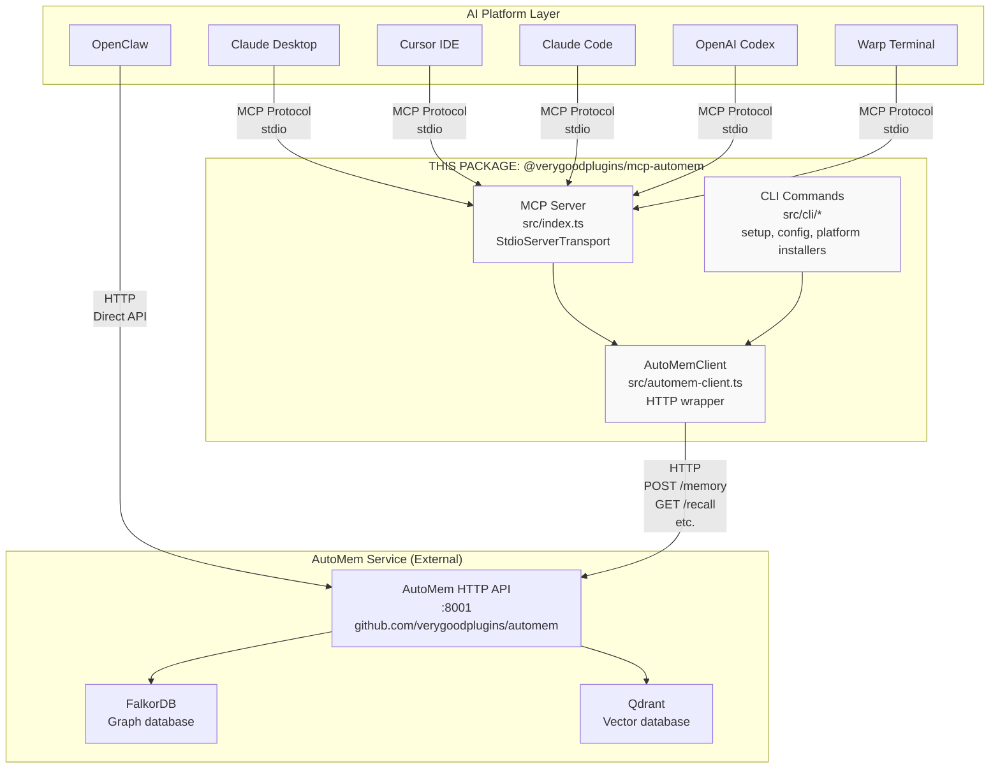

AutoMem gives AI assistants persistent memory that survives across sessions, devices, and platforms. When you tell Claude Desktop something important, AutoMem stores it. When you open Cursor the next day, that memory is still there — retrieved automatically and woven into context before your AI assistant even responds.

## What AutoMem Is

AutoMem is a self-hosted memory backend for AI assistants. It stores, enriches, and retrieves memories using a combination of graph and vector databases, enabling AI tools to remember facts, decisions, preferences, and patterns across any number of sessions or platforms.

Unlike context windows that reset with every conversation, AutoMem maintains a persistent knowledge graph that grows over time. Memories are enriched in the background with entity extraction, embeddings, and relationship mapping — then recalled via hybrid search that combines semantic similarity with graph traversal.

**What gets remembered:**

| Memory Type | Description | Example |
|---|---|---|
| `Decision` | Strategic or technical decisions | "Chose PostgreSQL for ACID compliance" |
| `Pattern` | Recurring approaches | "Always use transactions for batch updates" |
| `Preference` | User or team preferences | "Prefer async/await over callbacks" |
| `Style` | Code style conventions | "Use 4-space indentation for Python" |
| `Habit` | Regular workflows | "Run tests before committing" |
| `Insight` | Key learnings | "Connection pooling reduces latency by 40%" |
| `Context` | General information | "Project uses Python 3.10+" |

:::tip
If you omit `type` when storing a memory, the enrichment pipeline classifies it automatically using LLM-based classification.
:::

## Two-Component Architecture

AutoMem consists of two separate components that work together:

1. **The AutoMem server** (`verygoodplugins/automem`) — a Python/Flask service that handles memory storage, retrieval, and enrichment. It runs your databases and exposes a REST API.

2. **The MCP client** (`verygoodplugins/mcp-automem`) — a TypeScript/Node.js package that translates Model Context Protocol calls from AI platforms into AutoMem HTTP API requests.

The MCP client does not store memories itself. It is a bridge — it receives instructions from AI platforms (via the MCP protocol over stdio) and forwards them to the AutoMem server over HTTP.



### The AutoMem Server

The server (Flask on port 8001, run via `python app.py`) is the authoritative memory store. The codebase is organized as an `automem/` Python package — `app.py` is a ~631-line orchestration file that imports from the package rather than a monolithic application. It provides:

- A REST API for storing, recalling, updating, and deleting memories
- A FalkorDB graph database for canonical memory records and relationship traversal
- An optional Qdrant vector database for semantic search (the system degrades gracefully without it)
- Background worker threads for enrichment (entity extraction, embedding generation) and consolidation (decay, creative association, clustering, forgetting)

### The MCP Client

The MCP client (`@verygoodplugins/mcp-automem`) operates in two modes depending on how it is invoked:

- **Server mode**: When AI platforms launch it with no arguments (`npx -y @verygoodplugins/mcp-automem`), it starts a `StdioServerTransport` and listens on stdin/stdout for JSON-RPC messages from the platform.
- **CLI mode**: When invoked with arguments (`npx @verygoodplugins/mcp-automem setup`), it routes to command handlers for setup, configuration, and platform installation.

Both modes use the same `AutoMemClient` class (`src/automem-client.ts`) for HTTP communication with the AutoMem service.



## How Memory Works End-to-End

When an AI assistant calls `store_memory`:

1. The MCP client validates content length (hard limit: 2000 characters; soft limit: 500 characters — above this, the backend may summarize before embedding)
2. The Flask API receives a `POST /memory` request
3. `MemoryClassifier` classifies the content type
4. `EmbeddingProvider` generates a vector representation
5. FalkorDB stores the canonical memory record via a MERGE query
6. Qdrant stores the vector for semantic search (if available)
7. Background enrichment is queued via `ServiceState.enrichment_queue`

When an AI assistant calls `recall_memory`, the system runs hybrid search: parallel queries against both the semantic vector store and the graph database, then merges and re-ranks results using a 10-component relevance score.

:::note
The `recall_memory` tool selects one of three mutually exclusive retrieval modes: ID fetch (`GET /memory/{id}`), tag enumeration (`GET /memory/by-tag`, when `exhaustive: true`), or ranked hybrid search (`GET /recall`, the default). Only one endpoint is called per request.
:::

## Why Two Repositories

The separation between server and client is intentional:

- **Deployment flexibility** — run the memory backend on different infrastructure than the MCP client
- **Multi-client support** — multiple MCP clients (on different machines or platforms) can share one AutoMem instance
- **Scaling independence** — scale memory storage separately from MCP protocol handling
- **Technology separation** — backend uses Python/Flask while the client uses TypeScript

## Prerequisites

### Server Prerequisites

| Deployment Method | Requirements |
|---|---|
| Railway (Cloud) | Railway account (free trial available) |
| Docker Compose (Local) | Docker 20.10+, Docker Compose 2.0+ |
| Bare Metal | Python 3.10+, external FalkorDB instance |

**Optional enhancements** that improve functionality:

- **OpenAI API key** — enables semantic embeddings instead of placeholder hash-based vectors
- **Voyage API key** — alternative embedding provider with better performance
- **Qdrant Cloud account** — enables vector search (AutoMem degrades gracefully without it)
- **spaCy model** — richer entity extraction during enrichment (`python -m spacy download en_core_web_sm`)

:::note
Without an `OPENAI_API_KEY`, the system uses `PlaceholderEmbeddingProvider` which generates deterministic hash-based vectors with no semantic meaning. Memory storage and graph queries still work, but recall quality will be lower.
:::

### MCP Client Prerequisites

- **Node.js 20.19.0+, 22.13.0+, or 24+** — required for ESM support, the native fetch API, and modern async/await patterns (`engines: "^20.19.0 || ^22.13.0 || >=24"` in package.json)
- **A running AutoMem service** — the backend must be deployed before the MCP client can be configured

Check your Node.js version:

```bash
node --version
# Should output v20.19.x, v22.13.x, or v24.x.x or higher
```

If you need to upgrade:

| Method | Command |
|---|---|
| nvm (recommended) | `nvm install 20` |
| Official installer | Download from [nodejs.org](https://nodejs.org) |
| Homebrew (macOS) | `brew install node@20` |
| Package manager (Linux) | `apt install nodejs` or equivalent |

## Supported Platforms

The MCP client supports the following AI platforms via stdio:

- Claude Desktop (macOS, Windows, Linux)
- Cursor IDE
- Claude Code
- OpenAI Codex
- Warp Terminal
- OpenClaw

Cloud AI platforms (ChatGPT, Claude Web/Mobile, ElevenLabs) connect via a Remote MCP sidecar deployed alongside the AutoMem server on Railway.

## Next Steps

- **Deploy and connect**: See [Quick Start](/docs/getting-started/quick-start/) to deploy the server and connect your first platform in 5 minutes.
- **Platform-specific setup**: See the Platform Integrations section for Claude Desktop, Cursor, Claude Code, and others.
- **Understand the memory model**: See Core Concepts for memory types, relationships, and hybrid search.
- **API reference**: See the API Reference section for complete endpoint documentation.
