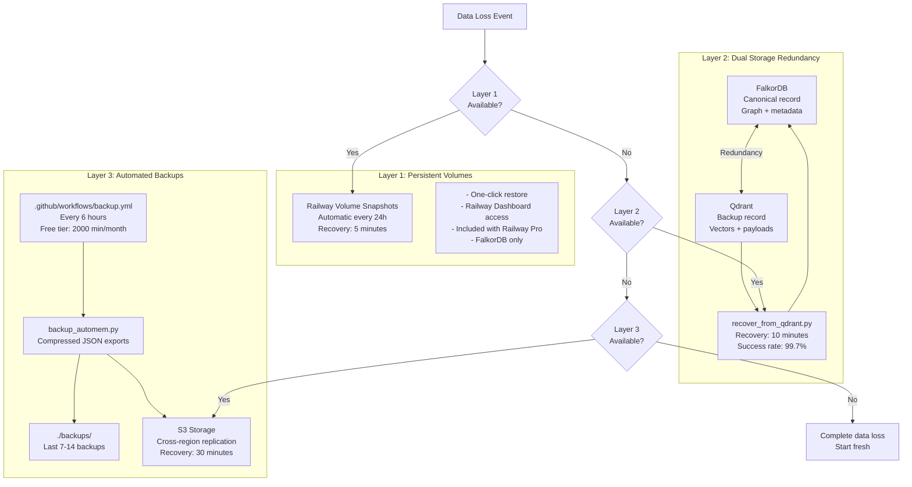
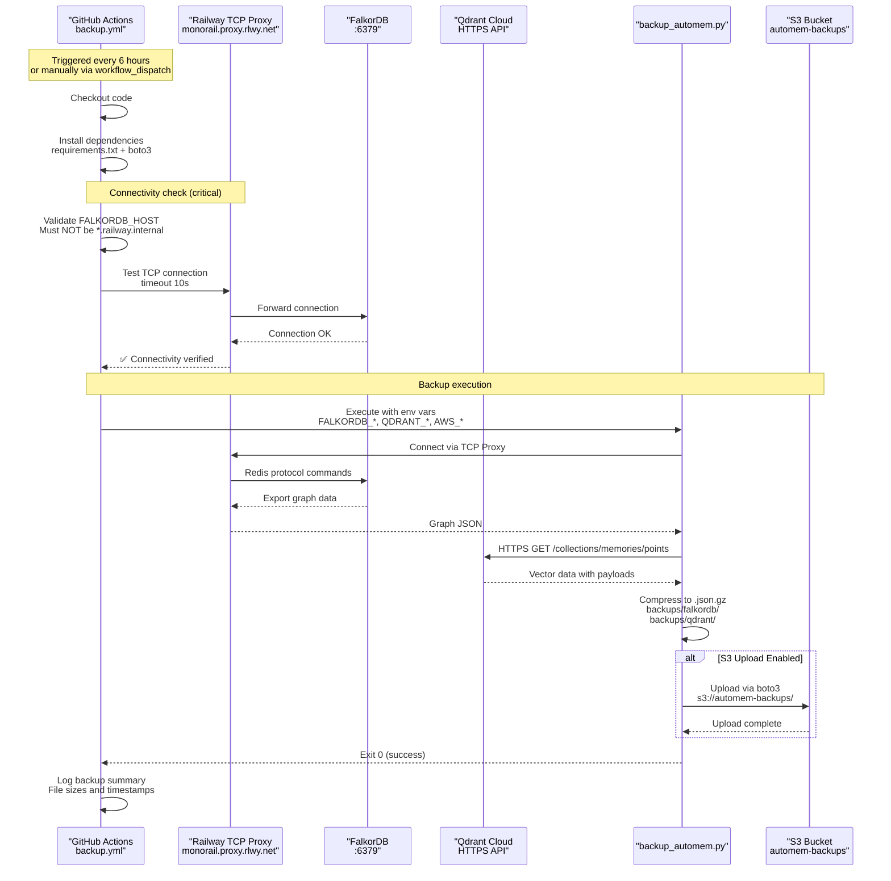
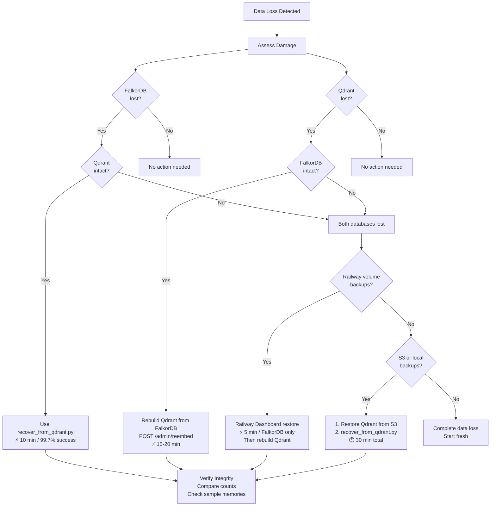
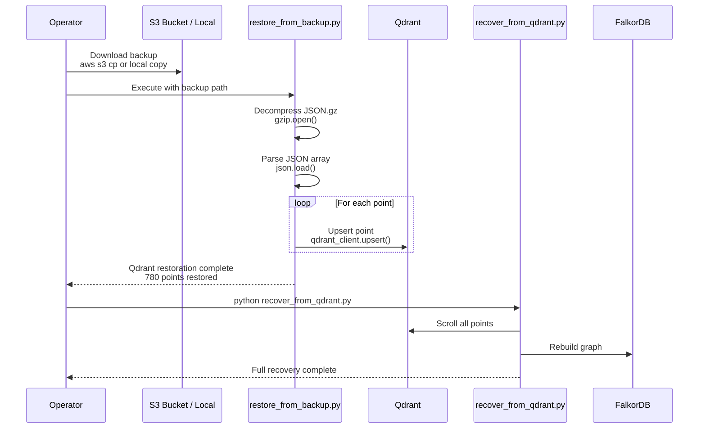
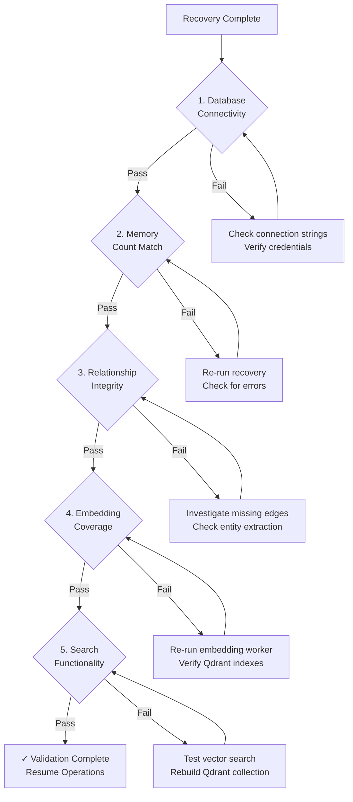

:::note[Source files]
This page combines content from [docs/MONITORING_AND_BACKUPS.md](https://github.com/verygoodplugins/automem/blob/main/docs/MONITORING_AND_BACKUPS.md), [.github/workflows/backup.yml](https://github.com/verygoodplugins/automem/blob/main/\.github/workflows/backup.yml), and [docs/RAILWAY_DEPLOYMENT.md](https://github.com/verygoodplugins/automem/blob/main/docs/RAILWAY_DEPLOYMENT.md).
:::

This page describes the backup strategies and disaster recovery procedures available for AutoMem deployments. It covers the three-layer backup architecture, automated backup methods, configuration options, backup formats, and four recovery paths for different failure scenarios. For monitoring backup health and detecting data drift, see [Health Monitoring](/docs/operations/health/).

## Backup Architecture Overview

AutoMem implements a defense-in-depth backup strategy with three independent layers:



### Layer Responsibilities

| Layer | Mechanism | Recovery Speed | Scope | Platform Lock |
|---|---|---|---|---|
| **Infrastructure** | Railway volume snapshots | Instant | FalkorDB only | Yes (Railway) |
| **Dual Storage** | Real-time dual writes | Immediate | Both databases | No |
| **Application** | Script exports | Minutes | Both databases | No |
| **Automated** | Scheduled execution | N/A (prevention) | Both databases | No |

---

## Infrastructure Backups (Layer 1)

### Railway Volume Snapshots

Railway provides automatic volume backups for the FalkorDB persistent volume configured in the deployment template.

The FalkorDB service uses a persistent volume mounted at `/var/lib/falkordb/data`. The Redis persistence settings ensure data durability with the following configuration:

- RDB snapshots every 60 seconds if at least 1 write
- AOF (Append-Only File) for write-ahead logging
- `fsync` every second for durability

**Accessing and restoring snapshots:**

1. Railway Dashboard → FalkorDB service
2. "Backups" tab shows snapshot history
3. One-click restore from any snapshot

**Limitations:**

- Only covers FalkorDB (Qdrant not included)
- Cannot export or download backups
- Platform-locked to Railway
- Best for quick recovery from recent failures

---

## Application-Level Backups (Layer 3)

### backup_automem.py Script

The core backup script at [`scripts/backup_automem.py`](https://github.com/verygoodplugins/automem/blob/main/scripts/backup_automem.py) exports data from both FalkorDB and Qdrant to compressed JSON files.

### Backup Format

**FalkorDB Export Structure:**

The FalkorDB export captures the entire Redis keyspace including:

- Memory nodes with all properties
- Relationship edges
- Metadata and indices
- Graph structure information

**Qdrant Export Structure:**

The Qdrant export includes:

- Vector embeddings (dimensions depend on `VECTOR_SIZE` config: 768, 1024, 2048, or 3072)
- Payload data (memory content, metadata, tags)
- Point IDs mapped to memory IDs
- Collection configuration

Both exports are compressed using `gzip` with `.json.gz` extension, typically achieving 70-80% compression ratio.

### Command-Line Usage

```bash
# Basic backup - creates timestamped backups in ./backups/falkordb/ and ./backups/qdrant/
python scripts/backup_automem.py

# With retention policy - deletes backups older than 7 days after creating new ones
python scripts/backup_automem.py --cleanup --keep 7

# Custom directory
python scripts/backup_automem.py --backup-dir /path/to/backups

# With S3 upload - requires boto3 and AWS credentials set via environment variables
python scripts/backup_automem.py --s3-bucket automem-backups
```

### Local Filesystem Storage

Backups are written to timestamped subdirectories:

```
backups/
├── falkordb/
│   ├── falkordb_20251020_143000.json.gz
│   ├── falkordb_20251020_203000.json.gz
│   └── ...
└── qdrant/
    ├── qdrant_20251020_143000.json.gz
    ├── qdrant_20251020_203000.json.gz
    └── ...
```

The `--cleanup --keep N` flag removes backups older than N days based on filename timestamp parsing.

### S3 Cloud Storage

```
s3://automem-backups/
├── falkordb/
│   ├── falkordb_20251020_143000.json.gz
│   └── ...
└── qdrant/
    ├── qdrant_20251020_143000.json.gz
    └── ...
```

**S3 Cost Estimation:**

| Component | Formula | Example |
|---|---|---|
| Storage | $0.023/GB/month | 100MB backup = $0.0023/month |
| PUT requests | $0.005/1000 requests | 4 backups/day = $0.60/year |
| GET requests (restore) | $0.0004/1000 requests | Negligible |
| **Total (100MB, every 6h)** | - | **~$0.30/month** |

---

## Automated Backup Methods (Layer 4)

### GitHub Actions Workflow

The recommended automation method uses GitHub Actions to run backups on a schedule without consuming Railway resources.



The workflow is defined in [`.github/workflows/backup.yml`](https://github.com/verygoodplugins/automem/blob/main/.github/workflows/backup.yml) and triggers every 6 hours or manually via `workflow_dispatch`.

:::caution[TCP Proxy requirement]
The workflow validates that `FALKORDB_HOST` is not a Railway internal hostname (`*.railway.internal`), as GitHub Actions runners cannot access internal Railway domains. The TCP proxy must be enabled to provide external connectivity.
:::

### Required GitHub Secrets

| Secret | Purpose | Example | Used By |
|---|---|---|---|
| `FALKORDB_HOST` | Railway TCP proxy domain | `monorail.proxy.rlwy.net` | `redis.Redis()` connection |
| `FALKORDB_PORT` | Railway TCP proxy port | `12345` | `redis.Redis()` connection |
| `FALKORDB_PASSWORD` | FalkorDB authentication | Generated by Railway | `redis.Redis(password=)` |
| `QDRANT_URL` | Qdrant endpoint | `https://xyz.qdrant.io` | `QdrantClient(url=)` |
| `QDRANT_API_KEY` | Qdrant authentication | API key from Qdrant Cloud | `QdrantClient(api_key=)` |
| `AWS_ACCESS_KEY_ID` | S3 upload (optional) | AWS credentials | `boto3.client('s3')` |
| `AWS_SECRET_ACCESS_KEY` | S3 upload (optional) | AWS credentials | `boto3.client('s3')` |
| `AWS_DEFAULT_REGION` | S3 region (optional) | `us-east-1` | `boto3.client('s3', region_name=)` |

The TCP proxy endpoint is found in Railway Dashboard → FalkorDB service → Settings → Networking → TCP Proxy.

### Railway Backup Service

For users who prefer Railway-hosted backups, [`scripts/Dockerfile.health-monitor`](https://github.com/verygoodplugins/automem/blob/main/scripts/Dockerfile.health-monitor) provides a containerized backup service that runs continuously.

The Dockerfile defines a Python 3.11 Alpine container that installs dependencies, copies the backup script, creates the output directory, and runs an infinite loop with backup and sleep cycles.

**Railway deployment configuration:**

- **Builder:** Dockerfile
- **Dockerfile Path:** `scripts/Dockerfile.health-monitor`
- **Root Directory:** `/` (project root)
- **Environment Variables:** Same as `memory-service`: `FALKORDB_HOST`, `FALKORDB_PORT`, `FALKORDB_PASSWORD`, `QDRANT_URL`, `QDRANT_API_KEY`, plus optional AWS credentials

**Resource usage:** Approximately $1-2/month on Railway Pro (minimal CPU/memory during sleep cycles).

---

## Backup Configuration Reference

### Environment Variables

| Variable | Required | Default | Description |
|---|---|---|---|
| `FALKORDB_HOST` | Yes | - | FalkorDB hostname or IP |
| `FALKORDB_PORT` | Yes | `6379` | FalkorDB Redis port |
| `FALKORDB_PASSWORD` | Yes | - | FalkorDB authentication password |
| `FALKORDB_GRAPH` | No | `memories` | Graph database name |
| `QDRANT_URL` | Yes* | - | Qdrant endpoint URL |
| `QDRANT_API_KEY` | Yes* | - | Qdrant API authentication |
| `QDRANT_COLLECTION` | No | `memories` | Qdrant collection name |
| `AWS_ACCESS_KEY_ID` | No | - | For S3 upload |
| `AWS_SECRET_ACCESS_KEY` | No | - | For S3 upload |
| `AWS_DEFAULT_REGION` | No | `us-east-1` | S3 region |

*Qdrant variables optional if system is running without vector storage.

### Retention Policy Recommendations

| Use Case | Backup Frequency | Retention Period | Storage Location | Estimated Cost |
|---|---|---|---|---|
| **Personal/Development** | Every 24 hours | 7 days | Local only | $0 |
| **Team/Small Production** | Every 6 hours | 14 days | Local + S3 | ~$0.50/month |
| **Production** | Every 1-6 hours | 30 days | S3 with versioning | ~$2-5/month |
| **Enterprise** | Every 1 hour | 90 days + archive | S3 + cross-region | ~$10-20/month |

---

## Backup Method Comparison

| Method | Scope | Speed | Automation | Platform Lock | Cost | Best For |
|---|---|---|---|---|---|---|
| **Railway Volumes** | FalkorDB only | Instant | Automatic | Yes | Included | Quick recovery |
| **GitHub Actions** | Both databases | 5-10 min | Scheduled | No | Free | Most users |
| **Railway Service** | Both databases | 5-10 min | Continuous | Partial | $1-2/mo | Railway-centric |
| **Manual Script** | Both databases | 5-10 min | Manual | No | Free | Development |

:::tip[Recommendation]
Use GitHub Actions for automated backups with S3 storage. Railway volumes provide additional quick-recovery capability for FalkorDB.
:::

---

## Disaster Recovery

### Recovery Decision Matrix

| Failure Scenario | Data Available | Recovery Method | Primary Tool | RTO |
|---|---|---|---|---|
| FalkorDB data loss | Qdrant intact | Qdrant-based rebuild | `recover_from_qdrant.py` | 2-5 min |
| FalkorDB persistence disabled | Qdrant intact | Qdrant-based rebuild | `recover_from_qdrant.py` | 2-5 min |
| Qdrant data loss | FalkorDB intact | Background re-embedding | Enrichment queue | 30-60 min |
| Both databases corrupted | Backup files (S3/local) | File restoration | `restore_from_backup.py` + recovery | 10-20 min |
| Railway volume failure | Railway snapshots | Volume restore | Railway dashboard | 5-10 min |
| Drift detected (5-50%) | Both databases available | Selective sync | `health_monitor.py --auto-recover` | 1-2 min |

### Recovery Decision Tree



---

## Method 1: Qdrant-Based Recovery

The fastest and most reliable recovery method. Uses Qdrant's vector payloads to rebuild the entire FalkorDB graph structure.

**When to use:**
- FalkorDB lost all data (container restart, persistence misconfiguration)
- FalkorDB corrupted but Qdrant intact
- Health monitor detects >50% drift with Qdrant having more data

**Recovery process details:**

| Function | Purpose | Code Location |
|---|---|---|
| `qdrant_client.scroll()` | Fetch all vectors with payloads | Qdrant SDK call |
| `_filter_reserved_fields()` | Remove type, confidence from metadata | [`scripts/recover_from_qdrant.py`](https://github.com/verygoodplugins/automem/blob/main/scripts/recover_from_qdrant.py) |
| `CREATE MERGE (m:Memory)` | Rebuild memory nodes | Cypher query in recovery loop |
| Relationship extraction | Parse `metadata.relationships` array | Recovery loop logic |

:::note[Critical Fix (v0.5.0)]
The script now filters `RESERVED_FIELDS = {"type", "confidence", "content", "timestamp", "importance", "tags", "id"}` to prevent metadata pollution that occurred in earlier versions where recovery overwrote memory types.
:::

**Execution steps:**

```bash
# Step 1: Verify Qdrant availability
curl https://your-qdrant-url/collections/memories

# Step 2: Run recovery script with database environment variables
FALKORDB_HOST=falkordb.railway.internal \
FALKORDB_PORT=6379 \
FALKORDB_PASSWORD=your-password \
QDRANT_URL=https://your-qdrant-url \
QDRANT_API_KEY=your-key \
python scripts/recover_from_qdrant.py

# Step 3: Monitor recovery progress in stdout
```

**Known limitations:**
- **99.7% recovery rate:** In testing, 2/780 memories failed due to malformed data
- **Relationship loss:** If relationships were stored only in FalkorDB (not in Qdrant payload), they won't be recovered
- **Recent writes:** Memories written in the last 2 seconds (before embedding completes) may be missing from Qdrant

---

## Method 2: Backup File Restoration

Used when both databases are lost or corrupted. Restores from compressed JSON backups stored locally or in S3.

**When to use:**
- Both FalkorDB and Qdrant lost
- Recovery from specific point in time needed
- Testing disaster recovery procedures

**Backup file structure:**

```
backups/
├── falkordb/
│   ├── falkordb_20251020_143000.json.gz
│   └── falkordb_20251020_083000.json.gz
└── qdrant/
    ├── qdrant_20251020_143000.json.gz
    └── qdrant_20251020_083000.json.gz
```

Each Qdrant backup contains an array of point objects with `id`, `vector` (float array, dimensions match `VECTOR_SIZE` config), and `payload` (content, memory_id, tags, importance, type, created_at).

### Restoration Flow



**Execution steps:**

```bash
# Step 1: Download backup files from S3
aws s3 cp s3://automem-backups/qdrant/qdrant_20251020_143000.json.gz ./

# Step 2: Decompress backup
gunzip qdrant_20251020_143000.json.gz

# Step 3: Restore to Qdrant
python scripts/restore_from_backup.py --file qdrant_20251020_143000.json

# Step 4: Rebuild FalkorDB from Qdrant
python scripts/recover_from_qdrant.py
```

### Recovery Time Estimate

| Database Size | Decompress | Qdrant Upload | FalkorDB Rebuild | Total |
|---|---|---|---|---|
| 100 memories | <1 sec | 5 sec | 10 sec | ~15 sec |
| 1,000 memories | 2 sec | 30 sec | 60 sec | ~2 min |
| 10,000 memories | 10 sec | 5 min | 10 min | ~15 min |
| 100,000 memories | 30 sec | 30 min | 60 min | ~90 min |

---

## Method 3: Railway Volume Restore

Uses Railway's built-in volume snapshots for instant recovery of FalkorDB data.

**When to use:**
- FalkorDB volume corruption
- Need to rollback to specific snapshot
- Quick recovery without external dependencies

**Restoration steps:**

1. Log in to Railway dashboard, navigate to FalkorDB service, click "Volumes" tab
2. View available snapshots (sorted by date), note timestamp and size
3. Click "Restore" next to chosen snapshot and confirm (irreversible action)
4. Railway stops the FalkorDB service, replaces volume with snapshot data, restarts the service
5. Verify service health with `curl https://your-automem-url/health`

**Limitations:**
- **Railway-locked:** Cannot export snapshots outside Railway platform
- **FalkorDB only:** Does not restore Qdrant data
- **Snapshot frequency:** Default 24-hour intervals (may lose up to 24 hours of data)
- **Retention policy:** Depends on Railway plan (Pro plan: 30 days)

---

## Method 4: Drift-Based Selective Recovery

Uses the health monitor to detect and automatically fix inconsistencies between FalkorDB and Qdrant without full recovery.

**When to use:**
- Health monitor detects 5-50% drift
- Both databases online but inconsistent
- Partial write failures suspected
- Preventive maintenance

```bash
# Enable auto-recovery on health monitor service
HEALTH_MONITOR_AUTO_RECOVER=true

# Or trigger manual recovery
python scripts/health_monitor.py --auto-recover
```

---

## Recovery Validation

After any recovery procedure, verify system integrity before returning to production.



### Validation Procedures

**1. Database Connectivity:**

```bash
curl https://your-automem-url/health
```

**2. Memory Count Verification:**

```bash
# Check FalkorDB count matches Qdrant count
curl https://your-automem-url/health | jq '.statistics'
```

**3. Relationship Integrity:**

```bash
# Use analyze endpoint to check relationship distribution
curl https://your-automem-url/analyze | jq '.relationship_types'
```

**4. Embedding Coverage:**

```bash
# Verify all memories have embeddings
curl https://your-automem-url/analyze | jq '.embedding_coverage'
```

**5. Search Functionality:**

```bash
# Test recall with a known query
curl -X GET "https://your-automem-url/recall?query=test" \
  -H "Authorization: Bearer your-api-token"
```

### Post-Recovery Monitoring

Monitor the system for 24 hours after recovery:

| Metric | Check Frequency | Threshold | Action if Exceeded |
|---|---|---|---|
| Drift percentage | Every 5 min | >5% | Investigate write failures |
| Enrichment queue depth | Every 15 min | >100 | Check worker health |
| Embedding queue depth | Every 15 min | >500 | Verify OpenAI API key |
| API error rate | Every 5 min | >1% | Check logs for errors |
| Response time (p95) | Every 15 min | >2s | Investigate slow queries |

---

## Recovery Time Objectives (RTO)

| Scenario | Method | Detection | Execution | Validation | Total RTO |
|---|---|---|---|---|---|
| FalkorDB lost, Qdrant intact | Qdrant recovery | Immediate | 2-3 min | 1 min | **3-4 min** |
| FalkorDB persistence disabled | Qdrant recovery | Immediate | 2-3 min | 1 min | **3-4 min** |
| Both databases corrupted | Backup restore | Varies | 5-10 min | 2 min | **7-12 min** |
| Railway volume failure | Volume restore | Immediate | 3-5 min | 1 min | **4-6 min** |
| 5-20% drift detected | Selective sync | Auto (5 min) | 1-2 min | 1 min | **7-8 min** |
| Qdrant lost, FalkorDB intact | Re-embedding | Immediate | 30-60 min | 5 min | **35-65 min** |

**Recovery Point Objective (RPO):**
- **Best case:** 0 seconds (Qdrant recovery, dual storage)
- **Typical case:** 2 seconds (embedding queue latency)
- **Worst case:** 6 hours (last automated backup)

---

## Troubleshooting Recovery Failures

### Recovery Script Fails with Connection Error

**Problem:** `recover_from_qdrant.py` exits with "Failed to connect to FalkorDB"

**Solution:** Verify `FALKORDB_HOST`, `FALKORDB_PORT`, and `FALKORDB_PASSWORD` environment variables match the FalkorDB service configuration. For Railway deployments, use the internal hostname `falkordb.railway.internal` (or TCP proxy endpoint for external access).

### Qdrant Recovery Shows 0% Success Rate

**Problem:** Script reports "Recovered 0/780 memories"

**Solutions:**
- If collection doesn't exist: Use backup restoration method (Method 2)
- If payloads are missing: Qdrant was used for vectors only; recovery not possible without payloads

### Memory Types Corrupted After Recovery

**Problem:** `/analyze` shows invalid memory types like "str", "int", "boolean"

**Cause:** Using old version of `recover_from_qdrant.py` without `RESERVED_FIELDS` filtering

**Solution:** Update to v0.5.0+ of AutoMem. If already on old version, run [`scripts/cleanup_memory_types.py`](https://github.com/verygoodplugins/automem/blob/main/scripts/cleanup_memory_types.py) to fix corrupted types.

### Drift Persists After Recovery

**Problem:** Health monitor still reports >5% drift after running recovery

**Solutions:**
- If FalkorDB has more: Recent Qdrant writes may have failed; check Qdrant API key
- If Qdrant has more: FalkorDB may be read-only; check `REDIS_ARGS` includes `--save` and `--appendonly`
- If inconsistent: May need bidirectional sync; open a GitHub issue

---

## Testing Recovery Procedures

Regular recovery testing ensures procedures work when needed.

### Recommended Testing Schedule

| Environment | Test Frequency | Test Type | Data Source |
|---|---|---|---|
| Development | Weekly | Full recovery | Test data |
| Staging | Monthly | Full recovery | Production replica |
| Production | Quarterly | Validation only | Verify backup integrity |

:::caution[Safe testing]
Never test recovery procedures on production without a current backup. Always test on a staging environment first.
:::

### Verifying Backup Integrity

```bash
# Check backup files exist and have reasonable sizes
ls -lh backups/falkordb/ backups/qdrant/

# Validate memory counts from backup
zcat backups/qdrant/qdrant_latest.json.gz | jq 'length'

# Test decompression
gunzip -t backups/falkordb/falkordb_latest.json.gz && echo "OK"
```
