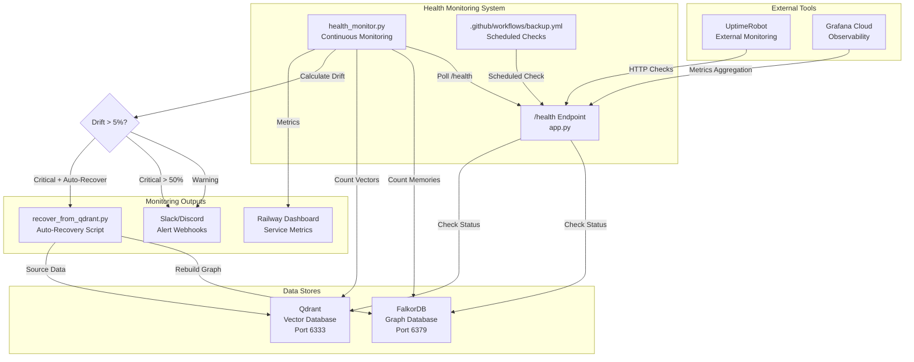
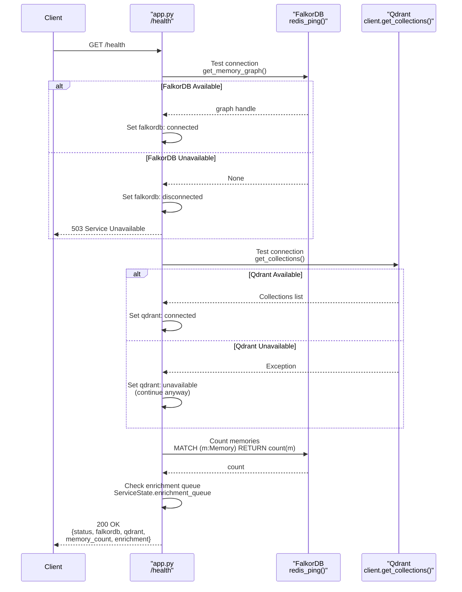
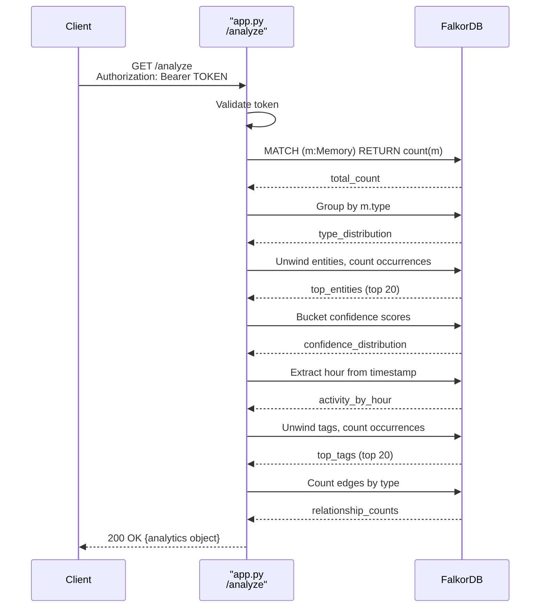
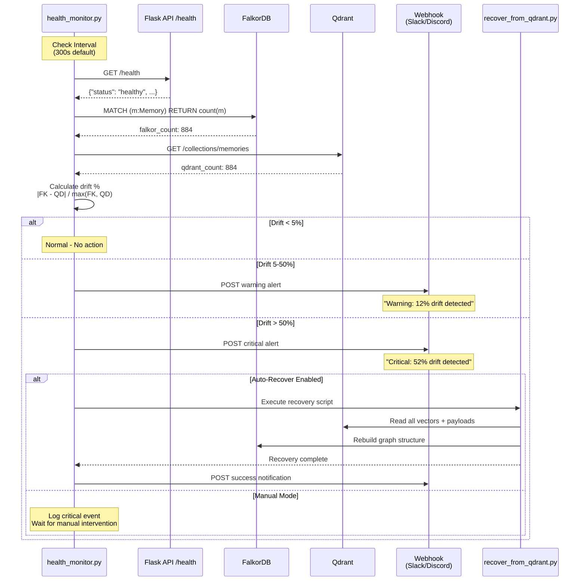
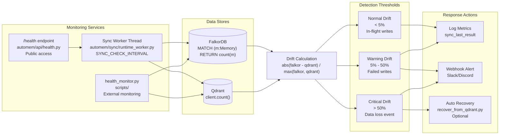
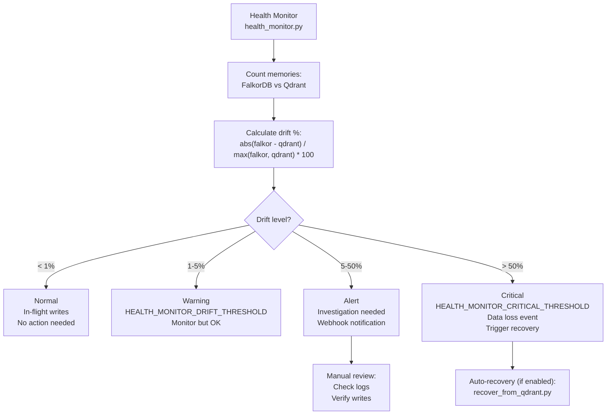

:::note[Source files]
This page merges content from two source documents: the **Health and Analytics** API reference (`5.6-health-and-analytics`) covering endpoint details and response schemas, and the **Health Monitoring** operations guide (`8.1-health-monitoring`) covering the monitoring architecture, drift detection, deployment options, and alerting.
:::

This page covers AutoMem's health monitoring system, which continuously tracks the status of FalkorDB and Qdrant databases, detects data synchronization drift, and can automatically trigger recovery when data loss is detected. It also documents the monitoring and introspection endpoints that provide visibility into AutoMem's operational status, database connectivity, queue health, and memory statistics.

For backup strategies and disaster recovery procedures, see [Backup & Recovery](/docs/operations/backup/). For deployment configuration, see [Railway Deployment](/docs/deployment/railway/).

## Architecture Overview

AutoMem's health monitoring system operates at multiple levels to ensure data integrity and service availability.

### Health Monitoring Components



## Health Endpoint

### `GET /health`

The health endpoint provides real-time service status, database connectivity checks, and enrichment pipeline metrics. This endpoint does **not** require authentication and is designed for automated health monitoring systems.

| Property | Value |
|---|---|
| **Path** | `/health` |
| **Method** | `GET` |
| **Authentication** | None (public endpoint) |
| **Response Type** | JSON |
| **Timeout** | 100 seconds (Railway default) |

#### Response Structure

```json
{
  "status": "healthy",
  "falkordb": "connected",
  "qdrant": "connected",
  "memory_count": 884,
  "vector_count": 884,
  "graph": "memories",
  "timestamp": "2025-10-20T14:30:00Z",
  "enrichment": {
    "status": "running",
    "queue_depth": 2,
    "pending": 2,
    "inflight": 0,
    "processed": 1247,
    "failed": 0
  }
}
```

#### Field Definitions

| Field | Type | Description |
|---|---|---|
| `status` | string | Overall health: `"healthy"`, `"degraded"`, or `"unknown"` |
| `falkordb` | string | FalkorDB status: `"connected"` or `"disconnected"` |
| `qdrant` | string | Qdrant status: `"connected"` or `"disconnected"` |
| `memory_count` | integer\|null | Total memories in FalkorDB (null if query fails) |
| `vector_count` | integer\|null | Total points in Qdrant collection (null if unavailable) |
| `enrichment` | object | Enrichment queue metrics (see below) |
| `graph` | string | FalkorDB graph name (`FALKORDB_GRAPH` env variable) |
| `timestamp` | string | ISO 8601 timestamp of health check |

#### Enrichment Queue Metrics

The `enrichment` object provides visibility into the background enrichment pipeline:

| Field | Type | Description |
|---|---|---|
| `status` | string | Worker state: `"running"` or `"stopped"` |
| `queue_depth` | integer | Total jobs in queue (pending + inflight) |
| `pending` | integer | Jobs waiting to be processed |
| `inflight` | integer | Jobs currently being processed |
| `processed` | integer | Total jobs completed since service start |
| `failed` | integer | Total jobs that failed permanently |

#### Status Values

| Field | Possible Values | Meaning |
|---|---|---|
| `status` | `healthy`, `degraded`, `unknown` | Overall service status |
| `falkordb` | `connected`, `disconnected` | FalkorDB connection state |
| `qdrant` | `connected`, `disconnected` | Qdrant connection state (optional service) |
| `enrichment.status` | `running`, `stopped` | Background enrichment worker state |

#### Health Check Flow



#### Example Requests

```bash
# Basic health check
curl https://your-project.up.railway.app/health

# With jq formatting
curl -s https://your-project.up.railway.app/health | jq .

# Check just the status field
curl -s https://your-project.up.railway.app/health | jq .status
```

#### Graceful Degradation

AutoMem continues operating even when components are unavailable:

- **Qdrant unavailable**: `status` remains `"healthy"`, `qdrant` shows `"disconnected"`
- **FalkorDB unavailable**: `status` becomes `"degraded"`, HTTP 503 returned
- **Enrichment worker stopped**: Service remains healthy but enrichment pipeline stops processing

#### Health Check Response Codes

| Status Code | Meaning | Action |
|---|---|---|
| `200` | Service healthy | Continue normal operation |
| `503` | Service degraded | FalkorDB or Qdrant unreachable |
| `500` | Service unhealthy | Critical failure in health check itself |

#### Integration with Railway

Railway's health check configuration monitors the `/health` endpoint to determine service availability. If the endpoint returns non-2xx status or fails to respond within 100 seconds, Railway marks the service as unhealthy and may restart it.

Railway health check configuration in `railway.json`:
```json
{
  "healthcheckPath": "/health",
  "healthcheckTimeout": 100
}
```

## Memory Analytics

### `GET /analyze`

The analyze endpoint provides comprehensive statistics about the memory graph, including type distributions, entity frequencies, temporal patterns, and relationship counts.

| Property | Value |
|---|---|
| **Path** | `/analyze` |
| **Method** | `GET` |
| **Authentication** | Required (API token via Bearer, `X-API-Key`, or `api_key` query parameter) |
| **Response** | HTTP 200 with JSON analytics, or HTTP 401 if unauthorized |

#### Analytics Components

The `/analyze` endpoint executes 7 independent Cypher queries against FalkorDB:

1. **Total Memory Count**: `MATCH (m:Memory) RETURN count(m)`
2. **Type Distribution**: Groups memories by `m.type` field
3. **Entity Frequency**: Unwinds `m.entities` array and counts occurrences (top 20)
4. **Confidence Distribution**: Buckets `m.confidence` scores by 0.1 intervals
5. **Activity by Hour**: Extracts hour from `m.timestamp` and counts memories
6. **Tag Frequency**: Unwinds `m.tags` array and counts occurrences (top 20)
7. **Relationship Counts**: Counts all edges by relationship type

Each query is wrapped in a try-except block — if a query fails, the corresponding field is set to `null`, `{}`, or `[]` depending on the expected type.

#### Analytics Query Flow



#### Example Requests

```bash
# Get memory analytics
curl -H "Authorization: Bearer YOUR_TOKEN" \
  https://your-project.up.railway.app/analyze

# Check relationship distribution
curl -s -H "Authorization: Bearer YOUR_TOKEN" \
  https://your-project.up.railway.app/analyze | jq .relationships
```

#### Use Cases

| Use Case | Relevant Fields |
|---|---|
| Identify memory class imbalance | `memories_by_type` |
| Find frequently discussed projects/tools | `top_entities` |
| Assess memory quality | `confidence_distribution` |
| Understand activity patterns | `activity_by_hour` |
| Audit tagging consistency | `top_tags` |
| Verify enrichment pipeline results | `relationships["SIMILAR_TO"]`, `relationships["EXEMPLIFIES"]` |
| Detect temporal validity issues | `relationships["INVALIDATED_BY"]`, `relationships["EVOLVED_INTO"]` |

## Startup Context Retrieval

### `GET /startup-recall`

The startup recall endpoint returns a curated set of memories suitable for initializing AI agent context. It prioritizes high-importance memories and falls back to recent memories.

| Property | Value |
|---|---|
| **Path** | `/startup-recall` |
| **Method** | `GET` |
| **Authentication** | None required |
| **Query Parameters** | None |
| **Response** | HTTP 200 with JSON memory list, or HTTP 503 if FalkorDB unavailable |

#### Retrieval Strategy

The startup recall endpoint filters memories by critical tags:

- Queries memories tagged with `critical`, `lesson`, or `ai-assistant`
- Returns matching memories up to the configured limit
- Falls back to recent memories if tag-filtered results are insufficient

#### Integration with AI Agents

The startup recall endpoint is designed for AI agent initialization. An agent can call this endpoint at the start of a session to load relevant context before processing user requests.

```bash
# Retrieve startup context
curl https://your-project.up.railway.app/startup-recall | jq '.memories | length'
```

## Health Monitor Service

The `health_monitor.py` script provides continuous monitoring with drift detection, alerting, and optional auto-recovery.

### Monitoring Flow



### Drift Detection

Drift percentage is calculated as:

```
drift_percent = |falkordb_count - qdrant_count| / max(falkordb_count, qdrant_count) * 100
```

#### Drift Detection Architecture



#### Drift Thresholds

| Threshold | Percentage | Action | Meaning |
|---|---|---|---|
| **Normal** | < 5% | None | Acceptable in-flight writes |
| **Warning** | 5-50% | Alert webhook | Possible failed writes to one store |
| **Critical** | > 50% | Alert webhook + Optional auto-recovery | Data loss event likely |

**Common Causes of Drift:**

- **< 1% drift**: Normal — in-flight writes during health check
- **5-10% drift**: Failed writes to one database during temporary outage
- **> 50% drift**: Critical data loss — one database was cleared/corrupted

#### Understanding Drift Thresholds



## Deployment Options

### Option 1: Railway Service (Recommended for Production)

Deploy as a dedicated Railway service for continuous monitoring.

**Environment Variables for health-monitor service:**

```
AUTOMEM_API_URL=http://memory-service.railway.internal:8001
HEALTH_MONITOR_WEBHOOK=https://hooks.slack.com/...
HEALTH_MONITOR_AUTO_RECOVER=false
HEALTH_MONITOR_CHECK_INTERVAL=300
```

**Pros:**
- Continuous monitoring 24/7
- Isolated from main service
- Railway restart policies apply
- Separate logging and metrics

**Cons:**
- Additional Railway service cost (~$2/month)
- Requires Pro plan resources

### Option 2: GitHub Actions (Recommended for Free Tier)

Use GitHub Actions for scheduled health checks without consuming Railway resources.

**Pros:**
- Free (2000 minutes/month on free tier)
- No Railway resource consumption
- GitHub Actions alerting built-in
- Simple to set up

**Cons:**
- No drift detection (only endpoint checks)
- No auto-recovery
- 5-minute minimum interval

### Option 3: Cron Job (Development/Testing)

Run periodic checks via Railway CLI or local cron.

**Pros:**
- No additional deployment complexity
- Direct access to recovery scripts
- Easy to test and debug

**Cons:**
- Requires active terminal/process
- No automatic restart on failure
- Not suitable for production

## Alerting Configuration

### Webhook Alert Format

Health monitor sends JSON payloads to configured webhooks:

```json
{
  "alert_type": "drift_warning",
  "drift_percent": 12.3,
  "falkordb_count": 884,
  "qdrant_count": 778,
  "timestamp": "2025-10-20T14:30:00Z",
  "service_url": "https://your-project.up.railway.app"
}
```

### Slack Integration

```
HEALTH_MONITOR_WEBHOOK=https://hooks.slack.com/services/T.../B.../...
```

### Discord Integration

Discord webhooks use the same format as Slack:

```
HEALTH_MONITOR_WEBHOOK=https://discord.com/api/webhooks/...
```

### Custom Webhook Endpoint

Implement your own webhook receiver to handle health alerts by accepting POST requests with the JSON payload format above.

## Auto-Recovery

### Recovery Mechanism

When critical drift is detected (> 50% by default), AutoMem can automatically rebuild the FalkorDB graph from Qdrant vectors.

:::caution[Warning]
Auto-recovery will automatically rebuild your FalkorDB graph when critical drift is detected. Only enable this if:
1. Qdrant is your source of truth
2. You trust the automated recovery process
3. You have tested recovery in a non-production environment
:::

### Enabling Auto-Recovery

**Enable via command line:**

```bash
python scripts/health_monitor.py --auto-recover
```

**Enable via environment variable:**

```
HEALTH_MONITOR_AUTO_RECOVER=true
```

### Recovery Process

The recovery script performs these steps:

1. **Read all vectors from Qdrant** — Retrieves payloads containing memory data
2. **Clear FalkorDB graph** — Removes corrupted/incomplete data
3. **Rebuild memory nodes** — Creates Memory nodes with all properties
4. **Restore relationships** — Rebuilds graph relationships from metadata
5. **Verify counts** — Confirms successful recovery

For detailed recovery procedures, see [Backup & Recovery](/docs/operations/backup/).

## Configuration Reference

### Environment Variables

| Variable | Default | Description |
|---|---|---|
| `HEALTH_MONITOR_DRIFT_THRESHOLD` | `5` | Warning threshold (percentage) |
| `HEALTH_MONITOR_CRITICAL_THRESHOLD` | `50` | Critical threshold (percentage) |
| `HEALTH_MONITOR_WEBHOOK` | `None` | Slack/Discord webhook URL |
| `HEALTH_MONITOR_AUTO_RECOVER` | `false` | Enable automatic recovery |
| `HEALTH_MONITOR_CHECK_INTERVAL` | `300` | Seconds between health checks |

## Monitoring Best Practices

### Recommended Schedules

**Personal Use:**
- Health checks: Every 5 minutes (alert-only)
- Drift monitoring: Every 10 minutes
- Auto-recovery: Disabled (manual trigger)

**Team Use:**
- Health checks: Every 2 minutes
- Drift monitoring: Every 5 minutes
- Auto-recovery: Enabled (>50% drift)

**Production Use:**
- Health checks: Every 30 seconds
- Drift monitoring: Every 1 minute
- Auto-recovery: Enabled (>50% drift) with immediate alerting

### Monitoring Stack Integration

**Railway + GitHub Actions (Free Tier):**
- GitHub Actions for scheduled `/health` endpoint checks
- UptimeRobot for external HTTP monitoring (free tier, 5-minute checks)

**Railway Pro (Production):**
- Dedicated health-monitor Railway service
- Slack/Discord webhook alerts
- Optional Grafana Cloud integration

## Cost Analysis

| Configuration | Monthly Cost | Services |
|---|---|---|
| **Basic** | ~$15 | Memory service + FalkorDB (no monitoring) |
| **Standard** | ~$18 | + Health monitor service (alert-only) |
| **Production** | ~$20 | + Health monitor (auto-recovery) + Backup service |

| Configuration | Cost | Trade-offs |
|---|---|---|
| **Railway + GitHub Actions** | ~$15/month | Free health checks, but no drift detection |
| **Railway + UptimeRobot** | ~$15/month | Free HTTP monitoring, but no database checks |
| **Railway Pro + Grafana** | ~$15/month | Advanced metrics, but requires configuration |

## Troubleshooting

### Problem: Health Monitor Shows High Drift

**Symptoms:**

```
⚠️ Warning: 12% drift detected
FalkorDB: 884 memories
Qdrant: 778 vectors
```

**Solutions:**

1. **< 5% drift**: Normal — in-flight writes during check
2. **5-10% drift**: Possible failed writes — check logs for errors
3. **> 50% drift**: Run recovery script manually:
   ```bash
   python scripts/recover_from_qdrant.py
   ```

### Problem: Health Endpoint Returns 503

**Causes:**
- FalkorDB connection failed
- Qdrant connection failed (if configured)
- Service still starting up

**Solutions:**
- Check FalkorDB container is running: `docker ps | grep falkordb`
- Verify FalkorDB environment variables: `FALKORDB_HOST`, `FALKORDB_PORT`, `FALKORDB_PASSWORD`
- Wait 30-60 seconds if service was just deployed

### Problem: Auto-Recovery Not Triggering

**Symptoms:**
- Critical drift detected
- Alert sent to webhook
- But recovery script not running

**Solutions:**
- Verify `HEALTH_MONITOR_AUTO_RECOVER=true` is set
- Check that `scripts/recover_from_qdrant.py` is accessible
- Review health monitor logs for permission errors

## Structured Logging

All three monitoring endpoints emit structured logs for observability:

- `/health` — logs connection check results and memory counts
- `/analyze` — logs query execution times for each analytics query
- `/startup-recall` — logs number of memories returned by each phase

The structured log format uses Python's `extra={}` parameter to include machine-parseable fields alongside log messages, enabling automated performance analysis and metrics dashboard integration. See [Performance Tuning](/docs/operations/performance/) for details on the logging fields and how to parse them.
