:::note[Source files]
This page is based on [`automem/`](https://github.com/verygoodplugins/automem/blob/1b812cf883cbc95632d5f9f1ed180d1865c0638a/automem/) module paths, [`automem/embedding/runtime_pipeline.py`](https://github.com/verygoodplugins/automem/blob/1b812cf883cbc95632d5f9f1ed180d1865c0638a/automem/embedding/runtime_pipeline.py), and [`automem/api/recall.py`](https://github.com/verygoodplugins/automem/blob/1b812cf883cbc95632d5f9f1ed180d1865c0638a/automem/api/recall.py).
:::

This page describes AutoMem's performance optimization strategies, including embedding batching, relationship count caching, query time tracking, and structured logging. These optimizations reduce API costs by 40-50%, speed up consolidation by 80%, and improve monitoring capabilities. For operational monitoring strategies, see [Health Monitoring](/docs/operations/health/).

## Overview

AutoMem implements performance optimizations in four key areas:

```mermaid
graph TB
    subgraph "Optimization 1: Embedding Batching"
        EmbedRequest["Memory POST requests<br/>automem/api/memory.py:/memory"]
        EmbedQueue["embedding_queue<br/>ServiceState.embedding_queue"]
        BatchCollect["Batch Collection<br/>Size: EMBEDDING_BATCH_SIZE=20<br/>Timeout: EMBEDDING_BATCH_TIMEOUT_SECONDS=2.0"]
        BatchProcess["process_embedding_batch()<br/>Single API call for 20 items"]

        EmbedRequest --> EmbedQueue
        EmbedQueue --> BatchCollect
        BatchCollect --> BatchProcess
    end

    subgraph "Optimization 2: LRU Caching"
        ConsolRequest["Consolidation cycles<br/>Decay/Creative/Cluster"]
        CacheImpl["_get_relationship_count_cached_impl()<br/>@lru_cache(maxsize=10000)"]
        CacheKey["Cache key: memory_id + hour_timestamp<br/>Automatic hourly invalidation"]

        ConsolRequest --> CacheImpl
        CacheImpl --> CacheKey
    end

    subgraph "Optimization 3: Async Processing"
        MemoryPOST["/memory endpoint<br/>automem/api/memory.py"]
        SyncWrite["FalkorDB write<br/>Immediate, blocking"]
        AsyncEmbed["Embedding generation<br/>Queued for background"]
        AsyncEnrich["Enrichment<br/>Queued for background"]
        Return["Return 200 OK<br/>100-150ms total"]

        MemoryPOST --> SyncWrite
        MemoryPOST --> AsyncEmbed
        MemoryPOST --> AsyncEnrich
        SyncWrite --> Return
    end

    subgraph "Optimization 4: Structured Logging"
        APIRequest["API Request"]
        PerfCounters["time.perf_counter()<br/>Start/End timestamps"]
        StructuredLog["logger.info()<br/>extra={'query': ..., 'latency_ms': ..., 'results': ...}"]
        QueryTimeField["Response JSON<br/>query_time_ms field"]

        APIRequest --> PerfCounters
        PerfCounters --> StructuredLog
        PerfCounters --> QueryTimeField
    end
```



These optimizations were implemented in version 0.6.0 with an estimated ROI of 200-300% in year 1.

---

## Embedding Batching

### Problem Statement

Prior to optimization, embeddings were generated one-at-a-time via `_generate_real_embedding()`, resulting in high API overhead. Each memory creation triggered a separate OpenAI API call, leading to:

- 1000 API calls per 1000 memories
- High request overhead (~50ms per call)
- Annual cost of $20-30 for typical usage

### Implementation

The embedding worker accumulates memories in a batch queue and processes them together using OpenAI's bulk embedding API.

The worker uses a timeout-based accumulation strategy:

1. Pop item from `embedding_queue`
2. Add to `batch` list
3. Check if `len(batch) >= EMBEDDING_BATCH_SIZE` or timeout elapsed
4. If batch ready, call `_process_embedding_batch()`
5. Otherwise, continue accumulating with 0.1s sleep intervals

### Key Functions

| Function | Purpose | Location |
|---|---|---|
| `embedding_worker()` | Main worker loop with batch accumulation | [`automem/embedding/runtime_pipeline.py`](https://github.com/verygoodplugins/automem/blob/1b812cf883cbc95632d5f9f1ed180d1865c0638a/automem/embedding/runtime_pipeline.py) |
| `process_embedding_batch()` | Processes accumulated batch | [`automem/embedding/runtime_pipeline.py`](https://github.com/verygoodplugins/automem/blob/1b812cf883cbc95632d5f9f1ed180d1865c0638a/automem/embedding/runtime_pipeline.py) |
| `store_embedding_in_qdrant()` | Stores single embedding in Qdrant | [`automem/embedding/runtime_pipeline.py`](https://github.com/verygoodplugins/automem/blob/1b812cf883cbc95632d5f9f1ed180d1865c0638a/automem/embedding/runtime_pipeline.py) |

### Configuration Parameters

| Variable | Default | Range | Description | Tuning Guidance |
|---|---|---|---|---|
| `EMBEDDING_BATCH_SIZE` | 20 | 1-2048 | Maximum items per batch | High-volume: 50-100; Low-latency: 10 |
| `EMBEDDING_BATCH_TIMEOUT_SECONDS` | 2.0 | 0.1-60.0 | Max wait time for partial batch | Cost-optimized: 5-10s; Low-latency: 1s |

### Performance Impact

| Metric | Before | After | Improvement |
|---|---|---|---|
| API calls per 1000 memories | 1000 | 50-100 | 40-50% decrease |
| Annual embedding cost | $20-30 | $12-18 | $8-15 saved |
| Request overhead | 50ms/memory | 2.5-5ms/memory | 90% decrease |

---

## Relationship Count Caching

### Problem Statement

During consolidation, `calculate_relevance_score()` queries the graph for relationship counts to determine memory preservation weight. With 10,000 memories, this resulted in:

- 10,000 graph queries per consolidation run
- ~5 minute execution time for decay task
- O(N) query complexity

### Implementation

An LRU cache with hourly invalidation reduces graph queries while maintaining fresh data.

The cache uses `functools.lru_cache` with a clever hour-based key for automatic invalidation. The wrapper function generates an `hour_key` based on the current timestamp truncated to the hour, and combines it with the `memory_id` to form the cache key.

The `hour_key` approach provides a balance between:

- **Freshness**: Data refreshes every 60 minutes
- **Performance**: 80% cache hit rate during consolidation runs
- **Simplicity**: No manual cache clearing required

### Cache Key Strategy

| Component | Purpose | Invalidation |
|---|---|---|
| `memory_id` | Unique identifier | Per-memory granularity |
| `hour_key` | Timestamp bucket | Automatic hourly refresh |
| LRU policy | Memory management | Evicts least-used entries |

### Performance Impact

| Metric | Before | After | Improvement |
|---|---|---|---|
| Graph queries (10k memories) | 10,000 | ~2,000 | 80% decrease |
| Decay consolidation time | ~5 min | ~1 min | 80% faster |
| Cache hit rate | N/A | 80% | - |

### Cache Performance

| Metric | Value | Notes |
|---|---|---|
| LRU cache max size | 10,000 entries | Sufficient for 10k memories |
| Cache hit rate (consolidation) | ~80% | Measured during decay runs |
| Cache invalidation | Hourly | Automatic via `hour_key` |
| Memory overhead | ~1-2 MB | Negligible for typical usage |

---

## Query Time Tracking

All API endpoints track query execution time using `time.perf_counter()` and include it in responses.

### Endpoints with Query Time Tracking

| Endpoint | Location | Metric Name |
|---|---|---|
| `GET /recall` | [`automem/api/recall.py`](https://github.com/verygoodplugins/automem/blob/1b812cf883cbc95632d5f9f1ed180d1865c0638a/automem/api/recall.py) | `query_time_ms` |
| `POST /memory` | [`automem/api/memory.py`](https://github.com/verygoodplugins/automem/blob/1b812cf883cbc95632d5f9f1ed180d1865c0638a/automem/api/memory.py) | `query_time_ms` |
| `GET /health` | [`automem/api/health.py`](https://github.com/verygoodplugins/automem/blob/1b812cf883cbc95632d5f9f1ed180d1865c0638a/automem/api/health.py) | `query_time_ms` |
| `GET /analyze` | [`automem/api/recall.py`](https://github.com/verygoodplugins/automem/blob/1b812cf883cbc95632d5f9f1ed180d1865c0638a/automem/api/recall.py) | none — this route has no timing instrumentation |

### Response Format

**`/recall` endpoint:**

```json
{
  "memories": [...],
  "count": 5,
  "query_time_ms": 42.3
}
```

**`POST /memory` endpoint:**

```json
{
  "memory_id": "abc-123",
  "status": "stored",
  "query_time_ms": 112.7
}
```

---

## Structured Logging

### Purpose

Structured logging provides machine-parseable performance data in log output, enabling:

- Automated performance analysis
- Bottleneck identification
- Production debugging
- Metrics dashboard integration

### Implementation Pattern

Logs use the `extra={}` parameter to include structured data alongside log messages:

```python
logger.info("Recall completed", extra={
    "query": query,
    "results": len(memories),
    "latency_ms": elapsed_ms,
    "vector_enabled": qdrant_available,
    "vector_matches": vector_hit_count,
    "has_time_filter": bool(time_filter),
    "has_tag_filter": bool(tag_filter),
    "limit": limit
})
```

### Recall Endpoint Logged Fields

| Field | Type | Description |
|---|---|---|
| `query` | string | Query text |
| `results` | int | Number of results returned |
| `latency_ms` | float | Query execution time |
| `vector_enabled` | bool | Qdrant availability |
| `vector_matches` | int | Semantic search hits (if applicable) |
| `has_time_filter` | bool | Temporal filtering active |
| `has_tag_filter` | bool | Tag filtering active |
| `limit` | int | Result limit |

### Memory Store Logged Fields

| Field | Type | Description |
|---|---|---|
| `memory_id` | string | Unique identifier |
| `type` | string | Memory classification |
| `importance` | float | User-defined priority |
| `tags_count` | int | Number of tags |
| `content_length` | int | Content size in bytes |
| `latency_ms` | float | Store operation time |
| `embedding_status` | string | `"queued"` or `"provided"` |
| `qdrant_status` | string | `"queued"`, `"stored"`, or `"disabled"` |
| `enrichment_queued` | bool | Enrichment pipeline status |

### Log Parsing and Analysis

```bash
# Find slow recall queries (>500ms)
railway logs | grep "Recall completed" | jq 'select(.latency_ms > 500)'

# Count results by query pattern
railway logs | grep "Recall completed" | jq '.query' | sort | uniq -c

# Monitor embedding queue status
railway logs | grep "embedding_status" | jq '{status: .embedding_status, id: .memory_id}'
```

---

## Monitoring and Observability

### Enrichment Metrics in /health

The `/health` endpoint includes enrichment queue metrics without requiring authentication:

```json
{
  "status": "healthy",
  "enrichment": {
    "status": "running",
    "queue_depth": 3,
    "pending": 2,
    "inflight": 1,
    "processed": 1247,
    "failed": 2
  }
}
```

| Metric | Description | Alert Threshold |
|---|---|---|
| `status` | `"running"`, `"stopped"`, or `"error"` | Alert if not `"running"` |
| `queue_depth` | Jobs waiting in queue | Alert if > 100 for 5+ min |
| `pending` | Unprocessed memories | Monitor for backlog |
| `inflight` | Currently processing | Usually 0-3 |
| `processed` | Total successful enrichments | Trend analysis |
| `failed` | Total failures | Alert if increasing |

---

## Configuration Reference

### All Optimization Environment Variables

| Variable | Default | Range | Purpose | Performance Impact |
|---|---|---|---|---|
| `EMBEDDING_BATCH_SIZE` | 20 | 1-2048 | Max items per embedding batch | Higher = fewer API calls, higher latency |
| `EMBEDDING_BATCH_TIMEOUT_SECONDS` | 2.0 | 0.1-60.0 | Max wait time for partial batch | Higher = better batching, higher latency |
| `CONSOLIDATION_DECAY_INTERVAL_SECONDS` | 86400 | 60-86400 | Seconds between decay runs | Lower = fresher scores, more CPU |
| `CONSOLIDATION_CREATIVE_INTERVAL_SECONDS` | 604800 | 600-604800 | Seconds between creative association discovery | Lower = more associations, more CPU |
| `CONSOLIDATION_CLUSTER_INTERVAL_SECONDS` | 2592000 | 3600-2592000 | Seconds between clustering runs | Lower = fresher clusters, more CPU |

### Tuning Guidelines

**High-Volume Scenario (>5000 memories/day):**

```bash
EMBEDDING_BATCH_SIZE=100
EMBEDDING_BATCH_TIMEOUT_SECONDS=5
CONSOLIDATION_DECAY_INTERVAL_SECONDS=7200
```

**Trade-offs:**
- Pros: Maximum cost efficiency, reduced API load
- Cons: 5s max latency for embeddings, less frequent score updates

**Low-Latency Scenario (interactive applications):**

```bash
EMBEDDING_BATCH_SIZE=10
EMBEDDING_BATCH_TIMEOUT_SECONDS=1
CONSOLIDATION_DECAY_INTERVAL_SECONDS=1800
```

**Trade-offs:**
- Pros: 1s max latency, fresher relevance scores
- Cons: Higher API costs, more frequent consolidation overhead

**Cost-Optimized Scenario (can tolerate delays):**

```bash
EMBEDDING_BATCH_SIZE=50
EMBEDDING_BATCH_TIMEOUT_SECONDS=10
CONSOLIDATION_DECAY_INTERVAL_SECONDS=86400
```

**Trade-offs:**
- Pros: Minimum API costs, lowest overhead
- Cons: 10s max latency, stale scores possible

---

## Performance Metrics

### Cost Analysis (1000 memories/day)

| Metric | Before v0.6.0 | After v0.6.0 | Improvement |
|---|---|---|---|
| OpenAI API calls/day | 1000 | 50-100 | 40-50% decrease |
| API request overhead | 50s/day | 5-10s/day | 80-90% decrease |
| Annual embedding cost | $20-30 | $12-18 | $8-15 saved |
| Consolidation time (10k memories) | ~5 min | ~1 min | 80% faster |
| `/memory` POST latency | 250-400ms | 100-150ms | 60% faster |

---

## Trade-offs and Considerations

### Embedding Batch Latency

**Trade-off**: Batching introduces latency (up to `EMBEDDING_BATCH_TIMEOUT_SECONDS`) for partial batches.

**Mitigation**:
- Set timeout based on use case (1-2s for interactive, 5-10s for batch processing)
- Monitoring: Track `queue_depth` in `/health` endpoint
- Alert threshold: Queue depth > 50 indicates batching may be too aggressive

### Cache Freshness

**Trade-off**: Hourly cache invalidation means relationship counts may be up to 1 hour stale.

**Impact**: Minimal for consolidation use case, as relevance scores change slowly.

**Alternative**: For real-time applications, consider cache invalidation on relationship creation (requires code modification in [`automem/consolidation/`](https://github.com/verygoodplugins/automem/blob/1b812cf883cbc95632d5f9f1ed180d1865c0638a/automem/consolidation/)).

### Memory Overhead

**Embedding Queue**: Each queued memory holds ~1KB (content + metadata)
- Max queue depth: ~1000 items
- Max memory: ~1MB

**LRU Cache**: Each cached count holds ~100 bytes (memory_id + count + hour_key)
- Max cache size: 10,000 entries
- Max memory: ~1MB

**Total overhead**: <5MB for typical deployments

### Monitoring Overhead

**Query Time Tracking**: `time.perf_counter()` adds <0.1ms per request (negligible)

**Structured Logging**: Log volume increases by ~200 bytes per request
- Impact: Minimal for most log aggregation services
- Mitigation: Configure log retention policies appropriately

---

## Future Optimization Opportunities

### Dimension Reduction (Not Implemented)

**Potential**: Reduce embedding dimensions below the default `VECTOR_SIZE=1024` (e.g. to 512) for additional cost and storage reduction

**Implementation**: Lower `VECTOR_SIZE` and rebuild the collection; or, for OpenAI, pass `dimensions=<n>` to truncate the vector before storage

**Trade-off**: Slightly lower semantic search accuracy (~1-2% reduction)

### Batch Graph Queries (Not Implemented)

**Potential**: Batch all relationship queries in consolidation into single Cypher query for 95% speedup

**Complexity**: Requires rewriting decay logic to fetch all counts at once, then compute scores

**Estimated effort**: 4 hours implementation + testing

### Prometheus Metrics (Not Implemented)

**Potential**: Export structured metrics via `/metrics` endpoint for Grafana dashboards

**Benefits**: Real-time performance monitoring, historical trend analysis

**Libraries**: `prometheus_client` for Python

---

## Rollback Procedures

### Disable Embedding Batching

Set batch size to 1 to revert to synchronous-equivalent behavior:

```bash
EMBEDDING_BATCH_SIZE=1
EMBEDDING_BATCH_TIMEOUT_SECONDS=0.1
```

**Effect**: Each embedding is processed immediately (pre-v0.6.0 behavior).

### Disable Relationship Caching

To disable caching without code changes, set a very short cache lifetime:

The LRU cache uses `hour_key` for invalidation — this cannot be fully disabled without code changes, but setting `CONSOLIDATION_DECAY_INTERVAL_SECONDS` to a high value minimizes consolidation frequency.

### Remove Health Enrichment Stats

Remove the enrichment section from the health response by modifying [`automem/api/health.py`](https://github.com/verygoodplugins/automem/blob/1b812cf883cbc95632d5f9f1ed180d1865c0638a/automem/api/health.py) to exclude the `enrichment` key from the response JSON.
