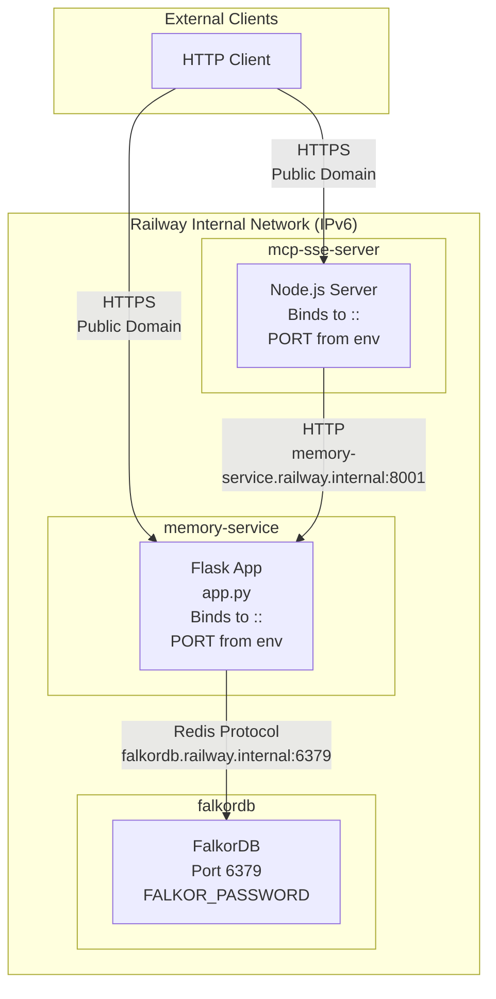
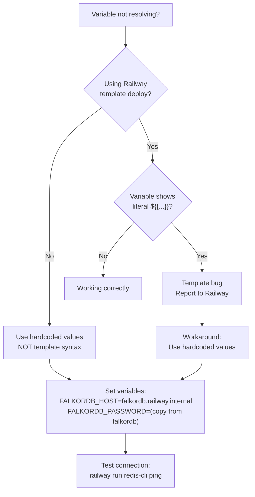
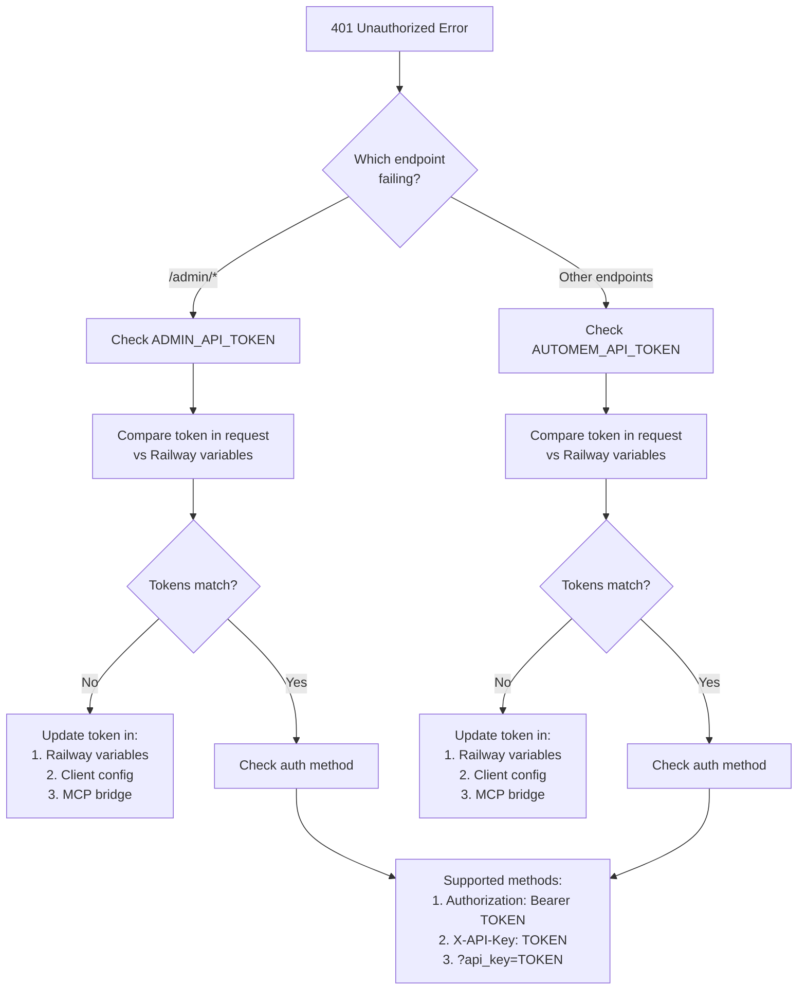
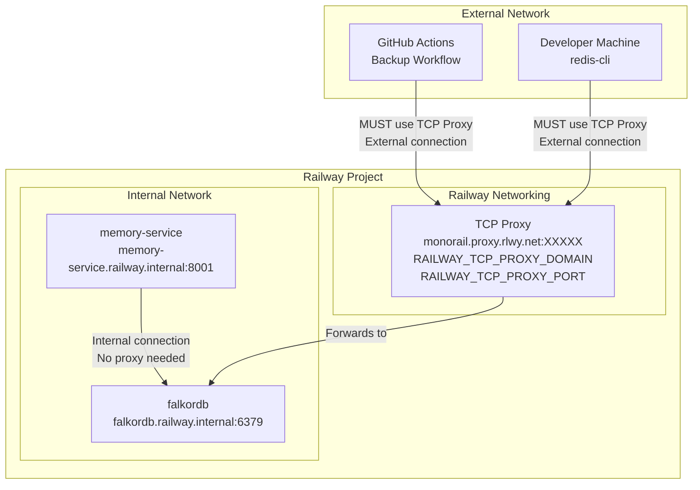
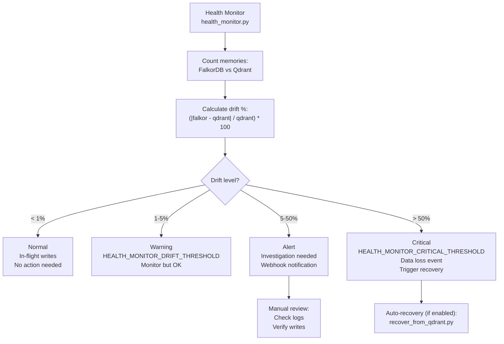
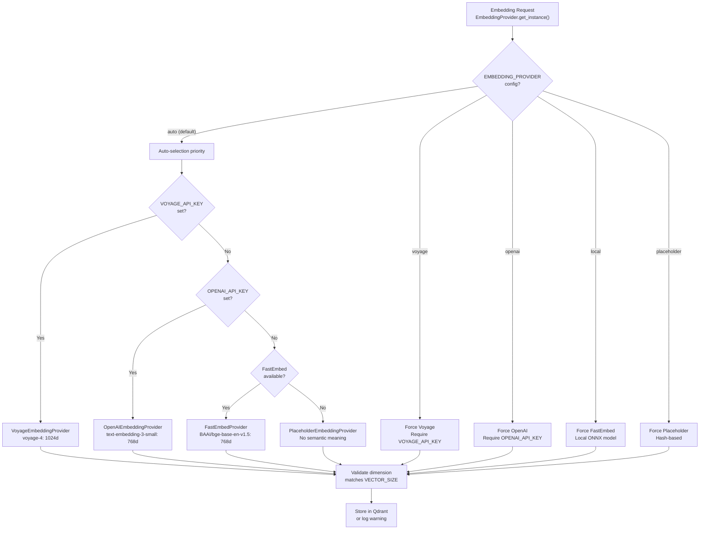

:::note[Source files]
This page is based on [`docs/RAILWAY_DEPLOYMENT.md`](https://github.com/verygoodplugins/automem/blob/main/docs/RAILWAY_DEPLOYMENT.md), [`docs/MONITORING_AND_BACKUPS.md`](https://github.com/verygoodplugins/automem/blob/main/docs/MONITORING_AND_BACKUPS.md), and [`docs/MCP_SSE.md`](https://github.com/verygoodplugins/automem/blob/main/docs/MCP_SSE.md) in the AutoMem repository.
:::

This page covers common operational issues and their solutions when deploying and running AutoMem. For configuration reference, see [Railway Deployment](/docs/deployment/railway/). For monitoring setup, see [Health Monitoring](/docs/operations/health/). For backup and recovery procedures, see [Backup & Recovery](/docs/operations/backup/).

---

## Connection Failures

### ECONNREFUSED Errors

The most common deployment issue is services unable to connect to each other, manifesting as `ECONNREFUSED` errors in logs.



#### Symptom: Connection Refused to Memory Service

**Error in logs:**

```
Error: connect ECONNREFUSED fd12:ca03:42be:0:1000:50:1079:5b6c:8001
[AutoMem] GET http://memory-service.railway.internal:8001/health failed
```

#### Root Cause 1: Missing PORT Environment Variable

**Problem:** Flask defaults to port 5000 when `PORT` is not set, but other services expect port 8001.

**Solution:**

1. Go to Railway Dashboard → `memory-service` → Variables
2. Add: `PORT=8001`
3. Redeploy the service

**Code reference:** [`app.py:1-10`](https://github.com/verygoodplugins/automem/blob/main/app.py#L1-L10) — Flask app initialization reads `PORT` from environment.

#### Root Cause 2: IPv4-Only Binding (Fixed in v0.7.1+)

**Problem:** Older versions bound to `0.0.0.0` (IPv4 only), but Railway's internal network uses IPv6 addresses.

**Check startup logs:**

```
# Expected output (v0.7.1+):
* Running on http://[::]:8001

# Bad output (old versions):
* Running on http://0.0.0.0:8001
```

**Solution:** Update to AutoMem v0.7.1 or later. Flask now binds to `::` (dual-stack IPv6/IPv4) via the `host="::"` parameter in [`app.py`](https://github.com/verygoodplugins/automem/blob/main/app.py).

#### Root Cause 3: Wrong Internal Hostname

**Problem:** Using public domain or incorrect internal hostname.

**Solution:** Ensure `AUTOMEM_API_URL` uses the internal hostname format:

```bash
# Correct (internal):
AUTOMEM_API_URL=http://memory-service.railway.internal:8001

# Incorrect (public domain):
AUTOMEM_API_URL=https://your-service.up.railway.app
```

Internal hostnames follow the pattern `{service-name}.railway.internal`.

---

### Variable Resolution Failures

#### Symptom: Variables Show Literal `${{...}}` in Logs

**Error example:**

```
FALKORDB_HOST=${{falkordb.RAILWAY_PRIVATE_DOMAIN}}
```

#### Root Cause: Template Syntax in Manual Configuration

**Problem:** Railway's `${{...}}` variable reference syntax only works in Railway templates, not manual service configuration.



**Solution:** Use hardcoded values for manual deployments:

```bash
# Set these directly in Railway Dashboard → memory-service → Variables
FALKORDB_HOST=falkordb.railway.internal
FALKORDB_PORT=6379
FALKORDB_PASSWORD=(copy exact value from falkordb service variables)
```

**Benefits:**
- More stable and predictable
- Easier to debug
- Works across redeployments
- Clear in logs

---

## Authentication Issues

### Invalid API Token Errors

#### Symptom: 401 Unauthorized

**Error response:**

```json
{"error": "Unauthorized", "message": "Invalid or missing API token"}
```

#### Diagnosis Flow



#### Solution: Verify Token Configuration

**Step 1: Get current tokens**

```bash
# Check token in Railway Dashboard → memory-service → Variables
# Look for AUTOMEM_API_TOKEN or ADMIN_API_TOKEN
```

**Step 2: Test token**

```bash
curl -H "Authorization: Bearer your-token" \
  https://your-service.up.railway.app/health
```

**Step 3: If tokens don't match, update everywhere:**

1. **Railway variable** (source of truth): Update `AUTOMEM_API_TOKEN` in Railway Dashboard
2. **MCP bridge** (if using): Update `AUTOMEM_API_TOKEN` in the mcp-sse-server service variables
3. **Client configuration** (Claude Desktop, Cursor, etc.): Update `.env` or platform config file with the copied token value

**Code reference:** [`app.py:1-50`](https://github.com/verygoodplugins/automem/blob/main/app.py#L1-L50) — `require_api_token` middleware validates tokens.

---

## TCP Proxy Configuration

### When TCP Proxy is Required

TCP Proxy enables external access to FalkorDB for:

- GitHub Actions automated backups
- Local development against production
- Manual database inspection

**Not needed for:**

- Service-to-service communication (use `*.railway.internal`)
- Normal API operations



### Symptom: GitHub Actions Backup Failing

**Error in GitHub Actions logs:**

```
❌ ERROR: Cannot connect to FalkorDB
Error: [Errno 104] Connection reset by peer
```

#### Root Cause: Using Internal Hostname from External Runner

GitHub Actions runners are outside Railway's network and cannot resolve `*.railway.internal` hostnames. The workflow at [`.github/workflows/backup.yml`](https://github.com/verygoodplugins/automem/blob/main/.github/workflows/backup.yml) validates that `FALKORDB_HOST` does not contain `.railway.internal`.

#### Solution: Enable and Configure TCP Proxy

**Step 1: Enable TCP Proxy**

1. Railway Dashboard → `falkordb` service
2. Settings → Networking → **Enable TCP Proxy**
3. Note the public endpoint (e.g., `monorail.proxy.rlwy.net:12345`)

**Step 2: Update GitHub Secrets**

In your GitHub repository → Settings → Secrets and variables → Actions:

```
FALKORDB_HOST = monorail.proxy.rlwy.net
FALKORDB_PORT = 12345
FALKORDB_PASSWORD = (same password as the Railway service variable)
```

**Step 3: Test Connectivity**

```bash
# From local machine with redis-cli
redis-cli -h monorail.proxy.rlwy.net -p 12345 -a your-password ping
```

**Debug checklist:**

- TCP Proxy is enabled in Railway Dashboard
- `FALKORDB_HOST` secret uses TCP proxy domain (not `.railway.internal`)
- `FALKORDB_PORT` secret uses TCP proxy port (not `6379`)
- `FALKORDB_PASSWORD` matches value in FalkorDB service variables
- Test connection with `redis-cli` from local machine succeeds

---

## Data Synchronization Issues

### Health Monitor Drift Detection

#### Symptom: Drift Alerts or Health Check Warnings

**Log output:**

```
⚠️  WARNING: Drift detected - FalkorDB: 850 memories, Qdrant: 892 memories (4.7% drift)
```

#### Understanding Drift Thresholds



**Default thresholds:**

- `HEALTH_MONITOR_DRIFT_THRESHOLD=5` (warning level — alert if drift exceeds 5%)
- `HEALTH_MONITOR_CRITICAL_THRESHOLD=50` (critical level — trigger recovery if drift exceeds 50%)

#### Common Causes of Drift

**1. In-Flight Writes (Normal, <1% drift)**

- Memory being written during health check
- Embedding worker processing queue
- Enrichment pipeline updating metadata

**2. Failed Writes (5-10% drift)**

Qdrant writes have try/except wrappers in [`automem/stores/qdrant.py`](https://github.com/verygoodplugins/automem/blob/main/automem/stores/qdrant.py). If the Qdrant service is unreachable, writes to FalkorDB succeed but Qdrant writes fail silently, causing drift.

**3. Data Loss Event (>50% drift)**

- FalkorDB restart without persistent volume
- Qdrant collection deleted or reset
- Manual data manipulation

#### Solution: Recover from Drift

**Option 1: Auto-Recovery (if enabled)**

```bash
# Set on health monitor service
HEALTH_MONITOR_AUTO_RECOVER=true
```

**Option 2: Manual Recovery**

```bash
python scripts/recover_from_qdrant.py
```

**Expected recovery time:**
- 5-10 minutes for 1000 memories
- 99.7% data recovery rate
- Relationships automatically rebuilt

For complete recovery procedures, see [Backup & Recovery](/docs/operations/backup/).

---

## Embedding Provider Issues

### API Key Configuration Errors

#### Symptom: Embeddings Skipped or Placeholder Used

**Log output:**

```
⚠️  No OPENAI_API_KEY or VOYAGE_API_KEY found - using placeholder embeddings
Semantic search will not work correctly
```

#### Embedding Provider Selection Flow



#### Solution: Configure API Keys

**Step 1: Choose provider**

| Provider | Cost | Quality | Key Required |
|---|---|---|---|
| Voyage AI | $0.00012/1K tokens | Best | `VOYAGE_API_KEY` |
| OpenAI | $0.00002/1K tokens | Good | `OPENAI_API_KEY` |
| FastEmbed | Free | Good (local ONNX) | None |
| Placeholder | Free | No semantic meaning | None (testing only) |

**Step 2: Verify provider is working**

```bash
# Check which provider is active
curl https://your-service.up.railway.app/health | jq '.embedding_provider'
```

**Step 3: Re-embed existing memories (if needed)**

If you switch providers, existing memories may have incorrect-dimension vectors. Trigger re-embedding:

```bash
curl -X POST https://your-service.up.railway.app/admin/reembed \
  -H "Authorization: Bearer your-admin-token"
```

---

### Vector Dimension Mismatch

#### Symptom: Qdrant Upsert Errors

**Error in logs:**

```
ValueError: Vector dimension mismatch: expected 768, got 1024
Failed to upsert memory to Qdrant
```

#### Root Cause: Changed Provider or Model

- **Scenario 1:** Switching from OpenAI (768d) to Voyage (1024d)
- **Scenario 2:** Changing `EMBEDDING_MODEL` to different dimensions
- **Scenario 3:** Existing Qdrant collection has different dimensions

#### Solution: Reconfigure or Reset Collection

**Option 1: Auto-detect existing dimensions (safe)**

The auto-detection logic in [`automem/stores/qdrant.py:100-150`](https://github.com/verygoodplugins/automem/blob/main/automem/stores/qdrant.py#L100-L150) checks the existing collection schema. Set `EMBEDDING_PROVIDER=auto` and restart the service — it will detect the existing dimensions.

**Option 2: Reset Qdrant collection (data loss)**

```bash
# Delete and recreate the collection
curl -X DELETE https://your-qdrant-url/collections/memories \
  -H "api-key: your-qdrant-key"
# Then restart memory-service to recreate with correct dimensions
```

:::caution[Data loss]
Resetting the Qdrant collection deletes all embeddings. Recover them using `POST /admin/reembed` or run `scripts/recover_from_qdrant.py` after restoring from backup.
:::

**Option 3: Create new collection and migrate**

```bash
# Create a new collection with target dimensions
# Migrate by re-embedding all memories from FalkorDB
curl -X POST https://your-service.up.railway.app/admin/reembed \
  -H "Authorization: Bearer your-admin-token"
```

---

## Performance Issues

### High Memory Usage

#### Symptom: OOM Kills or Slow Performance

**Railway logs:**

```
Error: Process killed (OOM)
Memory usage: 1.2GB / 1GB limit
```

#### Memory Usage by Component

| Component | Typical RAM | High Load | Config |
|---|---|---|---|
| Flask API | 100-200MB | 300-500MB | - |
| FalkorDB | 200-400MB | 800MB-2GB | `--maxmemory` |
| Enrichment Queue | 50-100MB | 200MB | `ENRICHMENT_QUEUE_SIZE` |
| Embedding Queue | 50-100MB | 200MB | `EMBEDDING_BATCH_SIZE` |
| **Total recommended** | **512MB-1GB** | **1.5-2GB** | Railway service size |

#### Solution: Optimize Memory Configuration

**FalkorDB memory limits:**

```bash
# In Railway Dashboard → falkordb → Variables
REDIS_ARGS=--maxmemory 512mb --maxmemory-policy allkeys-lru --save 60 1 --appendonly yes
```

**Queue size limits:**

```bash
# Reduce queue sizes if experiencing memory pressure
EMBEDDING_BATCH_SIZE=10
ENRICHMENT_QUEUE_SIZE=100
```

**Graceful degradation check:**

```bash
# Check if service is degrading gracefully
curl https://your-service.up.railway.app/health | jq '.enrichment.queue_depth'
```

---

### Slow Query Performance

#### Symptom: High Latency on /recall

**Response includes timing:**

```json
{
  "memories": [...],
  "query_time_ms": 1247.3
}
```

#### Performance Optimization Checklist

**1. Check relationship cache:**

The LRU cache in [`automem/consolidation.py:200-250`](https://github.com/verygoodplugins/automem/blob/main/automem/consolidation.py#L200-L250) should have an 80% hit rate during normal operation. If consolidation is running frequently, the cache may be continuously invalidated.

**2. Verify indexes:**

Ensure the Qdrant keyword index is set up correctly. The index setup is in [`automem/stores/qdrant.py:1-100`](https://github.com/verygoodplugins/automem/blob/main/automem/stores/qdrant.py#L1-L100).

**3. Limit expansion:**

High `RECALL_LIMIT` values increase graph traversal time:

```bash
# Reduce if high latency is observed
RECALL_LIMIT=10  # default is 20
```

**4. Check batch processing:**

A high `queue_depth` in `/health` indicates the embedding worker is backlogged. Increase `EMBEDDING_BATCH_SIZE` or reduce `EMBEDDING_BATCH_TIMEOUT_SECONDS`.

---

## Diagnostic Commands

### Quick Health Check

```bash
# Full health status
curl https://your-service.up.railway.app/health | jq .

# Check specific components
curl https://your-service.up.railway.app/health | jq '{
  status: .status,
  falkordb: .statistics.falkordb,
  qdrant: .statistics.qdrant,
  enrichment: .enrichment.status,
  queue: .enrichment.queue_depth
}'
```

### Connection Testing

```bash
# Test memory service
curl https://your-service.up.railway.app/health

# Test FalkorDB via TCP proxy (external)
redis-cli -h monorail.proxy.rlwy.net -p 12345 -a your-password ping

# Test Qdrant
curl https://your-qdrant-url/collections/memories
```

### Log Analysis

```bash
# Railway CLI log streaming
railway logs --follow --service memory-service

# Filter for errors
railway logs | grep -E "ERROR|CRITICAL|Exception"

# Filter for performance issues
railway logs | grep "latency_ms" | jq 'select(.latency_ms > 500)'

# Check drift warnings
railway logs | grep "Drift detected"
```

### Service Status

```bash
# List all Railway services in project
railway status

# Check specific service variables
railway variables --service memory-service

# Trigger manual redeploy
railway redeploy --service memory-service
```

---

## Getting Help

If issues persist after following this guide:

1. **Check logs first:**

   ```bash
   railway logs --service memory-service | tail -100
   ```

2. **Verify configuration:**
   - All required environment variables set (see [Railway Deployment](/docs/deployment/railway/))
   - Tokens match between services
   - Hostnames use internal `.railway.internal` domains
   - `PORT=8001` is set on memory-service

3. **Test minimal configuration:**
   - Deploy with only FalkorDB (no Qdrant)
   - Use placeholder embeddings (no OpenAI)
   - Disable MCP bridge temporarily

4. **Open an issue:**
   - GitHub: [https://github.com/verygoodplugins/automem/issues](https://github.com/verygoodplugins/automem/issues)
   - Include: error logs, configuration (redact secrets), Railway service logs
   - Mention which troubleshooting steps you've already tried
