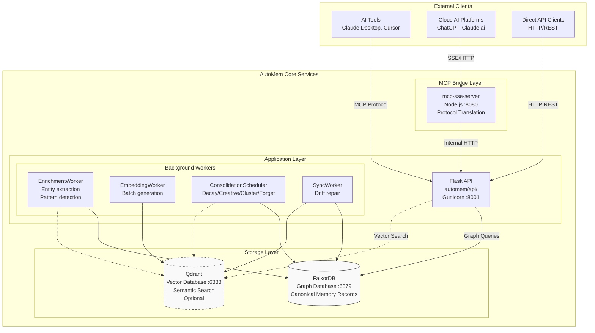
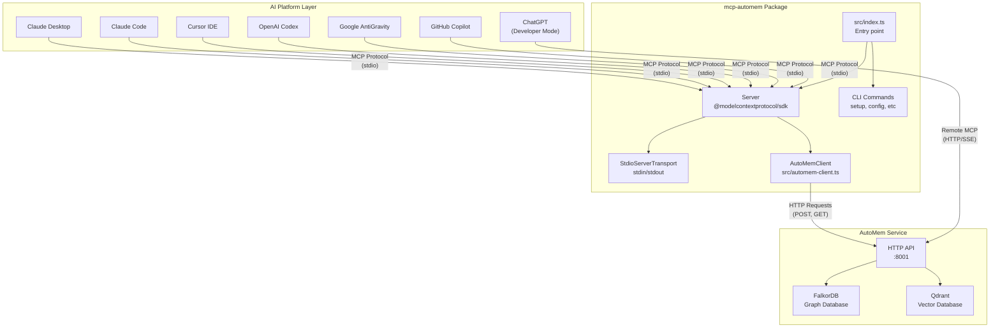
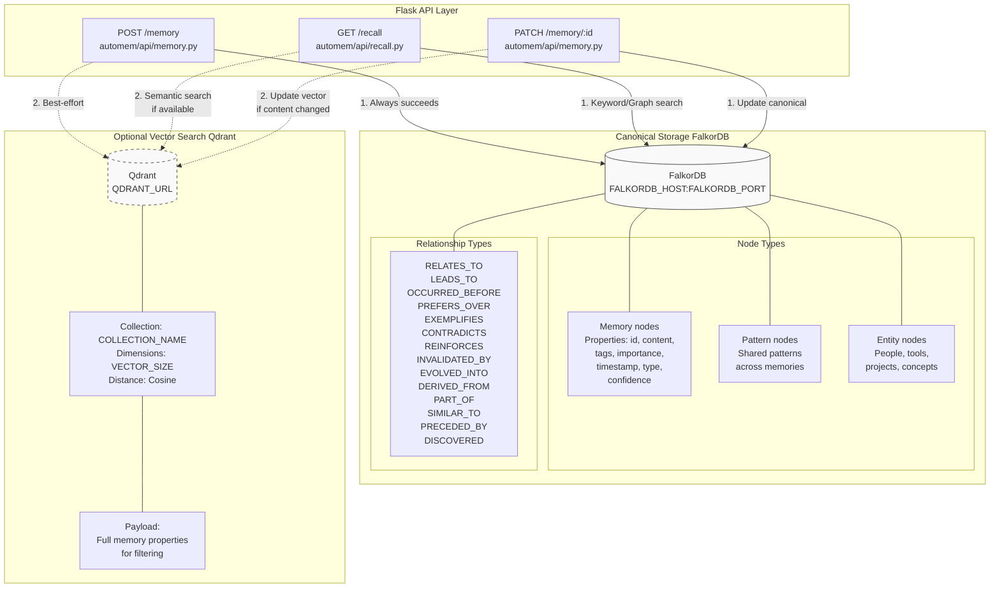
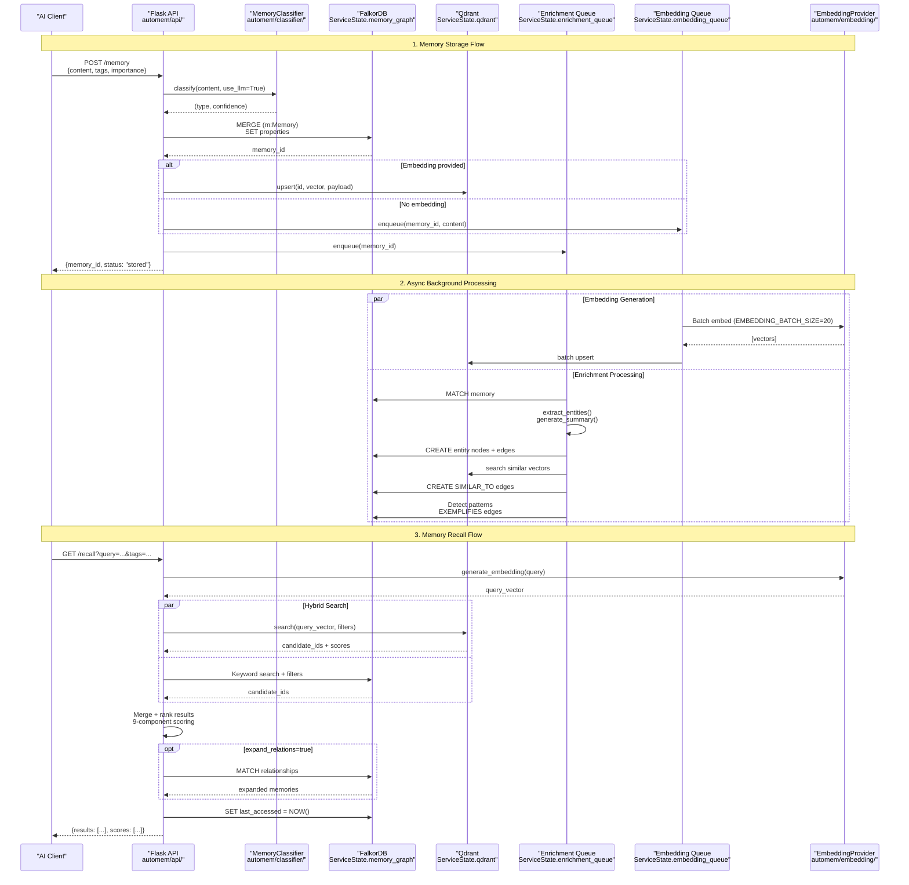
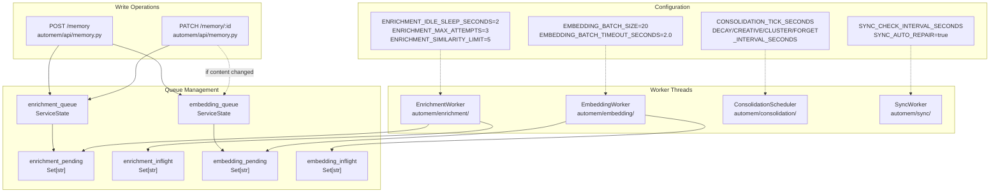
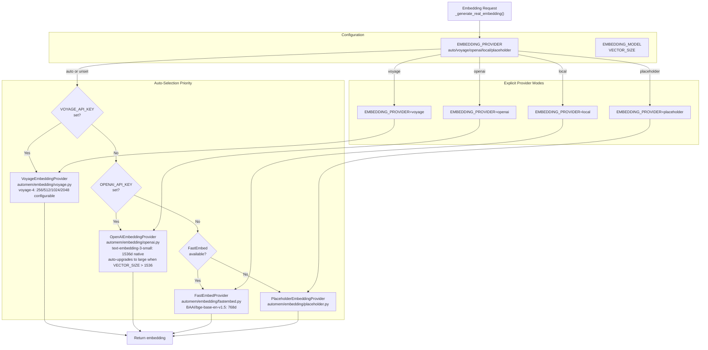

This document introduces AutoMem, a production-grade long-term memory system for AI assistants, and explains its high-level architecture, dual-storage approach, and graceful degradation design. For installation instructions, see [Getting Started](/docs/getting-started/introduction/). For detailed API documentation, see [API Reference](/docs/reference/api/memory-operations/). For operational guides, see [Operations](/docs/operations/health/).

## What is AutoMem?

AutoMem is a Flask-based HTTP API service that provides persistent, queryable memory storage for AI assistants. Unlike traditional RAG systems that retrieve similar documents, AutoMem builds knowledge graphs with typed relationships, enabling multi-hop reasoning, temporal awareness, and pattern learning. Current canonical benchmark claims are **87.00% on LongMemEval full** with **97.00% recall@5**, and **84.74% on LoCoMo full**. See [Benchmarks](/benchmarks/) for the canonical/publication source trail.

**Key capabilities:**

- **Store** memories with metadata, importance scores, classification, and semantic embeddings
- **Recall** via hybrid search combining vector similarity, keyword matching, graph relationships, and temporal signals
- **Connect** memories through 11 authorable relationship types (e.g., `LEADS_TO`, `CONTRADICTS`, `EXEMPLIFIES`) plus system-generated semantic and temporal edges
- **Learn** through automatic entity extraction, pattern detection, and neuroscience-inspired consolidation cycles
- **Degrade gracefully** when vector search is unavailable, continuing operations in graph-only mode

AI platforms connect to AutoMem through the **mcp-automem** MCP bridge package (`@verygoodplugins/mcp-automem`). This Node.js package translates MCP protocol calls from AI platforms into HTTP API requests to the AutoMem service — the AI doesn't store memories itself, it delegates to AutoMem. This separation allows multiple AI platforms to share one memory store, keeps the memory service platform-independent, and enables flexible deployment across machines.

---

## System Architecture Overview

AutoMem consists of three primary layers: the **MCP Bridge** for cloud AI platform integration, the **Flask API Application Layer** with background workers, and the **Dual-Storage Layer** combining graph and vector databases.

### High-Level Component Diagram

:::note
Dashed lines to Qdrant indicate optional vector search capabilities. The system operates in graph-only mode if Qdrant is unavailable.
:::

### MCP Bridge Position

The mcp-automem package implements a **bridge pattern** between AI platforms and the AutoMem service. Standard MCP platforms (Claude Desktop, Cursor, Claude Code, Codex, GitHub Copilot, AntiGravity) connect via stdio transport. Cloud platforms (ChatGPT, Claude.ai, ElevenLabs) connect via HTTP/SSE sidecar. Direct API clients such as OpenClaw plugin mode and Alexa can bypass the bridge entirely.

---

## Core Components

AutoMem's architecture separates concerns into distinct modules, each handling specific aspects of memory management.

| Component | File/Module | Purpose | Key Classes/Functions |
|-----------|-------------|---------|----------------------|
| **Flask API** | `automem/api/` | Request validation, orchestration, authentication | `Flask`, `require_api_token`, `ServiceState` |
| **Graph Store** | `automem/stores/graph_store.py` | FalkorDB operations, relationship management | `_build_graph_tag_predicate` |
| **Vector Store** | `automem/stores/vector_store.py` | Qdrant operations, semantic search | `_build_qdrant_tag_filter` |
| **Embedding Providers** | `automem/embedding/` | Pluggable embedding generation | `EmbeddingProvider`, `OpenAIEmbeddingProvider`, `VoyageEmbeddingProvider`, `FastEmbedProvider`, `PlaceholderEmbeddingProvider` |
| **Enrichment Pipeline** | `automem/enrichment/` | Entity extraction, pattern detection, relationship building | `EnrichmentStats`, `extract_entities`, `generate_summary` |
| **Consolidation Engine** | `automem/consolidation/` | Memory decay, creative association, clustering, forgetting | `MemoryConsolidator`, `ConsolidationScheduler` |
| **Memory Classifier** | `automem/classifier/` | Regex + LLM-based memory type classification | `MemoryClassifier`, `classify` |
| **Health Monitor** | `scripts/health_monitor.py` | Drift detection, webhook alerts | `check_drift`, `repair_drift` |

The MCP bridge exposes six tools to AI platforms:

| Tool | Purpose | Handler |
|------|---------|---------|
| `store_memory` | Store new memory with metadata | Calls `AutoMemClient.storeMemory()` |
| `recall_memory` | Hybrid search (semantic + keyword + graph) | Calls `AutoMemClient.recallMemory()` |
| `associate_memories` | Create typed relationships | Calls `AutoMemClient.associateMemories()` |
| `update_memory` | Modify existing memory | Calls `AutoMemClient.updateMemory()` |
| `delete_memory` | Remove memory | Calls `AutoMemClient.deleteMemory()` |
| `check_database_health` | Check service status | Calls `AutoMemClient.checkHealth()` |

---

## Dual-Storage Architecture

AutoMem implements a dual-storage pattern where **FalkorDB** serves as the canonical record for all memory operations, while **Qdrant** provides optional semantic search capabilities. This architecture enables graceful degradation and built-in redundancy.

### Storage Layer Architecture

**Key principles:**

- **FalkorDB writes always succeed**: If Qdrant is unavailable, the memory is still persisted in the graph
- **Qdrant operations are best-effort**: Failures are logged but don't block API responses
- **Full redundancy**: Qdrant payloads contain complete memory properties, enabling recovery from either store
- **Automatic sync repair**: `SyncWorker` monitors drift and queues missing embeddings for regeneration

---

## Request Flow and Memory Lifecycle

The following diagram illustrates how a memory flows through the system from storage to recall, showing the asynchronous enrichment and consolidation processes.

### Memory Lifecycle Sequence

---

## Graceful Degradation Design

AutoMem is designed to continue operating even when components fail. The most critical degradation path handles Qdrant unavailability, where the system falls back to graph-only operations.

### Degradation Behavior

| Scenario | System Behavior | Code Reference |
|----------|----------------|----------------|
| **Qdrant unavailable at startup** | Logs warning, initializes with `state.qdrant = None`, graph operations continue normally | [`automem/api/`](https://github.com/verygoodplugins/automem/tree/main/automem/api) |
| **Qdrant fails during write** | Logs error, memory persists in FalkorDB, enrichment queued | [`automem/api/memory.py`](https://github.com/verygoodplugins/automem/blob/main/automem/api/memory.py) |
| **Qdrant fails during recall** | Falls back to keyword/graph search only, returns results without vector scoring | [`automem/api/recall.py`](https://github.com/verygoodplugins/automem/blob/main/automem/api/recall.py) |
| **Embedding provider unavailable** | Falls back to `PlaceholderEmbeddingProvider`, generates deterministic hash-based vectors | [`automem/embedding/`](https://github.com/verygoodplugins/automem/tree/main/automem/embedding) |
| **Enrichment worker crashes** | Failed jobs remain in queue with retry tracking, manual reprocess available via `POST /enrichment/reprocess` | [`automem/enrichment/`](https://github.com/verygoodplugins/automem/tree/main/automem/enrichment) |
| **Consolidation scheduler fails** | Logs error, scheduler continues on next tick, control node tracks last successful runs | [`automem/consolidation/`](https://github.com/verygoodplugins/automem/tree/main/automem/consolidation) |

---

## Background Processing Architecture

AutoMem runs four independent worker threads that process memories asynchronously without blocking API requests. Each worker operates on its own queue and tracking sets to prevent duplicate processing.

### Worker Coordination Diagram

**Worker responsibilities:**

- **EnrichmentWorker**: Extracts entities (spaCy NER + regex), generates summaries, creates temporal/semantic links, detects patterns
- **EmbeddingWorker**: Batches requests (20 items, 2-second timeout) to reduce API costs by 40-50%, retries on failure (max 3 attempts)
- **ConsolidationScheduler**: Runs four cycles on configurable intervals (Decay, Creative, Cluster, Forget) using control node for persistence
- **SyncWorker**: Monitors drift between FalkorDB and Qdrant, auto-repairs when divergence exceeds 5%

---

## Embedding Provider Abstraction

AutoMem uses a pluggable provider pattern for embedding generation, supporting multiple backends with automatic failover. The system selects providers in priority order based on availability.

### Provider Selection Logic

**Provider characteristics:**

- **Voyage**: High-quality embeddings, supports 256d, 512d, 1024d, and 2048d, requires API key
- **OpenAI**: High-quality embeddings, uses `text-embedding-3-small` by default, auto-upgrades to `text-embedding-3-large` when `VECTOR_SIZE > 1536`, and supports compatible providers via `OPENAI_BASE_URL`
- **FastEmbed**: Local ONNX models, no API key required, ~210MB model download on first use
- **Placeholder**: Hash-based deterministic vectors, no semantic meaning, always available as fallback

---

## Supported Platforms

AutoMem supports AI platforms through three integration strategies:

### Standard MCP Integration (Recommended)

Platforms connect via MCP protocol using stdio transport:

- **[Claude Desktop](/docs/platforms/claude-desktop/)**: JSON config in `claude_desktop_config.json`
- **[Cursor IDE](/docs/platforms/cursor/)**: `.cursor/rules/automem.mdc` + `~/.cursor/mcp.json`
- **[Claude Code](/docs/platforms/claude-code/)**: `~/.claude.json` MCP config
- **[OpenAI Codex](/docs/platforms/codex/)**: `~/.codex/config.toml` MCP config
- **[Google AntiGravity](/docs/platforms/antigravity/)**: MCP Store custom server config
- **[GitHub Copilot](/docs/platforms/github-copilot/)**: Repository MCP configuration

### Remote MCP (Cloud Platforms)

Cloud platforms connect via HTTP/SSE sidecar:

- **[ChatGPT](/docs/platforms/chatgpt/)** (Developer Mode)
- **[Claude.ai & Mobile](/docs/platforms/claude-web/)** (web + iOS/Android)
- **[ElevenLabs Agents](/docs/platforms/elevenlabs/)**

### Direct API Integration

- **[OpenClaw](/docs/platforms/openclaw/)**: Native plugin (recommended) or legacy curl; also supports [MCP via mcporter](/docs/platforms/openclaw/#mcp-mode-architecture)
- **[Alexa](/docs/platforms/alexa/)**: Custom Alexa skill with direct API calls

---

## Authentication and Authorization

AutoMem implements two-tier authentication: standard API tokens for normal operations and admin tokens for privileged endpoints.

| Endpoint Pattern | Required Token | Header/Query Param | Example |
|-----------------|----------------|-------------------|---------|
| `GET /health` | None (public) | - | `curl /health` |
| `POST /memory` | `AUTOMEM_API_TOKEN` | `Authorization: Bearer <token>` | Standard operations |
| `GET /recall` | `AUTOMEM_API_TOKEN` | `X-API-Key: <token>` | Alternative header |
| `PATCH /memory/:id` | `AUTOMEM_API_TOKEN` | `?api_key=<token>` | Query param (discouraged) |
| `POST /admin/reembed` | Both tokens | `Authorization: Bearer <token>` + `X-Admin-Token: <admin_token>` | Admin operations |
| `POST /enrichment/reprocess` | Both tokens | Same as above | Admin operations |

Token validation is handled by the `require_api_token` decorator in [`automem/api/`](https://github.com/verygoodplugins/automem/tree/main/automem/api), which checks headers and query parameters in order of preference. Admin endpoints additionally validate the `X-Admin-Token` header.

For full details, see [Authentication](/docs/reference/authentication/).

---

## Key Configuration Points

AutoMem's behavior is controlled through environment variables loaded from process environment, `.env` in project root, or `~/.config/automem/.env`. For complete configuration reference, see [Configuration Reference](/docs/reference/configuration/).

**Critical environment variables:**

| Variable | Purpose | Default | Notes |
|----------|---------|---------|-------|
| `AUTOMEM_API_TOKEN` | Authentication for standard endpoints | _required_ | Generate securely |
| `ADMIN_API_TOKEN` | Authentication for admin endpoints | _required_ | Generate securely |
| `FALKORDB_HOST` | Graph database hostname | `localhost` | Use `*.railway.internal` on Railway |
| `FALKORDB_PORT` | Graph database port | `6379` | Standard Redis protocol port |
| `QDRANT_URL` | Vector database endpoint | _unset_ | Optional; enables semantic search |
| `VECTOR_SIZE` | Embedding dimension | `1024` | Must match Qdrant collection |
| `EMBEDDING_PROVIDER` | Provider selection mode | `auto` | `auto`, `voyage`, `openai`, `local`, `placeholder` |
| `PORT` | Flask API port | `8001` | **Must be set explicitly on Railway** |

The MCP bridge requires two additional environment variables:

| Variable | Purpose | Default |
|----------|---------|---------|
| `AUTOMEM_API_URL` | AutoMem service URL | `http://127.0.0.1:8001` |
| `AUTOMEM_API_KEY` | API key for authenticated instances | _optional_ |

:::caution
On Railway, if `PORT=8001` is not set, Flask defaults to `5000`, causing connection refused errors. The deployment must bind to `::` (IPv6 dual-stack) for internal networking to work.
:::

---

## Deployment Environments

AutoMem supports three deployment modes, each optimized for different use cases.

| Environment | Use Case | Services | Networking | Data Persistence |
|------------|----------|----------|------------|------------------|
| **Local Docker** | Development, testing, privacy | `docker-compose.yml`: API, FalkorDB, Qdrant | Localhost ports | Named volumes: `falkordb_data`, `qdrant_data` |
| **Railway Cloud** | Production, multi-device, team collaboration | Railway services with persistent volumes | IPv6 `*.railway.internal` DNS | 50GB volume per service, automated backups |
| **Bare API** | Development without Docker | Manual Flask process | External FalkorDB required | Depends on external services |

For detailed deployment guides, see [Railway Deployment](/docs/deployment/railway/) and [Docker Deployment](/docs/deployment/docker/).

---

## Next Steps

- **Installation**: [Getting Started](/docs/getting-started/introduction/) covers local development, Docker Compose, and Railway deployment
- **Core Concepts**: [Memory Model](/docs/core-concepts/memory-model/), [Relationship Types](/docs/core-concepts/relationship-types/), [Hybrid Search](/docs/core-concepts/hybrid-search/)
- **API Usage**: [Memory Operations](/docs/reference/api/memory-operations/), [Recall Operations](/docs/reference/api/recall-operations/), [Consolidation Operations](/docs/reference/api/consolidation/)
- **Platform Guides**: [Claude Desktop](/docs/platforms/claude-desktop/), [Cursor IDE](/docs/platforms/cursor/), [Claude Code](/docs/platforms/claude-code/), [ChatGPT](/docs/platforms/chatgpt/)
- **Operations**: [Health Monitoring](/docs/operations/health/), [Backup & Recovery](/docs/operations/backup/), [Performance Tuning](/docs/operations/performance/)
- **CLI Reference**: [Setup & Installation](/docs/cli/setup/), [Platform Installers](/docs/cli/platform-installers/)
- **Development**: [Project Structure](/docs/development/structure/), [Local Setup](/docs/development/local-setup/), [Testing](/docs/development/testing/)
- **Research**: [Research & Motivation](/docs/research/) — the benchmarks and theory behind AutoMem's design
