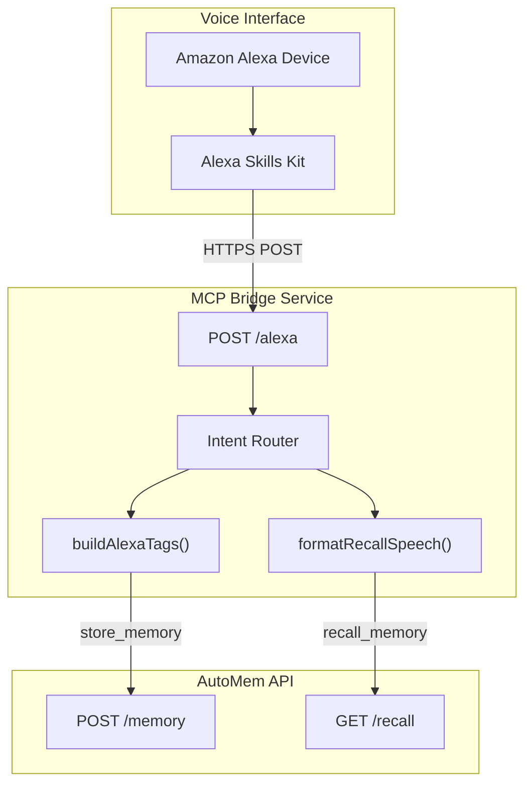

AutoMem's Alexa integration is built into the MCP Bridge server (`mcp-sse-server`) as a dedicated `/alexa` endpoint. This enables voice-based memory storage and recall through any Alexa-enabled device.

**Key features:**
- Voice-first interface with natural language commands
- Automatic user/device context tagging for scoped recall
- Speech-optimized output (240 chars per item, max 3 items)
- Two-tier recall: user/device-scoped first, global fallback

---

## Architecture



The Alexa endpoint is stateless — each request is independent. Authentication uses the `AUTOMEM_API_TOKEN` environment variable since Alexa cannot send custom HTTP headers.

---

## Prerequisites

- Deployed MCP Bridge service (included in Railway one-click template)
- AutoMem API with `AUTOMEM_API_TOKEN` configured
- Amazon Developer account

---

## Supported Intents

### LaunchRequest

**User says:** "Alexa, open AutoMem"

**Response:** "AutoMem is ready. Say remember to store something, or recall to fetch it."

---

### RememberIntent

**User says:**
- "Alexa, tell AutoMem to remember [note]"
- "Alexa, ask AutoMem to store [note]"

**Slot:** `note` (AMAZON.SearchQuery) — the content to store

**What happens:**
1. Extracts the `note` slot value
2. Automatically adds context tags: `alexa`, `user:<userId>`, `device:<deviceId>`
3. Calls `store_memory` with the content and tags
4. Returns speech confirmation

**Responses:**
- Success: "Saved to memory."
- Missing note: "I did not hear anything to remember."
- API error: "I could not save that right now."

---

### RecallIntent

**User says:**
- "Alexa, ask AutoMem what I said about [query]"
- "Alexa, tell AutoMem to recall [query]"

**Slot:** `query` (AMAZON.SearchQuery) — the search query

**Recall strategy (two-tier):**
1. **Primary search:** Query with user/device tags (scoped to this user/device)
2. **Fallback search:** Query without tags (global) if primary returns no results

**Result formatting:**
- Maximum 3 items returned
- Each item truncated to 240 characters
- Format: "Item 1: [content]. Item 2: [content]. Item 3: [content]."

**Responses:**
- Success: Formatted memory content
- No results: "I could not find anything in memory for that."
- Missing query: "What should I recall?"
- API error: "I could not recall anything right now."

---

### AMAZON.HelpIntent

**User says:** "Alexa, help"

**Response:** "Say remember and a note to store it. Say recall and a topic to fetch it."

---

## Automatic Context Tagging

Every memory stored through Alexa receives contextual tags automatically:

| Tag Pattern | Example | Purpose |
|-------------|---------|---------|
| `alexa` | `alexa` | Identify voice-originated memories |
| `user:<id>` | `user:amzn1.ask.account.ABC123` | User-specific filtering |
| `device:<id>` | `device:amzn1.ask.device.XYZ789` | Device-specific filtering |

**Why this matters:** The `user:<id>` tag enables different family members' memories to remain separate even when using the same device. The primary recall scope uses both user and device tags, falling back to just the user tag if no device-specific results are found.

---

## Alexa Skill Setup

### Step 1: Create Custom Skill

1. Go to [Alexa Developer Console](https://developer.amazon.com/alexa/console/ask)
2. Click **Create Skill**
3. Configure:
   - **Skill name:** AutoMem
   - **Primary locale:** English (US)
   - **Skill type:** Custom
   - **Hosting:** Alexa-hosted or provision your own

### Step 2: Define Interaction Model

**Invocation Name:** `automem` (or your preferred wake phrase)

**Intents:**

| Intent Name | Sample Utterances | Slots |
|-------------|-------------------|-------|
| `RememberIntent` | `remember {note}`, `store {note}`, `save {note}` | `note` (AMAZON.SearchQuery) |
| `RecallIntent` | `recall {query}`, `what did I say about {query}`, `fetch {query}` | `query` (AMAZON.SearchQuery) |
| `AMAZON.HelpIntent` | (built-in) | (none) |

Use `AMAZON.SearchQuery` for both `note` and `query` slots to accept arbitrary natural language input.

### Step 3: Configure Endpoint

1. In Alexa Developer Console → **Endpoint**
2. Select **HTTPS**
3. Set **Default Region** to your MCP Bridge URL:
   ```
   https://your-mcp-bridge.up.railway.app/alexa
   ```
4. **SSL Certificate:** Select "My development endpoint is a sub-domain of a domain that has a wildcard certificate from a certificate authority"

### Step 4: Test the Skill

Use the **Test** tab in Alexa Developer Console:

| User Says | Expected Response |
|-----------|-----------------|
| "Open AutoMem" | "AutoMem is ready. Say remember to store something, or recall to fetch it." |
| "Tell AutoMem to remember buy milk tomorrow" | "Saved to memory." |
| "Ask AutoMem what I said about milk" | "Item 1: Buy milk tomorrow." |
| "Help" | "Say remember and a note to store it. Say recall and a topic to fetch it." |

---

## Example Interactions

**Basic storage and recall:**
```
User: "Alexa, tell AutoMem to remember my favorite color is blue"
Alexa: "Saved to memory."

User: "Alexa, ask AutoMem what's my favorite color"
Alexa: "Item 1: My favorite color is blue."
```

**Multi-item recall:**
```
User: "Alexa, open AutoMem"
Alexa: "AutoMem is ready. Say remember to store something, or recall to fetch it."

User: "Remember I prefer dark mode in all applications"
Alexa: "Saved to memory."

User: "Remember I use Python 3.11 for all projects"
Alexa: "Saved to memory."

User: "Ask AutoMem what are my preferences"
Alexa: "Item 1: I prefer dark mode in all applications. Item 2: I use Python 3.11 for all projects."
```

**Cross-device recall (using user-scoped fallback):**
```
# Stored on Kitchen Echo:
User: "Tell AutoMem to remember buy milk"
Alexa: "Saved to memory."
# Tagged: alexa, user:abc123, device:kitchen-echo

# Recalled on Bedroom Echo:
User: "Ask AutoMem what should I buy"
Alexa: "Item 1: Buy milk."
# Primary search (device:bedroom-echo) finds nothing
# Fallback search (user:abc123) finds the memory
```

---

## Configuration

### Environment Variables

| Variable | Required | Default | Description |
|----------|---------|---------|-------------|
| `AUTOMEM_API_URL` | Yes | `http://127.0.0.1:8001` | AutoMem API base URL |
| `AUTOMEM_API_TOKEN` | Yes | (none) | Bearer token for API authentication |
| `PORT` | No | `8080` | Server listen port |

`AUTOMEM_ENDPOINT` is supported as a legacy alias for `AUTOMEM_API_URL`.

**Authentication token extraction order:**
1. `Authorization: Bearer <token>` header
2. `X-API-Key: <token>` header
3. `?api_key=<token>` query parameter
4. `AUTOMEM_API_TOKEN` environment variable (fallback — used by Alexa since it cannot send headers)

---

## Cross-Client Access

Memories stored via Alexa are accessible from any AutoMem-connected client:

1. User stores via Alexa: "Remember project uses Python 3.11"
2. Developer recalls in Cursor: search for "python version" returns the Alexa memory
3. Memory includes context: tagged with `alexa`, `user:<id>`, timestamp

---

## Security Considerations

**Token management:**
- Store `AUTOMEM_API_TOKEN` in Railway/cloud environment variables
- Never hardcode tokens in Alexa skill configuration
- Alexa cannot send custom headers — token must be in environment variable

**User privacy:**
- User and device IDs are stored as tags (opaque identifiers from Amazon)
- Memory content is not filtered or sanitized
- No automatic data expiration — implement deletion if required
- No user-level authentication — all users share the same API token

**Access control options:**
- **Per-user instances:** Deploy separate AutoMem instances per user, each with a unique token
- **Tag-based isolation:** Use single instance; filter all operations by user tags

**Alexa compliance:**
- Follow [Alexa Skills Kit Policy](https://developer.amazon.com/docs/custom-skills/policy-testing-for-an-alexa-skill.html)
- Obtain user consent for data storage
- Provide data deletion mechanisms (use the AutoMem API directly)

---

## Limitations

| Limitation | Impact | Workaround |
|------------|--------|-----------|
| No memory deletion via voice | Cannot remove memories | Use AutoMem API directly |
| No metadata updates via voice | Cannot change importance/tags | Use API directly |
| No relationship creation via voice | Cannot link memories | Use API directly |
| 240 char speech limit | Long memories truncated | Store summaries; use API for detail |
| No user authentication | All users share token | Deploy per-user instances |

---

## Troubleshooting

### "I could not save that right now"

| Cause | Solution |
|-------|---------|
| Invalid `AUTOMEM_API_TOKEN` | Verify token matches memory-service config |
| Memory service unreachable | Check `AUTOMEM_API_URL` points to correct endpoint |
| Network timeout | Increase Alexa skill timeout setting |

**Debug:** `curl -H "Authorization: Bearer $TOKEN" https://your-automem.up.railway.app/health`

### "I could not recall anything right now"

| Cause | Solution |
|-------|---------|
| No matching memories | Verify memories exist; check tags |
| Tag filtering too strict | Check user/device tags on stored memories |
| API timeout | Optimize memory count or increase skill timeout |

### Slot values not extracted ("I did not hear anything to remember")

| Cause | Solution |
|-------|---------|
| Utterance mismatch | Add more sample utterances to skill model |
| Slot type issues | Use `AMAZON.SearchQuery` for both slots |
| Alexa speech recognition | Speak clearly; test in developer console |

**Verification:** Enable skill test logging in Alexa Developer Console to see the raw request JSON and check slot values.
