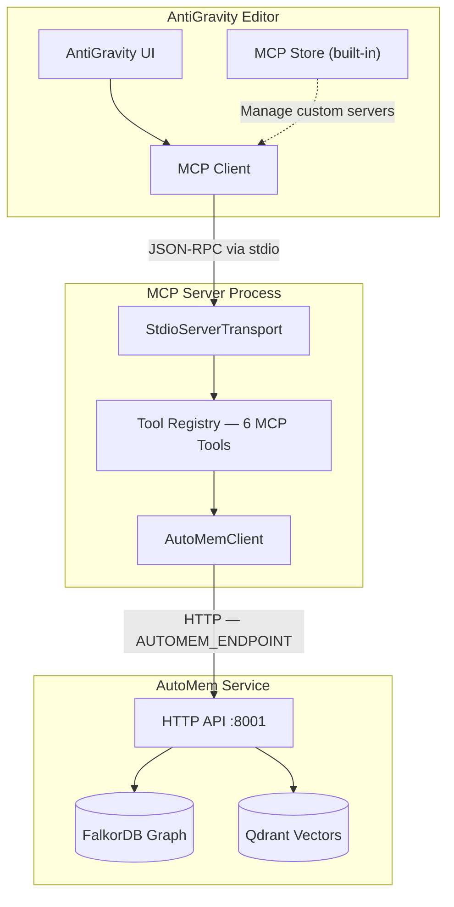

Google AntiGravity supports MCP natively through its **built-in MCP Store** and a `mcp_config.json` configuration file. AutoMem connects as a custom MCP server, exposing six memory tools (`store_memory`, `recall_memory`, `associate_memories`, `update_memory`, `delete_memory`, `check_database_health`) directly inside AntiGravity conversations.

:::note
AutoMem is not yet available in AntiGravity's MCP Store. Install it as a custom MCP server using the manual configuration below.
:::

---

## Architecture



AntiGravity spawns the AutoMem MCP server as a child process and communicates over stdin/stdout using JSON-RPC — the same stdio transport used by Claude Desktop and Cursor.

---

## Installation

### Step 1: Open the MCP Configuration

1. Open the **MCP Store** panel via the `...` dropdown at the top of AntiGravity's agent panel
2. Click **Manage MCP Servers**
3. Click **View raw config** to open `mcp_config.json`

### Step 2: Add the AutoMem Server

**Cloud deployment (Railway or other hosted AutoMem):**

```json
{
  "mcpServers": {
    "memory": {
      "command": "npx",
      "args": ["-y", "@verygoodplugins/mcp-automem"],
      "env": {
        "AUTOMEM_ENDPOINT": "https://your-automem-service.up.railway.app",
        "AUTOMEM_API_KEY": "your-api-token-here"
      }
    }
  }
}
```

**Local development (AutoMem running on localhost):**

```json
{
  "mcpServers": {
    "memory": {
      "command": "npx",
      "args": ["-y", "@verygoodplugins/mcp-automem"],
      "env": {
        "AUTOMEM_ENDPOINT": "http://127.0.0.1:8001"
      }
    }
  }
}
```

**Using a local build instead of the npm package:**

```json
{
  "mcpServers": {
    "memory": {
      "command": "node",
      "args": ["/path/to/mcp-automem/dist/index.js"],
      "env": {
        "AUTOMEM_ENDPOINT": "http://127.0.0.1:8001"
      }
    }
  }
}
```

### Step 3: Reload

After saving `mcp_config.json`, AntiGravity should automatically detect the new server. If tools don't appear, restart the editor.

---

## Tool Naming

AntiGravity prefixes MCP tools with the server name. With the server registered as `"memory"`, tools appear as:

- `store_memory`
- `recall_memory`
- `associate_memories`
- `update_memory`
- `delete_memory`
- `check_database_health`

:::note
AntiGravity's exact tool prefix format may vary. Check the editor's tool list after installation to confirm the naming pattern used in your version.
:::

---

## Multiple Server Instances

Run separate AutoMem instances for different contexts — personal vs. work memory, or per-project isolation:

```json
{
  "mcpServers": {
    "memory-personal": {
      "command": "npx",
      "args": ["-y", "@verygoodplugins/mcp-automem"],
      "env": { "AUTOMEM_ENDPOINT": "http://127.0.0.1:8001" }
    },
    "memory-work": {
      "command": "npx",
      "args": ["-y", "@verygoodplugins/mcp-automem"],
      "env": {
        "AUTOMEM_ENDPOINT": "https://work-automem.example.com",
        "AUTOMEM_API_KEY": "work-token"
      }
    }
  }
}
```

---

## Available Memory Tools

| Tool | Description |
|------|-------------|
| `store_memory` | Store content with tags, importance, and metadata |
| `recall_memory` | Hybrid search (semantic + keyword + tags + time) |
| `associate_memories` | Create typed relationships between memories |
| `update_memory` | Modify existing memory fields |
| `delete_memory` | Permanently remove a memory |
| `check_database_health` | Check FalkorDB and Qdrant connection status |

---

## Configuring Agent Instructions

AntiGravity's AI agent benefits from explicit instructions on when and how to use memory. Add these patterns to your editor's agent instructions or system prompt:

**Recommended recall strategy:**
- At conversation start, recall recent work and relevant project context
- Before creating content, check for style preferences and past corrections
- During debugging, search for similar past errors

**Recommended storage triggers:**

| Type | Importance | Example |
|------|-----------|---------|
| Decision | 0.9 | "Chose Firestore over BigQuery for real-time reads" |
| Insight / Bug fix | 0.8 | "CORS failing in Cloud Run. Root: missing allow-origin header" |
| Pattern | 0.7 | "Using service account impersonation for all GCP API calls" |
| Context | 0.5–0.7 | "Added Pub/Sub event pipeline for order processing" |

**Tagging convention:**

```json
{
  "tags": ["project-name", "antigravity", "YYYY-MM", "component-name"],
  "type": "Decision",
  "importance": 0.9
}
```

---

## Environment Variables

| Variable | Required | Purpose | Example |
|----------|---------|---------|---------|
| `AUTOMEM_ENDPOINT` | Yes | AutoMem service URL | `http://127.0.0.1:8001` |
| `AUTOMEM_API_KEY` | No* | API authentication token | `your-token-here` |

\*Required for Railway/cloud deployments. Optional for local development.

---

## Verification

After installation, ask AntiGravity's agent to verify the connection:

```
Check the health of the AutoMem service
```

Expected response includes:
- FalkorDB connection status
- Qdrant connection status
- Service version

---

## Troubleshooting

### Tools not appearing in AntiGravity

1. Verify `mcp_config.json` is valid JSON (no trailing commas)
2. Check that `AUTOMEM_ENDPOINT` is reachable from your machine
3. Restart AntiGravity completely
4. Re-open the MCP Store panel and confirm the server appears in the list

### Service unreachable

```bash
# Test your endpoint directly
curl http://127.0.0.1:8001/health

# For cloud deployments
curl -H "Authorization: Bearer $YOUR_KEY" https://your-automem.up.railway.app/health
```

### Authentication failures (401/403)

1. Verify `AUTOMEM_API_KEY` matches the token set in your AutoMem service
2. Test authentication: `curl -H "Authorization: Bearer $KEY" $ENDPOINT/health`
3. Regenerate API key if expired

### MCP Store vs. custom server conflicts

If you've installed another MCP server from the store that conflicts with your AutoMem config, check `mcp_config.json` for duplicate server names. Each server must have a unique key.

---

## Cross-Platform Memory Access

Memories stored via AntiGravity are accessible from any other AutoMem-connected platform (Cursor, Claude Desktop, Claude Code, GitHub Copilot) as long as they all point to the same AutoMem service endpoint.

---

## Related Platforms

AntiGravity's `mcp_config.json` follows the same `mcpServers` JSON structure as other MCP-enabled platforms:

- **Claude Desktop** — uses `claude_desktop_config.json` + Personal Preferences
- **Cursor IDE** — uses `~/.cursor/mcp.json` + `.cursor/rules/automem.mdc`
- **Claude Code** — uses `~/.claude.json` + `~/.claude/settings.json`
- **OpenAI Codex** — uses `~/.codex/config.toml` (TOML format)

All platforms share the same `@verygoodplugins/mcp-automem` npm package.
