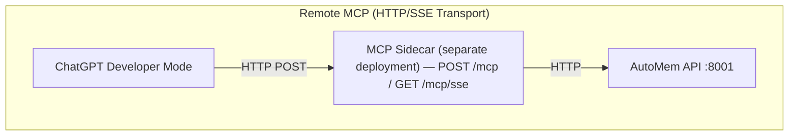

ChatGPT connects to AutoMem through a **remote MCP sidecar** — a separately deployed HTTP service that translates MCP protocol requests to AutoMem API calls. This is required because ChatGPT is cloud-based and cannot spawn local processes.

:::note
ChatGPT requires URL-based token authentication for custom MCP connectors. Header-based auth is not supported by ChatGPT's connector configuration UI.
:::

---

## Architecture



- **Local MCP** (Claude Desktop, Cursor, Claude Code): AI platform → stdio → MCP server → AutoMem API
- **Remote MCP** (ChatGPT, Claude.ai, ElevenLabs): AI platform → HTTPS → MCP sidecar → AutoMem API

The MCP sidecar is part of the AutoMem server repository (`mcp-sse-server/`), deployed separately from your local tools.

---

## Prerequisites

1. A deployed AutoMem service (see [deployment guide](/docs/getting-started/introduction/))
2. The MCP sidecar deployed and accessible over HTTPS
3. A ChatGPT Plus, Pro, Team, or Enterprise account (Developer Mode required)

---

## Deploy the MCP Sidecar

The sidecar is included in the AutoMem Railway one-click template. For manual deployment:

**Required environment variables:**

| Variable | Purpose |
|----------|---------|
| `AUTOMEM_API_URL` | AutoMem service URL (e.g., `http://memory-service.railway.internal:8001`) |
| `AUTOMEM_API_TOKEN` | API token for AutoMem service authentication |
| `PORT` | Server listen port (default: `8080`) |

**Railway deployment:**
1. Deploy via Railway one-click template (includes sidecar)
2. Go to `mcp-sse-server` service → Settings → Networking → Generate Domain
3. Note the public URL: `https://your-mcp-bridge.up.railway.app`

:::caution
On Railway, use the internal DNS (`http://memory-service.railway.internal:8001`) for `AUTOMEM_API_URL` to avoid egress charges. The memory service **must** have `PORT=8001` set — without it, Flask defaults to port 5000 and connections will fail.
:::

**Sidecar endpoints:**

| Endpoint | Method | Purpose |
|----------|--------|---------|
| `/mcp` | POST | Streamable HTTP — full-duplex MCP (recommended) |
| `/mcp/sse` | GET | SSE stream — server→client events (legacy) |
| `/mcp/messages?sessionId=<id>` | POST | SSE client→server messages (legacy) |
| `/health` | GET | Service health probe |

---

## Connect ChatGPT

1. Open ChatGPT → **Settings** → **Connectors** → **Advanced**
2. Enable **Developer Mode**
3. Click **+ Add Server**
4. Enter the server URL

**Streamable HTTP (recommended):**

```
https://your-mcp-bridge.up.railway.app/mcp?api_token=YOUR_AUTOMEM_TOKEN
```

**SSE (fallback if Streamable HTTP not supported):**

```
https://your-mcp-bridge.up.railway.app/mcp/sse?api_token=YOUR_AUTOMEM_TOKEN
```

5. Save the configuration

---

## Available Memory Tools

All six AutoMem tools are available via remote MCP:

| Tool | Description |
|------|-------------|
| `store_memory` | Store content with tags, importance, and metadata |
| `recall_memory` | Hybrid search (semantic + keyword + tags + time) |
| `associate_memories` | Create typed relationships between memories |
| `update_memory` | Modify existing memory fields |
| `delete_memory` | Permanently remove a memory |
| `check_database_health` | Check FalkorDB and Qdrant connection status |

---

## Verification

Test the connection by asking ChatGPT:

```
Check the health of the AutoMem service
```

Then test storing and recalling:

```
Store a memory: I prefer dark mode in all applications

What are my preferences?
```

---

## Troubleshooting

### ChatGPT cannot connect to the MCP endpoint

1. Verify the sidecar is running: `curl https://your-mcp-bridge.up.railway.app/health`
2. Check DNS resolves for your domain
3. Ensure HTTPS (port 443) is open — ChatGPT requires TLS
4. Verify TLS certificate is valid (Railway domains use wildcard certs automatically)

### 401 Unauthorized

1. Check `AUTOMEM_API_TOKEN` is set in the sidecar's environment variables
2. Verify the token in the URL matches exactly (no extra spaces)
3. Ensure the token is URL-encoded if it contains special characters
4. Test token directly: `curl -H "Authorization: Bearer $TOKEN" https://your-automem.up.railway.app/health`

### Memory service connection errors (502/504)

**Symptom in sidecar logs:**
```
[AutoMem] Fetch failed for http://memory-service.railway.internal:8001/memory:
Error: connect ECONNREFUSED fd12:ca03:42be:0:1000:50:1079:5b6c:8001
```

| Cause | Solution |
|-------|---------|
| Missing `PORT=8001` in memory service | Add `PORT=8001` to memory service environment variables |
| Wrong internal hostname | Update to `memory-service.railway.internal:8001` |
| Service not running | Check Railway dashboard for deployment status |

### Variable resolution failures

**Symptom:** Logs show literal `${{...}}` syntax:
```
[AutoMem] GET http://${{FalkorDB.RAILWAY_PRIVATE_DOMAIN}}:6379/health
```

Railway variable references (`${{...}}`) only work in template deployments. Use hardcoded values for manual service configuration.

### SSE connection drops

If using SSE transport (legacy), the sidecar sends heartbeats every 20 seconds. Some proxies buffer SSE streams — ensure your proxy is configured for streaming responses.

Consider switching to Streamable HTTP (`/mcp`) instead of SSE (`/mcp/sse`) for better reliability.

---

## Security Notes

- URL-based tokens (`?api_token=`) appear in server logs and browser history
- ChatGPT's connector UI does not support custom headers, making URL-based auth unavoidable
- Use Railway's private networking to keep the sidecar-to-AutoMem communication internal
- Rotate your `AUTOMEM_API_TOKEN` periodically

---

## Related Platforms

Other cloud-based platforms using the same remote MCP sidecar:
- [Claude.ai (Web)](/docs/platforms/claude-web/) — supports header-based auth
- [ElevenLabs](/docs/platforms/elevenlabs/) — uses SSE transport with header auth
