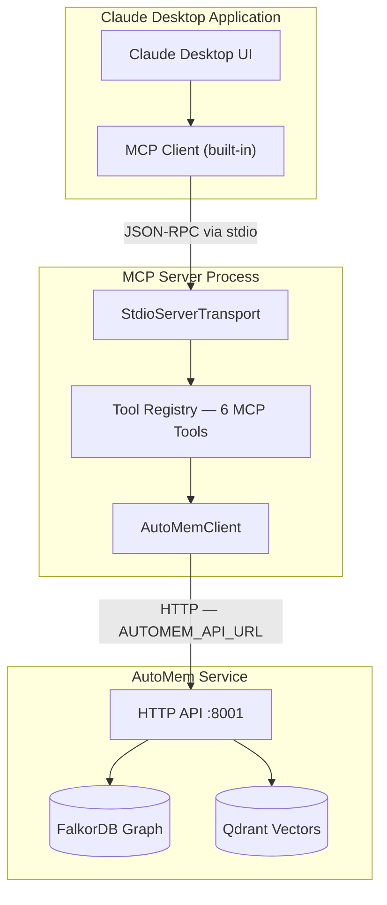
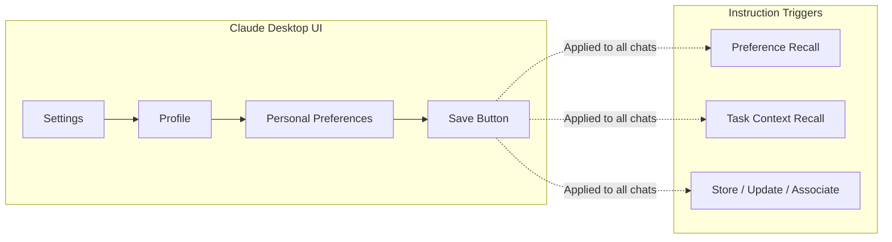

Claude Desktop uses the **Standard MCP** integration approach, connecting to AutoMem via a spawned stdio process. This exposes six memory tools (`store_memory`, `recall_memory`, `associate_memories`, `update_memory`, `delete_memory`, `check_database_health`) directly inside Claude Desktop conversations.

## System Architecture

Claude Desktop spawns the AutoMem MCP server as a child process and communicates over stdin/stdout using JSON-RPC.



**Tool naming:** When the MCP server is registered as `"memory"`, Claude Desktop prefixes tools with `mcp__memory__`:
- `mcp__memory__store_memory`
- `mcp__memory__recall_memory`
- `mcp__memory__associate_memories`
- `mcp__memory__update_memory`
- `mcp__memory__delete_memory`
- `mcp__memory__check_database_health`

---

## Installation

### Method 1: One-Click `.mcpb` Install (Planned)

:::note
The `.mcpb` (MCP Bundle) one-click install format is a planned feature and is not yet implemented. Use Method 2 (manual JSON configuration) for now.
:::

### Method 2: Manual JSON Configuration

Edit (or create) the Claude Desktop config file for your platform:

| Platform | Path |
|----------|------|
| macOS | `~/Library/Application Support/Claude/claude_desktop_config.json` |
| Windows | `%APPDATA%\Claude\claude_desktop_config.json` |
| Linux | `~/.config/Claude/claude_desktop_config.json` |

**Cloud deployment (Railway or other hosted AutoMem):**

```json
{
  "mcpServers": {
    "memory": {
      "command": "npx",
      "args": ["-y", "@verygoodplugins/mcp-automem"],
      "env": {
        "AUTOMEM_API_URL": "https://your-automem-service.up.railway.app",
        "AUTOMEM_API_KEY": "your-api-token-here"
      }
    }
  }
}
```

**Local development (AutoMem running on localhost):**

```json
{
  "mcpServers": {
    "memory": {
      "command": "npx",
      "args": ["-y", "@verygoodplugins/mcp-automem"],
      "env": {
        "AUTOMEM_API_URL": "http://127.0.0.1:8001"
      }
    }
  }
}
```

**Using a local build instead of the npm package:**

```json
{
  "mcpServers": {
    "memory": {
      "command": "node",
      "args": ["/path/to/mcp-automem/dist/index.js"],
      "env": {
        "AUTOMEM_API_URL": "http://127.0.0.1:8001"
      }
    }
  }
}
```

After editing the config, **restart Claude Desktop** for changes to take effect.

---

## Multiple Server Instances

You can run multiple AutoMem servers with different endpoints — for example, to separate personal and work memory:

```json
{
  "mcpServers": {
    "memory-personal": {
      "command": "npx",
      "args": ["-y", "@verygoodplugins/mcp-automem"],
      "env": { "AUTOMEM_API_URL": "http://127.0.0.1:8001" }
    },
    "memory-work": {
      "command": "npx",
      "args": ["-y", "@verygoodplugins/mcp-automem"],
      "env": {
        "AUTOMEM_API_URL": "https://work-automem.example.com",
        "AUTOMEM_API_KEY": "work-token"
      }
    }
  }
}
```

Tools from each server are prefixed with their server name:
- `mcp__memory-personal__recall_memory`
- `mcp__memory-work__recall_memory`

---

## Personal Preferences for Automatic Memory Usage

Claude Desktop's **Personal Preferences** field enables automatic, context-aware memory usage without manual prompting on every conversation.

As of April 2026, Claude Desktop labels this setting **Personal Preferences** under the Profile settings. Older docs may call the same area "Custom Instructions."

### Adding Personal Preferences



Navigate to: **Settings → Profile → Personal Preferences**.

Paste the starter template from the mcp-automem repo:

- [`templates/CLAUDE_DESKTOP_INSTRUCTIONS.md`](https://github.com/verygoodplugins/mcp-automem/blob/main/templates/CLAUDE_DESKTOP_INSTRUCTIONS.md)

The template assumes your MCP server key is `memory`, so examples use tool names such as `mcp__memory__recall_memory`. If your `claude_desktop_config.json` uses a different server key, update the tool prefix after pasting.

Key sections:

| Section | Purpose |
|---------|---------|
| Desktop is semantic-first | Avoids guessing project tags on broad Desktop conversations |
| Conversation start | Pulls preferences first, then one semantic task-context recall when useful |
| When to store | Keeps durable preferences, decisions, patterns, and fixes while skipping noise |
| Storage format | Shows concise `store_memory` calls with type, tags, importance, confidence |
| Mid-conversation memory ops | Uses recall → store → verify → associate for important updates |
| Relation types | Lists the 11 authorable association types for `associate_memories` |

### Memory Storage Patterns

Recommended importance thresholds:

| Type | Importance | Example |
|------|-----------|---------|
| Preference / Decision | 0.9 | "Prefer early returns over nested conditionals" |
| Insight / Bug fix | 0.8 | "Auth failing on null input. Root: missing validation" |
| Pattern | 0.7 | "Using early returns for validation in all API routes" |
| Context | 0.5–0.7 | "Added JWT auth with refresh token rotation" |

**Correction storage (critical pattern):** When you correct Claude's output, the Personal Preferences template tells Claude to store the correction as a high-importance style signal so the same mistake is not repeated.

---

## Environment Variables

| Variable | Required | Purpose | Example |
|----------|---------|---------|---------|
| `AUTOMEM_API_URL` | Yes | AutoMem service URL | `http://127.0.0.1:8001` |
| `AUTOMEM_API_KEY` | No* | API authentication token | `your-token-here` |

\*Required for Railway/cloud deployments. Optional for local development.

**Configuration resolution order:**
1. `env` block in `claude_desktop_config.json` (highest priority)
2. `.env` file in current working directory
3. Default values

---

## Verification

After installation, open Claude Desktop and verify the connection:

```
User: Check the health of the AutoMem service
```

Expected response includes:
- FalkorDB connection status
- Qdrant connection status
- Service version

---

## Troubleshooting

### Tools not appearing in Claude Desktop

1. Verify `claude_desktop_config.json` is valid JSON (no trailing commas)
2. Check that `AUTOMEM_API_URL` is reachable from your machine
3. Restart Claude Desktop completely (quit from menu, not just close window)
4. Check Claude Desktop logs for MCP server startup errors

### Service unreachable

```bash
# Test your endpoint directly
curl http://127.0.0.1:8001/health

# For cloud deployments
curl -H "Authorization: Bearer $YOUR_KEY" https://your-automem.up.railway.app/health
```

### Authentication failures (401/403)

1. Verify `AUTOMEM_API_KEY` matches the token set in your AutoMem service
2. Test authentication: `curl -H "Authorization: Bearer $KEY" $ENDPOINT/health`
3. Regenerate API key if expired

### Memory not persisting between sessions

- Ensure you have Personal Preferences set that tell Claude when to recall, store, update, and associate memories
- Check that `store_memory` calls are completing successfully (no error messages)
- Verify the AutoMem service has write access to its database directories

---

## Related Platforms

Claude Desktop's configuration is similar to other MCP-enabled platforms but uses a different config file location:

- **Cursor IDE** — uses `~/.cursor/mcp.json` + `.cursor/rules/automem.mdc`
- **Claude Code** — uses `~/.claude.json` + `~/.claude/settings.json`
- **OpenAI Codex** — uses `~/.codex/config.toml` (TOML format)
- **Google AntiGravity** — uses `mcp_config.json` via built-in MCP Store

All platforms share the same AutoMem MCP server package but with platform-specific configuration and optional rule files.
