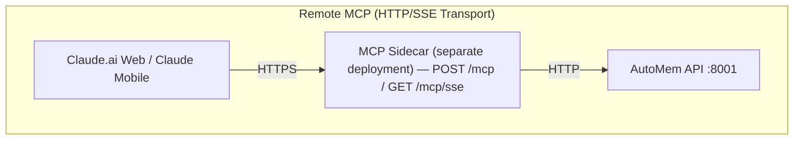

Claude.ai (web) and Claude mobile apps (iOS/Android) connect to AutoMem through a **remote MCP sidecar** — a separately deployed HTTPS service that bridges the MCP protocol to AutoMem's HTTP API. This is required because cloud-based Claude cannot spawn local processes.

Unlike ChatGPT, Claude.ai supports both header-based and URL-based authentication.

---

## Architecture



The sidecar service (`mcp-sse-server`) is included in the AutoMem server repository. It implements:
- **Streamable HTTP** (recommended): `POST /mcp` — full-duplex MCP-over-HTTP, MCP protocol version 2025-03-26
- **SSE** (legacy): `GET /mcp/sse` — server→client event stream, MCP protocol version 2024-11-05

Sessions are maintained server-side with a 1-hour TTL and 5-minute sweep interval. The Streamable HTTP transport supports `Last-Event-ID` for resumability.

---

## Prerequisites

1. A deployed AutoMem service
2. The MCP sidecar deployed and accessible over HTTPS
3. A Claude.ai account (Pro recommended for MCP features)

---

## Deploy the MCP Sidecar

**Required environment variables:**

| Variable | Purpose |
|----------|---------|
| `AUTOMEM_API_URL` | AutoMem service URL |
| `AUTOMEM_API_TOKEN` | API token for authentication |
| `PORT` | Listen port (default: `8080`) |

`AUTOMEM_ENDPOINT` is supported as a legacy alias for `AUTOMEM_API_URL`.

**Railway deployment (recommended):**
1. Deploy via Railway one-click template
2. Go to `mcp-sse-server` service → Settings → Networking → Generate Domain
3. Your sidecar URL will be: `https://your-mcp-bridge.up.railway.app`

:::caution
The memory service **must** have `PORT=8001` set. Without it, Flask defaults to port 5000, causing connection refused errors from the sidecar.

On Railway, use internal DNS for `AUTOMEM_API_URL`: `http://memory-service.railway.internal:8001`
:::

**Sidecar endpoints:**

| Endpoint | Method | Transport | Purpose |
|----------|--------|-----------|---------|
| `/mcp` | POST | Streamable HTTP | Full-duplex MCP (recommended) |
| `/mcp/sse` | GET | SSE | Server→client event stream (legacy) |
| `/mcp/messages?sessionId=<id>` | POST | SSE | Client→server JSON-RPC (legacy) |
| `/health` | GET | HTTP | Health probe |

---

## Connect Claude.ai Web

1. Open Claude.ai → **Settings** → **MCP Servers**
2. Add a new server

**Streamable HTTP (recommended):**

```
https://your-mcp-bridge.up.railway.app/mcp?api_token=YOUR_AUTOMEM_TOKEN
```

**SSE (fallback):**

```
https://your-mcp-bridge.up.railway.app/mcp/sse?api_token=YOUR_AUTOMEM_TOKEN
```

---

## Connect Claude Mobile (iOS/Android)

1. Open the Claude app → **Settings** → **MCP Servers**
2. Add server URL:

**Streamable HTTP:**

```
https://your-mcp-bridge.up.railway.app/mcp?api_token=YOUR_AUTOMEM_TOKEN
```

The mobile apps use the same MCP configuration as the web interface.

---

## Authentication Options

Claude.ai supports both authentication methods:

**URL-based (simpler):**
```
https://your-mcp-bridge.up.railway.app/mcp?api_token=YOUR_TOKEN
```

**Header-based (more secure):**
- Server URL: `https://your-mcp-bridge.up.railway.app/mcp`
- Header: `Authorization: Bearer YOUR_TOKEN`

:::tip
Prefer header-based authentication when the Claude.ai interface supports it — tokens in URLs appear in server logs and browser history.
:::

**Token extraction priority** (sidecar `getAuthToken()` function):
1. `Authorization: Bearer <token>` header
2. `X-API-Key: <token>` header
3. `X-API-Token: <token>` header
4. `?api_key=<token>` query parameter
5. `?apiKey=<token>` query parameter
6. `?api_token=<token>` query parameter
7. `AUTOMEM_API_TOKEN` environment variable (fallback)

---

## Available Memory Tools

All six AutoMem tools are available via remote MCP:

| Tool | Type | Description |
|------|------|-------------|
| `store_memory` | Write | Store content with tags, importance, metadata |
| `recall_memory` | Read | Hybrid search (semantic + keyword + tags + time) |
| `associate_memories` | Write | Create typed relationships between memories |
| `update_memory` | Write/Destructive | Modify existing memory fields |
| `delete_memory` | Write/Destructive | Permanently remove a memory |
| `check_database_health` | Read | Check FalkorDB and Qdrant connection status |

The `recall_memory` tool supports advanced parameters including `expand_relations`, `expand_entities`, `auto_decompose`, `expand_min_importance`, `expand_min_strength`, `context`, `language`, `active_path`, `context_tags`, `context_types`, and `priority_ids`.

---

## Verification

Test the connection:

```
Check the health of the AutoMem service
```

Test storing and recalling:

```
Store a memory: I prefer concise responses without unnecessary preamble.
```

```
What are my communication preferences?
```

---

## Migrating from SSE to Streamable HTTP

Streamable HTTP is the recommended transport. To migrate:

**Before (SSE):**
```
https://your-mcp-bridge.up.railway.app/mcp/sse?api_token=<token>
```

**After (Streamable HTTP):**
```
https://your-mcp-bridge.up.railway.app/mcp?api_token=<token>
```

Benefits of Streamable HTTP:
- Lower latency (fewer round-trips)
- No `sessionId` management needed
- Full-duplex communication
- Better error handling
- Supports `Last-Event-ID` for stream resumability

---

## Troubleshooting

### Claude.ai cannot connect to MCP endpoint

1. Check sidecar health: `curl https://your-mcp-bridge.up.railway.app/health`
2. Verify DNS resolves for your domain
3. Ensure valid TLS certificate (Railway auto-provisions)
4. Check firewall allows HTTPS (443)

### 401 Unauthorized

1. Verify `AUTOMEM_API_TOKEN` in sidecar environment variables
2. Check that the token matches between sidecar and memory service
3. Test token: `curl -H "Authorization: Bearer $TOKEN" https://your-automem.up.railway.app/health`

### SSE connection drops

The sidecar sends heartbeats every 20 seconds to maintain SSE connections. If Claude.ai drops the connection before 20 seconds:
- Check if a reverse proxy is buffering the SSE stream
- The sidecar sets anti-buffering headers (`X-Accel-Buffering: no`, `Cache-Control: no-cache`)
- Consider switching to Streamable HTTP transport

### Stream replay (Streamable HTTP)

The sidecar's `InMemoryEventStore` persists events for 1 hour with a maximum of 1000 events per stream. If Claude.ai sends a `Last-Event-ID` header on reconnect, the sidecar replays missed events automatically.

---

## Related Platforms

Other cloud platforms using the same remote MCP sidecar:
- [ChatGPT](/docs/docs/platforms/chatgpt/) — URL auth only, Streamable HTTP or SSE
- [ElevenLabs](/docs/docs/platforms/elevenlabs/) — SSE with header auth, 30s idle timeout handled by heartbeat
