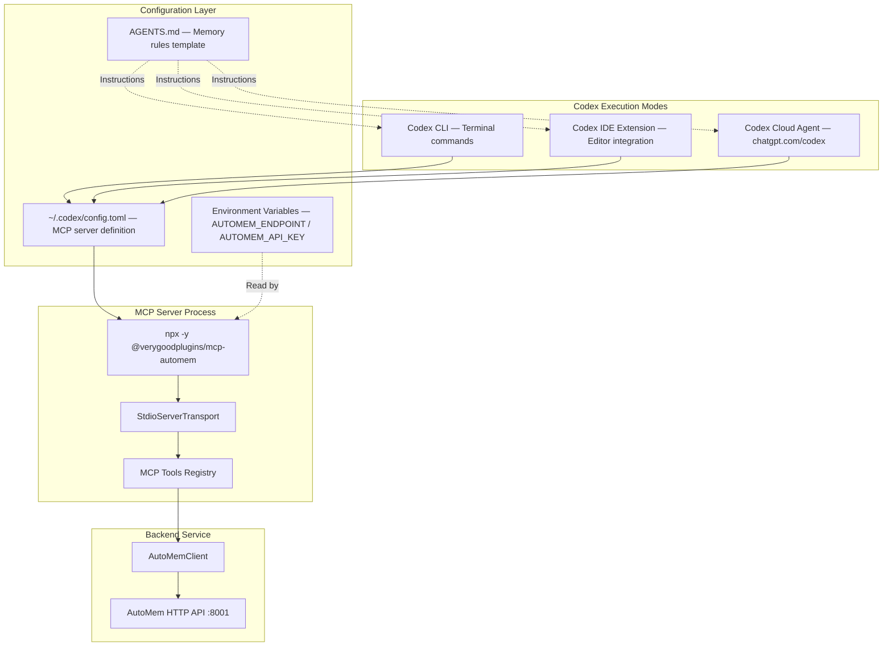
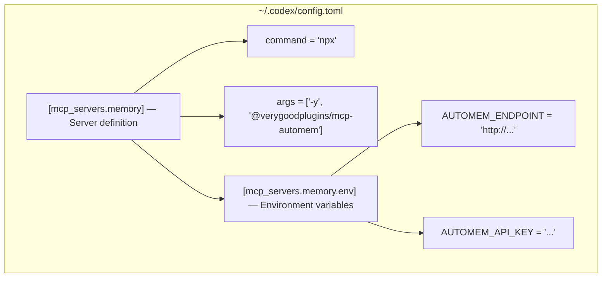

OpenAI Codex is an AI coding assistant that operates in three modes: CLI, IDE extensions, and cloud agent at [chatgpt.com/codex](https://chatgpt.com/codex). AutoMem integrates via MCP, providing persistent memory across all three modes.

**Key characteristics:**
- Configuration format: **TOML** (not JSON like other platforms)
- Rule system: `AGENTS.md` file for memory-first instructions
- Authentication: Requires ChatGPT Plus, Pro, Team, Edu, or Enterprise account
- Memory persists across CLI, IDE, and cloud agent modes

The integration consists of two components:
1. **MCP server configuration** in `~/.codex/config.toml`
2. **Memory rules** in `AGENTS.md` (project-specific or global)

---

## Architecture



**Configuration resolution:**
1. Codex reads `~/.codex/config.toml` for MCP server definitions
2. MCP server is spawned as a child process with environment variables
3. Server exposes tools via stdio transport
4. Codex reads `AGENTS.md` for memory usage instructions
5. AI follows instructions to call memory tools proactively

---

## Installation

### Prerequisites

| Requirement | Details |
|-------------|---------|
| Codex CLI | `npm install -g @openai/codex` or `brew install codex` |
| Authentication | ChatGPT Plus, Pro, Team, Edu, or Enterprise account |
| AutoMem service | Running at `http://127.0.0.1:8001` or cloud URL |
| Node.js | Required if using `npx` invocation |

### Step 1: Install Codex CLI

```bash
npm install -g @openai/codex
# or
brew install codex
```

Authenticate on first run:

```bash
codex  # Opens browser for authentication
```

### Step 2: Configure MCP Server

Edit or create `~/.codex/config.toml`:

```toml
[mcp_servers.memory]
command = "npx"
args = ["-y", "@verygoodplugins/mcp-automem"]

[mcp_servers.memory.env]
AUTOMEM_ENDPOINT = "http://127.0.0.1:8001"
# AUTOMEM_API_KEY = "your-token-here"  # Required for cloud deployments
```

**For cloud/Railway deployment:**

```toml
[mcp_servers.memory]
command = "npx"
args = ["-y", "@verygoodplugins/mcp-automem"]

[mcp_servers.memory.env]
AUTOMEM_ENDPOINT = "https://your-automem-service.up.railway.app"
AUTOMEM_API_KEY = "your-api-token-here"
```

**Using a local build (development):**

```toml
[mcp_servers.memory]
command = "node"
args = ["/path/to/mcp-automem/dist/index.js"]

[mcp_servers.memory.env]
AUTOMEM_ENDPOINT = "http://127.0.0.1:8001"
```

:::note
The `[mcp_servers.memory]` section name determines the tool prefix: `mcp__memory__*`. Changing it to `[mcp_servers.automem]` would change the prefix to `mcp__automem__*`.
:::

### Step 3: Add Memory Rules (Recommended)

Run the CLI installer to generate `AGENTS.md` with AutoMem memory rules:

```bash
# Auto-detect project name
npx @verygoodplugins/mcp-automem codex

# Specify project name
npx @verygoodplugins/mcp-automem codex --name my-project

# Preview without writing
npx @verygoodplugins/mcp-automem codex --dry-run
```

This detects your project name, generates a month-aware `AGENTS.md` section, and validates your MCP config.

### Step 4: Restart Codex

```bash
codex  # Restart to load new MCP server configuration
```

---

## TOML Configuration Details



**TOML vs JSON differences:**
- TOML uses `[section.subsection]` syntax for nesting
- String values use double or single quotes
- Arrays use square brackets with comma separation
- No trailing commas allowed
- Comments use `#` prefix

**Environment variable resolution order:**
1. Inline `[mcp_servers.memory.env]` section in `config.toml` (highest priority)
2. `.env` file in current working directory
3. Shell environment variables (lowest priority)

**Server naming and tool prefixes:**

| Config section | Tool prefix |
|----------------|------------|
| `[mcp_servers.memory]` | `mcp__memory__store_memory`, `mcp__memory__recall_memory` |
| `[mcp_servers.automem]` | `mcp__automem__store_memory`, `mcp__automem__recall_memory` |

The `AGENTS.md` template assumes the server is named `memory`. If you use a different name, update the tool prefixes in `AGENTS.md` accordingly.

---

## AGENTS.md Rule System

The `codex` CLI command generates an `AGENTS.md` section with placeholders:
- `{{PROJECT_NAME}}` → detected from `package.json` or git remote
- `{{CURRENT_MONTH}}` → current month in `YYYY-MM` format

### Memory Operation Patterns

**1. Task Start Recall**

Use at the beginning of a coding session, when switching projects, or resuming work:

```
recall_memory(
  queries: ["{{PROJECT_NAME}} architecture", "recent decisions"],
  tags: ["{{PROJECT_NAME}}"],
  time_query: "last 30 days"
)
```

**2. During-Task Storage**

Memory types and when to use them:

| Type | Use Case |
|------|---------|
| `Decision` | Strategic or technical decisions |
| `Pattern` | Recurring approaches, best practices |
| `Insight` | Key learnings, problem resolutions |
| `Preference` | User/team preferences |
| `Style` | Code style or formatting |
| `Habit` | Regular behaviors or workflows |
| `Context` | General information (default) |

**3. Content Size Guidelines**

| Size | Behavior |
|------|---------|
| Target: 150–300 chars | Optimal for semantic search quality |
| Maximum: 500 chars | Auto-summarized by backend if exceeded |
| Hard limit: 2000 chars | Rejected with error |

**Recommended structure:** `"Brief title. Context and details. Impact/outcome."`

---

## Advanced Recall Features

### Multi-Hop Reasoning (Entity Expansion)

```
recall_memory(
  query: "Amanda's preferences",
  expand_entities: true,
  auto_decompose: true
)
```

How it works:
1. Seed query finds: "Amanda's sister is Rachel"
2. Entity extractor identifies `Rachel` as a person entity
3. Supplementary query runs: memories about `Rachel`
4. Results are merged and deduplicated

### Graph Expansion with Filtering

```
recall_memory(
  query: "authentication patterns",
  expand_relations: true,
  expand_min_importance: 0.6,
  expand_min_strength: 0.5
)
```

- `expand_min_importance`: Threshold for expanded memory inclusion (0–1)
- `expand_min_strength`: Threshold for following relationships (0–1)
- Prevents low-quality memories from polluting results

### Context-Aware Coding Recall

```
recall_memory(
  query: "TypeScript patterns",
  language: "typescript",
  context_types: ["Style", "Pattern"],
  active_path: "src/auth.ts"
)
```

- `language`: Programming language hint
- `context_types`: Priority memory types to boost
- `context_tags`: Priority tags to boost in results
- `active_path`: Current file path for language auto-detection

---

## Usage Across Execution Modes

### CLI Mode

- Reads `AGENTS.md` from current working directory
- Falls back to `~/.codex/AGENTS.md` if project-level file doesn't exist
- Environment variables from shell or `.env` file

### IDE Mode

- Detects project root from workspace
- Reads `AGENTS.md` relative to project root
- Environment variables from IDE configuration

### Cloud Agent Mode

:::caution
The cloud agent runs in a GitHub-hosted environment. `localhost` URLs will not work. You must provide a publicly accessible `AUTOMEM_ENDPOINT` (Railway, Docker, etc.).
:::

Memories persist across all three modes — store in CLI, recall in IDE, or vice versa.

---

## Tagging Convention

Recommended 4-part tagging strategy:

1. **Project identifier**: your project name
2. **Platform tag**: `codex`
3. **Component tag**: specific area (e.g., `auth`, `api`, `frontend`)
4. **Temporal tag**: `YYYY-MM` (e.g., `2026-02`)

**Example:**
```json
["my-app", "codex", "auth", "decision", "2026-02"]
```

Why this structure:
- Project tag enables cross-session filtering
- Platform tag distinguishes Codex memories from Cursor/Claude
- Component tag enables architecture-aware recall
- Temporal tag enables time-based decay and recent work queries

---

## Importance Scoring Guidelines

| Score Range | Use Case | Examples |
|-------------|---------|---------|
| 0.9–1.0 | Critical decisions | Architecture choices, breaking changes |
| 0.7–0.9 | Important patterns | Bug fixes, reusable patterns |
| 0.5–0.7 | Standard notes | Minor features, config changes |
| 0.3–0.5 | Minor notes | Small fixes, temporary workarounds |

Memories with `importance < 0.3` naturally decay in retrieval ranking. Time decay is applied: recent memories are boosted, old memories penalized.

---

## Cross-Platform Memory Sync

Memories stored via Codex are accessible from Cursor, Claude Code, and Claude Desktop — they all connect to the same AutoMem service.

**Requirement:** Use consistent project names and tags across platforms.

**Tag strategy for cross-platform recall:**
- Always include the project identifier tag
- Platform tag (`codex`, `cursor`, `claude-code`) distinguishes source but doesn't block cross-platform recall
- Use `tag_mode: "any"` (default) for cross-platform queries

---

## CLI Command Reference

| Flag | Description | Default |
|------|-------------|---------|
| `--name <name>` | Project name | Detected from `package.json` or git |
| `--desc <description>` | Project description | Detected from `package.json` |
| `--dry-run` | Preview without writing | `false` |
| `--dir <path>` | Target directory | Current working directory |

---

## Troubleshooting

### Tools not available

**Symptom:** Codex doesn't recognize memory tools; error: "Unknown tool: mcp__memory__recall_memory"

1. Verify `~/.codex/config.toml` exists and has the `[mcp_servers.memory]` section
2. Check that `npx` is in your PATH: `which npx`
3. Test the MCP server directly: `npx -y @verygoodplugins/mcp-automem --version`
4. Restart Codex after config changes

### Service unreachable

**Symptom:** "ECONNREFUSED" or "Connection timeout"

```bash
# Test local service
curl http://127.0.0.1:8001/health

# Test cloud service
curl -H "Authorization: Bearer $KEY" https://your-automem.up.railway.app/health
```

For cloud agent mode, ensure `AUTOMEM_ENDPOINT` points to a publicly accessible URL.

### AGENTS.md rules not followed

**Symptom:** Codex doesn't recall memory automatically; doesn't store decisions.

1. Verify `AGENTS.md` exists in the project root (or `~/.codex/AGENTS.md` for global rules)
2. Check that the AutoMem section is present in `AGENTS.md`
3. Re-run the installer: `npx @verygoodplugins/mcp-automem codex`
4. Verify tool names in `AGENTS.md` match the prefix in `config.toml`

### Verification steps

```bash
# 1. Check config file
cat ~/.codex/config.toml

# 2. Test MCP server launches
npx -y @verygoodplugins/mcp-automem

# 3. Test AutoMem service
curl http://127.0.0.1:8001/health

# 4. Test memory operation in Codex
codex
# Then: "Store a test memory: AutoMem integration is working"
# Then: "What do you know about AutoMem integration?"
```
