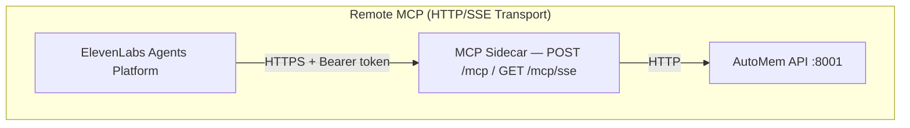

ElevenLabs Agents connect to AutoMem through the same **remote MCP sidecar** used by other cloud platforms (ChatGPT, Claude.ai). ElevenLabs supports custom HTTP headers, making it the only cloud platform that can use the more secure header-based authentication.

:::note
ElevenLabs has a **30-second idle timeout**. The sidecar's SSE transport sends heartbeats every 20 seconds to keep the connection alive. Streamable HTTP is also supported.
:::

---

## Architecture

The MCP sidecar bridges ElevenLabs voice agents to AutoMem's HTTP API:



---

## Prerequisites

1. A deployed AutoMem service
2. The MCP sidecar deployed and accessible over HTTPS
3. An ElevenLabs account with Agents access

---

## Deploy the MCP Sidecar

The sidecar is included in the AutoMem Railway one-click template. See [Claude.ai (Web)](/docs/docs/platforms/claude-web/) for full deployment instructions.

**Required environment variables:**

| Variable | Purpose |
|----------|---------|
| `AUTOMEM_API_URL` | AutoMem service URL |
| `AUTOMEM_API_TOKEN` | Default token for API authentication |
| `PORT` | Listen port (default: `8080`) |

**ElevenLabs-specific note:** The SSE transport heartbeat (every 20 seconds) is specifically designed to keep connections alive past ElevenLabs' 30-second idle timeout. Ensure the sidecar deployment does not have its own idle timeout shorter than 30 seconds.

---

## Connect ElevenLabs Agent

Configure the MCP server in your ElevenLabs Agent settings:

### Option 1: Header-Based Authentication (Recommended)

ElevenLabs supports custom HTTP headers, so you can use the more secure `Authorization` header:

- **Server URL:** `https://your-mcp-bridge.up.railway.app/mcp/sse`
- **Custom Header Name:** `Authorization`
- **Custom Header Value:** `Bearer YOUR_AUTOMEM_TOKEN`

Or using Streamable HTTP:

- **Server URL:** `https://your-mcp-bridge.up.railway.app/mcp`
- **Custom Header Name:** `Authorization`
- **Custom Header Value:** `Bearer YOUR_AUTOMEM_TOKEN`

### Option 2: URL-Based Authentication

**SSE transport:**
```
https://your-mcp-bridge.up.railway.app/mcp/sse?api_token=YOUR_AUTOMEM_TOKEN
```

**Streamable HTTP:**
```
https://your-mcp-bridge.up.railway.app/mcp?api_token=YOUR_AUTOMEM_TOKEN
```

:::tip
Use Option 1 (header-based) when possible. URL-based tokens appear in server logs, reverse proxy logs, and potentially in ElevenLabs' own analytics.
:::

---

## Voice Agent Memory Patterns

ElevenLabs voice agents benefit from memory in several ways:

**User preference recall** — Remember communication preferences across sessions:
```
recall_memory(
  tags: ["preference", "elevenlabs"],
  limit: 5
)
```

**Context continuity** — Resume conversations with context from previous sessions:
```
recall_memory(
  query: "last conversation with this user",
  time_query: "last 7 days"
)
```

**Knowledge persistence** — Store facts the user shares:
```
store_memory(
  content: "User's name is Alex. Prefers brief responses.",
  type: "Preference",
  importance: 0.9,
  tags: ["elevenlabs", "user-preferences"]
)
```

---

## Available Memory Tools

All six AutoMem tools are accessible to ElevenLabs agents:

| Tool | Description |
|------|-------------|
| `store_memory` | Store voice-captured information |
| `recall_memory` | Find relevant memories for current conversation |
| `associate_memories` | Create relationships between related memories |
| `update_memory` | Update existing memory content or metadata |
| `delete_memory` | Remove a specific memory |
| `check_database_health` | Verify AutoMem service is running |

---

## Connection Stability

ElevenLabs has a **30-second idle timeout** on SSE connections. The sidecar handles this automatically:

- SSE heartbeats sent every **20 seconds** (within the 30s timeout window)
- Heartbeat format: `: ping\n\n` (SSE comment, not a data event)
- Anti-buffering headers set: `X-Accel-Buffering: no`, `Cache-Control: no-cache`

If you observe connection drops:
1. Check that no intermediate proxy is buffering the SSE stream
2. Verify the proxy passes through SSE headers
3. Consider using Streamable HTTP (`/mcp`) instead of SSE (`/mcp/sse`)

---

## Verification

Test the connection through your ElevenLabs agent:

```
"Check the health of the AutoMem service"
```

Test memory:

```
"Remember that I prefer concise responses."
"What are my preferences?"
```

---

## Troubleshooting

### Agent cannot connect

1. Verify sidecar health: `curl https://your-mcp-bridge.up.railway.app/health`
2. Check TLS certificate is valid
3. Ensure port 443 is reachable from ElevenLabs' servers

### 401 Unauthorized

1. For header auth: verify the header name is exactly `Authorization` and value is `Bearer YOUR_TOKEN`
2. For URL auth: verify token is URL-encoded if it contains special characters
3. Test token: `curl -H "Authorization: Bearer $TOKEN" https://your-mcp-bridge.up.railway.app/health`

### Connection drops during agent conversation

The SSE heartbeat (every 20 seconds) should prevent ElevenLabs' 30-second timeout. If drops persist:
- Switch to Streamable HTTP (`/mcp`) — lower latency, no idle timeout issues
- Check sidecar logs for session expiration (sessions expire after 1 hour of inactivity)

### Memory service unreachable (sidecar returns 502)

Verify `AUTOMEM_API_URL` in sidecar environment variables points to the correct AutoMem service. On Railway, use the internal hostname: `http://memory-service.railway.internal:8001`.

---

## Related Platforms

Other cloud platforms using the same MCP sidecar:
- [ChatGPT](/docs/docs/platforms/chatgpt/) — URL auth only
- [Claude.ai (Web)](/docs/docs/platforms/claude-web/) — header or URL auth
