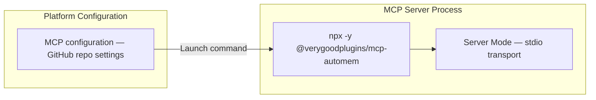

GitHub Copilot Coding Agent supports MCP servers configured at the repository level through GitHub.com settings. AutoMem integrates via the same `@verygoodplugins/mcp-automem` npm package used by other local platforms, with repository-level configuration stored in the GitHub UI.

:::note
GitHub Copilot MCP integration is for the **Coding Agent** feature, not standard Copilot autocomplete. The agent reads repository MCP configurations when executing tasks.
:::

---

## Architecture



GitHub Copilot spawns the MCP server using the same stdio transport pattern as Claude Desktop and Cursor. The server name in the configuration determines the tool prefix.

---

## Configuration

GitHub Copilot Coding Agent supports three MCP server types: `"local"`, `"http"`, and `"sse"`. For AutoMem, use `"local"` to run the stdio-based MCP server.

### Repository-Level Configuration

Add the MCP server configuration through the GitHub.com repository settings interface (Settings → Copilot → MCP Servers), or use a configuration file in your repository.

**MCP server configuration:**

```json
{
  "mcpServers": {
    "memory": {
      "type": "local",
      "command": "npx",
      "args": ["-y", "@verygoodplugins/mcp-automem"],
      "env": {
        "AUTOMEM_API_URL": "https://your-automem-service.up.railway.app",
        "AUTOMEM_API_KEY": "your-api-token-here"
      }
    }
  }
}
```

:::caution
GitHub Copilot Coding Agent runs in a GitHub-hosted environment. `localhost` or `127.0.0.1` URLs will not work. You must provide a publicly accessible `AUTOMEM_API_URL` (Railway, Docker, or other cloud deployment).
:::

### Using Remote MCP (HTTP/SSE)

Alternatively, configure Copilot to use the MCP sidecar directly via HTTP:

```json
{
  "mcpServers": {
    "memory": {
      "type": "http",
      "url": "https://your-mcp-bridge.up.railway.app/mcp?api_token=YOUR_TOKEN"
    }
  }
}
```

Or via SSE:

```json
{
  "mcpServers": {
    "memory": {
      "type": "sse",
      "url": "https://your-mcp-bridge.up.railway.app/mcp/sse?api_token=YOUR_TOKEN"
    }
  }
}
```

---

## Tool Naming

With the server named `"memory"`, tools are prefixed as `mcp__memory__`:
- `mcp__memory__store_memory`
- `mcp__memory__recall_memory`
- `mcp__memory__associate_memories`
- `mcp__memory__update_memory`
- `mcp__memory__delete_memory`
- `mcp__memory__check_database_health`

---

## Available Memory Tools

| Tool | Description |
|------|-------------|
| `store_memory` | Store content with tags, importance, and metadata |
| `recall_memory` | Hybrid search (semantic + keyword + tags + time) |
| `associate_memories` | Create typed relationships between memories |
| `update_memory` | Modify existing memory fields |
| `delete_memory` | Permanently remove a memory |
| `check_database_health` | Check FalkorDB and Qdrant connection status |

---

## Memory Rules for Copilot

Unlike Cursor (which uses `.cursor/rules/automem.mdc`) or Claude Code (which uses `~/.claude/CLAUDE.md`), GitHub Copilot reads agent instructions from repository-level files. Add memory rules to your repository's Copilot instructions or system prompt configuration.

**Recommended tagging strategy for GitHub repositories:**

```json
{
  "tags": ["repo-name", "copilot", "YYYY-MM", "component-name"],
  "type": "Decision",
  "importance": 0.9
}
```

**Repository-level memory patterns:**
- Store decisions made during code review
- Remember why code was written a certain way
- Capture PR-related implementation rationale
- Recall past discussions about implementations

Branch-independent memories tagged with the project name persist across all branches.

---

## Cross-Platform Memory Access

Memories stored by GitHub Copilot are accessible from any other AutoMem-connected platform (Cursor, Claude Code, Claude Desktop) as long as they all point to the same AutoMem service.

**Cross-platform workflow example:**
1. Store architectural decision via GitHub Copilot while reviewing a PR
2. Recall that decision in Cursor IDE during implementation
3. Memory includes context: tagged with `copilot`, project name, timestamp

---

## Environment Variables

| Variable | Required | Purpose |
|----------|---------|---------|
| `AUTOMEM_API_URL` | Yes | AutoMem service URL (must be public) |
| `AUTOMEM_API_KEY` | Yes* | API authentication token |

\*Required for cloud deployments. Not needed for local AutoMem (but Copilot agent can't reach localhost anyway).

---

## Troubleshooting

### MCP tools not appearing in Copilot

1. Verify the MCP configuration is saved correctly in GitHub.com settings
2. Check that `AUTOMEM_API_URL` is publicly accessible
3. Test the endpoint: `curl https://your-automem.example.com/health`
4. Ensure the AutoMem service has a valid API token configured

### Connection errors from cloud agent

The Copilot coding agent cannot reach `localhost` or `127.0.0.1`. Deploy AutoMem to Railway, Docker, or another cloud provider and use the public URL.

### Authentication failures

For `"local"` type configurations, env vars are passed to the spawned process. Verify that:
1. `AUTOMEM_API_KEY` matches the `API_TOKEN` set in your AutoMem service
2. The token value doesn't contain characters that need escaping in the config

For `"http"` or `"sse"` type, ensure the token is URL-encoded in the query parameter.
