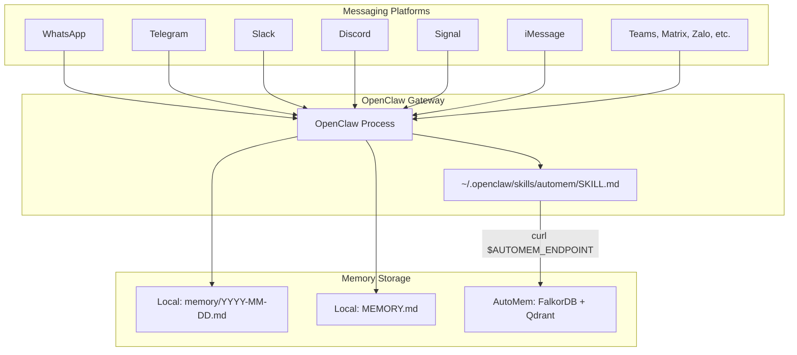

OpenClaw is a personal AI assistant that runs locally and supports 11+ messaging platforms (WhatsApp, Telegram, Slack, Discord, Signal, iMessage, Teams, Matrix, Zalo, etc.). Unlike all other AutoMem integrations, OpenClaw **bypasses the MCP protocol entirely** and calls the AutoMem HTTP API directly via `curl` commands through a native **skill** file.

---

## Why Direct HTTP Instead of MCP

| Aspect | OpenClaw | Other Platforms |
|--------|---------|----------------|
| Protocol | Direct HTTP API via `curl` | MCP over stdio |
| Integration type | Native skill (`.md` file) | MCP server process |
| Dependencies | bash + curl (built-in) | Node.js + npx |
| API access | Direct REST endpoints | MCP tool abstraction |
| Authentication | HTTP headers | Environment variables passed to MCP server |

This approach eliminates the MCP abstraction layer, making the integration simpler and more reliable for bot-based systems where the AI executes shell commands directly.

---

## Multi-Platform Memory Flow



The OpenClaw gateway receives messages from all platforms, loads skills (including `automem/SKILL.md`), and the bot executes curl commands to interact with the AutoMem service. This provides persistent semantic memory across all messaging platforms.

---

## Installation

### CLI Installer

```bash
# Basic installation (auto-detects workspace)
npx @verygoodplugins/mcp-automem openclaw

# With explicit workspace and endpoint
npx @verygoodplugins/mcp-automem openclaw \
  --workspace ~/clawd \
  --endpoint https://your-automem.up.railway.app \
  --api-key your-token-here

# Preview without writing
npx @verygoodplugins/mcp-automem openclaw --dry-run
```

**CLI options:**

| Option | Description | Default |
|--------|-------------|---------|
| `--workspace <path>` | OpenClaw workspace directory | Auto-detected |
| `--endpoint <url>` | AutoMem service endpoint | `http://127.0.0.1:8001` |
| `--api-key <key>` | AutoMem API key | None (optional) |
| `--name <name>` | Project name for memory tags | Auto-detected |
| `--dry-run` | Preview changes without modifying files | Off |
| `--quiet` | Suppress output | Off |

**What the installer does:**
1. Locates OpenClaw workspace directory
2. Installs `SKILL.md` to `~/.openclaw/skills/automem/SKILL.md`
3. Updates `~/.openclaw/openclaw.json` with AutoMem environment variables
4. Creates `<workspace>/memory/` directory for daily log files
5. Removes legacy `AGENTS.md` blocks from previous installations

### Workspace Detection

The installer searches for the workspace in this order:
1. `--workspace` flag (explicit)
2. `OPENCLAW_WORKSPACE` or `CLAWDBOT_WORKSPACE` environment variable
3. `~/.openclaw/openclaw.json` config file (reads `agents.defaults.workspace`)
4. Default paths: `~/.openclaw/workspace`, `~/clawd`, `~/.clawdbot/workspace`

### File Structure After Installation

```
~/.openclaw/
├── openclaw.json          # Updated with AutoMem config
└── skills/
    └── automem/
        └── SKILL.md       # Skill file with API reference

<workspace>/
└── memory/
    ├── .gitkeep
    └── YYYY-MM-DD.md      # Daily memory files (created by OpenClaw)
```

---

## Configuration

The installer updates `~/.openclaw/openclaw.json` under `skills.entries.automem`:

```json
{
  "skills": {
    "entries": {
      "automem": {
        "env": {
          "AUTOMEM_ENDPOINT": "http://127.0.0.1:8001",
          "AUTOMEM_API_KEY": "your-token-here"
        }
      }
    }
  }
}
```

The installer uses deep merging — it preserves all existing configuration and only updates the `automem` entry.

:::note
The installer handles JSON5-style comments in OpenClaw config files (single-line `//`, block `/* */`, trailing commas) using a string-aware comment stripper that preserves URLs containing `//`.
:::

---

## SKILL.md Architecture

The skill file at `~/.openclaw/skills/automem/SKILL.md` uses YAML front matter to declare required environment variables:

```yaml
---
env_required:
  - AUTOMEM_ENDPOINT
env_optional:
  - AUTOMEM_API_KEY
---
```

The rest of the file contains the complete HTTP API reference that the bot uses to construct curl commands.

### Memory Operations

**Store a memory:**

```bash
curl -s -X POST "$AUTOMEM_ENDPOINT/memory" \
  -H "Content-Type: application/json" \
  -H "Authorization: Bearer $AUTOMEM_API_KEY" \
  -d '{
    "content": "Brief title. Context and details. Impact/outcome.",
    "type": "Decision",
    "importance": 0.9,
    "tags": ["project-name", "component", "YYYY-MM"]
  }'
```

**Recall memories:**

```bash
curl -s "$AUTOMEM_ENDPOINT/recall?query=your+search+query&limit=5&tags=project-name" \
  -H "Authorization: Bearer $AUTOMEM_API_KEY"
```

Recall parameters: `query`, `limit`, `tags`, `tag_mode`, `time_query`, `expand_entities`.

**Associate memories:**

```bash
curl -s -X POST "$AUTOMEM_ENDPOINT/associate" \
  -H "Content-Type: application/json" \
  -H "Authorization: Bearer $AUTOMEM_API_KEY" \
  -d '{
    "memory1_id": "id-one",
    "memory2_id": "id-two",
    "type": "LEADS_TO",
    "strength": 0.8
  }'
```

11 relationship types: `RELATES_TO`, `LEADS_TO`, `EVOLVED_INTO`, `DERIVED_FROM`, `INVALIDATED_BY`, `CONTRADICTS`, `REINFORCES`, `PREFERS_OVER`, `PART_OF`, `EXEMPLIFIES`, `OCCURRED_BEFORE`.

---

## Behavioral Rules

### Session Start — Recall First

The skill instructs the bot to recall at session start for:
- Questions about past decisions, preferences, or history
- Debugging or troubleshooting (search for similar past issues)
- Project planning or architecture discussions

Skip recall for:
- Simple greetings or small talk
- Questions answerable from general knowledge
- Direct file operations or commands

### Storage Importance Levels

| Category | Importance | Examples |
|----------|-----------|---------|
| Decisions | 0.9 | "Chose Railway over Fly.io for deployment. Reason: persistent volumes." |
| User corrections | 0.8 | "Human prefers dark mode themes. Corrected my light mode suggestion." |
| Bug fixes | 0.8 | "WhatsApp webhook failing. Root cause: expired token. Solution: auto-refresh." |
| Preferences | 0.7 | "Human likes terse responses, no fluff." |
| Patterns | 0.7 | "Use early returns for validation in all API routes." |
| Context | 0.5 | "Set up new Telegram channel for family group." |

### Three Memory Layers

OpenClaw uses three complementary memory layers:

1. **Daily files** (`memory/YYYY-MM-DD.md`) — raw conversation logs, created automatically
2. **MEMORY.md** — curated notes in the workspace
3. **AutoMem** (`FalkorDB + Qdrant`) — semantic search and graph relationships across all sessions and platforms

AutoMem provides the cross-session, cross-platform memory that the file-based layers cannot.

---

## Error Handling

The skill instructs the bot on graceful degradation:

- **If AutoMem is unavailable (curl fails):** Continue normally — memory enhances but never blocks
- **Do not announce failures** to the human
- **Fall back** to file-based memory (`memory/` directory and `MEMORY.md`)
- Only check `/health` endpoint to diagnose persistent failures

### Common curl Error Patterns

| Error | Cause | Solution |
|-------|-------|---------|
| `401 Unauthorized` | Missing Authorization header | Add `-H "Authorization: Bearer $AUTOMEM_API_KEY"` |
| `Connection refused` | AutoMem service not running | Start service or fall back to file-based memory |
| Empty results | Query too specific or no matches | Broaden query terms, remove tag filters, increase limit |

---

## Troubleshooting

### Agent not using memory

1. Verify skill is loaded: `openclaw skills check automem`
2. Restart OpenClaw gateway after installation
3. Check AutoMem service is running: `curl http://127.0.0.1:8001/health`

### Bot mentions "Memory Tools Disabled"

This refers to OpenClaw's built-in `memory-lancedb` plugin, **not** AutoMem. The skill explicitly instructs the bot to ignore this message — AutoMem handles embeddings server-side with no client API keys required.

### curl calls failing

1. Verify endpoint: `curl $AUTOMEM_ENDPOINT/health`
2. Check API key if using an authenticated instance
3. Check firewall/VPN for Railway endpoints
4. Examine OpenClaw logs for curl exit codes

---

## Comparison with MCP Integrations

| Feature | OpenClaw (Direct HTTP) | MCP Platforms |
|---------|----------------------|---------------|
| Protocol | REST API via curl | MCP over stdio |
| Setup complexity | Single CLI command | CLI + config file editing |
| Runtime dependencies | bash + curl | Node.js runtime |
| Error recovery | curl exit codes | MCP error protocol |
| Latency | Direct HTTP call | MCP serialization overhead |
| Platform specificity | Native skill system | Universal MCP |
| Auth method | HTTP Bearer token | Environment variables |

The direct HTTP approach is simpler for bot-based systems but lacks the standardization benefits of MCP for cross-platform integrations.
