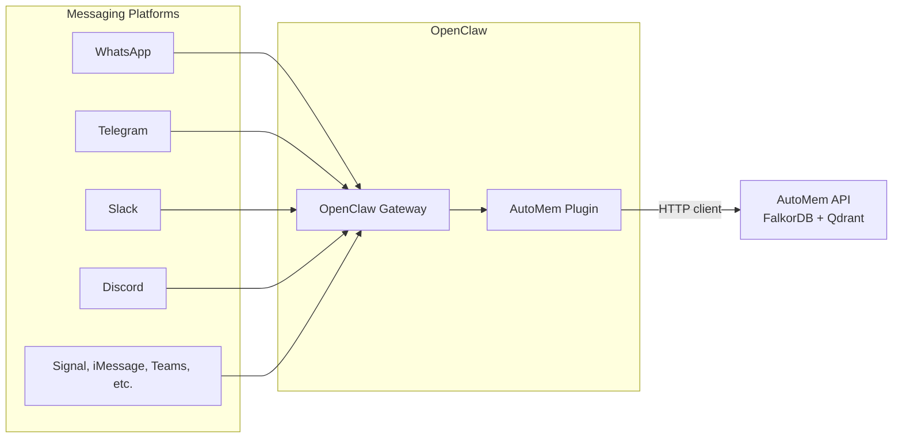

OpenClaw is a personal AI assistant that runs locally and supports 11+ messaging platforms (WhatsApp, Telegram, Slack, Discord, Signal, iMessage, Teams, Matrix, Zalo, etc.). AutoMem integrates with OpenClaw through three setup modes, in recommended order:

1. **`plugin`** — native OpenClaw plugin with typed AutoMem tools and auto-recall
2. **`mcp`** — mcporter-based setup with the same typed tools
3. **`skill`** — legacy curl fallback

---

## Integration Modes

| Aspect | Plugin (recommended) | MCP | Skill (legacy) |
|--------|---------------------|-----|-----------------|
| Protocol | Native plugin HTTP client | MCP over stdio (mcporter) | Direct HTTP via `curl` |
| Tool interface | Typed tools (`automem_store_memory`, etc.) | Same typed tools via mcporter | Raw curl commands |
| Auto-recall | Built-in hook, DM-only by default | Via skill rules | Via skill rules |
| Dependencies | OpenClaw plugin system | Node.js + mcporter | bash + curl |
| Config location | `plugins.entries.automem` | `skills.entries.automem` + `mcporter.json` | `skills.entries.automem` |

---

## Architecture

### Plugin mode (recommended)



### MCP mode architecture

```text
OpenClaw skill → mcporter → mcp-automem stdio server → AutoMem HTTP API
```

### Skill mode architecture (legacy)

```text
OpenClaw skill → curl → AutoMem HTTP API
```

---

## Installation

### Plugin mode (recommended)

```bash
npx @verygoodplugins/mcp-automem openclaw --mode plugin
```

### MCP mode

```bash
npx @verygoodplugins/mcp-automem openclaw --mode mcp --workspace ~/clawd
```

### Legacy skill mode

```bash
npx @verygoodplugins/mcp-automem openclaw --mode skill --workspace ~/clawd
```

### Common options

```bash
npx @verygoodplugins/mcp-automem openclaw --dry-run  # Preview without writing
```

### CLI Options

| Option | Description | Default |
|--------|-------------|---------|
| `--mode <plugin\|mcp\|skill>` | Integration mode | `plugin` |
| `--scope <workspace\|shared>` | Install scope for mcp/skill modes | `workspace` |
| `--workspace <path>` | OpenClaw workspace directory | Auto-detected |
| `--endpoint <url>` | AutoMem service endpoint | `http://127.0.0.1:8001` |
| `--api-key <key>` | AutoMem API key | None (optional) |
| `--plugin-source <spec>` | npm spec or local path for plugin installs | `@verygoodplugins/mcp-automem` |
| `--name <name>` | Project name for memory tags | Auto-detected |
| `--dry-run` | Preview changes without modifying files | Off |
| `--quiet` | Suppress non-error output | Off |

### What the installer does

**Plugin mode:**
1. Installs the package as an OpenClaw plugin
2. Configures `plugins.entries.automem` in `openclaw.json`
3. Archives old skill overrides that would shadow the plugin-shipped skill
4. Cleans up legacy `AGENTS.md` blocks from previous installs

**MCP mode:**
1. Installs the `automem` skill to `<workspace>/skills/automem/SKILL.md`
2. Creates `<workspace>/config/mcporter.json` with the `automem` server entry
3. Stores endpoint/API key in `skills.entries.automem` (secrets stay out of `mcporter.json`)

**Skill mode (legacy):**
1. Installs the curl-based `automem` skill to `<workspace>/skills/automem/SKILL.md`
2. Configures `skills.entries.automem.env` with endpoint and API key

### Workspace Detection

The installer searches for the workspace in this order:
1. `--workspace` flag (explicit)
2. `OPENCLAW_WORKSPACE` or `CLAWDBOT_WORKSPACE` environment variable
3. `~/.openclaw/openclaw.json` config file (reads `agents.defaults.workspace`)
4. Default paths: `~/.openclaw/workspace`, `~/clawd`, `~/.clawdbot/workspace`

---

## Plugin Configuration

In plugin mode, the installer writes to `~/.openclaw/openclaw.json` under `plugins.entries.automem`:

```json
{
  "plugins": {
    "entries": {
      "automem": {
        "enabled": true,
        "config": {
          "endpoint": "http://127.0.0.1:8001",
          "apiKey": "your-token-here",
          "autoRecall": true,
          "autoRecallLimit": 3,
          "exposure": "dm-only",
          "defaultTags": ["platform/openclaw", "project/my-project"]
        }
      }
    }
  }
}
```

### Config fields

| Field | Type | Default | Description |
|-------|------|---------|-------------|
| `endpoint` | string | — | Base URL for the AutoMem service (required) |
| `apiKey` | string | — | Bearer token for authenticated deployments (optional) |
| `autoRecall` | boolean | `true` | Recall relevant memories before each agent turn |
| `autoRecallLimit` | integer | `3` | Max memories to auto-recall (1–10) |
| `exposure` | string | `"dm-only"` | Auto-recall scope: `dm-only`, `all`, or `off` |
| `defaultTags` | string[] | `[]` | Tags applied when the request doesn't supply tags |

### MCP/Skill configuration

In MCP and skill modes, the installer writes to `skills.entries.automem` instead:

```json
{
  "skills": {
    "entries": {
      "automem": {
        "enabled": true,
        "env": {
          "AUTOMEM_ENDPOINT": "http://127.0.0.1:8001",
          "AUTOMEM_API_KEY": "your-token-here"
        }
      }
    }
  }
}
```

:::note
The installer handles JSON5-style comments in OpenClaw config files (single-line `//`, block `/* */`, trailing commas) using a string-aware comment stripper that preserves URLs containing `//`.
:::

---

## Natural Language Mappings

In plugin and MCP modes, the skill maps natural language to typed AutoMem tools:

| User says | Tool called |
|-----------|-------------|
| "remember ..." or "store this" | `automem_store_memory` |
| "what do you know about ..." or "recall ..." | `automem_recall_memory` |
| "update memory ..." | `automem_update_memory` |
| "delete memory ..." | `automem_delete_memory` (recalls first if ambiguous) |
| "link these memories ..." | `automem_associate_memories` |
| "is memory healthy?" | `automem_check_health` |

Slash commands also work: `/automem remember ...`, `/automem recall ...`, `/automem update ...`, `/automem delete ...`.

---

## Memory Operations (Legacy Skill)

In legacy skill mode, the bot constructs curl commands directly:

**Store a memory:**

```bash
curl -s -X POST "$AUTOMEM_ENDPOINT/memory" \
  -H "Content-Type: application/json" \
  ${AUTOMEM_API_KEY:+-H "Authorization: Bearer $AUTOMEM_API_KEY"} \
  -d '{
    "content": "Brief title. Context and details. Impact/outcome.",
    "tags": ["openclaw"],
    "importance": 0.7
  }'
```

**Recall memories:**

```bash
curl -s \
  ${AUTOMEM_API_KEY:+-H "Authorization: Bearer $AUTOMEM_API_KEY"} \
  "$AUTOMEM_ENDPOINT/recall?query=your+search+query&limit=5"
```

**Update a memory:**

```bash
curl -s -X PATCH "$AUTOMEM_ENDPOINT/memory/MEMORY_ID" \
  -H "Content-Type: application/json" \
  ${AUTOMEM_API_KEY:+-H "Authorization: Bearer $AUTOMEM_API_KEY"} \
  -d '{"content":"Updated context."}'
```

**Delete a memory:**

```bash
curl -s -X DELETE "$AUTOMEM_ENDPOINT/memory/MEMORY_ID" \
  ${AUTOMEM_API_KEY:+-H "Authorization: Bearer $AUTOMEM_API_KEY"}
```

---

## Behavioral Rules

### Session Start — Recall First

The skill (or plugin auto-recall hook) recalls at session start for:
- Questions about past decisions, preferences, or history
- Debugging or troubleshooting (search for similar past issues)
- Project planning or architecture discussions

Skip recall for:
- Simple greetings or small talk
- Questions answerable from general knowledge
- Direct file operations or commands

### Storage Importance Levels

| Category | Importance | Examples |
|----------|-----------|---------|
| Decisions | 0.9 | "Chose Railway over Fly.io for deployment. Reason: persistent volumes." |
| User corrections | 0.8 | "Human prefers dark mode themes. Corrected my light mode suggestion." |
| Bug fixes | 0.8 | "WhatsApp webhook failing. Root cause: expired token. Solution: auto-refresh." |
| Preferences | 0.7 | "Human likes terse responses, no fluff." |
| Patterns | 0.7 | "Use early returns for validation in all API routes." |
| Context | 0.5 | "Set up new Telegram channel for family group." |

### Tags

Tags use namespace-style formatting:
- `platform/openclaw` — automatically added
- `project/<name>` — derived from project name (auto-detected or `--name` flag)

### Memory Layers

OpenClaw uses four complementary memory layers:

| Layer | Storage | Purpose | Scope |
|-------|---------|---------|-------|
| Daily files (`memory/YYYY-MM-DD.md`) | Local filesystem | Raw session logs | Single workspace |
| `MEMORY.md` / workspace notes | Local filesystem | Curated local notes | Single workspace |
| `memory-core` | OpenClaw file memory tools | Fast file-backed retrieval | Single workspace |
| AutoMem | FalkorDB + Qdrant | Semantic graph memory | Cross-session, cross-platform |

`memory-core` is complementary — AutoMem does not replace it. Use `memory-core` for local file-backed notes and AutoMem for the semantic cross-session layer.

---

## Error Handling

- **If AutoMem is unavailable:** Continue normally — memory enhances but never blocks
- **Do not announce failures** to the human
- **Fall back** to file-based memory (`memory/` directory and `MEMORY.md`)
- Only check `/health` endpoint to diagnose persistent failures

---

## Troubleshooting

### Plugin not taking effect

1. Run `openclaw plugins list` — verify `automem` appears
2. Restart the OpenClaw gateway after installation
3. Check `~/.openclaw/openclaw.json` for `plugins.entries.automem`

### MCP tools missing

1. Run `mcporter list` — verify `automem` server appears
2. Check `<workspace>/config/mcporter.json` contains the `automem` server
3. Confirm `skills.entries.automem.env.AUTOMEM_ENDPOINT` is set in `~/.openclaw/openclaw.json`

### Legacy skill not connecting

1. Verify endpoint: `curl "$AUTOMEM_ENDPOINT/health"`
2. Check API key if using an authenticated instance
3. Check firewall/VPN for Railway endpoints
4. Consider switching to `plugin` or `mcp` mode for a better experience

### Bot mentions "Memory Tools Disabled"

This refers to OpenClaw's built-in `memory-lancedb` plugin, **not** AutoMem. The AutoMem skill explicitly instructs the bot to ignore this message — AutoMem handles embeddings server-side with no client API keys required.

### Quick verification commands

| Mode | Command |
|------|---------|
| Plugin | `openclaw plugins list` |
| MCP | `mcporter list` |
| Skill | `openclaw skills info automem` |

---

## Comparison with MCP Integrations

| Feature | Plugin | MCP | Skill (legacy) | MCP Platforms |
|---------|--------|-----|-----------------|---------------|
| Protocol | Native plugin HTTP | MCP over stdio | REST via curl | MCP over stdio |
| Setup | Single CLI command | CLI + mcporter | CLI only | CLI + config |
| Runtime deps | OpenClaw plugin system | Node.js + mcporter | bash + curl | Node.js |
| Auto-recall | Built-in hook | Skill rules | Skill rules | Platform-dependent |
| Error recovery | Plugin error handling | MCP error protocol | curl exit codes | MCP error protocol |
| Auth | Plugin config | Environment variables | HTTP Bearer token | Environment variables |
