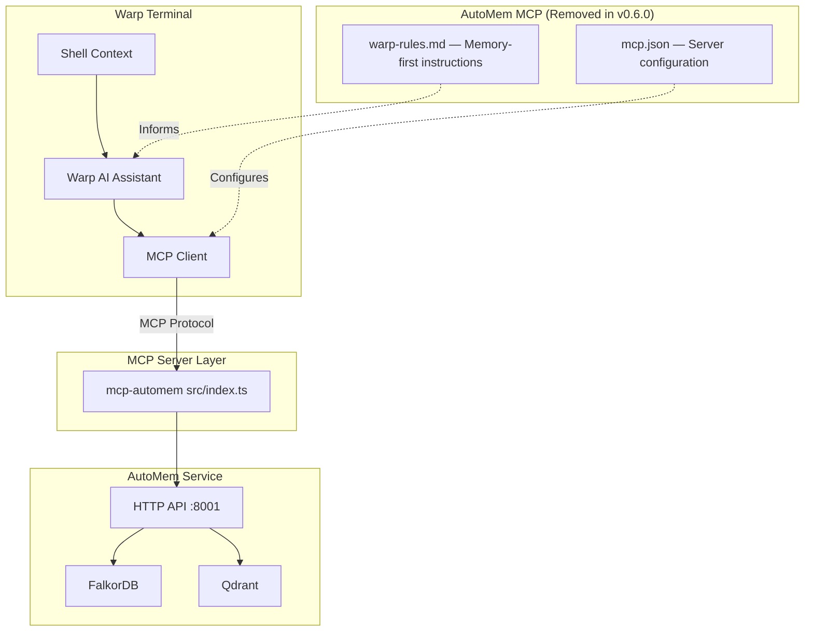

:::caution
Official Warp Terminal integration was **removed in v0.6.0**. No CLI installer or official templates exist. This page documents manual setup for users who specifically need Warp Terminal support.

For terminal-based AI memory workflows, [Claude Code](/docs/platforms/claude-code/) and [OpenAI Codex](/docs/platforms/codex/) are the recommended alternatives.
:::

---

## Overview

Warp Terminal is an AI-powered terminal that supports MCP servers. AutoMem provided persistent memory for Warp's AI assistant, enabling context-aware terminal assistance across sessions.

**Historical timeline:**
- **Added:** v0.4.0 (October 2025) — MCP-based integration with `warp-rules.md` template
- **Removed:** v0.6.0 (October 2025) — classified as "niche use case" with maintenance burden outweighing usage

The removal was part of a broader simplification effort focusing development on widely-adopted platforms (Claude Desktop, Cursor, Claude Code, Codex).

---

## Historical Architecture



---

## Manual Setup

While no official templates exist, Warp Terminal's built-in MCP client can be configured manually.

### Step 1: Configure MCP Server in Warp

Warp stores MCP server configurations in its settings. Add the AutoMem server:

```json
{
  "mcpServers": {
    "memory": {
      "command": "npx",
      "args": ["-y", "@verygoodplugins/mcp-automem"],
      "env": {
        "AUTOMEM_ENDPOINT": "http://127.0.0.1:8001",
        "AUTOMEM_API_KEY": "your-token-here"
      }
    }
  }
}
```

### Step 2: Add Memory Rules to Warp AI

Create terminal-focused memory rules for Warp's AI assistant. Based on the historical `warp-rules.md` template, effective rules should:

- Recall memories at conversation start and on directory changes
- Tag memories with `warp` and detected project context
- Store setup commands and configurations with high importance
- Use terminal-optimized query patterns (command names, error patterns)
- Keep responses terse and command-first

**Suggested rule structure:**

```markdown
## AutoMem Memory Rules

ALWAYS recall at session start:
- Query: recent terminal sessions, project context
- Tags: current project name, "warp"

ALWAYS recall when:
- Changing directories (cd commands) → recall project context
- Setup/configuration queries → recall past setup steps
- Debugging errors → search similar past error patterns

STORE memories for:
- Setup commands that worked (importance: 0.8)
- Debugging solutions (importance: 0.8)
- Configuration decisions (importance: 0.9)
- Deployment procedures (importance: 0.9)

TAGS: [project-name, "warp", "YYYY-MM", component]
```

### Step 3: Project Context Detection

Implement manual project detection in your terminal workflow:
- Use `basename $(pwd)` or `git remote get-url origin` to determine project
- Include the project name in memory tags for filtering
- Query memories with project-specific filters when switching contexts

---

## What the Historical Integration Provided

The v0.4.0 integration included:

1. **Project Context Auto-Detection** — detected project from `package.json`, `.git/config`, or directory name
2. **Smart Memory Recall** — automatic recall on directory changes; time-scoped queries for recent terminal activities
3. **Terminal-Optimized Communication** — terse, command-first response style; shell-friendly output
4. **Memory Storage Patterns** — captured setup commands, debugging patterns, deployment procedures
5. **Cross-Platform Sync** — memories accessible from Cursor, Claude Code, Claude Desktop

---

## Limitations of Manual Setup

- No automatic template installation or project auto-detection
- No CLI installer (`npx @verygoodplugins/mcp-automem warp` does not exist)
- Requires manual rule definition and maintenance
- No official documentation or support
- Future AutoMem updates may not account for Warp compatibility

---

## Alternatives

| Platform | Integration Type | Best For |
|----------|-----------------|---------|
| [Claude Code](/docs/platforms/claude-code/) | MCP + CLAUDE.md rules | Terminal development workflows |
| [OpenAI Codex](/docs/platforms/codex/) | MCP + AGENTS.md rules | CLI/IDE/cloud integration |

Both alternatives have active support, CLI installers, and regular updates. Memories stored during Warp usage remain accessible from any MCP-enabled platform — only the client integration changes.

---

## Migration from Warp to Claude Code

If you previously used the Warp integration:

1. **Existing memories are still accessible** — they remain in AutoMem, tagged with `warp`
2. **Install Claude Code integration:**
   ```bash
   npx @verygoodplugins/mcp-automem claude-code
   ```
3. **Update memory tags** (optional) — recall old Warp memories and re-tag them if needed:
   ```
   recall_memory(tags: ["warp"], limit: 50)
   ```
4. **Your workflow continues** — all AutoMem memory operations work identically across platforms
