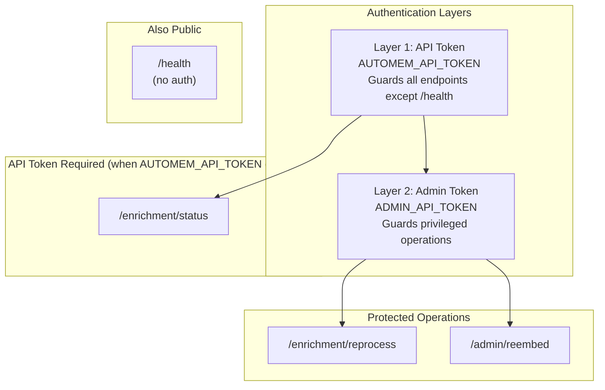
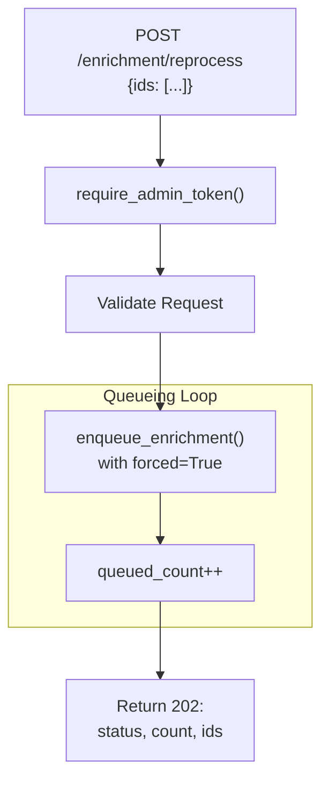
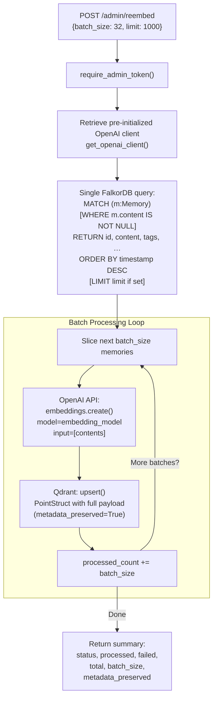

:::note[Source files]
- [automem/api/admin.py](https://github.com/verygoodplugins/automem/blob/ed36b98e3e1569dde71aa430417b6549520f7068/automem/api/admin.py) — Admin endpoints
- [automem/api/enrichment.py](https://github.com/verygoodplugins/automem/blob/ed36b98e3e1569dde71aa430417b6549520f7068/automem/api/enrichment.py) — Enrichment endpoints
:::

Administrative endpoints require elevated privileges (`ADMIN_API_TOKEN`) for managing enrichment processing and embedding generation. These operations are intended for maintenance, debugging, and bulk data operations.

For standard memory operations (store, recall, update, delete), see [Memory Operations](/docs/reference/api/memory-operations/). For consolidation scheduling, see [Consolidation Operations](/docs/reference/api/consolidation/).

---

## Authentication Model

Admin operations require **dual authentication**:

1. **Standard API Token** (`AUTOMEM_API_TOKEN`) — Required for all endpoints except `/health`
2. **Admin Token** (`ADMIN_API_TOKEN`) — Additional token for privileged operations

### Authentication Methods

| Token Type | Header Methods | Query Parameter | Environment Variable |
|------------|---------------|-----------------|---------------------|
| **API Token** | `Authorization: Bearer <token>` / `X-API-Key: <token>` | `?api_key=<token>` | `AUTOMEM_API_TOKEN` |
| **Admin Token** | `X-Admin-Token: <token>` / `X-Admin-Api-Key: <token>` | `?admin_token=<token>` | `ADMIN_API_TOKEN` |

### Endpoint Authentication Requirements



### Error Responses

| Status Code | Response | Meaning |
|-------------|----------|---------|
| `401 Unauthorized` | `{"error": "Unauthorized"}` | Missing or invalid `AUTOMEM_API_TOKEN` |
| `401 Admin authorization required` | `{"error": "Admin authorization required"}` | Missing or invalid `ADMIN_API_TOKEN` |
| `403 Admin token not configured` | `{"error": "Admin token not configured"}` | Server has no `ADMIN_API_TOKEN` environment variable set |

---

## GET /enrichment/status

**Authentication:** API token (when `AUTOMEM_API_TOKEN` is configured)

**Purpose:** Monitor the enrichment pipeline's health and processing statistics. Unlike `/health`, this endpoint is protected by the global API token guard whenever `AUTOMEM_API_TOKEN` is set.

### Response Schema

```json
{
  "status": "running",
  "queue_size": 3,
  "pending": 2,
  "inflight": 1,
  "max_attempts": 3,
  "stats": {}
}
```

### Status Values

| Field | Type | Description |
|-------|------|-------------|
| `status` | string | `"running"` if enrichment worker is active, `"stopped"` if worker thread is dead |
| `queue_size` | integer | Current number of jobs in the enrichment queue |
| `pending` | integer | Count of memories waiting to be processed |
| `inflight` | integer | Count of memories currently being processed |
| `max_attempts` | integer | Maximum retry attempts per memory before marking failed (from `ENRICHMENT_MAX_ATTEMPTS`) |
| `stats` | object | Lifetime enrichment statistics (nested object with processing counters) |

### Example Usage

```bash
curl "https://your-automem-instance/enrichment/status" \
  -H "Authorization: Bearer YOUR_API_TOKEN"
```

### Troubleshooting with Status

| Observation | Likely Cause | Action |
|-------------|-------------|--------|
| `status: "stopped"` | Worker thread crashed | Check application logs for exceptions, restart service |
| `queue_size` increasing | Worker processing slower than intake | Monitor `inflight`, check for spaCy or OpenAI issues |
| High failure count in `stats` | Enrichment logic errors | Review application logs, check Qdrant connectivity |
| `inflight` stuck | Worker deadlocked | Restart enrichment worker or service |

---

## POST /enrichment/reprocess

**Authentication:** API token + Admin token

**Purpose:** Force re-enrichment of specific memories. Useful after:
- Updating enrichment logic or configuration
- Adding spaCy model capabilities
- Fixing corrupted enrichment metadata
- Recovering from systematic enrichment failures

### Request Schema

| Parameter | Type | Required | Description |
|-----------|------|----------|-------------|
| `ids` | array[string] | **Yes** | List of memory UUIDs to reprocess (non-empty) |

Reprocessing always forces re-queuing regardless of current pending/in-flight state.

### Example Request

```bash
curl -X POST https://your-automem-instance/enrichment/reprocess \
  -H "Authorization: Bearer YOUR_API_TOKEN" \
  -H "X-Admin-Token: YOUR_ADMIN_TOKEN" \
  -H "Content-Type: application/json" \
  -d '{
    "ids": [
      "a1b2c3d4-e5f6-7890-abcd-ef1234567890",
      "b2c3d4e5-f6a7-8901-bcde-f12345678901"
    ]
  }'
```

### Response Schema (HTTP 202 Accepted)

| Field | Type | Description |
|-------|------|-------------|
| `status` | string | Always `"queued"` |
| `count` | integer | Number of UUIDs in the submitted `ids` array; not a success/failure count |
| `ids` | array[string] | Memory UUIDs that were queued, sorted lexicographically |

```json
{
  "status": "queued",
  "count": 2,
  "ids": [
    "a1b2c3d4-e5f6-7890-abcd-ef1234567890",
    "b2c3d4e5-f6a7-8901-bcde-f12345678901"
  ]
}
```

### Processing Flow



### Implementation Details

The reprocessing operation performs these steps:

1. **Validation Phase** — Validates that the `ids` array is non-empty
2. **Queueing** — Calls `enqueue_enrichment(memory_id, forced=True)` which:
   - Acquires `state.enrichment_lock`
   - Adds memory ID to `state.enrichment_pending`
   - Puts an `EnrichmentJob` with `forced=True` in queue
3. **Background Processing** — The `enrichment_worker()` thread picks up jobs and calls `enrich_memory()` which:
   - Extracts entities via spaCy (if installed)
   - Creates temporal `PRECEDED_BY` edges
   - Finds semantic neighbors via Qdrant
   - Creates `SIMILAR_TO` relationships
   - Detects patterns and creates `EXEMPLIFIES` edges
   - Updates `metadata.enriched_at` timestamp

---

## POST /admin/reembed

**Authentication:** API token + Admin token

**Purpose:** Regenerate embeddings for all memories in batches. Critical for:
- Migrating to a different embedding model
- Recovering from Qdrant data loss
- Fixing corrupted embeddings
- Bulk embedding generation after initial import

### Request Schema

| Parameter | Type | Required | Description |
|-----------|------|----------|-------------|
| `batch_size` | integer | No | Embeddings per OpenAI API call. Default: `32`. Max recommended: `100` |
| `limit` | integer | No | Max memories to process. If omitted, processes all memories in database |
| `force` | boolean | No | Re-embed memories even if embeddings already exist. Default: `false` |

### Example Request

```bash
curl -X POST https://your-automem-instance/admin/reembed \
  -H "Authorization: Bearer YOUR_API_TOKEN" \
  -H "X-Admin-Token: YOUR_ADMIN_TOKEN" \
  -H "Content-Type: application/json" \
  -d '{"batch_size": 32}'
```

### Processing Architecture



### Response Schema

| Field | Type | Description |
|-------|------|-------------|
| `status` | string | Result status |
| `processed` | integer | Number of memories successfully re-embedded |
| `failed` | integer | Number of memories that failed re-embedding |
| `total` | integer | Total memory count in database at operation start |
| `batch_size` | integer | Batch size used (from request or default 32) |
| `metadata_preserved` | boolean | Whether existing metadata was preserved during re-embedding |
| `failed_ids` | array[string] | *(Conditional)* Up to 10 memory IDs that failed re-embedding; only present when `failed > 0` |

```json
{
  "status": "complete",
  "processed": 1000,
  "failed": 0,
  "total": 1000,
  "batch_size": 32,
  "metadata_preserved": true
}
```

### Implementation Details

**Phase 1: Memory Enumeration and Content Fetch**

Fetches all memory data (or up to `limit`) in a single FalkorDB query:
```cypher
MATCH (m:Memory)
WHERE m.content IS NOT NULL
RETURN m.id AS id, m.content AS content, m.tags AS tags,
       m.importance AS importance, m.timestamp AS timestamp,
       m.type AS type, m.confidence AS confidence,
       m.metadata AS metadata, m.updated_at AS updated_at,
       m.last_accessed AS last_accessed
ORDER BY m.timestamp DESC
-- When the `limit` request parameter is set, a LIMIT clause is appended after this line
```

When `force=true`, the `WHERE m.content IS NOT NULL` filter is omitted from the query. However, the Python collection loop still checks `if content:` before adding a row to the processing list, so memories with null or empty content are excluded regardless of `force`. There is no separate per-batch content retrieval step — all memory data is loaded upfront.

**Phase 2: OpenAI Embedding Generation**

Generates embeddings for the entire batch in a single API call using the configured `embedding_model`. Dimension is determined by the `VECTOR_SIZE` environment variable (default 1024).

**Phase 3: Qdrant Update**

Embeddings are written to Qdrant only. Qdrant failures are logged but don't halt the operation (graceful degradation). FalkorDB graph data is not modified by this operation.

### Performance Considerations

| Batch Size | OpenAI API Calls (1000 memories) | Approx Time | Cost (1000 memories) |
|------------|----------------------------------|-------------|---------------------|
| 10 | 100 | ~5 minutes | $0.06 |
| 32 | 32 | ~2 minutes | $0.06 |
| 50 | 20 | ~1 minute | $0.06 |
| 100 | 10 | ~30 seconds | $0.06 |

**Recommendations:**
- **Default 32** balances API call overhead and failure blast radius
- **Use 100** for large migrations (>10K memories) with stable OpenAI access
- **Use 10** during testing or with rate-limited OpenAI keys
- Monitor `processed` count to detect stalls mid-operation

### Error Handling

The operation continues even if individual batches fail:

| Error | Cause | Behavior |
|-------|-------|----------|
| OpenAI API rate limit | Exceeded quota | Retries with exponential backoff (handled by OpenAI SDK) |
| Missing memory content | Deleted between enumeration and fetch | Logged, skipped, processing continues |
| Qdrant connection failure | Network issue or Qdrant down | Logged, embedding writes skipped for this batch; operation continues for remaining batches (FalkorDB is never modified by this operation) |
| Invalid content format | Null or non-string content | Logged, skipped |

All errors are logged with structured context:
```python
logger.exception("Failed to generate embeddings for batch", extra={"batch_ids": ids})
```

---

## POST /admin/sync

**Authentication:** API token + Admin token

**Purpose:** Perform non-destructive drift repair between FalkorDB and Qdrant. Detects and reconciles discrepancies without deleting data.

### Request Schema

| Parameter | Type | Required | Description |
|-----------|------|----------|-------------|
| `batch_size` | integer | No | Number of memories to process per batch. Default: `32` |
| `dry_run` | boolean | No | If `true`, report drift without making changes. Default: `false` |

### Example Request

```bash
curl -X POST https://your-automem-instance/admin/sync \
  -H "Authorization: Bearer YOUR_API_TOKEN" \
  -H "X-Admin-Token: YOUR_ADMIN_TOKEN" \
  -H "Content-Type: application/json" \
  -d '{"batch_size": 32, "dry_run": false}'
```

---

## Security Model

### Threat Model

Admin operations can:
- Force expensive OpenAI API calls (re-embedding entire database)
- Trigger resource-intensive enrichment reprocessing
- Access operational metrics (enrichment statistics)

**Without admin token protection**, a compromised API token could:
1. Generate thousands of dollars in OpenAI costs via repeated re-embedding
2. Overload enrichment workers with duplicate jobs
3. Enumerate all memory IDs via reprocess endpoint

### Best Practices

| Practice | Rationale | Implementation |
|----------|-----------|----------------|
| **Separate tokens** | Limits blast radius of API token compromise | Use different values for `AUTOMEM_API_TOKEN` and `ADMIN_API_TOKEN` |
| **Rotate periodically** | Reduces window of exposure | Regenerate tokens monthly, update all clients |
| **Restrict admin access** | Minimize privilege escalation risk | Share admin token only with operations team |
| **Use headers, not query params** | Prevents token leakage in logs | Prefer `Authorization: Bearer` and `X-Admin-Token` headers |
| **Monitor admin operations** | Detect anomalous usage | Alert on high-frequency `/admin/reembed` calls |
| **Audit admin calls** | Forensic capability | Log admin operations with IP, timestamp, token hash |

---

## Operational Patterns

### Enrichment Pipeline Recovery

After spaCy model upgrades or enrichment logic changes:

```bash
# 1. Get all memory IDs that need reprocessing
MEMORY_IDS=$(curl -s "https://your-instance/recall?limit=100&query=*" \
  -H "Authorization: Bearer $TOKEN" | jq -r '[.results[].memory.memory_id]')

# 2. Reprocess them
curl -X POST https://your-instance/enrichment/reprocess \
  -H "Authorization: Bearer $TOKEN" \
  -H "X-Admin-Token: $ADMIN_TOKEN" \
  -H "Content-Type: application/json" \
  -d "{\"ids\": $MEMORY_IDS}"
```

### Embedding Model Migration

When switching from `text-embedding-3-small` (1024-d, set by `VECTOR_SIZE`) to `text-embedding-3-large` (3072-d):

:::caution[Set EMBEDDING_MODEL before re-embedding]
Model selection is controlled by the `EMBEDDING_MODEL` environment variable (default: `text-embedding-3-small`). Simply running `/admin/reembed` will regenerate embeddings using the currently configured model — no code changes required.
:::

1. Update `VECTOR_SIZE` environment variable
2. Recreate the Qdrant collection with new dimensions
3. Run `/admin/reembed` with `batch_size=50` to regenerate all embeddings

### Disaster Recovery from Qdrant Loss

If Qdrant data is corrupted or lost but FalkorDB is intact:

```bash
curl -X POST https://your-automem-instance/admin/reembed \
  -H "Authorization: Bearer YOUR_API_TOKEN" \
  -H "X-Admin-Token: YOUR_ADMIN_TOKEN" \
  -H "Content-Type: application/json" \
  -d '{"batch_size": 50}'
```

See [Operations / Health](/docs/operations/health/) for complete recovery procedures.
