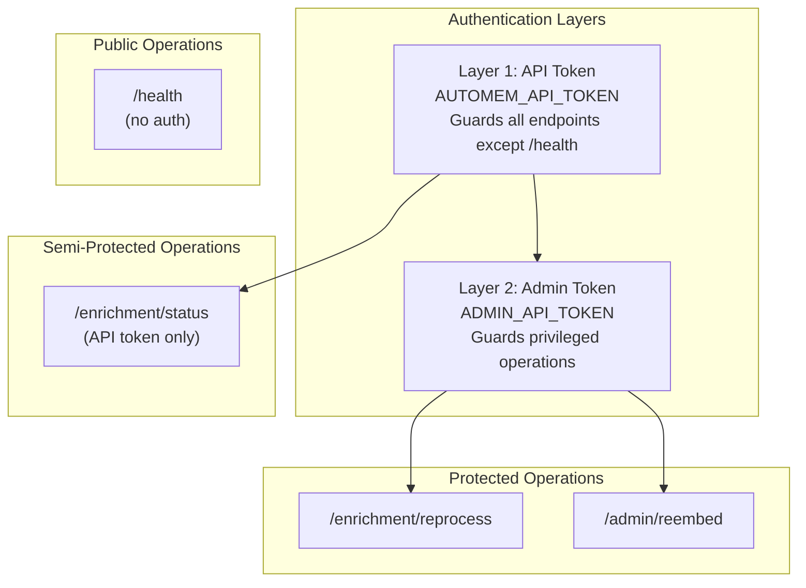
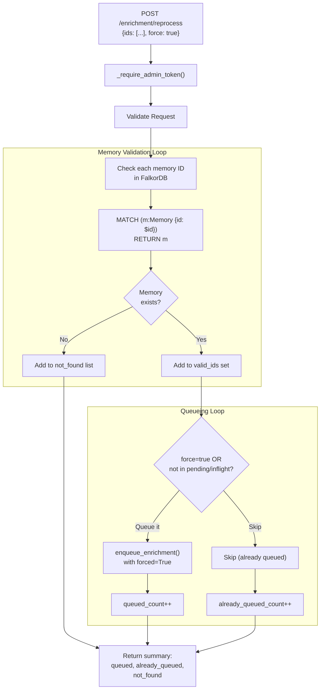
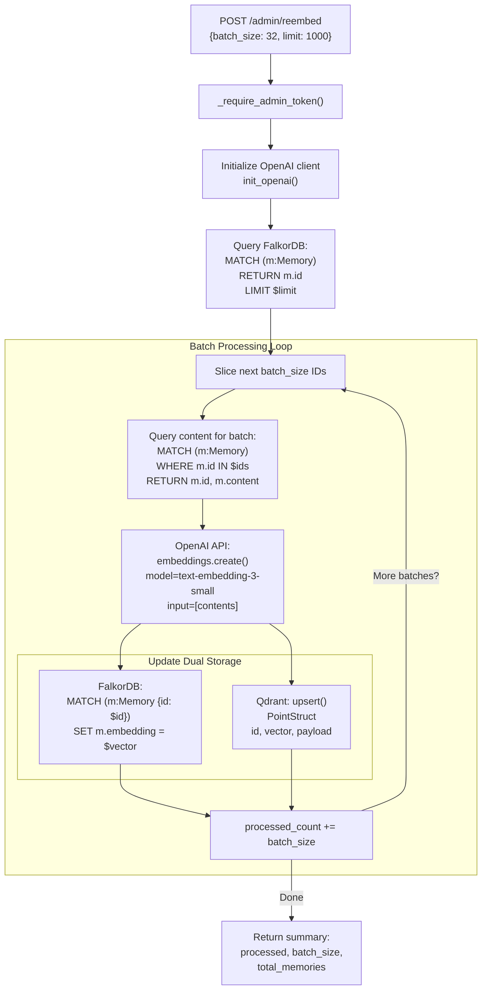

:::note[Source files]
- [app.py](https://github.com/verygoodplugins/automem/blob/main/app.py) — Admin endpoints (lines 2069–2256)
:::

Administrative endpoints require elevated privileges (`ADMIN_API_TOKEN`) for managing enrichment processing and embedding generation. These operations are intended for maintenance, debugging, and bulk data operations.

For standard memory operations (store, recall, update, delete), see [Memory Operations](/docs/reference/api/memory-operations/). For consolidation scheduling, see [Consolidation Operations](/docs/reference/api/consolidation/).

---

## Authentication Model

Admin operations require **dual authentication**:

1. **Standard API Token** (`AUTOMEM_API_TOKEN`) — Required for all endpoints except `/health`
2. **Admin Token** (`ADMIN_API_TOKEN`) — Additional token for privileged operations

### Authentication Methods

| Token Type | Header Methods | Query Parameter | Environment Variable |
|------------|---------------|-----------------|---------------------|
| **API Token** | `Authorization: Bearer <token>` / `X-API-Key: <token>` | `?api_key=<token>` | `AUTOMEM_API_TOKEN` |
| **Admin Token** | `X-Admin-Token: <token>` / `X-Admin-Api-Key: <token>` | `?admin_token=<token>` | `ADMIN_API_TOKEN` |

### Endpoint Authentication Requirements



### Error Responses

| Status Code | Response | Meaning |
|-------------|----------|---------|
| `401 Unauthorized` | `{"error": "Unauthorized"}` | Missing or invalid `AUTOMEM_API_TOKEN` |
| `401 Admin authorization required` | `{"error": "Admin authorization required"}` | Missing or invalid `ADMIN_API_TOKEN` |
| `403 Admin token not configured` | `{"error": "Admin token not configured"}` | Server has no `ADMIN_API_TOKEN` environment variable set |

---

## GET /enrichment/status

**Authentication:** API token only (no admin token required)

**Purpose:** Monitor the enrichment pipeline's health and processing statistics. This endpoint provides visibility into background processing without requiring elevated privileges.

### Response Schema

```json
{
  "status": "healthy",
  "queue_size": 3,
  "pending_count": 2,
  "in_flight_count": 1,
  "stats": {
    "processed_total": 1247,
    "successes": 1244,
    "failures": 3,
    "last_success_id": "a1b2c3d4-e5f6-7890-abcd-ef1234567890",
    "last_success_at": "2025-01-15T10:29:45Z",
    "last_error": "spaCy model not loaded",
    "last_error_at": "2025-01-14T08:15:22Z"
  }
}
```

### Status Values

| Field | Type | Description |
|-------|------|-------------|
| `status` | string | `"healthy"` if enrichment worker is running, `"unavailable"` if worker thread is dead |
| `queue_size` | integer | Number of jobs waiting in `state.enrichment_queue` |
| `pending_count` | integer | Count of memories in `state.enrichment_pending` set |
| `in_flight_count` | integer | Count of memories currently being processed (`state.enrichment_inflight`) |
| `stats.processed_total` | integer | Total enrichment attempts (successes + failures) |
| `stats.successes` | integer | Successfully enriched memories |
| `stats.failures` | integer | Failed enrichment attempts |
| `stats.last_success_id` | string \| null | UUID of most recently enriched memory |
| `stats.last_success_at` | string \| null | ISO timestamp of last successful enrichment |
| `stats.last_error` | string \| null | Error message from most recent failure |
| `stats.last_error_at` | string \| null | ISO timestamp of last enrichment failure |

### Example Usage

```bash
curl "https://your-automem-instance/enrichment/status" \
  -H "Authorization: Bearer YOUR_API_TOKEN"
```

### Troubleshooting with Status

| Observation | Likely Cause | Action |
|-------------|-------------|--------|
| `status: "unavailable"` | Worker thread crashed | Check application logs for exceptions, restart service |
| `queue_size` increasing | Worker processing slower than intake | Monitor `in_flight_count`, check for spaCy or OpenAI issues |
| High `failures` count | Enrichment logic errors | Review `last_error`, check Qdrant connectivity |
| `in_flight_count` stuck | Worker deadlocked | Restart enrichment worker or service |

---

## POST /enrichment/reprocess

**Authentication:** API token + Admin token

**Purpose:** Force re-enrichment of specific memories. Useful after:
- Updating enrichment logic or configuration
- Adding spaCy model capabilities
- Fixing corrupted enrichment metadata
- Recovering from systematic enrichment failures

### Request Schema

| Parameter | Type | Required | Description |
|-----------|------|----------|-------------|
| `ids` | array[string] | **Yes** | List of memory UUIDs to reprocess (non-empty) |
| `force` | boolean | No | If `true`, requeue memories even if already pending/in-flight. Default: `false` |

### Example Request

```bash
curl -X POST https://your-automem-instance/enrichment/reprocess \
  -H "Authorization: Bearer YOUR_API_TOKEN" \
  -H "X-Admin-Token: YOUR_ADMIN_TOKEN" \
  -H "Content-Type: application/json" \
  -d '{
    "ids": [
      "a1b2c3d4-e5f6-7890-abcd-ef1234567890",
      "b2c3d4e5-f6a7-8901-bcde-f12345678901"
    ],
    "force": false
  }'
```

### Response Schema

| Field | Type | Description |
|-------|------|-------------|
| `queued` | integer | Number of memories successfully added to enrichment queue |
| `already_queued` | integer | Memories skipped because already pending/in-flight (unless `force=true`) |
| `not_found` | integer | Memory IDs that don't exist in FalkorDB |
| `not_found_ids` | array[string] | List of non-existent memory UUIDs |

```json
{
  "queued": 2,
  "already_queued": 0,
  "not_found": 0,
  "not_found_ids": []
}
```

### Processing Flow



### Implementation Details

The reprocessing operation performs these steps:

1. **Validation Phase** — Queries FalkorDB to verify each memory exists via `MATCH (m:Memory {id: $id}) RETURN m`
2. **Deduplication** — Checks `state.enrichment_pending` and `state.enrichment_inflight` sets to avoid duplicate work (unless `force=true`)
3. **Queueing** — Calls `enqueue_enrichment(memory_id, forced=True, attempt=0)` which:
   - Acquires `state.enrichment_lock`
   - Adds memory ID to `state.enrichment_pending`
   - Puts `EnrichmentJob(memory_id, attempt=0, forced=True)` in queue
4. **Background Processing** — The `enrichment_worker()` thread picks up jobs and calls `enrich_memory()` which:
   - Extracts entities via spaCy (if installed)
   - Creates temporal `PRECEDED_BY` edges
   - Finds semantic neighbors via Qdrant
   - Creates `SIMILAR_TO` relationships
   - Detects patterns and creates `EXEMPLIFIES` edges
   - Updates `metadata.enriched_at` timestamp

---

## POST /admin/reembed

**Authentication:** API token + Admin token

**Purpose:** Regenerate embeddings for all memories in batches. Critical for:
- Migrating to a different embedding model
- Recovering from Qdrant data loss
- Fixing corrupted embeddings
- Bulk embedding generation after initial import

### Request Schema

| Parameter | Type | Required | Description |
|-----------|------|----------|-------------|
| `batch_size` | integer | No | Embeddings per OpenAI API call. Default: `32`. Max recommended: `100` |
| `limit` | integer | No | Max memories to process. If omitted, processes all memories in database |

### Example Request

```bash
curl -X POST https://your-automem-instance/admin/reembed \
  -H "Authorization: Bearer YOUR_API_TOKEN" \
  -H "X-Admin-Token: YOUR_ADMIN_TOKEN" \
  -H "Content-Type: application/json" \
  -d '{"batch_size": 32}'
```

### Processing Architecture



### Response Schema

| Field | Type | Description |
|-------|------|-------------|
| `processed` | integer | Number of memories successfully re-embedded |
| `batch_size` | integer | Batch size used (from request or default 32) |
| `total_memories` | integer | Total memory count in database at operation start |

```json
{
  "processed": 1000,
  "batch_size": 32,
  "total_memories": 1000
}
```

### Implementation Details

**Phase 1: Memory Enumeration**

Fetches all memory IDs (or up to `limit`) from FalkorDB:
```cypher
MATCH (m:Memory) RETURN m.id LIMIT $limit
```

**Phase 2: Batch Content Retrieval**

For each batch of `batch_size` IDs, queries FalkorDB for content. Missing memories are logged but don't halt processing.

**Phase 3: OpenAI Embedding Generation**

Generates embeddings for entire batch in single API call. OpenAI's `text-embedding-3-small` model:
- Dimension: 768
- Context window: 8191 tokens
- Cost: $0.00002 per 1K tokens

**Phase 4: Dual Storage Update**

Both Qdrant and FalkorDB are updated. Qdrant failures are logged but don't halt the operation (graceful degradation) — FalkorDB remains the source of truth.

### Performance Considerations

| Batch Size | OpenAI API Calls (1000 memories) | Approx Time | Cost (1000 memories) |
|------------|----------------------------------|-------------|---------------------|
| 10 | 100 | ~5 minutes | $0.06 |
| 32 | 32 | ~2 minutes | $0.06 |
| 50 | 20 | ~1 minute | $0.06 |
| 100 | 10 | ~30 seconds | $0.06 |

**Recommendations:**
- **Default 32** balances API call overhead and failure blast radius
- **Use 100** for large migrations (>10K memories) with stable OpenAI access
- **Use 10** during testing or with rate-limited OpenAI keys
- Monitor `processed` count to detect stalls mid-operation

### Error Handling

The operation continues even if individual batches fail:

| Error | Cause | Behavior |
|-------|-------|----------|
| OpenAI API rate limit | Exceeded quota | Retries with exponential backoff (handled by OpenAI SDK) |
| Missing memory content | Deleted between enumeration and fetch | Logged, skipped, processing continues |
| Qdrant connection failure | Network issue or Qdrant down | Logged, FalkorDB still updated (graceful degradation) |
| Invalid content format | Null or non-string content | Logged, skipped |

All errors are logged with structured context:
```python
logger.exception("Failed to generate embeddings for batch", extra={"batch_ids": ids})
```

---

## Security Model

### Threat Model

Admin operations can:
- Force expensive OpenAI API calls (re-embedding entire database)
- Trigger resource-intensive enrichment reprocessing
- Access operational metrics (enrichment statistics)

**Without admin token protection**, a compromised API token could:
1. Generate thousands of dollars in OpenAI costs via repeated re-embedding
2. Overload enrichment workers with duplicate jobs
3. Enumerate all memory IDs via reprocess endpoint

### Best Practices

| Practice | Rationale | Implementation |
|----------|-----------|----------------|
| **Separate tokens** | Limits blast radius of API token compromise | Use different values for `AUTOMEM_API_TOKEN` and `ADMIN_API_TOKEN` |
| **Rotate periodically** | Reduces window of exposure | Regenerate tokens monthly, update all clients |
| **Restrict admin access** | Minimize privilege escalation risk | Share admin token only with operations team |
| **Use headers, not query params** | Prevents token leakage in logs | Prefer `Authorization: Bearer` and `X-Admin-Token` headers |
| **Monitor admin operations** | Detect anomalous usage | Alert on high-frequency `/admin/reembed` calls |
| **Audit admin calls** | Forensic capability | Log admin operations with IP, timestamp, token hash |

---

## Operational Patterns

### Enrichment Pipeline Recovery

After spaCy model upgrades or enrichment logic changes:

```bash
# 1. Get all memory IDs that need reprocessing
MEMORY_IDS=$(curl -s "https://your-instance/recall?limit=100&query=*" \
  -H "Authorization: Bearer $TOKEN" | jq -r '[.results[].memory.memory_id]')

# 2. Reprocess them
curl -X POST https://your-instance/enrichment/reprocess \
  -H "Authorization: Bearer $TOKEN" \
  -H "X-Admin-Token: $ADMIN_TOKEN" \
  -H "Content-Type: application/json" \
  -d "{\"ids\": $MEMORY_IDS, \"force\": true}"
```

### Embedding Model Migration

When switching from `text-embedding-3-small` (768-d) to `text-embedding-3-large` (3072-d):

:::caution[Model changes require code updates]
Model changes require code updates to specify the new model in `_generate_real_embedding()`. Simply running `/admin/reembed` will regenerate with the currently configured model.
:::

1. Update `VECTOR_SIZE` environment variable
2. Recreate the Qdrant collection with new dimensions
3. Run `/admin/reembed` with `batch_size=50` to regenerate all embeddings

### Disaster Recovery from Qdrant Loss

If Qdrant data is corrupted or lost but FalkorDB is intact:

```bash
curl -X POST https://your-automem-instance/admin/reembed \
  -H "Authorization: Bearer YOUR_API_TOKEN" \
  -H "X-Admin-Token: YOUR_ADMIN_TOKEN" \
  -H "Content-Type: application/json" \
  -d '{"batch_size": 50}'
```

See [Operations / Health](/docs/operations/health/) for complete recovery procedures.
