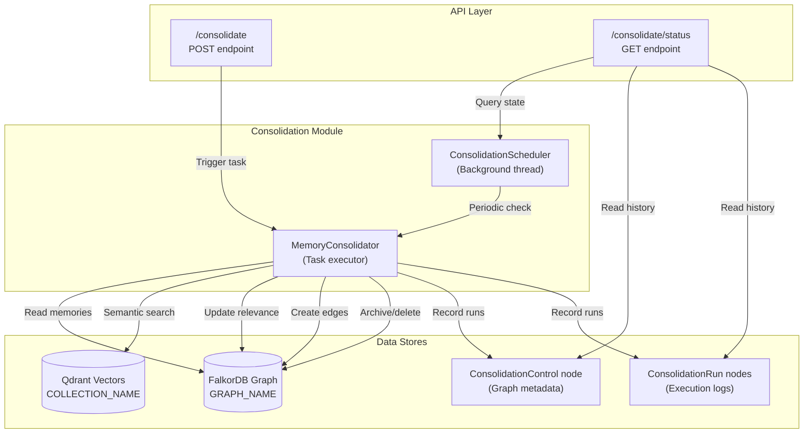
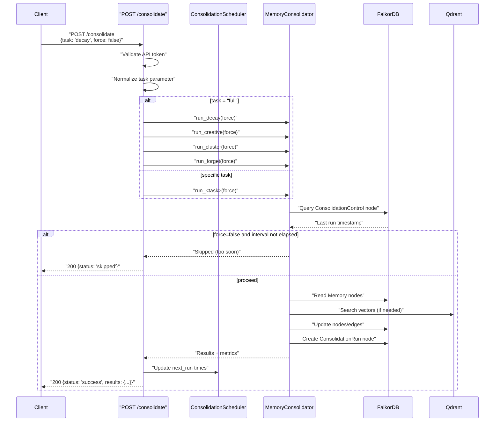

:::note[Source files]
- [app.py](https://github.com/verygoodplugins/automem/blob/main/app.py) — Consolidation API endpoints (lines 2646–2825)
- [consolidation.py](https://github.com/verygoodplugins/automem/blob/main/consolidation.py) — Consolidation engine implementation
:::

This page documents the HTTP API endpoints for triggering and monitoring memory consolidation tasks. Consolidation is AutoMem's background maintenance system that mimics biological memory processes — decay, creative association, clustering, and forgetting.

For information about the consolidation engine's internal architecture and algorithms, see [Consolidation Engine](/docs/core-concepts/consolidation/).

---

## Overview

AutoMem provides two REST endpoints for consolidation operations:

| Endpoint | Method | Purpose | Auth |
|----------|--------|---------|------|
| `/consolidate` | POST | Manually trigger consolidation tasks | API token |
| `/consolidate/status` | GET | Query scheduler state and last run times | API token |

The consolidation system runs automatically on scheduled intervals (configurable via environment variables), but these endpoints allow manual triggers for testing, debugging, or forcing immediate execution.

---

## System Architecture



---

## POST /consolidate

Manually trigger one or more consolidation tasks.

### Parameters

| Parameter | Type | Required | Default | Description |
|-----------|------|----------|---------|-------------|
| `task` | string | No | `"full"` | Task type to execute: `decay`, `creative`, `cluster`, `forget`, or `full` |
| `force` | boolean | No | `false` | Bypass interval checks and execute immediately |

### Task Types

| Task | Default Interval | Description | Configuration Variable |
|------|-----------------|-------------|----------------------|
| `decay` | 3600s (1 hour) | Apply exponential relevance decay to memories | `CONSOLIDATION_DECAY_INTERVAL_SECONDS` |
| `creative` | 3600s (1 hour) | Discover hidden associations (REM-like) | `CONSOLIDATION_CREATIVE_INTERVAL_SECONDS` |
| `cluster` | 21600s (6 hours) | Group semantically similar memories | `CONSOLIDATION_CLUSTER_INTERVAL_SECONDS` |
| `forget` | 86400s (24 hours) | Archive/delete low-relevance memories | `CONSOLIDATION_FORGET_INTERVAL_SECONDS` |
| `full` | N/A | Execute all four tasks in sequence | N/A |

### Execution Flow



### Response Format

#### Success (200 OK)

```json
{
  "status": "success",
  "task": "decay",
  "results": {
    "updates": 42,
    "duration_seconds": 1.23
  }
}
```

For `task="full"`, the `results` object contains combined metrics from all four tasks:

```json
{
  "status": "success",
  "task": "full",
  "results": {
    "decay": { "updates": 42, "duration_seconds": 1.23 },
    "creative": { "associations": 8, "duration_seconds": 2.45 },
    "cluster": { "clusters": 3, "duration_seconds": 5.67 },
    "forget": { "forgotten": 2, "duration_seconds": 0.89 }
  }
}
```

#### Skipped (200 OK)

When `force=false` and the interval hasn't elapsed:

```json
{
  "status": "skipped",
  "task": "decay",
  "reason": "Last run was 300 seconds ago. Next run in 3300 seconds."
}
```

#### Error (500 Internal Server Error)

```json
{
  "error": "Consolidation task 'decay' failed: Connection refused"
}
```

### Usage Examples

**Trigger full consolidation (forced):**

```bash
curl -X POST https://your-automem-instance/consolidate \
  -H "Authorization: Bearer YOUR_TOKEN" \
  -H "Content-Type: application/json" \
  -d '{"task": "full", "force": true}'
```

**Trigger single task (decay):**

```bash
curl -X POST https://your-automem-instance/consolidate \
  -H "Authorization: Bearer YOUR_TOKEN" \
  -H "Content-Type: application/json" \
  -d '{"task": "decay", "force": false}'
```

---

## GET /consolidate/status

Query the current state of the consolidation scheduler and retrieve execution history.

### Query Parameters

| Parameter | Type | Required | Default | Description |
|-----------|------|----------|---------|-------------|
| `history_limit` | integer | No | 20 | Number of recent execution records to return (0–100) |

### Response Format

```json
{
  "scheduler": {
    "running": true,
    "tick_seconds": 60
  },
  "last_run": {
    "decay": "2025-01-15T08:00:00Z",
    "creative": "2025-01-15T08:00:00Z",
    "cluster": "2025-01-15T06:00:00Z",
    "forget": "2025-01-15T00:00:00Z"
  },
  "next_run": {
    "decay": "2025-01-15T09:00:00Z",
    "creative": "2025-01-15T09:00:00Z",
    "cluster": "2025-01-15T12:00:00Z",
    "forget": "2025-01-16T00:00:00Z"
  },
  "intervals": {
    "decay": 3600,
    "creative": 3600,
    "cluster": 21600,
    "forget": 86400
  },
  "history": [
    {
      "task": "decay",
      "timestamp": "2025-01-15T08:00:00Z",
      "duration_seconds": 1.23,
      "updates": 42
    },
    {
      "task": "creative",
      "timestamp": "2025-01-15T08:00:00Z",
      "duration_seconds": 2.45,
      "associations": 8
    }
  ]
}
```

### Response Fields

| Field | Type | Description |
|-------|------|-------------|
| `scheduler.running` | boolean | Whether the background scheduler thread is active |
| `scheduler.tick_seconds` | integer | Polling interval for the scheduler loop |
| `last_run.<task>` | string (ISO 8601) | Timestamp of most recent execution |
| `next_run.<task>` | string (ISO 8601) | Calculated next execution time |
| `intervals.<task>` | integer | Configured interval in seconds |
| `history[].task` | string | Task type that was executed |
| `history[].timestamp` | string (ISO 8601) | Execution start time |
| `history[].duration_seconds` | float | Time taken to complete |
| `history[].updates` | integer | Nodes updated (decay task) |
| `history[].associations` | integer | Edges created (creative task) |
| `history[].clusters` | integer | MetaMemory nodes created (cluster task) |
| `history[].forgotten` | integer | Memories archived/deleted (forget task) |

### Usage Examples

**Check last run times:**

```bash
curl "https://your-automem-instance/consolidate/status" \
  -H "Authorization: Bearer YOUR_TOKEN"
```

**Query recent execution history:**

```bash
curl "https://your-automem-instance/consolidate/status?history_limit=50" \
  -H "Authorization: Bearer YOUR_TOKEN"
```

---

## Control Node Storage

Consolidation state is persisted in FalkorDB using two node types:

### ConsolidationControl Node

Properties correspond to the `CONSOLIDATION_TASK_FIELDS` mapping in `app.py`. A single `ConsolidationControl` node (with ID controlled by `CONSOLIDATION_CONTROL_NODE_ID`, defaulting to `"global"`) stores the last run timestamps for all four tasks.

### ConsolidationRun Nodes

Each execution creates a timestamped record stored as a `ConsolidationRun` node in FalkorDB. The `/consolidate/status` endpoint reads the most recent `ConsolidationRun` nodes ordered by timestamp descending, respecting the `history_limit` parameter (default 20, max 100).

---

## Configuration

Consolidation behavior is controlled via environment variables:

| Variable | Default | Description |
|----------|---------|-------------|
| `CONSOLIDATION_TICK_SECONDS` | 60 | Scheduler loop polling interval |
| `CONSOLIDATION_DECAY_INTERVAL_SECONDS` | 3600 | Minimum time between decay runs |
| `CONSOLIDATION_CREATIVE_INTERVAL_SECONDS` | 3600 | Minimum time between creative runs |
| `CONSOLIDATION_CLUSTER_INTERVAL_SECONDS` | 21600 | Minimum time between cluster runs |
| `CONSOLIDATION_FORGET_INTERVAL_SECONDS` | 86400 | Minimum time between forget runs |
| `CONSOLIDATION_DECAY_IMPORTANCE_THRESHOLD` | 0.3 | Skip decay for memories above this importance |
| `CONSOLIDATION_HISTORY_LIMIT` | 20 | Default number of history records to return |
| `CONSOLIDATION_CONTROL_NODE_ID` | `"global"` | ID of the ConsolidationControl node |

**Example configuration:**

```bash
CONSOLIDATION_TICK_SECONDS=30
CONSOLIDATION_DECAY_INTERVAL_SECONDS=1800
CONSOLIDATION_CREATIVE_INTERVAL_SECONDS=3600
CONSOLIDATION_CLUSTER_INTERVAL_SECONDS=14400
CONSOLIDATION_FORGET_INTERVAL_SECONDS=43200
CONSOLIDATION_DECAY_IMPORTANCE_THRESHOLD=0.4
```

---

## Authentication

Both endpoints require authentication using the `AUTOMEM_API_TOKEN`. Three authentication methods are supported:

1. **Bearer Token** (recommended): `Authorization: Bearer <token>`
2. **Custom Header**: `X-API-Key: <token>`
3. **Query Parameter** (discouraged in production): `?api_key=<token>`

Requests without valid authentication receive a `401 Unauthorized` response.

---

## Error Handling

### Client Errors (4xx)

| Status | Condition | Response |
|--------|-----------|----------|
| 400 Bad Request | Invalid `task` parameter | `{"error": "Invalid task type: xyz"}` |
| 400 Bad Request | `history_limit` out of range | `{"error": "history_limit must be between 0 and 100"}` |
| 401 Unauthorized | Missing or invalid token | `{"error": "Unauthorized"}` |

### Server Errors (5xx)

| Status | Condition | Response |
|--------|-----------|----------|
| 500 Internal Server Error | Database connection failure | `{"error": "Consolidation task 'decay' failed: ..."}` |
| 500 Internal Server Error | Task execution exception | `{"error": "Failed to query consolidation status: ..."}` |

All errors are logged with full stack traces to facilitate debugging.

---

## Integration with Background Scheduler

The `ConsolidationScheduler` runs in a background thread started at application initialization. It periodically checks whether each task's interval has elapsed and executes tasks automatically without manual triggers.

The `/consolidate` endpoint bypasses this automatic scheduling when `force=true` is provided, allowing immediate execution regardless of the last run time.

:::tip[When to force consolidation]
Use `force=true` after:
- Importing a large batch of memories (run `full` to build initial associations)
- Changing `CONSOLIDATION_DECAY_IMPORTANCE_THRESHOLD` (run `decay` to reapply)
- Debugging consolidation behavior (individual task runs with force)
:::
