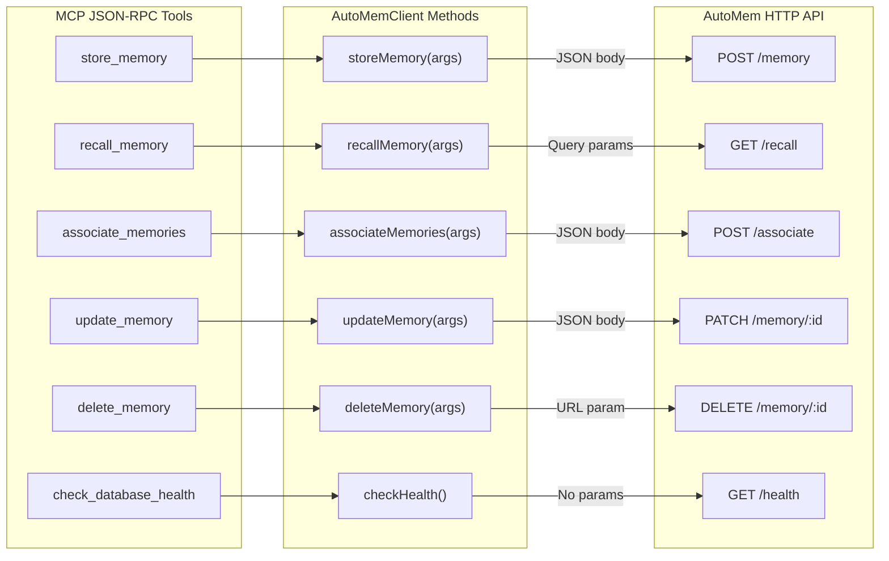
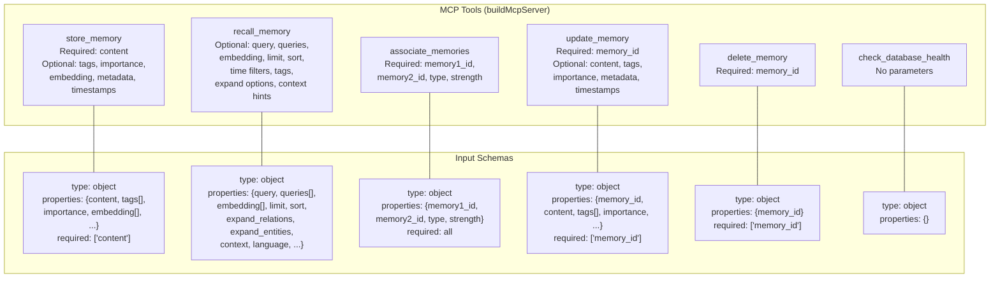

:::note[Source files]
- [src/index.ts](https://github.com/verygoodplugins/mcp-automem/blob/main/src/index.ts) — MCP server, tool definitions, and request handlers (lines 319–1237)
- [server.json](https://github.com/verygoodplugins/mcp-automem/blob/main/server.json) — MCP server manifest
:::

The AutoMem system is accessible through two interfaces: the **HTTP API** (direct REST calls to the AutoMem server) and the **MCP tools** (JSON-RPC calls through the `mcp-automem` bridge). Both interfaces reach the same backend but differ in transport, parameter style, and what they expose to callers.

For the HTTP API reference, see [Memory Operations](/docs/reference/api/memory-operations/), [Recall Operations](/docs/reference/api/recall-operations/), and related pages. For MCP setup, see [MCP Integration](/docs/platforms/claude-desktop/).

---

## Architecture Overview



The MCP bridge (`mcp-automem`) operates as a thin translation layer. Each MCP tool call is mapped to an `AutoMemClient` method, which in turn makes an HTTP request to the AutoMem server. No business logic lives in the bridge — it handles parameter mapping, content validation, and response formatting only.

---

## MCP Server Architecture

### Dual Operational Mode

The `mcp-automem` package (`src/index.ts`) serves two purposes from a single entry point:

1. **Server Mode**: When launched without arguments, it becomes an MCP server communicating over stdio
2. **CLI Mode**: When launched with commands (`setup`, `cursor`, `recall`, etc.), it executes utility functions and exits

Mode detection occurs immediately at startup:

```typescript
// src/index.ts lines 36-37
if (process.argv.length > 2) {
  // CLI mode — execute command and exit
} else {
  // Server mode — start MCP stdio transport
}
```

This allows a single npm package to serve as both an interactive MCP server for AI platforms and a command-line toolkit for configuration management.

### Stdio Transport

In server mode, all MCP communication occurs over `stdin`/`stdout` using the `StdioServerTransport` from `@modelcontextprotocol/sdk`. All logging is redirected to `stderr` to prevent pollution of the JSON-RPC channel:

```typescript
// Redirect console output to stderr (server mode only)
console.log = (...args) => process.stderr.write(args.join(" ") + "\n");
console.error = (...args) => process.stderr.write(args.join(" ") + "\n");
```

### Process Lifecycle

| Stage | Lines | Description |
|-------|-------|-------------|
| Entry | 1–35 | Shebang, imports, helper functions |
| Mode Detection | 36–51 | Determine server vs CLI mode |
| CLI Routing | 96–293 | Execute CLI commands and exit |
| Configuration | 295–312 | Load environment, create `AutoMemClient` |
| Server Setup | 314–876 | Create server, register tools and handlers |
| Main Loop | 1225–1237 | Install guards, connect transport, run |

### Error Resilience

The server guards against two classes of failures:

**Broken pipe errors** — When the AI platform terminates the connection unexpectedly:

```typescript
// installStdioErrorGuards() — lines 69-79
process.stdout.on("error", (err) => {
  if (err.code === "EPIPE") process.exit(0);
});
```

**Tool execution errors** — All tool handlers are wrapped in try-catch, returning MCP error responses rather than crashing the server.

---

## The Six MCP Tools



### Tool Summary

| Tool Name | HTTP Equivalent | Read-Only | Destructive | Idempotent |
|-----------|----------------|-----------|-------------|------------|
| `store_memory` | `POST /memory` | No | No | No |
| `recall_memory` | `GET /recall` | Yes | No | Yes |
| `associate_memories` | `POST /associate` | No | No | Yes |
| `update_memory` | `PATCH /memory/:id` | No | No | Yes |
| `delete_memory` | `DELETE /memory/:id` | No | Yes | Yes |
| `check_database_health` | `GET /health` | Yes | No | Yes |

:::note[Why store_memory is non-idempotent]
`store_memory` is the only tool with `idempotentHint: false` because each invocation generates a unique `memory_id` even if the content is identical. This prevents AI platforms from aggressively caching or deduplicating calls.
:::

### MCP Tool Annotations

MCP tool annotations provide semantic hints to AI platforms about tool behavior:

| Annotation | Type | Meaning | Applied To |
|------------|------|---------|------------|
| `readOnlyHint` | boolean | Tool only reads data | `recall_memory`, `check_database_health` |
| `destructiveHint` | boolean | Tool permanently removes or modifies data | `delete_memory` only |
| `idempotentHint` | boolean | Same args always produce same result | All except `store_memory` |
| `openWorldHint` | boolean | Tool may access external resources | `false` for all tools |

---

## Side-by-Side Tool Reference

### store_memory vs POST /memory

**MCP Tool Input Schema:**

| Parameter | Type | Required | Constraints | Description |
|-----------|------|----------|-------------|-------------|
| `content` | string | Yes | Runtime: ≤2000 chars | Memory content to store |
| `tags` | array[string] | No | — | Categorization tags |
| `importance` | number | No | 0–1 | Significance score |
| `embedding` | array[number] | No | — | Optional pre-computed vector |
| `metadata` | object | No | — | Structured additional data |
| `timestamp` | string | No | ISO format | Creation timestamp |

**MCP Tool Output:**

| Field | Type | Required | Description |
|-------|------|----------|-------------|
| `memory_id` | string | Yes | Unique identifier for stored memory |
| `message` | string | Yes | Confirmation message |

**HTTP API equivalent:**

```bash
curl -X POST https://your-automem-instance/memory \
  -H "Authorization: Bearer YOUR_API_TOKEN" \
  -H "Content-Type: application/json" \
  -d '{
    "content": "User prefers TypeScript for new projects",
    "tags": ["preference", "language:typescript"],
    "importance": 0.85
  }'
```

:::note[Additional undocumented store parameters]
The MCP `store_memory` tool also accepts `id`, `type`, and `confidence` parameters that are passed through to the HTTP API but not listed in the published schema.
:::

**Content Size Governance (MCP layer adds two-tier validation):**

| Limit | Value | Behavior |
|-------|-------|---------|
| Target | 150–300 chars | Optimal embedding quality |
| Soft limit | 500 chars | Warning; backend may auto-summarize |
| Hard limit | 2000 chars | MCP layer rejects before sending to API |

---

### recall_memory vs GET /recall

**MCP Tool Input Schema:**

| Parameter | Type | Required | Constraints | Description |
|-----------|------|----------|-------------|-------------|
| `query` | string | No | — | Semantic search query |
| `queries` | array[string] | No | — | Multiple queries for broader recall |
| `limit` | integer | No | 1–50, default 5 | Max results to return |
| `tags` | array[string] | No | — | Filter by tags |
| `tag_mode` | string | No | `"any"` \| `"all"` | Tag matching mode |
| `tag_match` | string | No | `"exact"` \| `"prefix"` | Tag matching strategy |
| `time_query` | string | No | — | Natural language time filter |
| `start` | string | No | ISO timestamp | Time range start |
| `end` | string | No | ISO timestamp | Time range end |
| `expand_entities` | boolean | No | — | Enable multi-hop entity expansion |
| `expand_relations` | boolean | No | — | Follow graph relationships |
| `expansion_limit` | integer | No | 1–500, default 25 | Max expanded results |
| `relation_limit` | integer | No | 1–200, default 5 | Relations per seed memory |
| `expand_min_importance` | number | No | 0–1 | Filter expanded results by importance |
| `expand_min_strength` | number | No | 0–1 | Min relation strength to traverse |
| `context` | string | No | — | Context label for boosting |
| `language` | string | No | — | Programming language hint |

**MCP Tool Output:**

| Field | Type | Required | Description |
|-------|------|----------|-------------|
| `count` | integer | Yes | Number of memories returned |
| `results` | array[object] | Yes | Array of memory objects with scores |
| `dedup_removed` | integer | No | Duplicates removed in multi-query mode |

:::note[Additional undocumented recall parameters]
The MCP `recall_memory` tool also accepts `per_query_limit`, `sort`, `format`, and `offset` parameters that are passed through to the HTTP API but not listed in the published schema.
:::

**Parallel Query Optimization (MCP layer):**

When `tags` are present, `recall_memory` executes two queries in parallel and merges results:

1. Semantic search with tag filtering (`query + tags`)
2. Pure tag matching (`tags` only, no semantic query)

This ensures comprehensive recall that neither pure vector search nor pure tag filtering achieves alone.

**HTTP API equivalent:**

```bash
curl "https://your-automem-instance/recall?query=typescript+preferences&tags=preference&limit=10" \
  -H "Authorization: Bearer YOUR_API_TOKEN"
```

---

### associate_memories vs POST /associate

**MCP Tool Input Schema:**

| Parameter | Type | Required | Constraints | Description |
|-----------|------|----------|-------------|-------------|
| `memory1_id` | string | Yes | — | Source memory UUID |
| `memory2_id` | string | Yes | — | Target memory UUID |
| `type` | string | Yes | enum: 16 types | Relationship type |
| `strength` | number | No | 0–1, default 0.5 | Relationship strength |

**Relationship Type Enum (all 16 values):**

1. `RELATES_TO` — General relationship
2. `LEADS_TO` — Causal relationship
3. `OCCURRED_BEFORE` — Temporal ordering
4. `PREFERS_OVER` — Chosen alternative
5. `EXEMPLIFIES` — Concrete example of a pattern
6. `CONTRADICTS` — Conflicts with
7. `REINFORCES` — Strengthens validity
8. `INVALIDATED_BY` — Superseded by
9. `EVOLVED_INTO` — Updated version
10. `DERIVED_FROM` — Implementation of a decision
11. `PART_OF` — Component of a larger effort
12. `SIMILAR_TO` — Semantically similar
13. `PRECEDED_BY` — Temporal predecessor
14. `EXPLAINS` — Provides explanation
15. `SHARES_THEME` — Common theme
16. `PARALLEL_CONTEXT` — Parallel events

**MCP Tool Output:**

| Field | Type | Required | Description |
|-------|------|----------|-------------|
| `success` | boolean | Yes | Whether association was created |
| `message` | string | Yes | Confirmation message |

**HTTP API equivalent:**

```bash
curl -X POST https://your-automem-instance/associate \
  -H "Authorization: Bearer YOUR_API_TOKEN" \
  -H "Content-Type: application/json" \
  -d '{
    "memory1_id": "a1b2c3d4-...",
    "memory2_id": "b2c3d4e5-...",
    "type": "INVALIDATED_BY",
    "strength": 0.95
  }'
```

---

### update_memory vs PATCH /memory/:id

**MCP Tool Input Schema:**

| Parameter | Type | Required | Constraints | Description |
|-----------|------|----------|-------------|-------------|
| `memory_id` | string | Yes | — | ID of memory to update |
| `content` | string | No | — | New content (replaces existing) |
| `tags` | array[string] | No | — | New tags (replaces existing) |
| `importance` | number | No | 0–1 | New importance score |
| `metadata` | object | No | — | Metadata (merged with existing) |
| `timestamp` | string | No | ISO format | Override creation timestamp |
| `updated_at` | string | No | ISO format | Explicit update timestamp |
| `last_accessed` | string | No | ISO format | Last access timestamp |
| `type` | string | No | — | Memory type classification |
| `confidence` | number | No | 0–1 | Confidence score |

**MCP Tool Output:**

| Field | Type | Required | Description |
|-------|------|----------|-------------|
| `memory_id` | string | Yes | ID of updated memory |
| `message` | string | Yes | Confirmation message |

**HTTP API equivalent:**

```bash
curl -X PATCH https://your-automem-instance/memory/a1b2c3d4-... \
  -H "Authorization: Bearer YOUR_API_TOKEN" \
  -H "Content-Type: application/json" \
  -d '{"importance": 0.95, "tags": ["preference", "language:typescript", "reviewed"]}'
```

---

### delete_memory vs DELETE /memory/:id

**MCP Tool Input Schema:**

| Parameter | Type | Required | Description |
|-----------|------|----------|-------------|
| `memory_id` | string | Yes | ID of memory to delete |

**MCP Tool Output:**

| Field | Type | Required | Description |
|-------|------|----------|-------------|
| `memory_id` | string | Yes | ID of deleted memory |
| `message` | string | Yes | Confirmation message |

**HTTP API equivalent:**

```bash
curl -X DELETE https://your-automem-instance/memory/a1b2c3d4-... \
  -H "Authorization: Bearer YOUR_API_TOKEN"
```

:::caution[Permanent deletion]
`delete_memory` permanently removes the memory from both FalkorDB and Qdrant. The `destructiveHint: true` annotation signals to AI platforms that this tool requires elevated confirmation before invocation.
:::

---

### check_database_health vs GET /health

**MCP Tool Input Schema:** Empty object — no parameters required.

**MCP Tool Output:**

| Field | Type | Required | Description |
|-------|------|----------|-------------|
| `status` | string | Yes | `"healthy"` or `"error"` |
| `backend` | string | Yes | Backend type (always `"automem"`) |
| `statistics` | object | No | Database statistics (memory counts, etc.) |
| `error` | string | No | Error message if `status` is `"error"` |

**Difference from GET /health:** The `check_database_health` MCP tool returns a simplified status object suitable for AI platform consumption. The HTTP `/health` endpoint returns the full response with enrichment queue metrics, individual component statuses, and timestamps. Use the HTTP endpoint directly for detailed monitoring dashboards.

**HTTP API equivalent:**

```bash
curl https://your-automem-instance/health
```

---

## Response Formatting

MCP tool handlers return dual-representation responses conforming to the MCP protocol:

1. **`content` array** — Human-readable text (type: `"text"`) for display in chat interfaces
2. **`structuredContent` object** — Machine-readable data matching the tool's `outputSchema`

Example from `store_memory`:

```typescript
return {
  content: [{ type: "text", text: `Memory stored with ID: ${result.memory_id}` }],
  structuredContent: { memory_id: result.memory_id, message: result.message }
};
```

This dual format ensures:
- AI platforms can parse structured data programmatically via `structuredContent`
- Users viewing responses in chat see clean, formatted text via `content`
- Tools remain compatible with both chat interfaces and API clients

---

## When to Use Each Interface

| Scenario | Use HTTP API | Use MCP Tools |
|----------|-------------|---------------|
| AI agent integration (Claude, Cursor, etc.) | — | Preferred — native JSON-RPC |
| Custom application or script | Preferred — direct control | — |
| Bulk operations (migration, reprocessing) | Preferred — no overhead | — |
| Content size validation before storage | — | Built-in two-tier limits |
| Parallel tag+semantic recall | Manual implementation | Built-in optimization |
| Admin operations (reembed, reprocess) | Preferred — admin endpoints | Not available |
| Health monitoring dashboards | Preferred — full response | Simplified output only |
| Process supervision (stable PID) | — | Supported via `PROCESS_TITLE` env var |

:::tip[Prefer MCP for AI agents]
AI platforms using the MCP protocol get automatic tool discovery, schema validation, and structured output parsing. The MCP layer also adds content governance (rejecting >2000 char memories before they reach the API) and parallel query optimization that would need to be manually implemented when using the HTTP API directly.
:::

---

## Tool Registration and Discovery

The `mcp-automem` server registers tools via the MCP SDK's schema-based routing:

**`ListToolsRequestSchema` handler (line 874–876):** Returns the complete `tools` array when AI platforms query available tools via MCP introspection. AI platforms call this once at startup to discover what tools are available.

**`CallToolRequestSchema` handler (lines 878–1223):** Executes tool logic based on the `name` parameter using a switch-based dispatcher, then delegates to the corresponding `AutoMemClient` method.

The `tools` array (lines 319–872) contains six static tool definitions with extensive inline documentation in the `description` field. This documentation is directly visible to AI platforms via MCP introspection, informing the model when and how to invoke each tool.
