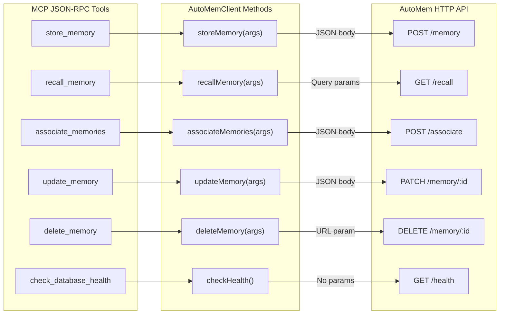
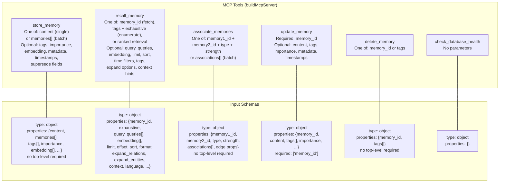

:::note[Source files]
- [src/index.ts](https://github.com/verygoodplugins/mcp-automem/blob/538721c/src/index.ts) — MCP server, tool definitions, and request handlers
- [src/recall-memory.ts](https://github.com/verygoodplugins/mcp-automem/blob/538721c/src/recall-memory.ts) — MCP recall response budgeting and summary-first formatting
- [server.json](https://github.com/verygoodplugins/mcp-automem/blob/538721c/server.json) — MCP server manifest
:::

The AutoMem system is accessible through two interfaces: the **HTTP API** (direct REST calls to the AutoMem server) and the **MCP tools** (JSON-RPC calls through the `mcp-automem` bridge). Both interfaces reach the same backend but differ in transport, parameter style, and what they expose to callers.

For the HTTP API reference, see [Memory Operations](/docs/reference/api/memory-operations/), [Recall Operations](/docs/reference/api/recall-operations/), and related pages. For MCP setup, see [MCP Integration](/docs/platforms/claude-desktop/).

---

## Architecture Overview


```mermaid
graph LR
    subgraph mcp["MCP JSON-RPC Tools"]
        StoreMemory["store_memory"]
        RecallMemory["recall_memory"]
        AssociateMemories["associate_memories"]
        UpdateMemory["update_memory"]
        DeleteMemory["delete_memory"]
        CheckHealth["check_database_health"]
    end

    subgraph client["AutoMemClient Methods"]
        StoreMethod["storeMemory(args)"]
        RecallMethod["recallMemory(args)"]
        AssociateMethod["associateMemories(args)"]
        UpdateMethod["updateMemory(args)"]
        DeleteMethod["deleteMemory(args)"]
        HealthMethod["checkHealth()"]
    end

    subgraph api["AutoMem HTTP API"]
        PostMemory["POST /memory"]
        GetRecall["GET /recall"]
        PostAssociate["POST /associate"]
        PatchMemory["PATCH /memory/:id"]
        DeleteMemoryEndpoint["DELETE /memory/:id"]
        GetHealth["GET /health"]
    end

    StoreMemory --> StoreMethod
    RecallMemory --> RecallMethod
    AssociateMemories --> AssociateMethod
    UpdateMemory --> UpdateMethod
    DeleteMemory --> DeleteMethod
    CheckHealth --> HealthMethod

    StoreMethod -->|"JSON body"| PostMemory
    RecallMethod -->|"Query params"| GetRecall
    AssociateMethod -->|"JSON body"| PostAssociate
    UpdateMethod -->|"JSON body"| PatchMemory
    DeleteMethod -->|"URL param"| DeleteMemoryEndpoint
    HealthMethod -->|"No params"| GetHealth
```

The MCP bridge (`mcp-automem`) operates as a thin translation layer. Each MCP tool call is mapped to an `AutoMemClient` method, which in turn makes an HTTP request to the AutoMem server. No business logic lives in the bridge — it handles parameter mapping, content validation, and response formatting only.

---

## MCP Server Architecture

### Dual Operational Mode

The `mcp-automem` package (`src/index.ts`) serves two purposes from a single entry point:

1. **Server Mode**: When launched without arguments, it becomes an MCP server communicating over stdio
2. **CLI Mode**: When launched with commands (`setup`, `cursor`, `recall`, etc.), it executes utility functions and exits

Mode detection occurs immediately at startup:

```typescript
// src/index.ts lines 41-42
const command = (process.argv[2] || "").toLowerCase();
const isServerMode = command.length === 0;
// ...
if (isServerMode) {
  // Redirect console.log/info/debug/warn to stderr
} else {
  // CLI mode — execute command and exit
}
```

This allows a single npm package to serve as both an interactive MCP server for AI platforms and a command-line toolkit for configuration management.

### Stdio Transport

In server mode, all MCP communication occurs over `stdin`/`stdout` using the `StdioServerTransport` from `@modelcontextprotocol/sdk`. All logging is redirected to `stderr` to prevent pollution of the JSON-RPC channel:

```typescript
// Redirect console output to stderr (server mode only)
console.log = (...args) => process.stderr.write(args.join(" ") + "\n");
console.error = (...args) => process.stderr.write(args.join(" ") + "\n");
```

### Process Lifecycle

| Stage | Lines | Description |
|-------|-------|-------------|
| Entry | 1–40 | Shebang, imports, helper functions |
| Mode Detection | 41–98 | Determine server vs CLI mode; silence dotenv and redirect logging in server mode |
| Helpers | 100–176 | `installStdioErrorGuards()`, version lookup, shared schema fragments |
| CLI Routing | 178–433 | Execute CLI commands and exit |
| Configuration | 435–455 | Resolve endpoint/key, create `AutoMemClient` |
| Server Setup | 457–1706 | Create server, register tools (`tools` array 466–1418) and handlers |
| Main Loop | 1708–1763 | Install stdio guards, connect transport, run shutdown layers |

### Error Resilience

The server guards against two classes of failures:

**Broken pipe errors** — When the AI platform terminates the connection unexpectedly:

```typescript
// installStdioErrorGuards() — lines 100-110
const handler = (error: unknown) => {
  const err = error as { code?: string } | undefined;
  if (err?.code === "EPIPE" || err?.code === "ECONNRESET") {
    process.exit(0);
  }
};
process.stdout.on("error", handler);
process.stderr.on("error", handler);
```

**Tool execution errors** — All tool handlers are wrapped in try-catch, returning MCP error responses rather than crashing the server.

---

## The Six MCP Tools


```mermaid
graph TB
    subgraph tools["MCP Tools (buildMcpServer)"]
        direction TB

        T1["store_memory<br/>One of: content (single)<br/>or memories[] (batch)<br/>Optional: tags, importance,<br/>embedding, metadata, timestamps,<br/>supersede fields"]
        T2["recall_memory<br/>One of: memory_id (fetch),<br/>tags + exhaustive (enumerate),<br/>or ranked retrieval<br/>Optional: query, queries,<br/>embedding, limit, sort,<br/>time filters, tags,<br/>expand options, context hints"]
        T3["associate_memories<br/>One of: memory1_id +<br/>memory2_id + type + strength<br/>or associations[] (batch)"]
        T4["update_memory<br/>Required: memory_id<br/>Optional: content, tags,<br/>importance, metadata, timestamps"]
        T5["delete_memory<br/>One of: memory_id or tags"]
        T6["check_database_health<br/>No parameters"]
    end

    subgraph schemas["Input Schemas"]
        S1["type: object<br/>properties: {content, memories[],<br/>tags[], importance, embedding[], ...}<br/>no top-level required"]
        S2["type: object<br/>properties: {memory_id, exhaustive,<br/>query, queries[], embedding[],<br/>limit, offset, sort, format,<br/>expand_relations, expand_entities,<br/>context, language, ...}"]
        S3["type: object<br/>properties: {memory1_id,<br/>memory2_id, type, strength,<br/>associations[], edge props}<br/>no top-level required"]
        S4["type: object<br/>properties: {memory_id,<br/>content, tags[], importance, ...}<br/>required: ['memory_id']"]
        S5["type: object<br/>properties: {memory_id, tags[]}<br/>no top-level required"]
        S6["type: object<br/>properties: {}"]
    end

    T1 --- S1
    T2 --- S2
    T3 --- S3
    T4 --- S4
    T5 --- S5
    T6 --- S6
```

### Tool Summary

| Tool Name | HTTP Equivalent | Read-Only | Destructive | Idempotent |
|-----------|----------------|-----------|-------------|------------|
| `store_memory` | `POST /memory` | No | No | No |
| `recall_memory` | `GET /recall` | Yes | No | Yes |
| `associate_memories` | `POST /associate` | No | No | Yes |
| `update_memory` | `PATCH /memory/:id` | No | No | Yes |
| `delete_memory` | `DELETE /memory/:id` | No | Yes | Yes |
| `check_database_health` | `GET /health` | Yes | No | Yes |

:::note[Why store_memory is non-idempotent]
`store_memory` is the only tool with `idempotentHint: false` because each invocation generates a unique `memory_id` even if the content is identical. This prevents AI platforms from aggressively caching or deduplicating calls.
:::

### MCP Tool Annotations

MCP tool annotations provide semantic hints to AI platforms about tool behavior:

| Annotation | Type | Meaning | Applied To |
|------------|------|---------|------------|
| `readOnlyHint` | boolean | Tool only reads data | `recall_memory`, `check_database_health` |
| `destructiveHint` | boolean | Tool permanently removes or modifies data | `delete_memory` only |
| `idempotentHint` | boolean | Same args always produce same result | All except `store_memory` |
| `openWorldHint` | boolean | Tool may access external resources | `false` for all tools |

---

## Side-by-Side Tool Reference

### store_memory vs POST /memory

**MCP Tool Input Schema:**

`store_memory` is mode-multiplexed: pass top-level `content` for a single memory, or `memories: [...]` for a batch.

| Parameter | Type | Required | Constraints | Description |
|-----------|------|----------|-------------|-------------|
| `content` | string | XOR `memories` | Runtime: ≤2000 chars | Single-memory mode content |
| `memories` | array[object] | XOR `content` | ≤500 items; each item requires `content` | Batch mode — bulk ingestion |
| `tags` | array[string] | No | — | Categorization tags |
| `importance` | number | No | 0–1 | Significance score |
| `embedding` | array[number] | No | Single mode only | Optional pre-computed vector |
| `metadata` | object | No | — | Structured additional data |
| `timestamp` | string | No | ISO format | Creation timestamp |
| `type` | string | No | enum: memory types | Classification |
| `confidence` | number | No | 0–1 | Classification confidence |
| `id` | string | No | Single mode only | Custom memory ID |
| `t_valid`, `t_invalid` | string | No | ISO format, single mode only | Validity window |
| `updated_at`, `last_accessed` | string | No | ISO format | Explicit timestamps |
| `supersedes_memory_id` | string | No | Single mode only | Existing memory this one replaces |
| `supersede_relation` | string | No | `INVALIDATED_BY` (default) \| `EVOLVED_INTO` | Relation from old → new |
| `supersede_reason` | string | No | — | Reason stored on the old memory |

**MCP Tool Output:**

Only `message` is a required output field — the rest depend on which mode ran.

| Field | Type | Required | Description |
|-------|------|----------|-------------|
| `message` | string | Yes | Confirmation message |
| `memory_id` | string | No | Single mode: ID of the stored memory |
| `memory_ids` | array[string] | No | Batch mode: IDs of the stored memories |
| `stored` | integer | No | Batch mode: number of memories stored |
| `qdrant`, `enrichment` | string | No | Batch mode: server-reported indexing/enrichment status |
| `query_time_ms` | number | No | Batch mode: server-reported execution time |
| `superseded_memory_id` | string | No | Supersede mode: ID of the memory marked invalid |
| `association_created` | boolean | No | Supersede mode: whether old → new was linked |

**HTTP API equivalent:**

```bash
curl -X POST https://your-automem-instance/memory \
  -H "Authorization: Bearer YOUR_API_TOKEN" \
  -H "Content-Type: application/json" \
  -d '{
    "content": "User prefers TypeScript for new projects",
    "tags": ["preference", "language:typescript"],
    "importance": 0.85
  }'
```

:::note[Supersede mode is client-orchestrated]
Every parameter above is published in the MCP `inputSchema`, so AI platforms discover them via introspection. Most are forwarded straight to the HTTP API, but supersede mode (`supersedes_memory_id`, `supersede_relation`, `supersede_reason`) is **not** a POST pass-through — the MCP client orchestrates fetch → store → invalidate → associate. See [Memory Operations](/docs/reference/api/memory-operations/).
:::

**Content Size Governance (MCP layer adds two-tier validation):**

| Limit | Value | Behavior |
|-------|-------|---------|
| Target | 150–300 chars | Optimal embedding quality |
| Soft limit | 500 chars | Warning; backend may auto-summarize |
| Hard limit | 2000 chars | MCP layer rejects before sending to API |

---

### recall_memory vs GET /recall

**MCP Tool Input Schema:**

`recall_memory` is mode-multiplexed too: `memory_id` fetches one record by ID, `tags` + `exhaustive: true` enumerates a tag exactly, and everything else is ranked hybrid retrieval.

| Parameter | Type | Required | Constraints | Description |
|-----------|------|----------|-------------|-------------|
| `memory_id` | string | No | — | ID-fetch mode; other params are ignored |
| `exhaustive` | boolean | No | Requires `tags`; rejects `tag_match: "prefix"` and `tag_mode: "all"` | Tag-enumeration mode — paginated exact-match listing, not ranked retrieval |
| `offset` | integer | No | — | Pagination offset (enumeration and ranked modes) |
| `query` | string | No | — | Semantic search query |
| `queries` | array[string] | No | — | Multiple queries for broader recall |
| `limit` | integer | No | 1–200, default 5 | Max results to return |
| `tags` | array[string] | No | — | Filter by tags |
| `tag_mode` | string | No | `"any"` \| `"all"` | Tag matching mode |
| `tag_match` | string | No | `"exact"` \| `"prefix"` | Tag matching strategy |
| `time_query` | string | No | — | Natural language time filter |
| `start` | string | No | ISO timestamp | Time range start |
| `end` | string | No | ISO timestamp | Time range end |
| `expand_entities` | boolean | No | — | Enable multi-hop entity expansion |
| `expand_relations` | boolean | No | — | Follow graph relationships |
| `expansion_limit` | integer | No | 1–500, default 25 | Max expanded results |
| `relation_limit` | integer | No | 1–200, default 5 | Relations per seed memory |
| `expand_min_importance` | number | No | 0–1 | Filter expanded results by importance |
| `expand_min_strength` | number | No | 0–1 | Min relation strength to traverse |
| `context` | string | No | — | Context label for boosting |
| `language` | string | No | — | Programming language hint |

**MCP Tool Output:**

| Field | Type | Required | Description |
|-------|------|----------|-------------|
| `count` | integer | Yes | Number of memories returned |
| `results` | array[object] | Yes | Array of memory objects with scores |
| `dedup_removed` | integer | No | Duplicates removed in multi-query mode |

:::note[Additional pass-through recall parameters]
The table above is a subset. The published `inputSchema` also carries `per_query_limit`, `sort`, `format`, `exclude_tags`, `auto_decompose`, `expand_respect_tags`, `current_only`, `state_mode`, `state_debug`, `recency_bias`, `scope_fallback`, `min_score`, `adaptive_floor`, `active_path`, `context_tags`, `context_types`, and `priority_ids` — all forwarded to the HTTP API and documented in [Recall Operations](/docs/reference/api/recall-operations/).
:::

**Response shaping and backend-owned recall:**

The MCP bridge forwards recall arguments to the AutoMem backend and then formats the response for MCP clients. Hybrid scoring, tag filtering, deduplication, entity expansion, and `priority_ids` guarantees all live in AutoMem itself, so HTTP and MCP produce the same recall behavior when you pass the same arguments.

**MCP response budgeting (v0.15+):** Budgeted formats (`text`, `items`, `detailed`) are summary-first to stay under MCP client tool-response caps (~25k tokens in Claude Code). When a memory has a server-generated `summary`, budgeted output shows that instead of a long `content` preview; relations collapse to compact stubs (max 3 per memory); metadata collapses to its key list. The default token budget is 18,000 estimated tokens (override with `AUTOMEM_RECALL_TOKEN_BUDGET`). `format: "json"` keeps raw per-field passthrough but the global budget still applies. ID fetches via `memory_id` are never truncated — use that mode to retrieve a full record.

**HTTP API equivalent:**

```bash
curl "https://your-automem-instance/recall?query=typescript+preferences&tags=preference&limit=10" \
  -H "Authorization: Bearer YOUR_API_TOKEN"
```

---

### associate_memories vs POST /associate

**MCP Tool Input Schema:**

Like `store_memory`, this tool has a single-pair mode and a batch mode. The top-level schema declares no `required` array — pass either the four pair fields or `associations`.

| Parameter | Type | Required | Constraints | Description |
|-----------|------|----------|-------------|-------------|
| `memory1_id` | string | Pair mode | XOR `associations` | Source memory UUID |
| `memory2_id` | string | Pair mode | XOR `associations` | Target memory UUID |
| `type` | string | Pair mode | enum: 11 authorable types | Relationship type |
| `strength` | number | No | 0–1 | Relationship strength |
| `associations` | array[object] | Batch mode | 1–500 items; each item requires `memory1_id`, `memory2_id`, `type`, `strength` | Batch mode — do not combine with the pair fields |
| `context`, `reason`, `pattern_type`, `confidence`, `resolution`, `observations`, `timestamp`, `transformation`, `role` | — | No | — | Relation-specific properties stored on the edge |

**Relationship type enum values (11 authorable):**

1. `RELATES_TO` — General relationship
2. `LEADS_TO` — Causal relationship
3. `OCCURRED_BEFORE` — Temporal ordering
4. `PREFERS_OVER` — Chosen alternative
5. `EXEMPLIFIES` — Concrete example of a pattern
6. `CONTRADICTS` — Conflicts with
7. `REINFORCES` — Strengthens validity
8. `INVALIDATED_BY` — Superseded by
9. `EVOLVED_INTO` — Updated version
10. `DERIVED_FROM` — Implementation of a decision
11. `PART_OF` — Component of a larger effort

System-generated relations may still appear in recall results, but they are not valid inputs to `associate_memories`: `SIMILAR_TO`, `PRECEDED_BY`, and `DISCOVERED`.

**MCP Tool Output:**

| Field | Type | Required | Description |
|-------|------|----------|-------------|
| `success` | boolean | Yes | Whether association was created |
| `message` | string | Yes | Confirmation message |

**HTTP API equivalent:**

```bash
curl -X POST https://your-automem-instance/associate \
  -H "Authorization: Bearer YOUR_API_TOKEN" \
  -H "Content-Type: application/json" \
  -d '{
    "memory1_id": "a1b2c3d4-...",
    "memory2_id": "b2c3d4e5-...",
    "type": "INVALIDATED_BY",
    "strength": 0.95
  }'
```

---

### update_memory vs PATCH /memory/:id

**MCP Tool Input Schema:**

| Parameter | Type | Required | Constraints | Description |
|-----------|------|----------|-------------|-------------|
| `memory_id` | string | Yes | — | ID of memory to update |
| `content` | string | No | — | New content (replaces existing) |
| `tags` | array[string] | No | — | New tags (replaces existing) |
| `importance` | number | No | 0–1 | New importance score |
| `metadata` | object | No | — | Metadata (replaces existing) |
| `timestamp` | string | No | ISO format | Override creation timestamp |
| `updated_at` | string | No | ISO format | Explicit update timestamp |
| `last_accessed` | string | No | ISO format | Last access timestamp |
| `type` | string | No | — | Memory type classification |
| `confidence` | number | No | 0–1 | Confidence score |

**MCP Tool Output:**

| Field | Type | Required | Description |
|-------|------|----------|-------------|
| `memory_id` | string | Yes | ID of updated memory |
| `message` | string | Yes | Confirmation message |

**HTTP API equivalent:**

```bash
curl -X PATCH https://your-automem-instance/memory/a1b2c3d4-... \
  -H "Authorization: Bearer YOUR_API_TOKEN" \
  -H "Content-Type: application/json" \
  -d '{"importance": 0.95, "tags": ["preference", "language:typescript", "reviewed"]}'
```

---

### delete_memory vs DELETE /memory/:id

**MCP Tool Input Schema:**

| Parameter | Type | Required | Description |
|-----------|------|----------|-------------|
| `memory_id` | string | No | ID of memory to delete (XOR with `tags`) |
| `tags` | array[string] | No | Bulk-delete all memories matching any tag (XOR with `memory_id`) |

Exactly one of `memory_id` or `tags` must be provided.

**MCP Tool Output:**

Only `message` is a required output field — `memory_id` is absent in bulk-by-tag mode.

| Field | Type | Required | Description |
|-------|------|----------|-------------|
| `message` | string | Yes | Confirmation message |
| `memory_id` | string | No | Single-delete result: ID of the deleted memory |
| `deleted_count` | integer | No | Bulk-delete result: number of memories deleted |
| `tags` | array[string] | No | Bulk-delete result: tags used for the bulk delete |

**HTTP API equivalent:**

```bash
curl -X DELETE https://your-automem-instance/memory/a1b2c3d4-... \
  -H "Authorization: Bearer YOUR_API_TOKEN"
```

:::caution[Permanent deletion]
`delete_memory` permanently removes the memory from both FalkorDB and Qdrant. The `destructiveHint: true` annotation signals to AI platforms that this tool requires elevated confirmation before invocation.
:::

---

### check_database_health vs GET /health

**MCP Tool Input Schema:** Empty object — no parameters required.

**MCP Tool Output:**

| Field | Type | Required | Description |
|-------|------|----------|-------------|
| `status` | string | Yes | `"healthy"` or `"error"` |
| `backend` | string | Yes | Backend type (always `"automem"`) |
| `statistics` | object | No | Database statistics (memory counts, etc.) |
| `error` | string | No | Error message if `status` is `"error"` |

**Difference from GET /health:** The `check_database_health` MCP tool returns a simplified status object suitable for AI platform consumption. The HTTP `/health` endpoint returns the full response with enrichment queue metrics, individual component statuses, and timestamps. Use the HTTP endpoint directly for detailed monitoring dashboards.

**HTTP API equivalent:**

```bash
curl https://your-automem-instance/health
```

---

## Response Formatting

MCP tool handlers return dual-representation responses conforming to the MCP protocol:

1. **`content` array** — Human-readable text (type: `"text"`) for display in chat interfaces
2. **`structuredContent` object** — Machine-readable data matching the tool's `outputSchema`

Example from `store_memory`:

```typescript
return {
  content: [{ type: "text", text: `Memory stored with ID: ${result.memory_id}` }],
  structuredContent: { memory_id: result.memory_id, message: result.message }
};
```

This dual format ensures:
- AI platforms can parse structured data programmatically via `structuredContent`
- Users viewing responses in chat see clean, formatted text via `content`
- Tools remain compatible with both chat interfaces and API clients

---

## When to Use Each Interface

| Scenario | Use HTTP API | Use MCP Tools |
|----------|-------------|---------------|
| AI agent integration (Claude, Cursor, etc.) | — | Preferred — native JSON-RPC |
| Custom application or script | Preferred — direct control | — |
| Bulk operations (migration, reprocessing) | Preferred — no overhead | — |
| Content size validation before storage | — | Built-in two-tier limits |
| Structured tool output for chat clients | Manual formatting | Built-in `content` + `structuredContent` |
| Admin operations (reembed, reprocess) | Preferred — admin endpoints | Not available |
| Health monitoring dashboards | Preferred — full response | Simplified output only |
| Process supervision (stable PID) | — | Supported via `PROCESS_TITLE` env var |

:::tip[Prefer MCP for AI agents]
AI platforms using the MCP protocol get automatic tool discovery, schema validation, structured output parsing, and content governance before requests reach the API. Recall ranking, tag handling, deduplication, and graph/entity expansion remain backend behavior, so the main difference is transport and response format, not search semantics.
:::

---

## Tool Registration and Discovery

The `mcp-automem` server registers tools via the MCP SDK's schema-based routing:

**`ListToolsRequestSchema` handler (lines 1420–1422):** Returns the complete `tools` array when AI platforms query available tools via MCP introspection. AI platforms call this once at startup to discover what tools are available.

**`CallToolRequestSchema` handler (lines 1424–1706):** Executes tool logic based on the `name` parameter using a switch-based dispatcher, then delegates to the corresponding `AutoMemClient` method.

The `tools` array (lines 466–1418) contains six static tool definitions with extensive inline documentation in the `description` field. This documentation is directly visible to AI platforms via MCP introspection, informing the model when and how to invoke each tool.
