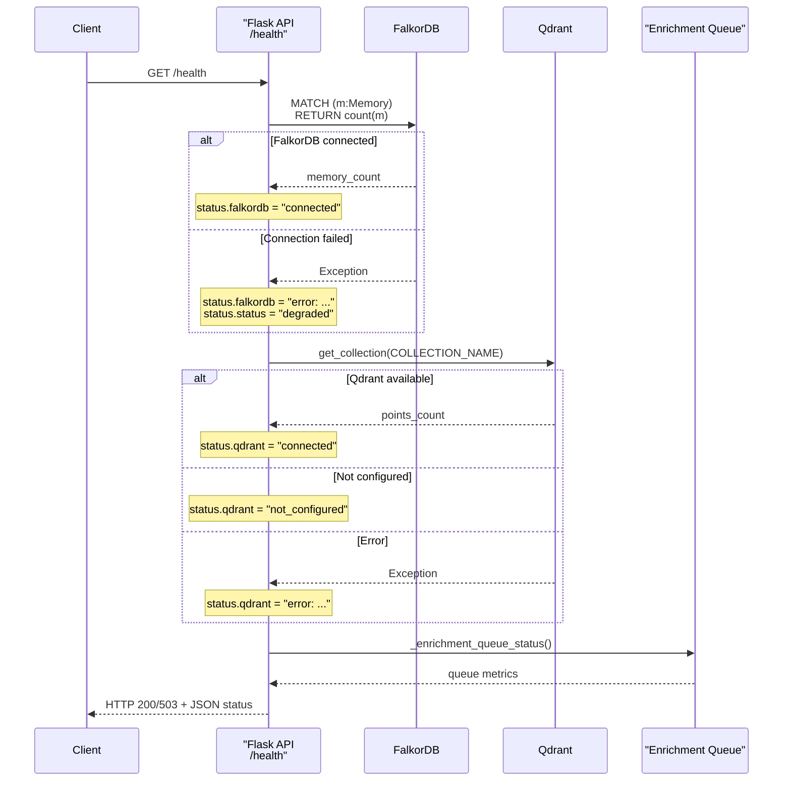
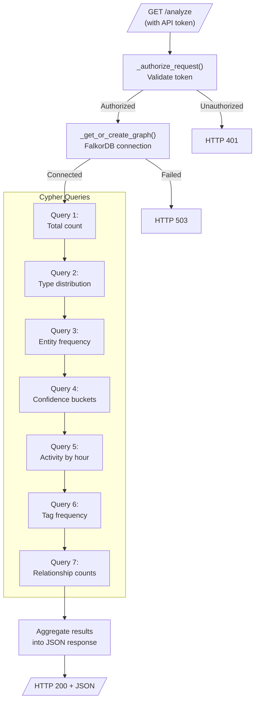
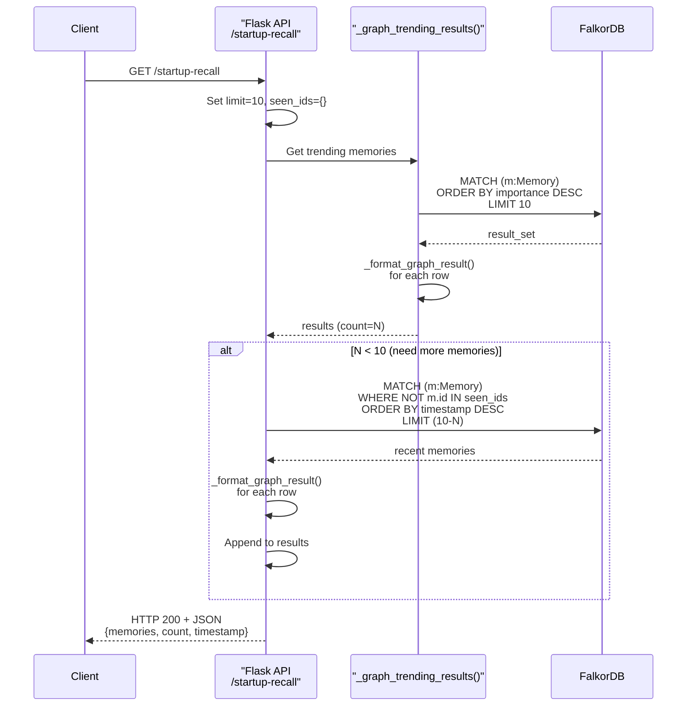
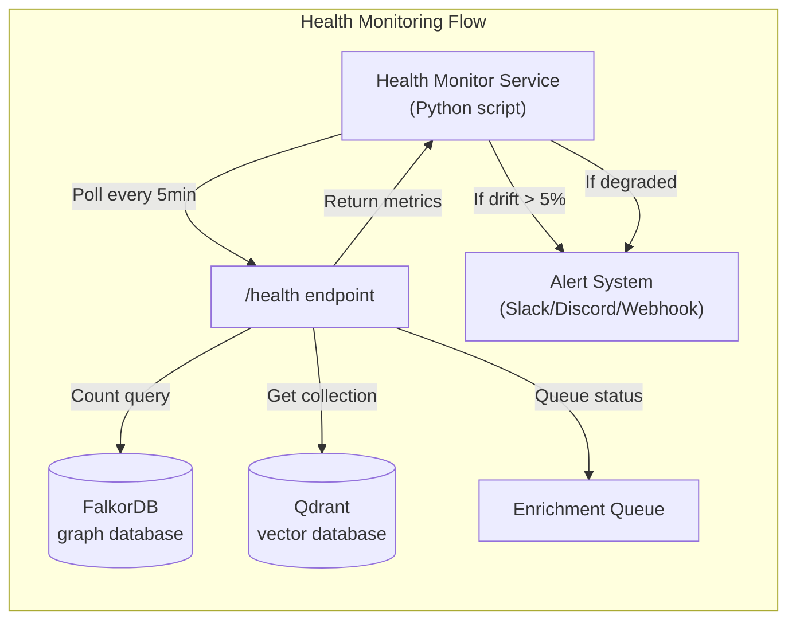

:::note[Source files]
- [app.py](https://github.com/verygoodplugins/automem/blob/main/app.py) — Health and analytics endpoints (lines 2790–3069)
:::

AutoMem provides three monitoring and introspection endpoints that give visibility into service health, database connectivity, enrichment queue state, and memory graph statistics. These endpoints are essential for deployment monitoring, debugging, and understanding the characteristics of stored memories.

For administrative operations like reprocessing, see [Admin Operations](/docs/reference/api/admin/). For memory operations, see [Memory Operations](/docs/reference/api/memory-operations/).

---

## Overview

| Endpoint | Authentication | Purpose |
|----------|---------------|---------|
| `GET /health` | None | Service health check with database connectivity and queue status |
| `GET /analyze` | API Token | Comprehensive memory graph statistics and patterns |
| `GET /startup-recall` | None | Retrieve high-importance memories for initialization context |

---

## GET /health

The health endpoint provides real-time service status, database connectivity checks, and enrichment pipeline metrics. This endpoint does **not** require authentication and is designed for automated health monitoring systems.

**Authentication:** None required

**Response:** Always returns JSON. HTTP 200 if healthy, HTTP 503 if degraded.

### Health Check Flow



### Response Schema

```json
{
  "status": "healthy",
  "falkordb": "connected",
  "qdrant": "connected",
  "memory_count": 1247,
  "qdrant_count": 1247,
  "enrichment": {
    "status": "running",
    "queue_depth": 3,
    "pending": 2,
    "inflight": 1,
    "processed": 5823,
    "failed": 4,
    "last_success": "2025-01-15T10:29:45Z",
    "last_error": null,
    "worker_active": true
  },
  "graph": "automem",
  "timestamp": "2025-01-15T10:30:00Z"
}
```

### Top-Level Field Definitions

| Field | Type | Description |
|-------|------|-------------|
| `status` | string | Overall health: `"healthy"` or `"degraded"` |
| `falkordb` | string | FalkorDB status: `"connected"`, `"unknown"`, or `"error: ..."` |
| `qdrant` | string | Qdrant status: `"connected"`, `"not_configured"`, or `"error: ..."` |
| `memory_count` | integer \| null | Total memories in FalkorDB (null if query fails) |
| `qdrant_count` | integer \| null | Total points in Qdrant collection (null if unavailable) |
| `enrichment` | object | Enrichment queue metrics (see below) |
| `graph` | string | FalkorDB graph name (`FALKORDB_GRAPH` env variable) |
| `timestamp` | string | ISO 8601 timestamp of health check |

### Enrichment Object Fields

The `enrichment` object provides visibility into the background enrichment pipeline:

| Field | Type | Description |
|-------|------|-------------|
| `status` | string | Worker state: `"running"`, `"idle"`, or `"stopped"` |
| `queue_depth` | integer | Total jobs in queue (pending + inflight) |
| `pending` | integer | Jobs waiting to be processed |
| `inflight` | integer | Jobs currently being processed |
| `processed` | integer | Total jobs completed since service start |
| `failed` | integer | Total jobs that failed permanently |
| `last_success` | string \| null | Timestamp of most recent successful enrichment |
| `last_error` | string \| null | Most recent error message (if any) |
| `worker_active` | boolean | Whether enrichment worker thread is alive |

### Example Request

```bash
curl https://your-automem-instance/health
```

### Graceful Degradation

AutoMem continues operating even when some components are unavailable:

| Component Failure | `status` field | HTTP code | Behavior |
|-------------------|---------------|-----------|---------|
| Qdrant unavailable | `"healthy"` | 200 | `qdrant` shows `"not_configured"` or `"error: ..."` |
| FalkorDB unavailable | `"degraded"` | 503 | All memory operations fail |
| Enrichment worker stopped | `"healthy"` | 200 | Service runs but enrichment pipeline stops |

:::tip[Drift detection]
Compare `memory_count` (FalkorDB) against `qdrant_count` (Qdrant) to detect database drift. A significant difference indicates that some memories are missing their vector embeddings and may need `/admin/reembed`.
:::

---

## GET /analyze

The analyze endpoint provides comprehensive statistics about the memory graph, including type distributions, entity frequencies, temporal patterns, and relationship counts. Useful for understanding memory characteristics and identifying patterns in stored data.

**Authentication:** Required (`Authorization: Bearer <token>`, `X-API-Key: <token>`, or `?api_key=<token>`)

**Response:** HTTP 200 with JSON analytics, or HTTP 401 if unauthorized.

### Analytics Query Flow



### Analytics Components

The `/analyze` endpoint executes 7 independent Cypher queries against FalkorDB:

| # | Component | Cypher | Returns |
|---|-----------|--------|---------|
| 1 | Total Memory Count | `MATCH (m:Memory) RETURN count(m)` | Integer |
| 2 | Type Distribution | Groups memories by `m.type` field | `{type: count}` map |
| 3 | Entity Frequency | Unwinds `m.entities` array, counts occurrences | Top 20 entities |
| 4 | Confidence Distribution | Buckets `m.confidence` by 0.1 intervals | `{bucket: count}` map |
| 5 | Activity by Hour | Extracts hour from `m.timestamp`, counts | `{hour: count}` map |
| 6 | Tag Frequency | Unwinds `m.tags` array, counts occurrences | Top 20 tags |
| 7 | Relationship Counts | Counts all edges by type | `{type: count}` map |

Each query is wrapped in a try-except block. If a query fails, the corresponding field is set to `null`, `{}`, or `[]` depending on expected type — partial failures do not prevent a response.

### Response Schema

```json
{
  "total_memories": 1247,
  "memories_by_type": {
    "Decision": 312,
    "Pattern": 289,
    "Preference": 201,
    "Context": 178,
    "Insight": 145,
    "Style": 89,
    "Habit": 33
  },
  "top_entities": [
    {"entity": "Python", "count": 87},
    {"entity": "FastAPI", "count": 54}
  ],
  "confidence_distribution": {
    "0.9-1.0": 423,
    "0.8-0.9": 389,
    "0.7-0.8": 251,
    "0.6-0.7": 122,
    "0.5-0.6": 62
  },
  "activity_by_hour": {
    "9": 145,
    "10": 167,
    "14": 134,
    "15": 98
  },
  "top_tags": [
    {"tag": "project:automem", "count": 201},
    {"tag": "language:python", "count": 167}
  ],
  "relationships": {
    "SIMILAR_TO": 3421,
    "EXEMPLIFIES": 892,
    "RELATES_TO": 445,
    "INVALIDATED_BY": 23,
    "EVOLVED_INTO": 67
  }
}
```

### Example Requests

```bash
# Basic analytics
curl "https://your-automem-instance/analyze" \
  -H "Authorization: Bearer YOUR_API_TOKEN"

# With custom API key header
curl "https://your-automem-instance/analyze" \
  -H "X-API-Key: YOUR_API_TOKEN"
```

### Use Cases

| Use Case | Relevant Fields |
|----------|-----------------|
| Identify memory class imbalance | `memories_by_type` |
| Find frequently discussed projects or tools | `top_entities` |
| Assess overall memory quality | `confidence_distribution` |
| Understand when memories are most created | `activity_by_hour` |
| Audit tagging consistency | `top_tags` |
| Verify enrichment pipeline results | `relationships["SIMILAR_TO"]`, `relationships["EXEMPLIFIES"]` |
| Detect temporal validity issues | `relationships["INVALIDATED_BY"]`, `relationships["EVOLVED_INTO"]` |

---

## GET /startup-recall

The startup recall endpoint returns a curated set of memories suitable for initializing AI agent context at session start. It prioritizes high-importance memories and falls back to recent memories to ensure the agent always has relevant context.

**Authentication:** None required

**Query Parameters:** None

**Response:** HTTP 200 with JSON memory list, or HTTP 503 if FalkorDB unavailable.

### Startup Recall Flow



### Retrieval Strategy

The endpoint uses a two-phase retrieval strategy to fill up to 10 results:

**Phase 1: High-Importance Memories (primary)**

```cypher
MATCH (m:Memory) ORDER BY m.importance DESC, m.timestamp DESC LIMIT 10
```

Returns high-importance memories regardless of recency. Implemented via `_graph_trending_results()`.

**Phase 2: Recent Memories (fallback)**

Only triggered if Phase 1 returns fewer than 10 memories:

```cypher
MATCH (m:Memory)
WHERE NOT m.id IN $seen_ids
ORDER BY m.timestamp DESC
LIMIT $remaining
```

Fills remaining slots with the most recently stored memories.

### Response Schema

```json
{
  "memories": [
    {
      "memory_id": "a1b2c3d4-e5f6-7890-abcd-ef1234567890",
      "content": "User prefers TypeScript over JavaScript for new projects",
      "tags": ["preference", "language:typescript"],
      "importance": 0.9,
      "confidence": 0.95,
      "timestamp": "2025-01-10T14:22:00Z",
      "type": "Preference"
    }
  ],
  "count": 10,
  "timestamp": "2025-01-15T10:30:00Z"
}
```

### Example Request

```bash
curl https://your-automem-instance/startup-recall
```

### Integration with AI Agents

The startup recall endpoint is designed for session initialization. A typical MCP client uses it at startup to load context into the agent's working memory:

```python
# At session start, load context memories
response = requests.get(f"{AUTOMEM_URL}/startup-recall")
memories = response.json()["memories"]

# Inject into system prompt
context_block = "\n".join([f"- {m['content']}" for m in memories])
system_prompt = f"Known context:\n{context_block}\n\n{base_prompt}"
```

:::tip[Startup recall vs. recall_memory]
Use `/startup-recall` for passive context loading at session start. Use `/recall` (or the `recall_memory` MCP tool) for active retrieval when answering specific questions. Startup recall selects by importance, not relevance to any particular query.
:::

---

## Monitoring Integration

### Health Monitoring Service



For production deployments, a health monitoring service polls `/health` on an interval and takes action on anomalies:

- Polls `/health` every 5 minutes (configurable)
- Compares `memory_count` (FalkorDB) vs `qdrant_count` (Qdrant) to detect drift
- Triggers alerts if drift exceeds 5%
- Optionally triggers auto-recovery via `recover_from_qdrant.py`

### Structured Logging

All three endpoints emit structured logs for observability. Enable detailed logging via the `AUTOMEM_LOG_LEVEL` environment variable:

```bash
AUTOMEM_LOG_LEVEL=DEBUG
```

Log entries include request context (endpoint, duration, result counts) suitable for ingestion into log aggregation platforms (Datadog, Grafana Loki, CloudWatch).

### Alert Thresholds

| Condition | Recommended Alert |
|-----------|------------------|
| `status: "degraded"` | Immediate page — FalkorDB unavailable |
| `qdrant` shows `"error: ..."` | Warning — vector search degraded |
| `memory_count` vs `qdrant_count` drift > 5% | Warning — run `/admin/reembed` |
| `enrichment.worker_active: false` | Warning — enrichment stopped, restart service |
| `enrichment.failed` count growing | Investigation — check `last_error` field |

See [Operations / Health](/docs/operations/health/) for complete monitoring and recovery procedures.
