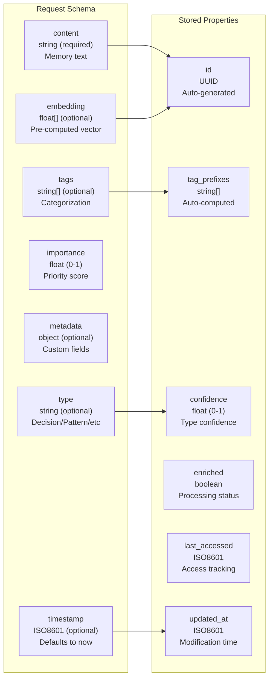
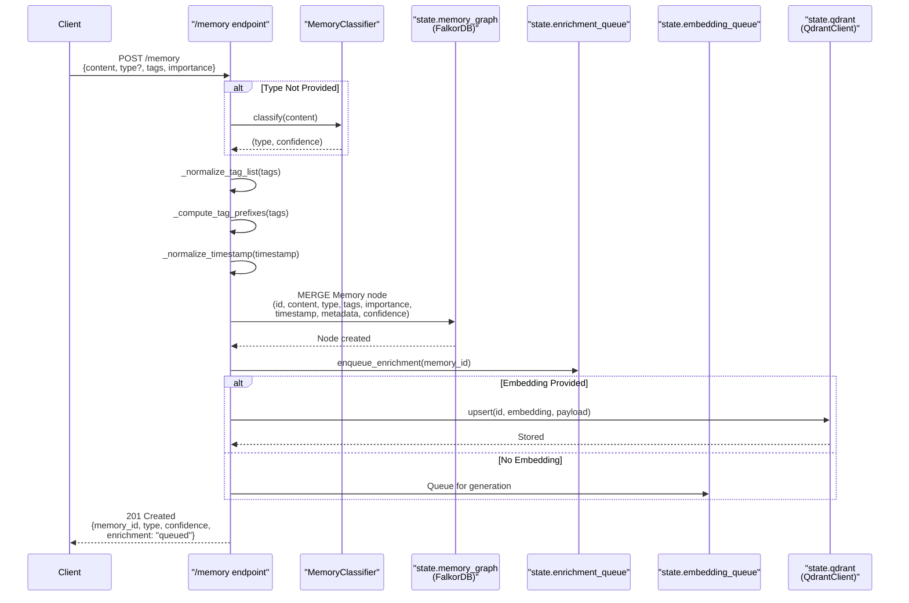
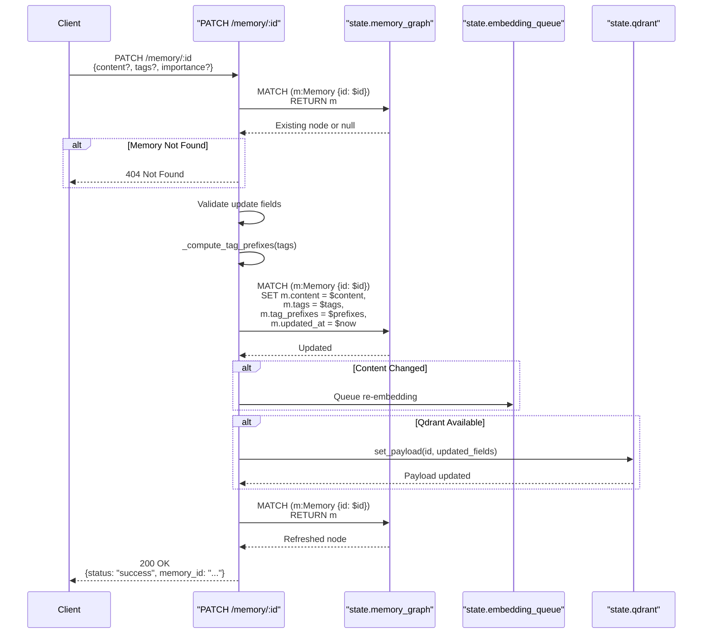
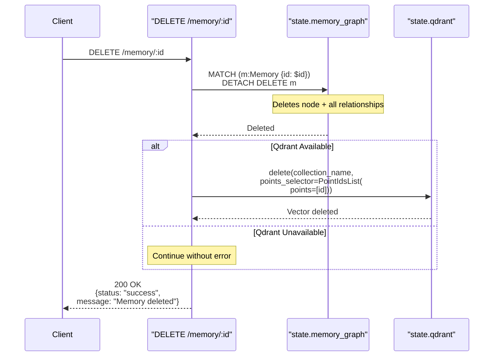

:::note[Source files]
- [automem/api/memory.py](https://github.com/verygoodplugins/automem/blob/main/automem/api/memory.py) — Flask API endpoints
- [src/index.ts](https://github.com/verygoodplugins/mcp-automem/blob/main/src/index.ts) — MCP tool definitions and handlers
- [src/automem-client.ts](https://github.com/verygoodplugins/mcp-automem/blob/main/src/automem-client.ts) — HTTP transport layer
- [src/types.ts](https://github.com/verygoodplugins/mcp-automem/blob/main/src/types.ts) — TypeScript type definitions
:::

Memory operations provide the primary interface for storing and retrieving contextual information. The system maintains dual storage: FalkorDB serves as the source of truth for graph data, while Qdrant provides semantic search capabilities.

All operations except `/health` require authentication via `AUTOMEM_API_TOKEN`. Authentication tokens can be passed via:

1. `Authorization: Bearer <token>` header (recommended)
2. `X-API-Key: <token>` header
3. `?api_key=<token>` query parameter

## Available Endpoints

| Endpoint | Method | Purpose | Authentication |
|----------|--------|---------|----------------|
| `/memory` | POST | Create new memory | API Token |
| `/memory` | POST (batch) | Batch ingest up to 500 memories | API Token |
| `/memory/:id` | GET | Retrieve single memory by ID | API Token |
| `/recall` | GET | Search/retrieve memories | API Token |
| `/memory/<id>` | PATCH | Update existing memory | API Token |
| `/memory/<id>` | DELETE | Remove memory | API Token |
| `/memory/by-tag` | GET | Filter by tags | API Token |

---

## POST /memory — Creating Memories

Creates a new memory node in FalkorDB and optionally stores its embedding in Qdrant. The operation executes synchronously for the primary write but queues background enrichment and embedding generation tasks.

### Request Format

**Required Fields:**

- `content` (string): Memory content, minimum 1 character

**Optional Fields:**

| Field | Type | Description |
|-------|------|-------------|
| `type` | string | One of `Decision`, `Pattern`, `Preference`, `Style`, `Habit`, `Insight`, `Context` (default: auto-classified) |
| `confidence` | float | 0.0–1.0, classification confidence (default: 0.9 if type provided) |
| `tags` | array | Categorization tags, supports hierarchical syntax with `:` or `/` delimiters |
| `importance` | float | 0.0–1.0, importance score (default: 0.5) |
| `metadata` | object | Arbitrary JSON metadata |
| `timestamp` | string | ISO 8601 timestamp (default: current UTC time) |
| `embedding` | array | 1024-dimensional vector (auto-generated if omitted) |
| `id` | string | Custom UUID (auto-generated if omitted) |
| `t_valid`, `t_invalid` | string | Temporal validity bounds |
| `updated_at`, `last_accessed` | string | Tracking timestamps |

**Memory Data Model:**



### Example Request

```bash
curl -X POST https://your-automem-instance/memory \
  -H "Authorization: Bearer YOUR_TOKEN" \
  -H "Content-Type: application/json" \
  -d '{
    "content": "Chose PostgreSQL over MongoDB. Need ACID guarantees for transactions. Impact: ensures data consistency.",
    "type": "Decision",
    "tags": ["project-alpha", "database", "architecture"],
    "importance": 0.9,
    "metadata": {
      "files_modified": ["db/config.py"],
      "alternatives": ["MongoDB", "MySQL"]
    }
  }'
```

### Memory Type Classification

The system uses `MemoryClassifier` to automatically determine memory type when not explicitly provided:

**Classification Strategy:**

1. **Explicit Type**: If `type` parameter provided, use directly with `confidence=0.9`
2. **Regex Patterns**: Match content against predefined patterns for each memory type (fast, free)
3. **LLM Classification**: Use OpenAI GPT-4o-mini as fallback for complex content
4. **Default**: Assign `Context` type with low confidence (0.3) if all methods fail

**Memory Type Reference:**

| Type | Typical Importance | Use Cases |
|------|-------------------|-----------|
| `Decision` | 0.9–1.0 | Architecture choices, library selections, pattern decisions |
| `Pattern` | 0.7–0.9 | Code patterns, architectural patterns, reusable solutions |
| `Insight` | 0.7–0.9 | Root cause discoveries, realizations, aha moments |
| `Preference` | 0.6–0.9 | Style choices, tool preferences, workflow preferences |
| `Style` | 0.6–0.8 | Coding conventions, formatting rules |
| `Habit` | 0.5–0.7 | Development workflows, testing practices |
| `Context` | 0.5–0.7 | Feature descriptions, project context, miscellaneous (default) |

### Data Flow



**Processing Steps:**

1. **Validation**: Extract and validate required fields, normalize tags and timestamps
2. **Classification**: Determine memory type if not provided (regex → LLM → default)
3. **Tag Processing**: Compute hierarchical tag prefixes for efficient filtering
4. **Graph Write**: Execute `MERGE` operation in FalkorDB (immediate, blocking)
5. **Enrichment Queue**: Add to background queue for entity extraction and relationship building
6. **Embedding Handling**: Store provided embedding or queue for generation
7. **Response**: Return immediately with memory ID and enrichment status

### Tag Processing

Tags support hierarchical structure using `:` or `/` delimiters. The system computes all prefixes for efficient filtering. For example, a tag of `slack:channel:general` generates prefixes: `slack`, `slack:channel`, and `slack:channel:general`.

This enables prefix matching queries like `tags=slack` to match `slack:channel:general`, `slack:user:U123`, etc.

**Implementation functions:**
- `_normalize_tag_list()`: Parse comma-separated or array tags
- `_expand_tag_prefixes()`: Split on `:` or `/` and generate cumulative prefixes
- `_compute_tag_prefixes()`: Deduplicate and lowercase all prefixes

**Tagging Conventions (from platform templates):**

| Memory Type | Tag Pattern | Example |
|-------------|-------------|---------|
| Project Decision | `[project, platform, date, decision]` | `["ecommerce", "cursor", "2025-01", "decision"]` |
| Bug Fix | `[project, platform, date, bug-fix, component]` | `["api-gateway", "codex", "2025-01", "bug-fix", "auth"]` |
| Code Pattern | `[project, platform, date, pattern, component]` | `["frontend", "cursor", "2025-01", "pattern", "react"]` |
| User Preference | `[preference, platform, date, domain]` | `["preference", "cursor", "2025-01", "code-style"]` |
| Personal Note | `[personal, date, category]` | `["personal", "2025-01", "health"]` |

:::tip[Project vs personal namespacing]
Use `personal` instead of a project tag for personal memories to ensure preferences and lifestyle context aren't drowned out by high-importance technical memories when recalling across projects.
:::

### Content Size Governance

The MCP `store_memory` tool enforces a two-tier content size system:

| Limit Type | Threshold | Behavior |
|------------|-----------|----------|
| **Target** | 150–300 chars | Ideal size for semantic search quality |
| **Soft Limit** | 500 chars | Warning issued; backend may auto-summarize |
| **Hard Limit** | 2000 chars | Rejected immediately with error |

When content exceeds the soft limit, the backend AutoMem service may automatically summarize it using an LLM. The response then includes:
- `summarized: true` — Flag indicating summarization occurred
- `original_length: number` — Original content length
- `summarized_length: number` — Post-summarization length

### Importance Scoring Guidelines

| Range | Category | Examples |
|-------|----------|---------|
| 0.9–1.0 | Critical | User preferences, major architecture decisions, breaking changes, corrections to AI outputs |
| 0.7–0.9 | Important | Patterns discovered, bug fixes with root cause, significant features |
| 0.5–0.7 | Standard | Minor decisions, helpful context, tool selections, configuration notes |
| 0.3–0.5 | Minor | Small fixes, temporary workarounds, low-impact notes |
| 0.0–0.3 | Low | Trivial changes (avoid storing these) |

### Success Response (201 Created)

```json
{
  "memory_id": "a1b2c3d4-e5f6-7890-abcd-ef1234567890",
  "type": "Decision",
  "confidence": 0.9,
  "enrichment": "queued",
  "embedding": "queued"
}
```

### MCP Tool: `store_memory`

When using AutoMem via MCP, the `store_memory` tool corresponds to `POST /memory`:

**Required Parameters:**
- `content` (string): The memory content. Must be under 2000 characters (hard limit).

**Optional Parameters:**

| Parameter | Type | Default | Description |
|-----------|------|---------|-------------|
| `tags` | `string[]` | `[]` | Tags for categorization and filtering |
| `importance` | `number` (0.0–1.0) | `0.5` | Importance score affecting recall ranking |
| `embedding` | `number[]` | auto-generated | 1024-dimensional vector for semantic search |
| `metadata` | `object` | `{}` | Structured metadata (files modified, error signatures, etc.) |
| `timestamp` | `string` (ISO 8601) | `now()` | When the memory was created |

**MCP example:**

```json
{
  "content": "Login failing on special characters. Root: missing input sanitization. Added validator. Files: auth/login.ts",
  "tags": ["auth", "bug-fix", "2025-01"],
  "importance": 0.8,
  "metadata": {
    "files_modified": ["auth/login.ts", "auth/validator.ts"],
    "error_signature": "ValidationError: special_chars",
    "solution_pattern": "input-sanitization"
  }
}
```

**Best practices for content:**

```
✅ "Chose PostgreSQL over MongoDB. Need ACID guarantees for transactions. Impact: ensures data consistency."
✅ "Login failing on special characters. Root: missing input sanitization. Added validator. Files: auth/login.ts"
✅ "Using early returns for validation. Reduces nesting, improves readability. Applied in all API routes."

❌ "Fixed typo" (too trivial, no context)
❌ "Changed config" (what config? why?)
❌ "[DECISION] Chose PostgreSQL..." (type prefix redundant, use type field instead)
❌ "[3000 character essay...]" (exceeds hard limit)
```

**When to store:**
- User corrections to AI outputs (importance: 0.9)
- Architectural decisions with rationale (importance: 0.9)
- Bug fixes with root cause (importance: 0.7–0.8)
- Patterns discovered during work (importance: 0.7–0.9)

**Never store:**
- Trivial edits (typos, formatting, simple renames)
- Already well-documented information
- Temporary file contents or debug output
- Sensitive credentials or API keys

**Client retry logic:**
- Network errors: Retried up to 3 times (500ms, 1s, 2s delays)
- 5xx server errors: Retried up to 3 times
- 4xx client errors: Not retried (auth/validation issues)
- Timeout: 25 seconds (to fit within Claude Desktop's 30s MCP timeout)

---

## POST /memory (Batch) — Batch Ingest

Ingests up to 500 memories in a single request. Each memory in the batch follows the same field schema as the single `POST /memory` endpoint.

### Request Format

```json
[
  {
    "content": "First memory content",
    "type": "Decision",
    "tags": ["project-alpha"],
    "importance": 0.9
  },
  {
    "content": "Second memory content",
    "type": "Context",
    "tags": ["project-alpha"],
    "importance": 0.5
  }
]
```

Send the request body as a JSON array (not an object). The `Content-Type` must be `application/json`.

### Example Request

```bash
curl -X POST https://your-automem-instance/memory \
  -H "Authorization: Bearer YOUR_TOKEN" \
  -H "Content-Type: application/json" \
  -d '[
    {"content": "Prefer PostgreSQL for transactional workloads", "type": "Preference", "importance": 0.9},
    {"content": "Redis used for session caching layer", "type": "Context", "importance": 0.6}
  ]'
```

### Response Format

```json
{
  "status": "stored",
  "count": 2,
  "memory_ids": ["abc-123", "def-456"],
  "query_time_ms": 45.2
}
```

Each memory in the batch is written to FalkorDB synchronously and queued for background embedding and enrichment. Embeddings are generated in batches by the background worker (see [Performance Tuning](/docs/operations/performance/)).

---

## GET /memory/:id — Retrieve Single Memory

Retrieves a single memory by its UUID from FalkorDB.

### Request Format

```bash
curl "https://your-automem-instance/memory/abc-123-def-456" \
  -H "Authorization: Bearer YOUR_TOKEN"
```

### Response Format

```json
{
  "id": "abc-123-def-456",
  "content": "Chose PostgreSQL over MongoDB. Need ACID guarantees for transactions.",
  "type": "Decision",
  "tags": ["project-alpha", "database"],
  "importance": 0.9,
  "confidence": 0.9,
  "timestamp": "2025-01-15T10:30:00Z",
  "updated_at": "2025-01-15T10:30:00Z",
  "last_accessed": "2025-01-16T08:00:00Z",
  "metadata": {},
  "relations": []
}
```

### Status Codes

| Status | Condition |
|--------|-----------|
| 404 Not Found | Memory ID does not exist in FalkorDB |
| 401 Unauthorized | Missing or invalid API token |

---

## PATCH /memory/:id — Updating Memories

Updates an existing memory node in FalkorDB and synchronizes changes to Qdrant. Content changes trigger automatic re-embedding.

### Request Format

**Updatable Fields:**

| Field | Notes |
|-------|-------|
| `content` | Triggers re-embedding if changed |
| `tags` | Recomputes `tag_prefixes` automatically |
| `importance`, `confidence`, `type` | Update directly |
| `metadata` | Merged with existing metadata (not replaced) |
| `t_valid`, `t_invalid` | Update temporal bounds |
| `timestamp` | Override original creation time |

**Non-updatable Fields:**

| Field | Reason |
|-------|--------|
| `id` | Immutable identifier |
| `updated_at` | Auto-set to current UTC time |

### Update Data Flow



**Update process:**
1. **Validation**: Verify memory exists (404 if not found)
2. **Field Processing**: Normalize tags, compute prefixes, validate types
3. **Graph Update**: Execute Cypher `SET` operation with changed fields
4. **Re-embedding**: Queue if `content` changed
5. **Qdrant Sync**: Update payload fields (non-blocking failure)
6. **Refresh**: Fetch updated node and return to client

### Metadata Merge Behavior

The `metadata` field uses merge semantics, not replacement. Given existing metadata `{"key1": "val1"}` and an update with `{"key2": "val2"}`, the result is `{"key1": "val1", "key2": "val2"}`.

To remove a metadata field, explicitly set it to `null`.

### Example Request

```bash
curl -X PATCH https://your-automem-instance/memory/a1b2c3d4-e5f6-7890-abcd-ef1234567890 \
  -H "Authorization: Bearer YOUR_TOKEN" \
  -H "Content-Type: application/json" \
  -d '{
    "importance": 0.95,
    "tags": ["project-alpha", "database", "architecture", "reviewed"],
    "metadata": {
      "reviewed_at": "2025-02-01T10:00:00Z"
    }
  }'
```

### Success Response (200 OK)

```json
{
  "status": "success",
  "memory_id": "a1b2c3d4-e5f6-7890-abcd-ef1234567890"
}
```

### MCP Tool: `update_memory`

The `update_memory` MCP tool corresponds to `PATCH /memory/:id`.

**Input Schema:**

| Parameter | Type | Required | Constraints | Description |
|-----------|------|----------|-------------|-------------|
| `memory_id` | string | Yes | — | ID of memory to update |
| `content` | string | No | — | New content (replaces existing) |
| `tags` | array[string] | No | — | New tags (replaces existing) |
| `importance` | number | No | 0–1 | New importance score |
| `metadata` | object | No | — | Metadata (merged with existing) |
| `timestamp` | string | No | ISO format | Override creation timestamp |
| `updated_at` | string | No | ISO format | Explicit update timestamp |
| `last_accessed` | string | No | ISO format | Last access timestamp |
| `type` | string | No | — | Memory type classification |
| `confidence` | number | No | 0–1 | Confidence score |

---

## DELETE /memory/:id — Deleting Memories

Removes a memory from both FalkorDB and Qdrant. The operation deletes the node, all its relationships, and the corresponding vector embedding.

No request body is required.

### Deletion Data Flow



**Deletion process:**
1. **Graph Deletion**: Execute Cypher `DETACH DELETE` to remove node and relationships
2. **Vector Deletion**: Remove embedding from Qdrant (non-blocking failure)
3. **Response**: Confirm deletion success

The `DETACH DELETE` clause ensures all incoming and outgoing relationships are automatically removed, preventing orphaned edges.

:::caution[Non-idempotent delete]
The endpoint returns **404 Not Found** if the memory does not exist. Qdrant deletion failures are logged but don't fail the request, since FalkorDB is the source of truth.
:::

### Example Request

```bash
curl -X DELETE https://your-automem-instance/memory/a1b2c3d4-e5f6-7890-abcd-ef1234567890 \
  -H "Authorization: Bearer YOUR_TOKEN"
```

### Success Response (200 OK)

```json
{
  "status": "success",
  "message": "Memory a1b2c3d4-e5f6-7890-abcd-ef1234567890 deleted"
}
```

### MCP Tool: `delete_memory`

The `delete_memory` MCP tool corresponds to `DELETE /memory/:id`.

| Parameter | Type | Required | Description |
|-----------|------|----------|-------------|
| `memory_id` | string | Yes | ID of memory to delete |

The tool is annotated `destructiveHint: true`. Note that the HTTP API returns 404 if the memory does not exist, but the MCP tool handles this gracefully.

---

## GET /memory/by-tag — Querying by Tags

Retrieves memories filtered by tags, ordered by importance and recency. More performant than `/recall` when only tag filtering is needed.

### Query Parameters

| Parameter | Type | Description | Default |
|-----------|------|-------------|---------|
| `tags` | string[] | Tag filters (multiple values supported) | Required |
| `limit` | integer | Max results (1–200) | `20` |

### Example Requests

```bash
# Filter by single tag
curl "https://your-automem-instance/memory/by-tag?tags=project-alpha" \
  -H "Authorization: Bearer YOUR_TOKEN"

# Filter by multiple tags (any match)
curl "https://your-automem-instance/memory/by-tag?tags=project-alpha&tags=database&limit=20" \
  -H "Authorization: Bearer YOUR_TOKEN"
```

### Implementation

**Query Strategy:**
1. **FalkorDB Direct**: Queries FalkorDB graph directly using tag filters — does not use Qdrant vector search
2. **Ordering**: Sort by `importance DESC, timestamp DESC`
3. **Relations**: Fetch connected memories for context
4. **Format**: Return in same format as `/recall` for consistency

The query leverages tag arrays with direct index usage on the `tags` property in FalkorDB — no vector search or keyword extraction required, making it more efficient than `/recall` for tag-only filtering.

The `score` field in the response reflects the memory's `importance` when filtering by tags only.

---

## Error Responses

All endpoints follow consistent error formatting:

```json
{
  "error": "Description of what went wrong",
  "field": "field_name"
}
```

Validation errors include specific field names and expected formats to aid debugging.

| Status Code | Meaning |
|-------------|---------|
| 400 Bad Request | Invalid or missing required fields |
| 401 Unauthorized | Missing or invalid API token |
| 404 Not Found | Memory ID does not exist |
| 503 Service Unavailable | FalkorDB unavailable |

---

## Performance Considerations

### Embedding Generation

- **Batching**: Embeddings queue for batch generation (20 items or 2s timeout)
- **Async Processing**: POST returns immediately, embedding happens in background
- **Fallback**: System generates placeholder vectors if OpenAI unavailable

### Relationship Limits

The `RECALL_RELATION_LIMIT` constant (default: 5) caps the number of relationships fetched per memory to prevent performance degradation. For memories with many relationships, only the most relevant are returned.

### Tag Prefix Optimization

Hierarchical tags precompute all prefixes and store them in `tag_prefixes` array for O(1) filtering. This enables efficient prefix queries without runtime string operations.

---

## Post-Storage: Creating Associations

After storing certain memory types, create associations to build the knowledge graph:

| After Storing | Search For | Association Type |
|---------------|-----------|-----------------|
| User correction | What's being corrected | `INVALIDATED_BY` |
| Bug fix | Original bug discovery | `DERIVED_FROM` |
| Decision | Alternatives considered | `PREFERS_OVER` |
| Evolution | Superseded knowledge | `EVOLVED_INTO` |

See [Relationship Operations](/docs/reference/api/relationships/) for details on creating associations.
