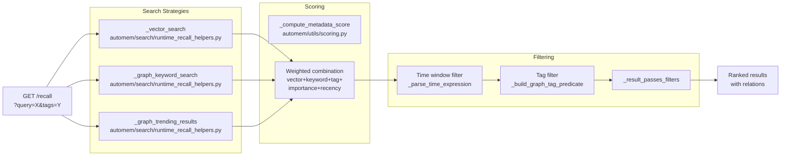
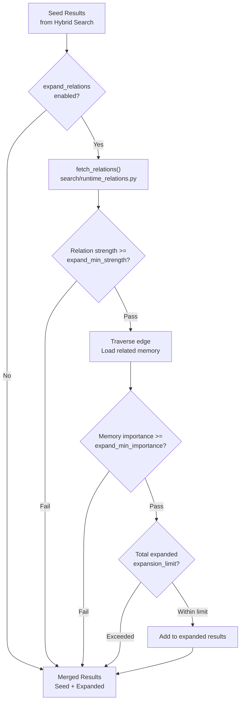
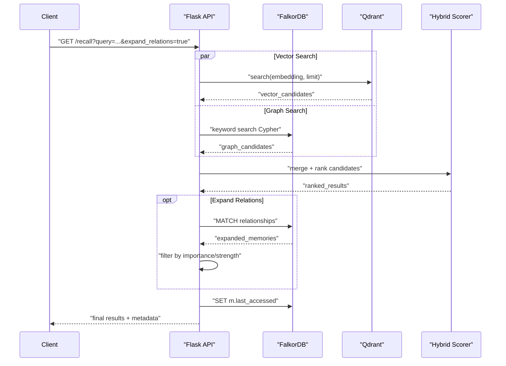

:::note[Source files]
- [automem/api/recall.py](https://github.com/verygoodplugins/automem/blob/0720da2/automem/api/recall.py) — Recall endpoint and graph expansion logic (`_expand_related_memories`)
- [automem/search/runtime_recall_helpers.py](https://github.com/verygoodplugins/automem/blob/0720da2/automem/search/runtime_recall_helpers.py) — Vector/keyword/trending search helpers
- [automem/utils/scoring.py](https://github.com/verygoodplugins/automem/blob/0720da2/automem/utils/scoring.py) — Scoring algorithm (`_compute_metadata_score`)
- [automem/config.py](https://github.com/verygoodplugins/automem/blob/0720da2/automem/config.py) — Score weight and recall tuning configuration
- [src/index.ts](https://github.com/verygoodplugins/mcp-automem/blob/538721c/src/index.ts) — MCP `recall_memory` tool
- [src/recall-memory.ts](https://github.com/verygoodplugins/mcp-automem/blob/538721c/src/recall-memory.ts) — MCP recall response budgeting and formatting
- [src/automem-client.ts](https://github.com/verygoodplugins/mcp-automem/blob/538721c/src/automem-client.ts) — HTTP client and response normalization
:::

The recall system provides a single unified endpoint that supports multiple search strategies. It combines nine scoring components into a hybrid ranking system and supports both basic retrieval and advanced graph expansion. Authentication is required via `Authorization: Bearer <token>` header or `X-API-Key` header.

## Endpoint Overview

```
GET /recall
```

---

## Request Parameters

### Basic Search Parameters

| Parameter | Type | Default | Description |
|-----------|------|---------|-------------|
| `query` | string | — | Natural language search query or wildcard `*` |
| `embedding` | array[float] | — | Pre-computed embedding vector for semantic search |
| `limit` | integer | 5 | Maximum results to return (capped at `RECALL_MAX_LIMIT=100`) |
| `sort` / `order_by` | string | `score` | Sort mode: `score`, `time_desc`, `time_asc`, `updated_desc`, `updated_asc` |

The `query` parameter triggers keyword extraction and full-text search. When `query="*"` or is omitted, the system returns trending memories ordered by importance.

### Tag Filtering Parameters

| Parameter | Type | Default | Description |
|-----------|------|---------|-------------|
| `tags` | array[string] | — | Tags to filter by (can specify multiple) |
| `exclude_tags` | array[string] | — | Tags to exclude (supports prefix matching) |
| `tag_mode` | string | `any` | Match mode: `any` or `all` |
| `tag_match` | string | `prefix` | Match type: `prefix` or `exact` |

Tag filtering uses pre-computed `tag_prefixes` stored in both FalkorDB and Qdrant for efficient prefix matching. The `exclude_tags` parameter removes any memory containing ANY of the specified tags.

**Prefix matching example:**
- Query: `tags=slack`
- Matches: `slack:channel:general`, `slack:user:U123`, `slack:reaction:thumbs-up`
- Uses precomputed `tag_prefixes` field for O(1) lookup

**Mode behavior:**
- `any` (default): Match if ANY filter tag present
- `all`: Match only if ALL filter tags present

### Temporal Filtering Parameters

| Parameter | Type | Default | Description |
|-----------|------|---------|-------------|
| `time_query` | string | — | Natural language time expression (e.g., `"last week"`) |
| `start` | string | — | ISO 8601 start timestamp |
| `end` | string | — | ISO 8601 end timestamp |

Time queries are parsed by `_parse_time_expression()` from `automem/utils/time.py`, which supports expressions like `"last 7 days"`, `"yesterday"`, `"last month"`. Explicit timestamps override natural language queries.

### Context Hint Parameters

| Parameter | Type | Default | Description |
|-----------|------|---------|-------------|
| `context` | string | — | Contextual hint for ranking (e.g., `"programming task"`) |
| `language` | string | — | Programming language context (e.g., `"python"`) |
| `active_path` | string | — | File path being edited (auto-detects language) |
| `context_tags` | array[string] | — | Tags to boost in scoring |
| `context_types` | array[string] | — | Memory types to prioritize |
| `priority_ids` | array[string] | — | Memory IDs to boost during scoring |

Context hints influence the 9-component scoring system but do not filter results. When `active_path` matches a coding language extension, the system prioritizes `Style` type memories for that language.

:::note[`priority_ids` semantics]
`priority_ids` adds a relevance boost to matching memories during scoring — it does **not** bypass filters or guarantee inclusion. If a listed ID fails the tag gate, time window, or other query constraints, it will still be excluded. To guarantee a specific memory is returned, fetch it directly via [`GET /memory/{id}`](/docs/reference/api/memory-operations/) instead of relying on `priority_ids`.
:::

### Graph Expansion Parameters

| Parameter | Type | Default | Description |
|-----------|------|---------|-------------|
| `expand_relations` | boolean | false | Follow graph edges from seed results |
| `expand_entities` | boolean | false | Multi-hop reasoning via entity tags |
| `relation_limit` | integer | 5 | Max relations per seed (from `RECALL_RELATION_LIMIT`) |
| `expansion_limit` | integer | 25 | Total max expanded memories (from `RECALL_EXPANSION_LIMIT`) |
| `expand_min_importance` | float | 0.0 | Minimum importance threshold for expanded memories |
| `expand_min_strength` | float | 0.0 | Minimum relation strength to traverse |

Graph expansion operates in two phases: seed results from hybrid search, then expansion via graph traversal. Expansion filtering parameters only apply to expanded memories, never to seed results.

### State Filtering Parameters

State filtering is the largest behavior change in 0.16: **recall now returns current state only by default.** Expired, not-yet-valid, archived, and invalidated/evolved memories are suppressed unless you explicitly ask for history. Supersession chains resolve to their head — if memory A was superseded by B and B by C (`INVALIDATED_BY` / `EVOLVED_INTO`), a recall that would surface A returns C instead. Resolution is bounded at 5 hops and is cycle-safe.

| Parameter | Type | Default | Description |
|-----------|------|---------|-------------|
| `state_mode` | string | `current` | `current` returns active memories only; `history` returns the full set including superseded/expired/archived memories |
| `current_only` | boolean | — | Legacy flag. `true` == `state_mode=current`, `false` == `state_mode=history`. When both are set and resolve, `current_only` **wins** |
| `state_debug` | boolean | false | Adds suppression and replacement detail (which memories were hidden and what replaced them) under a `state_filter` object in the response |

:::note[Default changed in 0.16]
Before 0.16, recall returned every matching memory regardless of lifecycle state. As of 0.16 the default is `state_mode=current` — to retrieve superseded, expired, or archived memories you must pass `state_mode=history` (or the legacy `current_only=false`).
:::

### Metadata Sidecar Search

Text queries can admit a bounded set of additional candidates when the query strongly matches whitelisted metadata values (the metadata "sidecar"). This is enabled by default and controlled by the `RECALL_METADATA_SEARCH_ENABLED` environment variable — there is **no request parameter**.

The sidecar runs after vector and keyword candidates are merged. It reserves up to `max(1, min(limit, 10))` slots and can **upgrade** memories already in the candidate pool (their IDs are passed as `include_seen_ids`) so a strong metadata match is not dropped when the vector pool is full. Sidecar matches still pass the same tag, time, and state filters as other candidates.

### Vector Candidate Over-fetch

Vector search returns more candidates than the requested `limit` so the hybrid re-rank can surface high-importance or exact-match memories that rank slightly lower on raw cosine similarity alone. The fetch size is:

```
max(limit, min(limit × RECALL_VECTOR_OVERFETCH, RECALL_VECTOR_FETCH_CAP))
```

Tag-scoped queries with text or an explicit embedding may widen the pool further (still capped by `RECALL_VECTOR_FETCH_CAP`). The response is trimmed to `limit` after scoring — over-fetch does not increase payload size. Defaults: `RECALL_VECTOR_OVERFETCH=4`, `RECALL_VECTOR_FETCH_CAP=200`. Set `RECALL_VECTOR_OVERFETCH=1` to restore legacy 1× vector fetch behavior.

### Internal Artifact Type Exclusion

User-facing `/recall` results exclude internal artifact memory types (for example consolidation `MetaPattern` cluster summaries). Filtering is controlled by `RECALL_EXCLUDED_TYPES` (default `MetaPattern`, comma-separated). At automem@0720da2 this exclusion applies to ranked recall only — `/health`, `/admin/sync`, and background drift repair still count all `Memory` nodes, including internal artifacts.

### Relative-Recency Bias

| Parameter | Type | Default | Description |
|-----------|------|---------|-------------|
| `recency_bias` | string | from `RECALL_RECENCY_BIAS` (ships `off`) | `off`, `on`, or `auto`. Re-ranks score order toward more recent memories. `auto` activates only on temporal-intent queries |

When the recency re-rank activates, the response echoes the applied `recency_bias` value.

### Scoped Fallback

| Parameter | Type | Default | Description |
|-----------|------|---------|-------------|
| `scope_fallback` | boolean | false | When tag-scoped results fall short of `limit` and a `query` is present, fill the remaining slots from an unscoped vector search |

Fallback fills are appended **after** the scoped results, and each carries `outside_tag_scope: true`. The `exclude_tags`, time-window, `min_score`, and current-state filters still apply to fallback candidates.

### Weak-Result Gating

| Parameter | Type | Default | Description |
|-----------|------|---------|-------------|
| `min_score` | float | from `RECALL_MIN_SCORE` | Minimum final score for a result to be returned |
| `adaptive_floor` | boolean | from `RECALL_ADAPTIVE_FLOOR` | Adjusts the minimum score floor based on overall result quality, dropping weak outliers |

---

## Hybrid Search Architecture



**Search strategy:**
1. **Vector Search** (`state.qdrant != None`): Semantic similarity using the configured embedding provider (Voyage by default)
2. **Keyword Search** (FalkorDB): Content and tag matching using Cypher `CONTAINS`
3. **Trending Results** (no query): High-importance memories ordered by recency
4. **Deduplication**: Track seen IDs across sources
5. **Filtering**: Apply temporal and tag constraints
6. **Scoring**: Combine weighted factors into final score
7. **Relations**: Fetch connected memories (limited by `RECALL_RELATION_LIMIT`)

---

## Hybrid Scoring System

### 9-Component Score Calculation

```mermaid
graph TB
    Query["Query Input"]

    subgraph VectorSearch["Vector Search (Qdrant)"]
        VectorComp["Vector Component<br/>Weight: SEARCH_WEIGHT_VECTOR<br/>Cosine similarity score"]
    end

    subgraph KeywordSearch["Keyword Search (FalkorDB)"]
        KeywordComp["Keyword Component<br/>Weight: SEARCH_WEIGHT_KEYWORD<br/>TF-IDF + phrase matching"]
        ExactComp["Exact Component<br/>Weight: SEARCH_WEIGHT_EXACT<br/>Direct content overlap"]
    end

    subgraph MetadataScoring["Metadata Scoring"]
        ImportanceComp["Importance Component<br/>Weight: SEARCH_WEIGHT_IMPORTANCE<br/>User-assigned priority"]
        ConfidenceComp["Confidence Component<br/>Weight: SEARCH_WEIGHT_CONFIDENCE<br/>Classification confidence"]
        RecencyComp["Recency Component<br/>Weight: SEARCH_WEIGHT_RECENCY<br/>Freshness boost"]
        TagComp["Tag Component<br/>Weight: SEARCH_WEIGHT_TAG<br/>Tag overlap score"]
    end

    subgraph ContextScoring["Context Scoring"]
        RelationComp["Relation Component<br/>Weight: SEARCH_WEIGHT_RELATION<br/>Computed from graph edges"]
        RelevanceComp["Relevance Component<br/>Weight: SEARCH_WEIGHT_RELEVANCE<br/>Consolidation decay score"]
    end

    FinalScore["Final Weighted Score<br/>Sum of all components"]

    Query --> VectorSearch
    Query --> KeywordSearch
    Query --> MetadataScoring
    Query --> ContextScoring

    VectorComp --> FinalScore
    KeywordComp --> FinalScore
    ExactComp --> FinalScore
    ImportanceComp --> FinalScore
    ConfidenceComp --> FinalScore
    RecencyComp --> FinalScore
    TagComp --> FinalScore
    RelationComp --> FinalScore
    RelevanceComp --> FinalScore
```



The formula:

```
final_score = (vector_score × SEARCH_WEIGHT_VECTOR) +
              (keyword_score × SEARCH_WEIGHT_KEYWORD) +
              (exact_match_score × SEARCH_WEIGHT_EXACT) +
              (importance × SEARCH_WEIGHT_IMPORTANCE) +
              (confidence × SEARCH_WEIGHT_CONFIDENCE) +
              (recency_score × SEARCH_WEIGHT_RECENCY) +
              (tag_score × SEARCH_WEIGHT_TAG) +
              (relation_score × SEARCH_WEIGHT_RELATION) +
              (relevance_score × SEARCH_WEIGHT_RELEVANCE)
```

**Default weight configuration (all configurable via environment variables):**

| Component | Environment Variable | Default Value |
|-----------|---------------------|---------------|
| Vector | `SEARCH_WEIGHT_VECTOR` | 0.35 |
| Keyword | `SEARCH_WEIGHT_KEYWORD` | 0.35 |
| Exact | `SEARCH_WEIGHT_EXACT` | 0.20 |
| Importance | `SEARCH_WEIGHT_IMPORTANCE` | 0.10 |
| Confidence | `SEARCH_WEIGHT_CONFIDENCE` | 0.05 |
| Recency | `SEARCH_WEIGHT_RECENCY` | 0.10 |
| Tag | `SEARCH_WEIGHT_TAG` | 0.20 |
| Relation | `SEARCH_WEIGHT_RELATION` | 0.25 |
| Relevance | `SEARCH_WEIGHT_RELEVANCE` | 0.0 |

### Scoring Component Details

**Vector Search Component:**

Executes via `_vector_search()` using Qdrant when available. When Qdrant is unavailable, the system gracefully degrades to graph-only mode using keyword and metadata scoring.

**Keyword Search Component:**

Implemented in `_graph_keyword_search()` using Cypher queries:
- Extracts keywords via `_extract_keywords()` from `automem/utils/text.py`
- Matches against `m.content` and `m.tags` fields in FalkorDB
- Scores based on keyword frequency and phrase containment
- Returns memories ordered by `score DESC, m.importance DESC, m.timestamp DESC`
- Content match: 2 points per keyword
- Tag match: 1 point per keyword
- Exact phrase bonus: +2 (content) or +1 (tag)

**Metadata Components:**

Computed by `_compute_metadata_score()` and `_parse_metadata_field()`:
- **Importance**: Direct multiplication by weight (0.0–1.0 range)
- **Confidence**: Classification confidence from memory type detection
- **Recency**: `max(0, 1 - (age_days / 180))` — 6-month linear decay based on time since last access
- **Tag**: `matched_tokens / total_query_tokens` — overlap ratio between query tags and memory tags

---

## Graph Expansion

### Relationship Expansion Flow



The `_expand_related_memories()` function implements multi-hop graph traversal using Cypher `MATCH` patterns to follow typed relationship edges (e.g., `RELATES_TO`, `PREFERS_OVER`, `LEADS_TO`).

**Key configuration constants:**
- `RECALL_RELATION_LIMIT` (default: 5) — Max edges per seed memory
- `RECALL_EXPANSION_LIMIT` (default: 25) — Total expanded memories cap
- `RECALL_MIN_SCORE` — Minimum score threshold for results to be returned
- `RECALL_ADAPTIVE_FLOOR` — Adaptive floor that adjusts minimum score based on result quality

**Edge types traversed:** `RELATES_TO`, `LEADS_TO`, `DERIVED_FROM`, `EVOLVED_INTO`, `REINFORCES`, `EXEMPLIFIES`, and all other relationship types. See [Relationship Operations](/docs/reference/api/relationships/) for the full type reference.

### Entity Expansion Flow

When `expand_entities=true`, the system performs multi-hop reasoning via entity tags:

1. Extract entity tags from query (format: `entity:<type>:<slug>`)
2. Find memories with matching entity tags (first hop)
3. Extract entities from matched memories
4. Find memories containing those entities (second hop)

**Example:** Query `"What is Sarah's sister's job?"` → Find `"Sarah"` entity → Find Sarah's relationships → Find `"sister Rachel"` → Find Rachel's job.

### Auto Query Decomposition

When `auto_decompose: true`, the backend automatically extracts entities and topics from the query to generate supplementary searches:

- Query: `"React OAuth authentication patterns"`
- Decomposed into: `["React", "OAuth", "authentication", "patterns"]`
- Executes parallel searches for each term
- Merges and deduplicates results

### Multiple Query Deduplication

The `queries` parameter (array of strings) allows multiple search queries in a single request. The backend executes them in parallel and deduplicates results server-side.

**Deduplication logic:**
1. Each query returns up to `limit` results
2. Server merges results by `memory_id`
3. Keeps highest-scored version of each memory
4. Returns `dedup_removed` count in response metadata

### MCP Client Routing (MCP Layer)

The MCP `recall_memory` tool (`src/automem-client.ts`) routes requests through three mutually exclusive branches — only one executes per call:

1. **ID fetch mode:** If `memory_id` is provided, short-circuits to `GET /memory/{id}` and returns immediately without evaluating other parameters.
2. **Enumeration mode:** If `exhaustive: true` is set (with tags), routes to `GET /memory/by-tag`. Ranked-only parameters (`query`, `embedding`, `time_query`, etc.) are rejected with a validation error in this mode.
3. **Ranked retrieval mode:** All other cases call `GET /recall` with URL parameters built from the tool arguments.

---

## Query Execution Flow



**Typical performance:**
- Sub-100ms for queries without expansion
- 100–300ms with graph expansion enabled
- Scales to 100k+ memories with proper indexing

---

## Response Format

### Standard Response Structure

```json
{
  "status": "success",
  "query": "PostgreSQL database decisions",
  "results": [
    {
      "memory": {
        "memory_id": "a1b2c3d4-e5f6-7890-abcd-ef1234567890",
        "content": "Chose PostgreSQL over MongoDB...",
        "tags": ["project-alpha", "database"],
        "importance": 0.9,
        "created_at": "2025-01-15T10:30:00Z"
      },
      "final_score": 0.847,
      "match_type": "semantic",
      "score_components": {
        "vector": 0.82,
        "keyword": 0.15,
        "importance": 0.9,
        "recency": 0.71
      },
      "relations": []
    }
  ],
  "count": 1,
  "dedup_removed": 0,
  "sort": "score",
  "vector_search": {
    "enabled": true,
    "matched": true
  },
  "tag_mode": "any",
  "tag_match": "prefix",
  "query_time_ms": 47.3
}
```

**Result fields:**
- `memory`: The stored memory object with `memory_id`, `content`, `tags`, `importance`, `created_at`
- `final_score`: Combined relevance score
- `match_type`: Type of match — `semantic`, `keyword`, `tag`, `relation`, or `entity`
- `score_components`: Breakdown of scoring factors
- `relations`: Connected memories (if expansion enabled)
- `expanded_from_entity`: Entity that triggered expansion (if applicable)
- `deduped_from`: IDs of duplicate results removed

### Expansion Response Fields

When `expand_relations=true`:

```json
{
  "expansion": {
    "enabled": true,
    "seed_count": 3,
    "expanded_count": 5,
    "relation_limit": 5,
    "expansion_limit": 25,
    "respect_tags": false
  }
}
```

When `expand_entities=true`:

```json
{
  "entity_expansion": {
    "enabled": true,
    "expanded_count": 4,
    "entities_found": ["Rachel", "Platform team"]
  }
}
```

---

## Usage Examples

### Basic Text Search

```bash
curl "https://your-automem-instance/recall?query=PostgreSQL+database+decisions&limit=5" \
  -H "Authorization: Bearer YOUR_TOKEN"
```

### Semantic Search with Pre-computed Vector

```bash
curl "https://your-automem-instance/recall?embedding=0.1,0.2,0.3,...&limit=10" \
  -H "Authorization: Bearer YOUR_TOKEN"
```

### Time-Filtered Search

```bash
# Natural language time filter
curl "https://your-automem-instance/recall?time_query=last+week&query=bug+fixes" \
  -H "Authorization: Bearer YOUR_TOKEN"

# Explicit time range
curl "https://your-automem-instance/recall?start=2025-01-01T00:00:00Z&end=2025-01-31T23:59:59Z" \
  -H "Authorization: Bearer YOUR_TOKEN"
```

### Tag-Based Filtering

```bash
# Any tag match (default)
curl "https://your-automem-instance/recall?tags=project-alpha&tags=database" \
  -H "Authorization: Bearer YOUR_TOKEN"

# All tags required
curl "https://your-automem-instance/recall?tags=project-alpha&tags=database&tag_mode=all" \
  -H "Authorization: Bearer YOUR_TOKEN"

# Exclude certain tags
curl "https://your-automem-instance/recall?query=preferences&exclude_tags=conversation&exclude_tags=temp" \
  -H "Authorization: Bearer YOUR_TOKEN"
```

### Context-Aware Coding Search

```bash
curl "https://your-automem-instance/recall?query=error+handling&active_path=src/auth.ts&context_types=Style&context_types=Pattern" \
  -H "Authorization: Bearer YOUR_TOKEN"
```

Auto-detects TypeScript context → boosts `Style` type memories → prioritizes language-specific patterns.

### Graph Expansion with Filtering

```bash
curl "https://your-automem-instance/recall?query=authentication&expand_relations=true&expand_min_strength=0.3&expand_min_importance=0.5" \
  -H "Authorization: Bearer YOUR_TOKEN"
```

Performs hybrid search for seed results → follows graph edges with strength ≥ 0.3 → filters expanded memories with importance ≥ 0.5.

### Multi-Hop Entity Search

```bash
curl "https://your-automem-instance/recall?query=Sarah%27s+sister%27s+job&expand_entities=true" \
  -H "Authorization: Bearer YOUR_TOKEN"
```

### Current-State Recall (Default)

```bash
# Default: only current memories — superseded/expired/archived are suppressed
curl "https://your-automem-instance/recall?query=database+choice" \
  -H "Authorization: Bearer YOUR_TOKEN"

# Opt into the full history, including superseded and archived memories
curl "https://your-automem-instance/recall?query=database+choice&state_mode=history&state_debug=true" \
  -H "Authorization: Bearer YOUR_TOKEN"
```

The first call resolves supersession chains to their head and hides invalidated memories. The second returns the full lifecycle and, with `state_debug=true`, reports what was suppressed and what replaced it under `state_filter`.

---

## Sorting Modes

### Score-Based Sorting (Default)

When `sort=score` (or unspecified with query), results are ordered by the final weighted hybrid score combining all 9 components optimized for relevance.

### Time-Based Sorting

Time-based sorting modes are designed for "what happened since X" queries:
- `time_desc` / `updated_desc`: Newest first (ordered by `coalesce(m.updated_at, m.timestamp)`)
- `time_asc` / `updated_asc`: Oldest first

When a time window is specified without a query, the system defaults to `time_desc` to show recent activity.

---

## MCP Tool: `recall_memory`

The `recall_memory` MCP tool wraps `GET /recall` with additional client-side optimizations. It is annotated `readOnlyHint: true` and `idempotentHint: true`.

**Full input schema:**

| Parameter | Type | Required | Constraints | Description |
|-----------|------|----------|-------------|-------------|
| `query` | string | No | — | Semantic search query |
| `queries` | array[string] | No | — | Multiple queries for broader recall |
| `limit` | integer | No | 1–200, default 5 | Max results to return; server enforces its own cap (default 100 via `RECALL_MAX_LIMIT`) |
| `tags` | array[string] | No | — | Filter by tags |
| `tag_mode` | string | No | `"any"` or `"all"` | Tag matching mode |
| `tag_match` | string | No | `"exact"` or `"prefix"` | Tag matching strategy |
| `time_query` | string | No | — | Natural language time filter |
| `start` | string | No | ISO timestamp | Time range start |
| `end` | string | No | ISO timestamp | Time range end |
| `expand_entities` | boolean | No | — | Enable multi-hop entity expansion |
| `expand_relations` | boolean | No | — | Follow graph relationships |
| `expansion_limit` | integer | No | 1–500, default 25 | Max expanded results |
| `relation_limit` | integer | No | 1–200, default 5 | Relations per seed memory |
| `expand_min_importance` | number | No | 0–1 | Filter expanded results by importance |
| `expand_min_strength` | number | No | 0–1 | Min relation strength to traverse |
| `context` | string | No | — | Context label for boosting |
| `language` | string | No | — | Programming language hint |
| `active_path` | string | No | — | Current file path for language detection |
| `context_tags` | array[string] | No | — | Priority tags to boost |
| `context_types` | array[string] | No | — | Priority memory types to boost |
| `priority_ids` | array[string] | No | — | Memory IDs to boost during scoring (does not bypass filters) |
| `auto_decompose` | boolean | No | — | Auto-extract entities from query for parallel searches |
| `state_mode` | string | No | `"current"` or `"history"` | Lifecycle filter; default `current` (current-state only) |
| `current_only` | boolean | No | — | Legacy lifecycle flag; wins over `state_mode` when both resolve |
| `state_debug` | boolean | No | — | Include suppression/replacement detail in `state_filter` |
| `recency_bias` | string | No | `"off"`, `"on"`, or `"auto"` | Relative-recency re-rank; default from `RECALL_RECENCY_BIAS` |
| `scope_fallback` | boolean | No | — | Fill short tag-scoped results from an unscoped vector search |
| `min_score` | number | No | — | Minimum final score gate for returned results |
| `adaptive_floor` | boolean | No | — | Adaptive score-floor gating based on result quality |

**Output schema:**

| Field | Type | Required | Description |
|-------|------|----------|-------------|
| `count` | integer | Yes | Number of memories returned |
| `results` | array | Yes | Array of memory objects with scores |
| `dedup_removed` | integer | No | Duplicates removed in multi-query |
| `expansion` | object | No | Graph expansion statistics |
| `entity_expansion` | object | No | Entity expansion statistics |
| `time_window` | object | No | Applied time filter bounds |
| `tags` | string[] | No | Applied tag filters |

### MCP Response Formatting

Budgeted formats (`text`, `items`, `detailed`) are **summary-first** to stay under MCP client tool-response caps (~25k tokens in Claude Code). The formatter in `src/recall-memory.ts`:

- Prefers each memory's server-generated `summary` over a long `content` preview when present
- Truncates content previews to 400 characters when no summary is available
- Collapses relations to compact stubs (max 3 per memory, 100-char summaries)
- Collapses metadata to its key list
- Applies a global token budget (default 18,000 estimated tokens; override with `AUTOMEM_RECALL_TOKEN_BUDGET`)

`format: "json"` keeps raw per-field passthrough but the global budget still applies. **ID fetches** via `memory_id` are never truncated — use that mode to retrieve a full record.

Each memory in budgeted `text` output is a numbered list item:

```
1. [summary or preview] [tags] (importance: X) score=X.XXX [match_type] relations=X
   ID: mem-abc123
   Created: 2025-01-15T10:30:00Z
```

A summary line includes statistics when applicable:

```
(3 duplicates removed; 5 via entity expansion (Rachel, Platform team); 2 via relation expansion)
```

The MCP response also includes `structuredContent` with the (possibly budget-trimmed) `RecallResult` object for programmatic consumption.

### Common MCP Patterns

**Session start — load recent project context:**

```json
{
  "queries": ["recent decisions", "user preferences"],
  "tags": ["preference"],
  "time_query": "last 30 days",
  "limit": 10
}
```

**Preference recall (no time filter needed):**

```json
{
  "tags": ["preference"],
  "limit": 10
}
```

**Debug pattern search:**

```json
{
  "query": "authentication timeout error",
  "tags": ["bug-fix", "auth"],
  "limit": 5
}
```

**Multi-hop reasoning:**

```json
{
  "query": "What does Amanda's sister do?",
  "expand_entities": true,
  "expansion_limit": 10
}
```

**Filtered graph exploration:**

```json
{
  "query": "database architecture",
  "expand_relations": true,
  "expand_min_strength": 0.5,
  "expand_min_importance": 0.7,
  "relation_limit": 3
}
```

---

## Error Handling

### Service Degradation

| Condition | Behavior | HTTP Status |
|-----------|----------|------------|
| FalkorDB unavailable | Returns 503 error | 503 |
| Qdrant unavailable | Graph-only mode (keyword + metadata) | 200 |
| Embedding generation fails | Falls back to keyword search | 200 |
| No query and no tags | Returns trending memories | 200 |

The system implements graceful degradation where vector search failures don't block graph operations.

### Validation Errors

| Error | HTTP Status | Condition |
|-------|-------------|-----------|
| Invalid embedding dimensions | 400 | Vector size doesn't match `VECTOR_SIZE` |
| Invalid time query | 400 | Unparseable time expression |
| Limit exceeds maximum | 200 | Clamped to `RECALL_MAX_LIMIT` |
| Missing authentication | 401 | No valid token provided |

---

## Performance Optimization Techniques

1. **Tag Prefix Indexing**: Pre-computed `tag_prefixes` enable O(1) prefix matching
2. **Parallel Search**: Vector and graph searches execute concurrently
3. **LRU Caching**: Entity extraction results cached (80% speedup)
4. **Access Tracking**: `last_accessed` updates happen asynchronously
