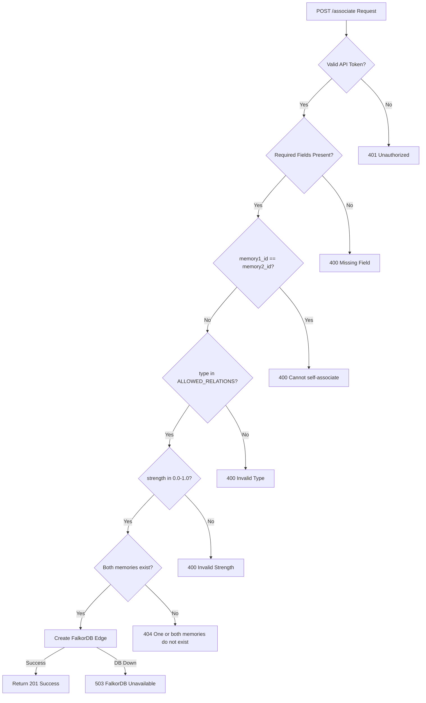
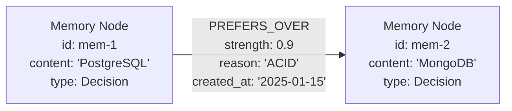
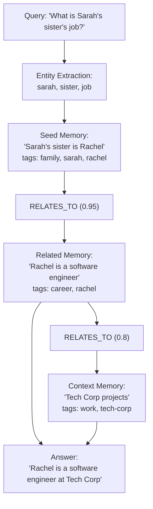

:::note[Source files]
- [app.py](https://github.com/verygoodplugins/automem/blob/main/app.py) — Flask API `/associate` endpoint
- [automem/config.py](https://github.com/verygoodplugins/automem/blob/main/automem/config.py) — `ALLOWED_RELATIONS` set
- [automem/stores/graph_store.py](https://github.com/verygoodplugins/automem/blob/main/automem/stores/graph_store.py) — FalkorDB edge operations
- [src/index.ts](https://github.com/verygoodplugins/mcp-automem/blob/main/src/index.ts) — MCP `associate_memories` tool
- [src/automem-client.ts](https://github.com/verygoodplugins/mcp-automem/blob/main/src/automem-client.ts) — HTTP client
- [src/types.ts](https://github.com/verygoodplugins/mcp-automem/blob/main/src/types.ts) — Relationship type definitions
:::

The `/associate` endpoint creates typed relationships between memories to build a knowledge graph in FalkorDB. These associations enable graph traversal during recall, allowing multi-hop reasoning and discovery of related context beyond direct semantic similarity.

Unlike semantic similarity (which is computed automatically via vector embeddings), associations capture explicit logical relationships such as causation (`LEADS_TO`), evolution (`EVOLVED_INTO`), or contradiction (`CONTRADICTS`).

Associations serve two primary purposes:
1. **Structural Knowledge Graph** — Organize memories into a queryable graph with semantic meaning
2. **Enhanced Recall** — Surface related memories during graph expansion that semantic search alone would miss

---

## Endpoint Overview

```
POST /associate
Content-Type: application/json
Authorization: Bearer <AUTOMEM_API_TOKEN>
```

**Key characteristics:**
- Creates directed edges (memory1 → memory2)
- Requires both memories to exist in FalkorDB
- Stores relationships as graph edges, not separate nodes
- Supports 11 authorable semantic relationship types
- Optional strength score (0.0–1.0) for weighting connections

---

## Request Format

### Field Specifications

| Field | Type | Required | Description |
|-------|------|----------|-------------|
| `memory1_id` | string | Yes | Source memory UUID |
| `memory2_id` | string | Yes | Target memory UUID |
| `type` | string | Yes | Relationship type (must be in `ALLOWED_RELATIONS`) |
| `strength` | float | No | Edge weight 0.0–1.0 (default: 0.5) |
| `properties` | object | No | Additional edge metadata (stored in graph) |

### Basic Request

```bash
curl -X POST https://your-automem-instance/associate \
  -H "Authorization: Bearer YOUR_TOKEN" \
  -H "Content-Type: application/json" \
  -d '{
    "memory1_id": "a1b2c3d4-e5f6-7890-abcd-ef1234567890",
    "memory2_id": "b2c3d4e5-f6a7-8901-bcde-f12345678901",
    "type": "LEADS_TO",
    "strength": 0.9
  }'
```

### Request with Additional Properties

```bash
curl -X POST https://your-automem-instance/associate \
  -H "Authorization: Bearer YOUR_TOKEN" \
  -H "Content-Type: application/json" \
  -d '{
    "memory1_id": "a1b2c3d4-e5f6-7890-abcd-ef1234567890",
    "memory2_id": "b2c3d4e5-f6a7-8901-bcde-f12345678901",
    "type": "PREFERS_OVER",
    "strength": 0.9,
    "properties": {
      "reason": "ACID compliance required",
      "context": "transaction-heavy workload"
    }
  }'
```

---

## Relationship Types

AutoMem supports 11 authorable semantic relationship types that enable rich knowledge graph construction.

```mermaid
graph TB
    subgraph "Causal & Temporal"
        M1["Memory: Problem"]
        M2["Memory: Solution"]
        M3["Memory: Planning"]
        M4["Memory: Execution"]

        M1 -->|LEADS_TO| M2
        M3 -->|OCCURRED_BEFORE| M4
    end

    subgraph "Preference & Pattern"
        M5["Memory: PostgreSQL Decision"]
        M6["Memory: MongoDB Evaluation"]
        M7["Memory: Code Review"]
        M8["Memory: Best Practice"]

        M5 -->|PREFERS_OVER| M6
        M7 -->|EXEMPLIFIES| M8
    end

    subgraph "Knowledge Evolution"
        M9["Memory: Initial Design"]
        M10["Memory: Final Design"]
        M11["Memory: Old Docs"]
        M12["Memory: New Docs"]

        M9 -->|EVOLVED_INTO| M10
        M11 -->|INVALIDATED_BY| M12
    end

    subgraph "Hierarchical"
        M13["Memory: User Story"]
        M14["Memory: Epic"]
        M15["Memory: Feature Spec"]
        M16["Memory: Implementation"]

        M13 -->|PART_OF| M14
        M16 -->|DERIVED_FROM| M15
    end
```



### Full Relationship Type Reference

| Type | Direction | Use Case | Example |
|------|-----------|----------|---------|
| `RELATES_TO` | Bidirectional | General connection, default choice | Bug report → Related issue |
| `LEADS_TO` | A → B (Causal) | Cause → Effect, A caused/resulted in B | Problem analysis → Solution implemented |
| `OCCURRED_BEFORE` | A → B (Temporal) | Earlier → Later (without causation) | Planning meeting → Execution sprint |
| `PREFERS_OVER` | A → B (Preference) | Chosen → Rejected | PostgreSQL → MongoDB |
| `EXEMPLIFIES` | B → A (Pattern) | Concrete example → Abstract pattern | Code review feedback → Best practice rule |
| `CONTRADICTS` | Bidirectional | Conflicting information | Alternative approach A ↔ Alternative approach B |
| `REINFORCES` | B → A (Supporting) | Additional evidence strengthening original | Performance test → Design decision |
| `INVALIDATED_BY` | A → B (Superseding) | Outdated → Current | Old documentation → Updated docs |
| `EVOLVED_INTO` | A → B (Evolution) | Initial → Final form | Draft design → Shipping implementation |
| `DERIVED_FROM` | B → A (Source) | Implementation → Spec | Feature code → Requirements document |
| `PART_OF` | B → A (Hierarchical) | Component → Container | User story → Epic |
| `SIMILAR_TO` | Bidirectional | Semantically similar memories (auto-created) | Two related bug reports |
| `PRECEDED_BY` | A → B (Temporal) | Temporal predecessor (auto-created) | Current sprint → Previous sprint |
| `DISCOVERED` | Varies | Heuristic edge inferred by consolidation (auto-created, `kind=explains\|shares_theme\|parallel_context`) | Root cause → Observed symptom |

:::tip[Directionality note]
Although all relationships are stored as directed edges in FalkorDB (`memory1_id` → `memory2_id`), some types have semantic bidirectionality (e.g., `RELATES_TO`, `CONTRADICTS`). Graph traversal during recall expansion follows edges in both directions by default.
:::

---

## Validation Rules

The `/associate` endpoint enforces the following validation:

1. **Memory Existence**: Both `memory1_id` and `memory2_id` must reference existing Memory nodes in FalkorDB
2. **Relationship Type**: `type` must be in the `ALLOWED_RELATIONS` configuration set
3. **Strength Bounds**: If provided, `strength` must be between 0.0 and 1.0 (inclusive)
4. **Required Fields**: `memory1_id`, `memory2_id`, and `type` are mandatory
5. **Authentication**: Valid `AUTOMEM_API_TOKEN` required via Authorization header

### Validation Flow



---

## Response Format

### Success Response (201 Created)

```json
{
  "status": "success",
  "message": "Association created successfully",
  "relation_type": "LEADS_TO",
  "strength": 0.9
}
```

### Error Responses

**404 Not Found** — One or both memories don't exist:

```json
{
  "error": "One or both memories do not exist"
}
```

**400 Bad Request** — Self-association attempt:

```json
{
  "error": "Cannot associate a memory with itself"
}
```

**400 Bad Request** — Invalid relationship type:

```json
{
  "error": "Invalid relationship type: INVALID_TYPE. Must be one of: RELATES_TO, LEADS_TO, ..."
}
```

**400 Bad Request** — Missing required fields:

```json
{
  "error": "Missing required field: memory2_id"
}
```

**503 Service Unavailable** — FalkorDB unavailable:

```json
{
  "error": "Graph database unavailable"
}
```

---

## Graph Storage Implementation

Relationships are stored as **edges** in FalkorDB, not as separate nodes. This enables efficient graph traversal queries.

### Cypher Query Pattern

The endpoint executes a Cypher `MERGE` query to create or update the relationship:

```cypher
MATCH (m1:Memory {id: $id1})
MATCH (m2:Memory {id: $id2})
MERGE (m1)-[r:LEADS_TO]->(m2)
SET r.strength = $strength,
    r.created_at = $created_at
```

### FalkorDB Edge Structure



### Storage Characteristics

| Aspect | Implementation |
|--------|----------------|
| Storage Layer | FalkorDB only (not replicated to Qdrant) |
| Edge Direction | Directed (m1 → m2) |
| Edge Label | Relationship type (e.g., `:PREFERS_OVER`) |
| Edge Properties | `strength`, `created_at`, custom properties from `properties` field |
| Indexing | FalkorDB automatically indexes edge types for traversal |
| Query Cost | O(1) for direct edge lookup, O(k) for k-hop traversal |

:::note[Qdrant not affected]
Unlike `store_memory` which writes to both databases, `associate_memories` only modifies FalkorDB. The vector embeddings in Qdrant remain unchanged — associations are purely graph relationships.
:::

---

## Usage in Recall Operations

Relationships created via `/associate` are utilized during recall operations when `expand_relations=true` is specified. See [Recall Operations](/docs/reference/api/recall-operations/) for the full parameter reference.

### Traversal Parameters

| Parameter | Default | Description |
|-----------|---------|-------------|
| `expand_relations` | `false` | Enable graph traversal from seed results |
| `relation_limit` | `5` | Max edges to follow per seed memory |
| `expansion_limit` | `25` | Total max expanded memories to return |
| `expand_min_strength` | `0.0` | Minimum edge strength to traverse |
| `expand_min_importance` | `0.0` | Minimum importance of expanded memories |

### Relationship Scoring in Recall

Relationship strength contributes to the hybrid scoring formula:

```
relation_score = Σ (edge.strength × related_memory.importance)
final_score = vector_score × 0.35
            + keyword_score × 0.35
            + relation_score × 0.25    ← Relationship contribution
            + ... (6 other components)
```

---

## Multi-Hop Reasoning Example

Relationships enable AutoMem to answer queries requiring multiple traversal steps.

### Example: "What is Sarah's sister's job?"

**Step 1**: Store memories with relationships:

```json
// Memory 1
{ "content": "Sarah's sister is Rachel", "tags": ["family", "sarah", "rachel"] }

// Memory 2
{ "content": "Rachel is a software engineer at Tech Corp", "tags": ["career", "rachel"] }
```

Create association:
```json
{
  "memory1_id": "<id of memory 1>",
  "memory2_id": "<id of memory 2>",
  "type": "RELATES_TO",
  "strength": 0.95
}
```

**Step 2**: Query with entity expansion:

```bash
curl "https://your-automem-instance/recall?query=Sarah%27s+sister%27s+job&expand_entities=true" \
  -H "Authorization: Bearer YOUR_TOKEN"
```

**Step 3**: AutoMem traverses the graph:



---

## MCP Tool: `associate_memories`

The `associate_memories` MCP tool corresponds to `POST /associate`.

### Input Schema

| Parameter | Type | Required | Constraints | Description |
|-----------|------|----------|-------------|-------------|
| `memory1_id` | string | Yes | — | Source memory ID (from `store_memory` or `recall_memory` results) |
| `memory2_id` | string | Yes | — | Target memory ID to link to |
| `type` | string (enum) | Yes | 11 authorable types | Relationship type |
| `strength` | number | No | 0.0–1.0, default 0.5 | Relationship strength |

**Relationship type enum values (11 authorable):**
1. `RELATES_TO` — General relationship
2. `LEADS_TO` — Causal relationship
3. `OCCURRED_BEFORE` — Temporal ordering
4. `PREFERS_OVER` — Chosen alternative
5. `EXEMPLIFIES` — Concrete example of pattern
6. `CONTRADICTS` — Conflicts with
7. `REINFORCES` — Strengthens validity
8. `INVALIDATED_BY` — Superseded by
9. `EVOLVED_INTO` — Updated version
10. `DERIVED_FROM` — Implementation of decision
11. `PART_OF` — Component of larger effort

The following 3 types are **system-generated** and cannot be created via `associate_memories`. They appear in recall results and can be filtered/expanded but are not valid enum values for this tool:
- `SIMILAR_TO` — Semantically similar (created by enrichment)
- `PRECEDED_BY` — Temporal predecessor (created by enrichment)
- `DISCOVERED` — Heuristic edge with `kind` property (created by consolidation)

:::note[Validation at MCP layer]
The MCP server validates the enum at request time, ensuring invalid relationship types are rejected before reaching the backend.
:::

### Output Schema

| Field | Type | Required | Description |
|-------|------|----------|-------------|
| `success` | boolean | Yes | Whether association was created |
| `message` | string | Yes | Confirmation message |

The tool is annotated `idempotentHint: true` — creating the same relationship multiple times is safe (MERGE semantics).

### Association Creation Data Flow

```mermaid
sequenceDiagram
    participant Client
    participant Flask["@app.route('/associate')<br/>POST"]
    participant Falkor["FalkorDB"]

    Client->>Flask: POST /associate<br/>{memory1_id, memory2_id, type}
    Flask->>Flask: validate relationship type
    Flask->>Falkor: MATCH (m1:Memory {id: $id1})<br/>MATCH (m2:Memory {id: $id2})
    Flask->>Falkor: MERGE (m1)-[r:TYPE]->(m2)
    Flask->>Falkor: SET r.strength = $strength
    Flask-->>Client: 200 OK
```

---

## Association Strength Scoring

The `strength` parameter (0.0–1.0) quantifies the confidence or importance of the relationship. This value is used during graph expansion to filter weak connections via the `expand_min_strength` parameter in `recall_memory`.

| Range | Interpretation | Examples |
|-------|---------------|---------|
| 0.9–1.0 | Direct causation, critical dependency | Bug fix directly caused by root cause discovery; feature implementation directly derived from architecture decision |
| 0.7–0.9 | Strong relationship, high confidence | Pattern strongly relates to multiple implementations; new decision reinforces established convention |
| 0.5–0.7 | Moderate relationship, relevant connection | Feature relates to broader system architecture; alternative approach considered during decision |
| 0.3–0.5 | Weak relationship, tangential connection | Loosely related topics; historical context with minimal current relevance |
| < 0.3 | Very weak — consider not creating | Risk of noise during graph expansion |

:::tip[Default recommendation]
Use 0.8 for most associations unless you have a specific reason to score higher or lower. Graph expansion typically uses `expand_min_strength: 0.3–0.6` to filter out weak connections.
:::

---

## Association Creation Patterns

### When to Create Associations

**Always create immediately:**
- User corrections (always link to what was corrected)
- Bug fixes (link to root cause if stored separately)
- Decisions (link to rejected alternatives)

**Defer until meaningful:**
- Pattern discovery (wait to accumulate examples before linking)
- Speculative relationships (verify the connection is meaningful first)

**Target:** 1–3 associations per stored memory. Avoid creating `RELATES_TO` for memories that are already semantically similar — vector search will find those automatically.

### Pattern-Specific Triggers

#### User Corrections (`INVALIDATED_BY`)

When a user corrects a previous statement or approach, link the correction to what was corrected:

```json
// Store the correction
{ "content": "Do NOT use --force flag with git push to main", "importance": 0.95 }

// Associate: old approach INVALIDATED_BY new correction
{
  "memory1_id": "<old approach memory id>",
  "memory2_id": "<new correction memory id>",
  "type": "INVALIDATED_BY",
  "strength": 0.95
}
```

**Rationale**: Prevents the AI from repeating invalidated approaches. During recall, if the old memory surfaces, the `INVALIDATED_BY` relationship signals it has been superseded.

#### Bug Fixes (`DERIVED_FROM`, `LEADS_TO`)

Link bug fixes to their root cause discoveries:

```json
// Bug discovery → Bug fix
{
  "memory1_id": "<bug discovery memory id>",
  "memory2_id": "<bug fix memory id>",
  "type": "LEADS_TO",
  "strength": 0.9
}

// Bug fix ← Architecture decision (fix derived from)
{
  "memory1_id": "<bug fix memory id>",
  "memory2_id": "<architecture decision memory id>",
  "type": "DERIVED_FROM",
  "strength": 0.8
}
```

**Rationale**: Creates a causal chain from problem discovery through resolution. If a similar bug occurs, graph expansion can traverse from the new bug discovery to related fixes.

#### Architectural Decisions (`PREFERS_OVER`, `PART_OF`)

```json
// Chosen solution → Rejected alternative
{
  "memory1_id": "<PostgreSQL decision memory id>",
  "memory2_id": "<MongoDB evaluation memory id>",
  "type": "PREFERS_OVER",
  "strength": 0.9
}
```

**Rationale**: Captures the decision context (why A was chosen over B) and system structure (how components relate to the whole).

#### Pattern Evolution (`EVOLVED_INTO`, `EXEMPLIFIES`)

Track how patterns change over time and connect abstract patterns to concrete examples:

```json
// Old approach → New approach
{
  "memory1_id": "<old pattern memory id>",
  "memory2_id": "<new pattern memory id>",
  "type": "EVOLVED_INTO",
  "strength": 0.85
}

// Specific example → General pattern
{
  "memory1_id": "<specific fix memory id>",
  "memory2_id": "<general pattern memory id>",
  "type": "EXEMPLIFIES",
  "strength": 0.75
}
```

### Association + Update for Deprecation

When deprecating old information, combine `update_memory` and `associate_memories`:

```json
// 1. Update the old memory to flag it as outdated
PATCH /memory/<old-id>
{ "metadata": { "deprecated": true, "superseded_by": "<new-id>" } }

// 2. Associate: old EVOLVED_INTO new
{
  "memory1_id": "<old memory id>",
  "memory2_id": "<new memory id>",
  "type": "EVOLVED_INTO",
  "strength": 0.9
}
```

This pattern is preferred over deletion because it preserves history and provides context for why the approach changed.

---

## Best Practices

### Relationship Type Selection

**Use `PREFERS_OVER` when:**
- Documenting user preferences (PostgreSQL over MongoDB)
- Recording rejected alternatives
- Establishing decision hierarchies

**Use `DERIVED_FROM` when:**
- Linking implementation to specifications
- Connecting code to requirements
- Tracing decisions to principles

**Use `EVOLVED_INTO` when:**
- Tracking design iterations
- Recording refactoring history
- Documenting process improvements

**Use `EXEMPLIFIES` when:**
- Connecting instances to patterns
- Building pattern libraries
- Reinforcing best practices

### Bidirectional vs. Directed

Most relationships are **directed** (one-way):
- `LEADS_TO`: Problem → Solution (not Solution → Problem)
- `INVALIDATED_BY`: Old → New (not New → Old)
- `PART_OF`: Component → Whole (not Whole → Component)

Use `RELATES_TO` for **bidirectional** general connections where direction doesn't matter.

### Common Anti-Patterns

**Over-association:** Creating relationships for every possible connection adds noise to graph expansion and increases query latency.

**Weak relationships:** Associations with strength < 0.3 are rarely worth creating unless you have specific intent for that connection.

**Wrong direction:** Using `LEADS_TO` with (solution → problem) instead of (problem → solution) inverts the causal chain and confuses traversal.

---

## Debugging Associations

To verify associations are working, use `expand_relations` with low thresholds during recall:

```bash
curl "https://your-automem-instance/recall?query=database+decisions&expand_relations=true&expand_min_strength=0.0&relation_limit=10" \
  -H "Authorization: Bearer YOUR_TOKEN"
```

The `relations` field in recall results shows the relationship metadata for expanded memories, including `type` and `strength`.

---

## Performance Considerations

**Association storage cost (low):**
- Single edge creation in FalkorDB (O(1) write)
- No vector embedding computation required
- No impact on Qdrant

**Recall expansion cost (moderate):**
- Each seed memory can trigger up to `relation_limit` edge traversals
- Each expanded memory requires a Qdrant lookup for its vector embedding
- Recommendation: Use `expand_min_strength` and `expand_min_importance` to limit expansion

**Bi-directional traversal:**
FalkorDB supports efficient traversal in both directions — forward (m1 → m2 outgoing) and backward (m2 ← m1 incoming). The recall expansion follows edges in both directions by default, so a single `LEADS_TO` relationship enables discovery from either end.
